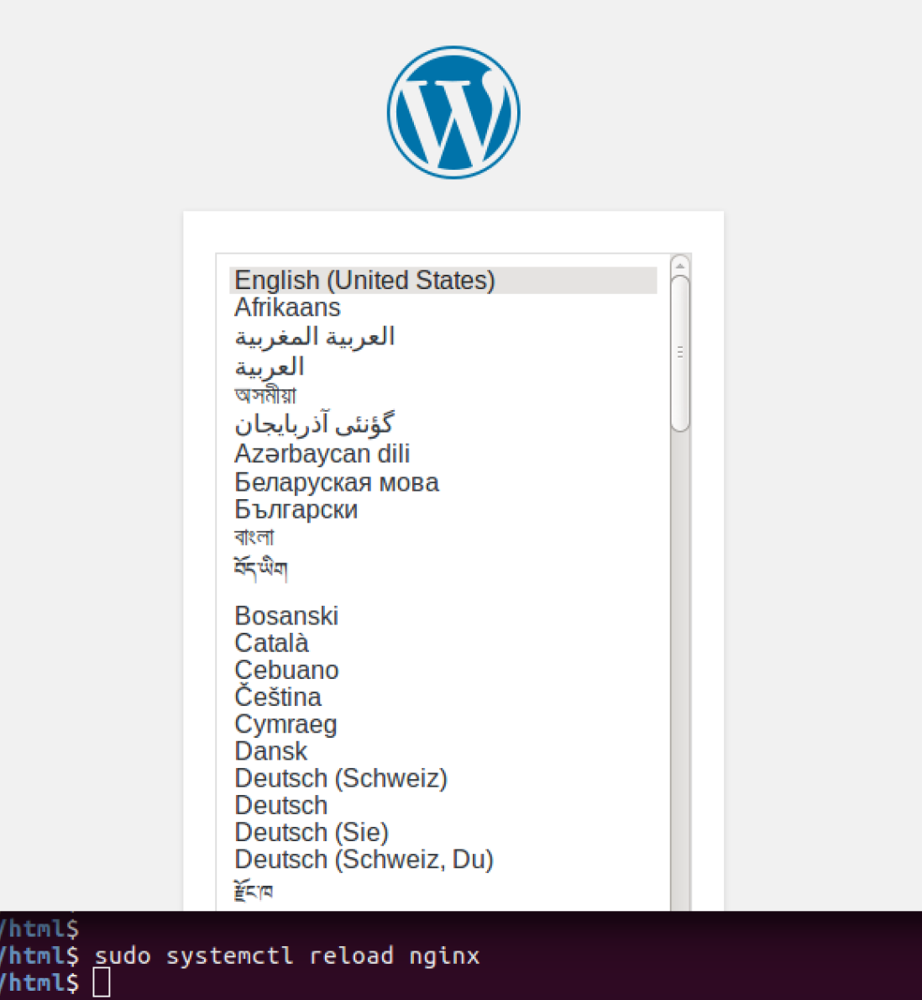
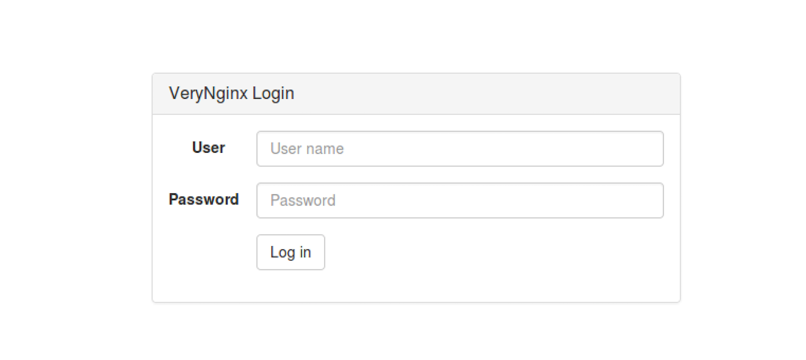
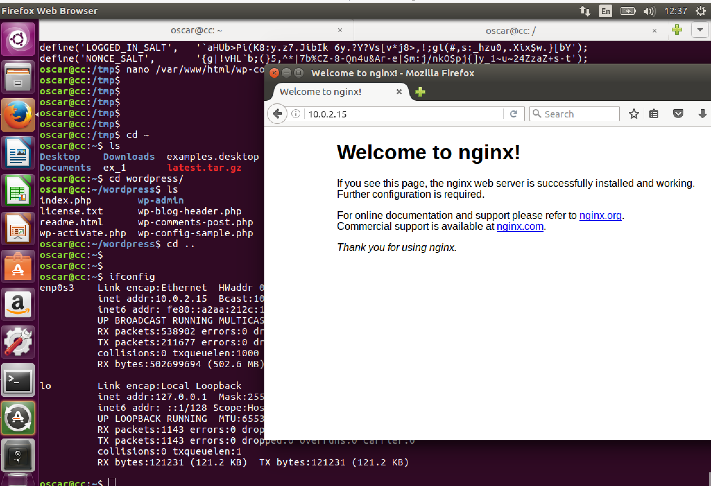
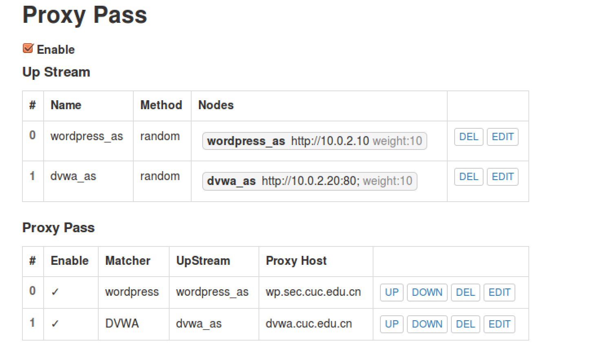
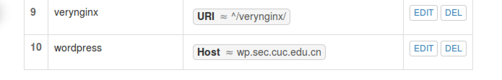

#Web搭建实验报告

##环境配置

>系统环境
>>3*Linux虚拟机
>>>2*ubuntu16.04(服务器)
>>>
>>>1*ubuntu16.04(客户端)
>
>网络环境
>>2*ubuntu16.04(服务器)
>>>verynginx/wordpress
>>>>内部网络10.0.2.10
>>>
>>>nginx
>>>>内部网络10.0.2.15
>>>
>>>DVWA
>>>>内部网络10.0.2.20
>>
>>1*ubuntu16.04(客户端)
>>>桥接网卡：192.168.1.117

##基本配置

* VeryNginx作为反向代理

* Up Stream
  
  * nodes:使用upstream规定proxy pass可以代理的目标站点的节点，在本次实验中，每一个代理只需要一个webserver作为目标节点，不牵扯负载均衡问题，因此权值weight可以随意设置。
  * method
        
        * ip_hash：指相同client在确立链接后与同一个server进行通信，只有当当前server出现宕机才会更换。
        * random：client与server为默认根据权值分配。

* Proxy Pass

  * Proxy Host：反向代理的地址。此前已经在hosts中修改两个站点域名,即反向代理服务器ip。
  * UpStream：目标站点的节点集合。
  * Matcher：根据规则限定访问目标地址.

 

