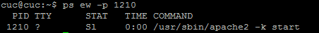
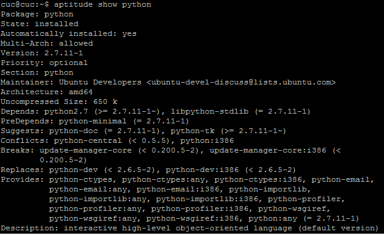

# 实验报告3_20170314
## 动手实战SYSTEMD
* Systemd 入门教程：命令篇
	[https://asciinema.org/a/64pz6g2y7ni0tf6un4tog7b1f](https://asciinema.org/a/64pz6g2y7ni0tf6un4tog7b1f "https://asciinema.org/a/64pz6g2y7ni0tf6un4tog7b1f")
* Systemd 入门教程：实战篇
	[https://asciinema.org/a/6xbhsysdg1fcfjhaghrgcfaif](https://asciinema.org/a/6xbhsysdg1fcfjhaghrgcfaif "https://asciinema.org/a/6xbhsysdg1fcfjhaghrgcfaif")
## 课堂问题（软件相关）
* 操作系统发行版和内核信息
	* 查看发行版本：lsb_release -a
	* 查看内核信息：uname -a
* 系统中当前有谁在线
	* who
* 现在在运行的进程有哪些
	* ps aux
* 哪些进程在监听哪些端口
	*  netstat –apn
* 挂载点和文件系统
	* mount
* 已安装应用软件列表、故障或问题发生前最近新安装的软件信息
	* 已安装应用软件列表:apt list --installed
	* 查看最近安装软件信息
		* 列出使用安装的软件 
			* grep " install " /var/log/apt/history.log
		* 列出使用dpkg安装的软件
			* grep " install " /var/log/dpkg.log
* 系统环境变量、当前用户环境变量
	* 查看所有环境变量
		* env
	* 查看用户环境变量
		* echo $PATH
## 课堂问题（软件相关进阶问题）
* 故障/问题发生前后邻近的系统日志、应用程序日志等
	* 大多数文件在/var/log/目录下 可根据相关需求查看
* 系统自启动项有哪些，自启动机制分别是什么；系统定时任务有哪些，触发机制分别是什么
	* 自启动：
		* 将启动脚本文件放置在/etc/init.d/目录下
			* 自启动机制
				* 内核初始化的最后一步就是运行 init 程序。init程序负责在系统启动时运行一些服务程序或脚本，来让一些重要和必要的服务开机就能运行起来。
		* 使用update-rc.d 命令，添加一个软连接，在/etc/rcN.d/对应目录下
			* 自启动机制
				* sysvinit在启动时，就会读取/etc/inittab文件，获得默认的运行级别（假设为N），然后依次启动/etc/rcN.d/中的相应程序，这里面的程序对应的是/etc/init.d/下的启动脚本。
		* 使用systemd 
			* sudo systemctl enable ssh
			* 自启动机制
				* 有些像之前的软连接，上面的命令相当于在/etc/systemd/system目录添加一个符号链接，指向/usr/lib/systemd/system里面的httpd.service文件。这是因为开机时，Systemd只执行/etc/systemd/system目录里面的配置文件。这也意味着，如果把修改后的配置文件放在该目录，就可以达到覆盖原始配置的效果。
	* 系统定时任务
		* crontab -l
			* 触发机制
				* 每隔一定时间触发，或者到某一特定时间触发
* 出问题应用程序的当前环境变量设置情况等
	* 查看某一程序的进程号(比如1002)
		* ps aux|grep apache2
	* 查看某一进程的环境变量
		* ps eww -p 1002
		* PS：（经实验不是很确定...这个command下面是这个程序的环境变量么 为啥还带-k start）
			 
## 课堂问题（软件相关高级问题）
* 疑似出问题应用程序的版本信息、编译方式、安装方式等(以python为例)
	* 版本信息
		* 多数软件有-v参数，可以查看版本信息
		* aptitude python
			* 包含软件的版本号、依赖、项目主页等信息。
				
* 已加载第三方模块信息、依赖的第三方lib版本信息
	* 已加载第三方模块信息
		* sudo lsof -p 1075
	* 依赖的第三方lib版本信息(以vim为例)
		* ldd vim
* 完整或能复现问题的最小化配置文件
	* 这个应该是备份之前的配置文件或者查看问题发生时该程序的配置文件吧？
* 调试模式的运行、启动日志
	* 不同的软件应该有对应的调试日志信息
* 第三方性能分析、调试工具的分析、调试日志
## 课堂问题（网络相关）
* 系统的IP地址、MAC地址信息
	* ifconfig
* ARP表 / 路由表 / hosts文件配置 / DNS服务器配置 / 代理服务器配置
	* ARP表
		* arp -a
	* 路由表
		* ip route list
	* hosts文件配置
		*  vim /etc/hosts
	* DNS服务器配置
		* vim /etc/resolv.conf
	* 代理服务器配置
		* /etc/apt/apt.conf
* 防火墙规则表
	* sudo iptables -L
## 课堂问题（硬件相关）
* 硬件品牌、型号、购买渠道等
* CPU/内存/硬盘/网卡/外设和主要接口等硬件参数信息（例如是否使用了RAID？）
	* 查看CPU信息
		* cat /proc/cpuinfo
	* 查看内存信息 
		* cat /proc/meminfo 
	* 查看网卡信息
		* ifconfig -a
	* 查看机器型号 
		* dmidecode | grep "Product Name" 
	* 查看外设信息
		* lspci
	* 查看RAID（独立磁盘冗余阵列）状态
		* cat /proc/mdstat
* 联网信息，例如使用的宽带接入方式、上下行带宽、运营商信息等
	* 这个系统获取不了吧，需要外部信息