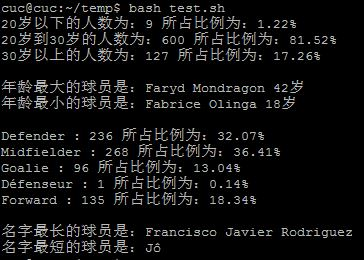

# 实验报告4_20170326
## 任务一
### 任务要求
* 任务一：用bash编写一个图片批处理脚本，实现以下功能：
	* 支持命令行参数方式使用不同功能
	* 支持对指定目录下所有支持格式的图片文件进行批处理
	* 支持以下常见图片批处理功能的单独使用或组合使用
	* 支持对jpeg格式图片进行图片质量压缩
	* 支持对jpeg/png/svg格式图片在保持原始宽高比的前提下压缩分辨率
	* 支持对图片批量添加自定义文本水印
	* 支持批量重命名（统一添加文件名前缀或后缀，不影响原始文件扩展名）
	* 支持将png/svg图片统一转换为jpg格式图片
### 程序帮助信息如下：
* 
		usage: ImageProcessing.sh [-f filename][-cq percent][-cr percent][-cf][-tw text][-sr suffixrename][-pr prefixrename][-bp directory][-h]"
		
		optional arguments:
		-f,  --file <filename>               The filename"
		-cq, --compqua <percent>             Image compression"
		-cr, --compreso <percent>            Compresse image resolution"
		-cf, --changeformat                  Change image format to jpg(Keep Original Image)"
		-tw, --textwatermark <text>          Add text watermark"
		-sr, --suffixrename <suffixrename>   Add suffixname(jpeg,jpg,png,svg)"
		-pr, --prefixrename  <prefixrename>  Add prefixname(jpeg,jpg,png,svg)"
		-bp, --batchprocessing <directory>   Batch processing of image"
		-h,  --help"
### 样例输入（程序名称为ImageProcessing.sh）：
* 转换格式为jpg
	* bash ImageProcessing.sh -f 1.png -cf
* 添加文本水印(默认字体文件为1.ttf，该版本程序还未开放指定字体文件和调水印样式)
	* bash ImageProcessing.sh -tw "这是水印" -f 1.png
* 添加后缀
	* bash ImageProcessing.sh -f 1.png -sr _sr
* 添加前缀
	* bash ImageProcessing.sh -f 1_sr.png -pr pr_
* 压缩图片质量
	* bash ImageProcessing.sh -f pr_1_sr.png -cq 70
* 压缩图片分辨率（保持宽高比）
	* bash ImageProcessing.sh -f pr_1_sr.png -cr 70
* 批处理
	* bash ImageProcessing.sh -bp /home/cuc/temp -cq 70
## 任务二
### 任务要求
* 任务二：用bash编写一个文本批处理脚本，对以下附件分别进行批量处理完成相应的数据统计任务：
	* 2014世界杯运动员数据
		* 统计不同年龄区间范围（20岁以下、[20-30]、30岁以上）的球员数量、百分比
		* 统计不同场上位置的球员数量、百分比
		* 名字最长的球员是谁？名字最短的球员是谁？
		* 年龄最大的球员是谁？年龄最小的球员是谁？
### 样例输入（程序名称为WorldcupdataStatistics.sh）：
*  bash test.sh

	  
## 任务三
### 任务要求
* 任务二：用bash编写一个文本批处理脚本，对以下附件分别进行批量处理完成相应的数据统计任务：
	* Web服务器访问日志
		* 统计访问来源主机TOP 100和分别对应出现的总次数
		* 统计访问来源主机TOP 100 IP和分别对应出现的总次数
		* 统计最频繁被访问的URL TOP 100
		* 统计不同响应状态码的出现次数和对应百分比
		* 分别统计不同4XX状态码对应的TOP 10 URL和对应出现的总次数
		* 给定URL输出TOP 100访问来源主机
### 程序帮助信息如下：
* 
		usage: WebProcessing.sh [-sh][-si][-sc][-u][-uh][-fs][-h]
		
		optional arguments:
		-sh             统计访问来源主机TOP 100和分别对应出现的总次数
		-si             统计访问来源主机TOP 100 IP和分别对应出现的总次数
		-sc             统计不同响应状态码的出现次数和对应百分比
		-u              统计最频繁被访问的URL TOP 100
		-uh <url>       给定URL输出TOP 100访问来源主机
		-fs             分别统计不同4XX状态码对应的TOP 10 URL和对应出现的总次数
		-h,  --help
### 样例输入（程序名称为WebProcessing.sh）：
* 统计访问来源主机TOP 100和分别对应出现的总次数
	* bash WebProcessing.sh -sh
* 统计访问来源主机TOP 100 IP和分别对应出现的总次数
	* bash WebProcessing.sh -si
* 统计不同响应状态码的出现次数和对应百分比
	* bash WebProcessing.sh -sc
* 统计最频繁被访问的URL TOP 100
	* bash WebProcessing.sh -u
* 给定URL输出TOP 100访问来源主机
	* bash WebProcessing.sh -uh /shuttle/missions/STS-69/mission-STS-69.html
* 分别统计不同4XX状态码对应的TOP 10 URL和对应出现的总次数
	* bash WebProcessing.sh -fs
