# 实验报告6_20170416
## FTP
### 配置要求
	[完成] 配置一个提供匿名访问的FTP服务器，匿名访问者可以访问1个目录且仅拥有该目录及其所有子目录的只读访问权限；
	[完成] 配置一个支持用户名和密码方式访问的账号，该账号继承匿名访问者所有权限，且拥有对另1个独立目录及其子目录完整读写（包括创建目录、修改文件、删除文件等）权限；
	[完成] 该账号仅可用于FTP服务访问，不能用于系统shell登录；
	[完成] FTP用户不能越权访问指定目录之外的任意其他目录和文件；
	[完成] 匿名访问权限仅限白名单IP来源用户访问，禁止白名单IP以外的访问；
	[完成]（可选加分任务）使用FTPS服务代替FTP服务，上述所有要求在FTPS服务中同时得到满足；
### 环境说明
* 使用软件为vsftp
### 连接说明
* 匿名方式：
	* ftp 10.0.2.11
	* name: anonymous
	* password:
* 用户名密码方式
	* 因为配置为FTPS连接，所以ftp不可以直接连接，要使用支持FTPS的软件，这里使用Filezilla
	* 配置如下图
	
	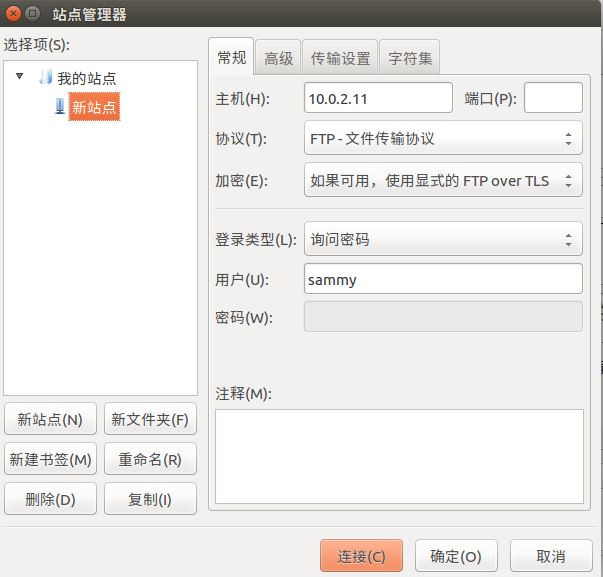
### 任务完成情况说明
* [完成] 配置一个提供匿名访问的FTP服务器，匿名访问者可以访问1个目录且仅拥有该目录及其所有子目录的只读访问权限；
	* 如下图，可以允许匿名访问

		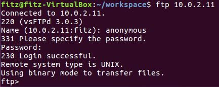
* [完成] 配置一个支持用户名和密码方式访问的账号，该账号继承匿名访问者所有权限，且拥有对另1个独立目录及其子目录完整读写（包括创建目录、修改文件、删除文件等）权限；
	* 可以看到,可以向远程目录下上传，并且下载
	
		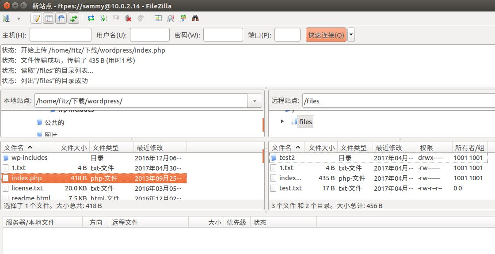
	* 注：此处的FTP设置为根目录不允许写，对1个独立目录（files）及其子目录完整读写（包括创建目录、修改文件、删除文件等）权限
* [完成] 该账号仅可用于FTP服务访问，不能用于系统shell登录；
	* 设置使用的登录shell为/usr/sbin/nologin
	* 如下图，ftp账户sammy不可用于shell登录

		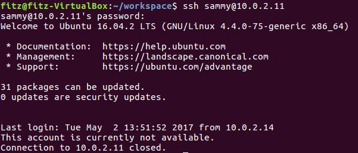
* [完成] FTP用户不能越权访问指定目录之外的任意其他目录和文件；
* [完成] 匿名访问权限仅限白名单IP来源用户访问，禁止白名单IP以外的访问；
	* 在hosts.allow和hosts.deny中做限制
		
			hosts.allow配置规则:
			vsftpd:10.0.2.13
		 	vsftpd:10.0.2.14

			host.deny配置规则
			vsftpd:ALL
	* 如下图，可以看到，IP在白名单中的10.0.2.14可以对ftp服务器进行访问，而不在白名单中的10.0.2.18，则不可以对ftp服务器进行访问

		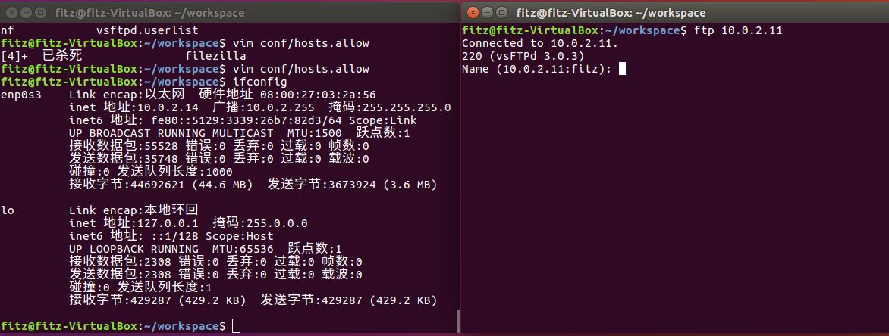
		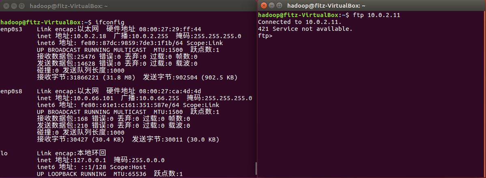
* [完成]（可选加分任务）使用FTPS服务代替FTP服务，上述所有要求在FTPS服务中同时得到满足；
	* 如下图，可以看到因为使用了FTPS服务，所以不可以直接用ftp命令访问，要使用支持ftps协议的软件，这里使用filezilla进行连接
		
		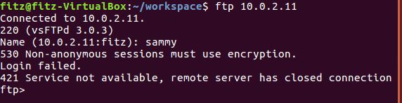
		
### 参考链接
* [https://www.digitalocean.com/community/tutorials/how-to-set-up-vsftpd-for-a-user-s-directory-on-ubuntu-16-04](https://www.digitalocean.com/community/tutorials/how-to-set-up-vsftpd-for-a-user-s-directory-on-ubuntu-16-04 "https://www.digitalocean.com/community/tutorials/how-to-set-up-vsftpd-for-a-user-s-directory-on-ubuntu-16-04")

## NFS 
### 配置要求
	[完成] 在1台Linux上配置NFS服务，另1台电脑上配置NFS客户端挂载2个权限不同的共享目录，分别对应只读访问和读写访问权限；
	[完成] 实验报告中请记录你在NFS客户端上看到的：
		共享目录中文件、子目录的属主、权限信息
		你通过NFS客户端在NFS共享目录中新建的目录、创建的文件的属主、权限信息
		上述共享目录中文件、子目录的属主、权限信息和在NFS服务器端上查看到的信息一样吗？无论是否一致，请给出你查到的资料是如何讲解NFS目录中的属主和属主组信息应该如何正确解读
	[完成]（可选加分任务）在客户端或NFS服务器上抓包分析使用NFS协议时的远程文件下载、上传、移动、删除等操作是否是明文？远程的文件传输数据流是否可以被恢复出完整的传输文件？
		提示：我们在《网络安全》第4章《网络监听》中介绍过的工具filesnarf
### 环境说明
* 使用软件为：nfs-kernel-server
### 任务完成情况说明
* [完成] 在1台Linux上配置NFS服务，另1台电脑上配置NFS客户端挂载2个权限不同的共享目录，分别对应只读访问和读写访问权限；
	* 如下图，在挂载前，nfs文件夹为空文件夹，挂在完成后，共享了目标主机NFS服务的共享目录

		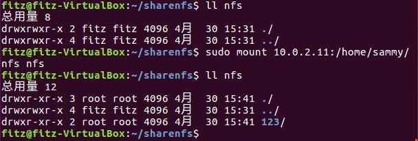
	* 如下图，nfs文件夹对应的是拥有读写访问权限，可以往里面写入新文件
		
		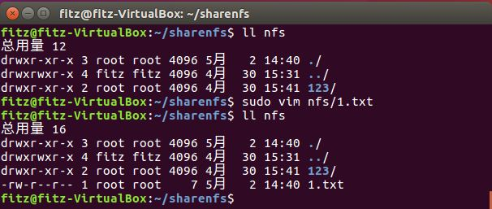
	* 如下图，nfs1文件夹对应的是只读访问权限，不能写入
		
		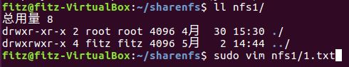
		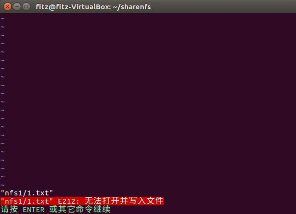
* [完成] 实验报告中请记录你在NFS客户端上看到的：
	* 共享目录中文件、子目录的属主、权限信息
		* 文件和子目录的属主均为root
		* 子目录权限为:rwxr-xr-x
		* 文件权限为:rw-r--r--
		
			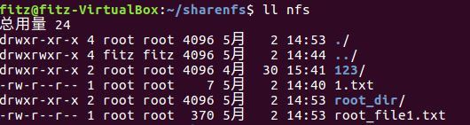
	* 你通过NFS客户端在NFS共享目录中新建的目录、创建的文件的属主、权限信息
		* 文件和子目录的属主均为root
		* 子目录权限为:rwxr-xr-x
		* 文件权限为:rw-r--r--
		
			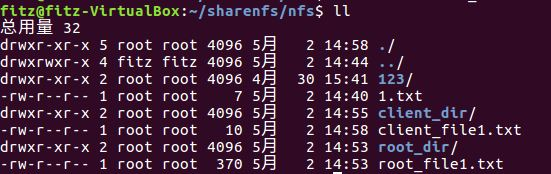
	* 上述共享目录中文件、子目录的属主、权限信息和在NFS服务器端上查看到的信息一样吗？无论是否一致，请给出你查到的资料是如何讲解NFS目录中的属主和属主组信息应该如何正确解读
		* 一致......

			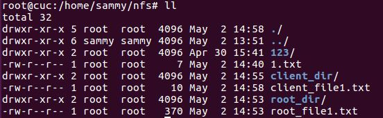
		* 资料解释：当客户端访问此目录时，NFS是判定访问者的uid是否相符，若相同，那么访问者就有可能拥有与用户相同的权限，这还要取决于/share设置共享时所分配的权限；如果访问者的uid对应了NFS服务器上的另一个用户，则访问者就对应拥有other权限，但是否能够完全对应用other权限也要取决于\share的共享权限；如果访问者的uid恰好在NFS服务器上不存在，则服务器用自动将其压缩成为匿名用户，其uid为65534，而CentOS将其显示为nfsnobody。由于在绝大部分Linux系统中root用户的uid为0，也就是说客户端可以轻易的获得NFS的root权限来访问共享目录，这样是极不安全的，所以NFS默认用将root的身份压缩成匿名用户。
		* 我的配置文件里将权限设置为no_root_squash，访问共享目录时保持root用户身份，所以显示的权限是一样的，均为root用户
		* 资料解释参考链接
			* [http://www.178linux.com/5603](http://www.178linux.com/5603 "http://www.178linux.com/5603")
* [待完成]（可选加分任务）在客户端或NFS服务器上抓包分析使用NFS协议时的远程文件下载、上传、移动、删除等操作是否是明文？远程的文件传输数据流是否可以被恢复出完整的传输文件？
### 参考链接
* [https://help.ubuntu.com/16.04/serverguide/network-file-system.html](https://help.ubuntu.com/16.04/serverguide/network-file-system.html "https://help.ubuntu.com/16.04/serverguide/network-file-system.html")
## Samba 
### 配置要求
	[完成] Linux设置匿名访问共享目录
	[完成] Linux设置用户名密码方式的共享目录
	[完成] Linux访问Windows的用户名密码方式共享目录
	[完成] 下载整个目录
### 环境说明
* 使用软件为：samba
### 任务完成情况说明
#### linux作为服务器
* [完成]Linux设置匿名访问共享目录

	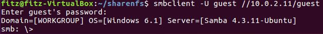
* [完成]Linux设置用户名密码方式的共享目录
	
	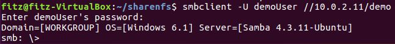
#### Windows作为服务器
* [完成]Linux访问Windows的用户名密码方式共享目录
	* windows开启共享方式，在文件夹属性中的共享下选择共享
		
		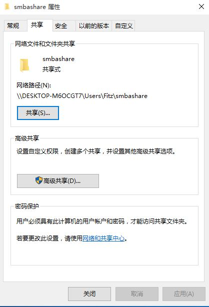
	* 在客户端中，连接Windows主机
		* smbclient -U Fitz //HOSTNAME/smbashare password

			
* [完成]下载整个目录
	* 命令如下
	
			smbclient -U Fitz //DESKTOP-M6OCGT7/smbashare
			tarmode
			recurse
			prompt
			mget a\
	* 结果如下图，可以下载整个目录中的文件
		
		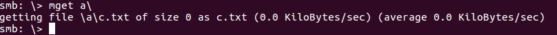
### 补充说明
* 在手动配置环境试验中，任务完成情况如上
* 在一键化配置实验中，目标主机为linux系统，故在配置脚本中只考虑针对linux目标主机的配置
### 参考链接
* [https://wiki.samba.org/index.php/Setting_up_Samba_as_a_Standalone_Server](https://wiki.samba.org/index.php/Setting_up_Samba_as_a_Standalone_Server "https://wiki.samba.org/index.php/Setting_up_Samba_as_a_Standalone_Server")
## DHCP
### 配置要求
	[完成] 2台虚拟机使用Internal网络模式连接，其中一台虚拟机上配置DHCP服务，另一台服务器作为DHCP客户端，从该DHCP服务器获取网络地址配置
### 环境说明
* 使用软件为：isc-dhcp-server
### 服务器端配置
* 查看/etc/default/isc-dhcp-server配置文件修改下列属性为你自己要使用的网卡
	
		INTERFACES="enp0s8"
* 给你要使用的网卡设置IP，不然之后dhcp服务启动不了（但是配好以后又重新给这个网卡分了一个IP）
	
		ifconfig enp0s8 10.0.66.1 netmask 255.255.255.0
* 修改/etc/dhcp/dhcpd.conf配置文件

		# minimal sample /etc/dhcp/dhcpd.conf
		default-lease-time 600;
		max-lease-time 7200;
		
		subnet 10.0.66.0 netmask 255.255.255.0 {
		 range 10.0.66.100 10.0.66.200;
		 option routers 10.0.66.1;
		 option domain-name-servers ns1.example.org, ns2.example.org, 10.0.66.1;
		 option domain-name "example.org";
		} 
### 客户端配置
* 客户端配置如下图,设置其为自为自动（DHCP）

	
## DNS
### 配置要求
	[完成]基于上述Internal网络模式连接的虚拟机实验环境，在DHCP服务器上配置DNS服务，使得另一台作为DNS客户端的主机可以通过该DNS服务器进行DNS查询
	[完成]在DNS服务器上添加 zone "cuc.edu.cn" 的以下解析记录
		ns.cuc.edu.cn NS
		ns A <自行填写DNS服务器的IP地址>
		wp.sec.cuc.edu.cn A <自行填写第5章实验中配置的WEB服务器的IP地址>
		dvwa.sec.cuc.edu.cn CNAME wp.sec.cuc.edu.cn
### DNS服务器端
* 安装bind9
	
		sudo apt-get install bind9 bind9utils bind9-doc
* 设置bind9到ipv4模式
		
		sudo vi /etc/default/bind9
	* 在OPTIONS变量里增加-4
		
			OPTIONS="-4 -u bind"
* 修改配置文件/etc/bind/named.conf.options，如下
		
		acl "trusted" {
        10.0.66.100;
        10.0.66.101;
        127.0.0.1;
		};
		options {
        directory "/var/cache/bind";

        recursion yes;                 # enables resursive queries
        allow-recursion { trusted; };  # allows recursive queries from "trusted" clients
        listen-on { 10.0.66.101; };   # ns1 private IP address - listen on private network only
        allow-transfer { none; };      # disable zone transfers by default

        forwarders {
                8.8.8.8;
                8.8.4.4;
        };
* 修改配置文件/etc/bind/named.conf.local，如下

		zone "cuc.edu.cn" {
    	type master;
    	file "/etc/bind/zones/db.cuc.edu.cn"; # zone file path
    	allow-transfer { 10.0.66.101; };         # ns2 private IP address - secondary
		};
* 创建/etc/bind/zones文件夹，并复制配置文件

		sudo mkdir /etc/bind/zones
		cd /etc/bind/zones
		sudo cp ../db.local ./db.cuc.edu.cn
* 编辑配置文件/etc/bind/zones/db.cuc.edu.cn,如下

		;
		; BIND data file for local loopback interface
		;
		$TTL    604800
		@       IN      SOA     ns1.cuc.edu.cn. cuc.edu.cn. (
		                              3         ; Serial
		                         604800         ; Refresh
		                          86400         ; Retry
		                        2419200         ; Expire
		                         604800 )       ; Negative Cache TTL
		;
		; name servers - NS records
		    IN      NS      ns.cuc.edu.cn.
		
		; name servers - A records
		ns.cuc.edu.cn.              IN      A       10.0.66.101
		; wp - A records
		wp.sec.cuc.edu.cn.          IN      A       10.0.2.13
		; DVWA - CNAME records
		dvwa.sec.cuc.edu.cn.        IN      CNAME   wp.sec.cuc.edu.cn.
* 重启DNS服务器
	
		sudo systemctl restart bind9.service
### DNS客户端
* 编辑head文件 /etc/resolvconf/resolv.conf.d/head，如下
	
		search cuc.edu.cn  # your private domain
		nameserver 10.0.66.101  # ns1 private IP address
* 生成新的resolv.conf文件

		sudo resolvconf -u
### 测试
* 配置完成的DNS服务器不仅能够解析本地配置域名，还能够解析外部域名，表明其能够正常工作
* dig wp.sec.cuc.edu.cn
	
	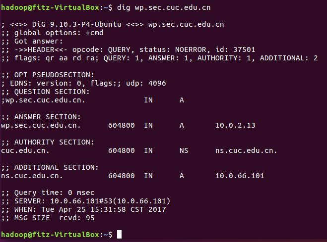
* dig dvwa.sec.cuc.edu.cn
	
	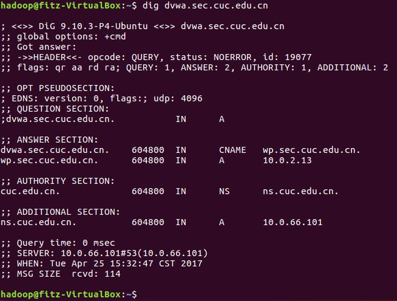
* dig baidu.com
	
	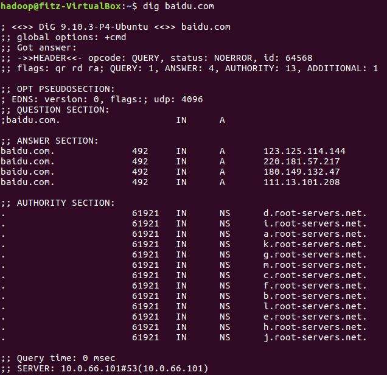
### 参考链接
* [https://www.digitalocean.com/community/tutorials/how-to-configure-bind-as-a-private-network-dns-server-on-ubuntu-14-04](https://www.digitalocean.com/community/tutorials/how-to-configure-bind-as-a-private-network-dns-server-on-ubuntu-14-04 "https://www.digitalocean.com/community/tutorials/how-to-configure-bind-as-a-private-network-dns-server-on-ubuntu-14-04")
## 一键化配置
### 环境说明
* 测试与验证系统均为ubuntu-16.04.1-server-amd64
### SHELL脚本编程基本要求
* [完成] 目标测试与验证系统为本学期课程指定操作系统版本
* [完成] 自动安装与自动配置过程的启动脚本要求在本地执行
	* 提示：配置远程目标主机的SSH免密root登录，安装脚本、配置文件可以从工作主机（执行启动脚本所在的主机）上通过scp或rsync方式拷贝或同步到远程目标主机，然后再借助SSH的远程命令执行功能实现远程控制安装和配置
* [完成] 假设目标系统没有配置过root用户免密登录，所以我们要求在自动安装脚本中包含自动配置远程root用户免密登录的代码
* [完成] 脚本在执行过程中，如果需要在目标主机上创建目录、创建临时文件、执行网络下载等操作需要判断执行是否成功，并进行必要的异常处理（例如：apt-get update失败，则退出脚本执行，并将友好错误信息打印在控制台上。临时目录不存在，则自动创建该临时目录）
* [完成] 所有服务的配置文件、临时目录需设置正确的目录和文件归属和权限位，禁止使用777这种偷懒的权限位设置
* [完成] 减少不必要的安装过程中的人机交互输入，尽可能全部通过脚本的方式完成选项设置和交互式问题输入等
### 配置脚本使用说明
* 一键化配置脚本为Script.sh
* 配置文件为config.conf，包括了目标主机IP，目标主机用户及密码，FTP和NFS用户及密码，samba用户及密码，如下：

		# IP of Target host
		hostname=10.0.2.20
		# User of Taeget host 
		hostuser="cuc"
		# Password of User
		password="sec.cuc.edu.cn"
		# Ftp and NFS username you want to set
		ftpnfsuser="sammy"
		# Password of ftp user you want to set
		ftpnfspassword="123456"
		# Samba username you want to set
		sambaname="demoUser"
		# Samba password you want to set
		sambapassword="123456"
		# networkcard of Taeget host,it must use Internal network,such as enp0s9
		networkcard="enp0s9"

* 其他软件配置文件在conf文件夹下
* 配置文件默认放置在workspace/conf文件夹中，保持workspace目录结构即可