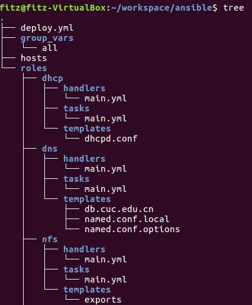
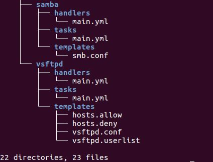
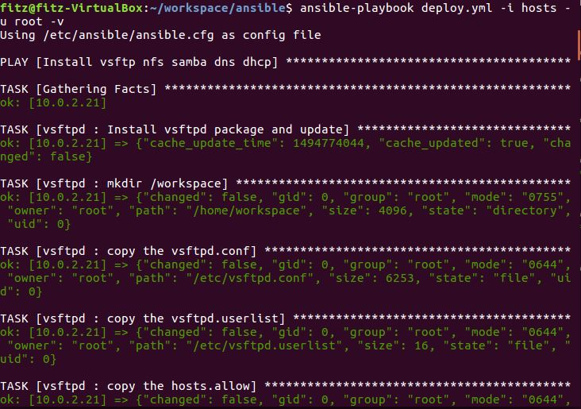
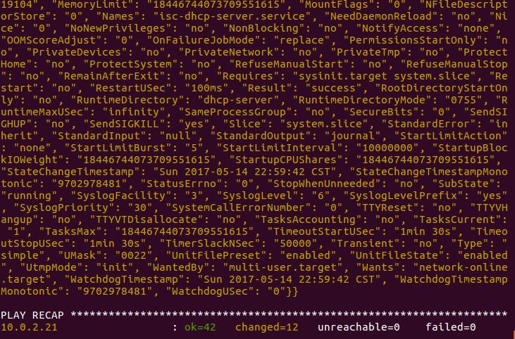

# 实验报告8_20170510
## 实验目的
* 使用ansible技术重构FTP、NFS、DHCP、DNS、Samba服务器的自动安装与自动配置
## ansible目录结构解释
* deploy.yml负责整个结构的安装与配置，往往将具体的服务安装配置交给指定roles中的具体目录
* hosts文件中指定目标主机
* group_vars文件夹下保存着配置所需要的变量信息
* roles目录下的各个目录分别承担各自服务的安装与配置
* roles/XXX/tasks目录负责执行具体服务的主要的安装配置功能
* roles/XXX/templates目录保存各个服务所需的配置文件
* roles/XXX/handles目录负责服务的重启
	
	

	
## 实验步骤
* 配置免密登录，参照
	[http://sec.cuc.edu.cn/huangwei/course/LinuxSysAdmin/chap0x08.md.print.html](http://sec.cuc.edu.cn/huangwei/course/LinuxSysAdmin/chap0x08.md.print.html "http://sec.cuc.edu.cn/huangwei/course/LinuxSysAdmin/chap0x08.md.print.html")
* 参照之前的shell脚本编程过程，将shell脚本转换为ansible命令即可。
	* 配置文件结构及ansible配置文件格式参考：
		* [https://github.com/ansible/ansible-examples](https://github.com/ansible/ansible-examples "https://github.com/ansible/ansible-examples")
* 用户创建及密钥存储采用调用crypt 模块
	* 参考链接：[http://zouqingyun.blog.51cto.com/782246/1741263](http://zouqingyun.blog.51cto.com/782246/1741263 "http://zouqingyun.blog.51cto.com/782246/1741263")
## 实验结果

## 参考链接
* [Ansible中文权威指南](http://www.ansible.com.cn/ "http://www.ansible.com.cn/")
* [免密登录](http://sec.cuc.edu.cn/huangwei/course/LinuxSysAdmin/chap0x08.md.print.html "http://sec.cuc.edu.cn/huangwei/course/LinuxSysAdmin/chap0x08.md.print.html")
* [ansible配置样例参考](https://github.com/ansible/ansible-examples "https://github.com/ansible/ansible-examples")