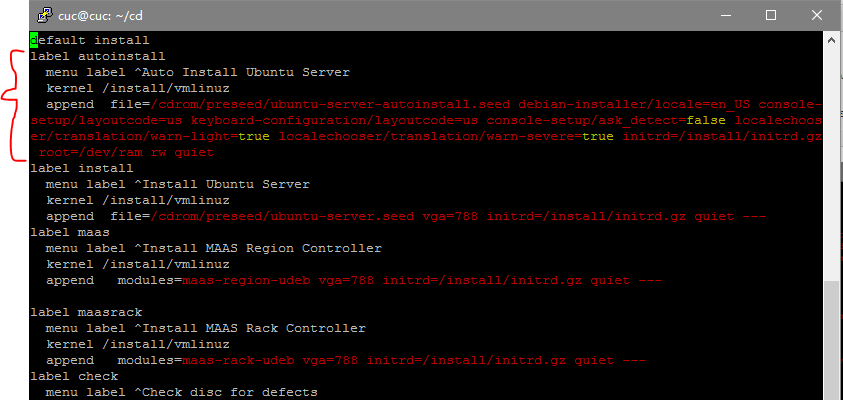
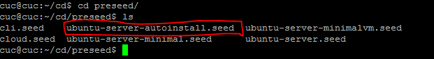
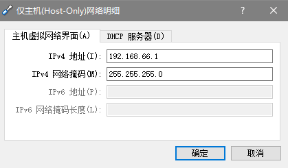

# LINUX系统与网络管理 实验报告1 20170228
## 实验名称
* 无人值守安装ISO制作
## 实现特性
* 定制一个普通用户名和默认密码
* 定制安装OpenSSH Server
* 安装过程禁止自动联网更新软件包
## 实验过程
* 1.使用putty 连接目标主机
* 2.使用psftp将待重打包iso文件传进目标主机（put 1.iso）
* 3.根据实验指导，命令如下

		# 在当前用户目录下创建一个用于挂载iso镜像文件的目录
		mkdir loopdir
		
		# 挂载iso镜像文件到该目录
		mount -o loop ubuntu-16.04.1-server-amd64.iso loopdir
		
		# 创建一个工作目录用于克隆光盘内容
		mkdir cd
		 
		# 同步光盘内容到目标工作目录
		# 一定要注意loopdir后的这个/，cd后面不能有/
		rsync -av loopdir/ cd
		
		# 卸载iso镜像
		umount loopdir
		
		# 进入目标工作目录
		cd cd/
		
	*  下图表明已成功将iso文件中内容同步到工作目录中
		
* 4.
	
		# 编辑Ubuntu安装引导界面增加一个新菜单项入口	
			vim isolinux/txt.cfg
		# 添加以下内容到该文件后强制保存退出
			label autoinstall
			  menu label ^Auto Install Ubuntu Server
			  kernel /install/vmlinuz
			  append  file=/cdrom/preseed/ubuntu-server-autoinstall.seed debian-installer/locale=en_US console-setup/layoutcode=us keyboard-configuration/layoutcode=us console-setup/ask_detect=false localechooser/translation/warn-light=true localechooser/translation/warn-severe=true initrd=/install/initrd.gz root=/dev/ram rw quiet
	
	
* 5.将定制好的ubuntu-server-autoinstall.seed文件保存到刚才创建的工作目录~/cd/preseed/ubuntu-server-autoinstall.seed

	
* 6.修改isolinux/isolinux.cfg，增加内容timeout 10
	
	
* 7.

		# 重新生成md5sum.txt
			cd ~/cd && find . -type f -print0 | xargs -0 md5sum > md5sum.txt
			
			# 封闭改动后的目录到.iso
			IMAGE=custom.iso
			# 路径要写成绝对路径，不然会出错
			BUILD=/home/cuc/cd/
			
			mkisofs -r -V "Custom Ubuntu Install CD" \
			            -cache-inodes \
			            -J -l -b isolinux/isolinux.bin \
			            -c isolinux/boot.cat -no-emul-boot \
			            -boot-load-size 4 -boot-info-table \
			            -o $IMAGE $BUILD
* 8.生成好了.iso，然后在psftp中用get拷出来

	
* 9.安装过程如下 可实现无人值守安装Ubuntu
	<iframe height=498 width=510 src="http://player.youku.com/embed/XMjUzNTMyNTMyMA==">

	<iframe height=498 width=510 src='http://player.youku.com/embed/XMjUzNTMyNTMyMA==' frameborder=0 'allowfullscreen'></iframe>
## 遇到的问题
* 1.用的是host-only+NAT连接方式，为什么主机ping不通虚拟机里的host-only网卡的IP？
	* 解决方法：可能因为中间断网等若干玄学原因，使得host-only网卡的ip被改为非预期的奇怪的IP，将其手动改回到和DHCP服务器一个网段的IP即可。

		
		
* 2.重新计算MD5值的时候，没有写权限
	* 解决方法：将计算好的MD5值的文件放到其他目录下，然后再拷贝过来