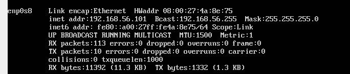
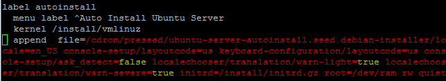
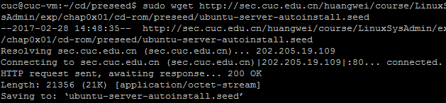
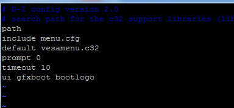
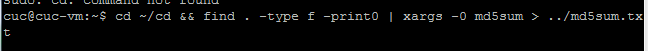
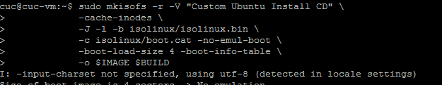
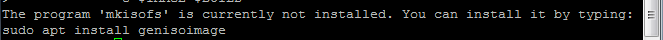
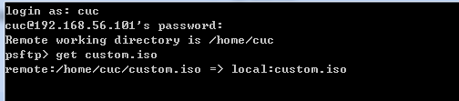

# 无人值守安装iso并在Virtualbox中完成自动化安装 #

## 实验要求
- 在linux的ubuntu系统下，实现一个可自动化安装的iso镜像

##实验环境
- 本实验在virtualbox虚拟机中完成，虚拟机为linux ubuntu 16.04.1系统

##实验内容
- 因为本次试验多处应用到相关命令的拷贝复制，而在未安装增强功能的虚拟机的命令行界面不具备复制粘贴功能，所以利用putty远程控制的方式进行相关操作
 - 因为虚拟机默认的NAT连接模式存在地址冲突，所以首先给虚拟机添加第二块网卡，采取host-only连接方式
 - 直接添加以后会发现ifconfig未显示出新添加的网卡，加入-a参数后，才显示该网卡名称enp0s8，说明该网卡还没有被启用
 - 接下来输入命令ifconfig enp0s8 up启用该网卡，这里第一次遇到了权限不足的错误信息，使用sudo命令提权并输入密码执行命令  

 - 再次输入ifconfig可以看到enp0s8网卡已被启用，但没有被分配地址，这样putty仍然无法远程登录，所以执行dhclient enp0s8命令给其分配地址，同样提示需要提权  

 - 完成以上操作后，输入ifconfig查看可以其网络地址，就可以在宿主机利用putty远程登陆了  
（地址为192.168.56.101）
- putty可以正确连接后，首先使用wget下载好ubuntu 16.04.1的iso镜像文件到虚拟机，然后新建一个loopdir的挂载目录，将iso镜像文件挂载到该目录，报错提示只有root权限可以执行挂载命令，同样进行提权操作  

- 创建一个工作目录cd用于克隆光盘内容:输入命令mkdir cd
- 同步光盘内容到目标工作目录：输入命令rsync -av loopdir/ cd
- 完成以上操作后，iso镜像文件已经可全部克隆到虚拟机中，所以可以将其卸载：输入命令umount loopdir
- 接下来为ubuntu的安装界面增加一个新的菜单选项，也就是本次试验所要实现的自动安装选项，这里需要注意将添加的label放在默认安装选项的下面，这样后面把菜单的选择时间改为10后，就可以实现完全的自动安装
 - 进入cd目录，执行命令vim isolinux/txt.cfg
 - 添加以下内容到该文件后按ESC输入：wq！强制保存退出：  
  label autoinstall    
  menu label ^Auto Install Ubuntu Server    
  kernel /install/vmlinuz  
  append  file=/cdrom/preseed/ubuntu-server-autoinstall.seed debian-installer/locale=en_US console-setup/layoutcode=us keyboard-configuration/layoutcode=us console-setup/ask_detect=false localechooser/translation/warn-light=true localechooser/translation/warn-severe=true initrd=/install/initrd.gz root=/dev/ram rw quiet   

- 下载黄老师修改过的ubuntu-server-autoinstall.seed文件，并保存在刚刚创建的工作目录~/cd/preseed/ubuntu-server-autoinstall.seed  

- 修改isolinux/isolinux.cfg，增加内容timeout 10，这样可以使系统直接选择刚才设置好的默认自动安装方式，而无需人工点击选择  

- 重新生成md5sum.txt，这里因为权限问题不能自动生成，所以我先在默认路径下生成了md5sum.txt，然后通过mv命令移动到cd目录下，即输入命令  
 - cd ~/cd && find . -type f -print0 | xargs -0 md5sum > ../md5sum.txt  
 - mv md5sum.txt cd  

- 封闭改动后的目录到custom.iso,输入命令：  
 - IMAGE=custom.iso  
 - BUILD=~/cd/  
 - mkisofs -r -V "Custom Ubuntu Install CD" \  
  -cache-inodes \  
  -J -l -b isolinux/isolinux.bin \  
  -c isolinux/boot.cat -no-emul-boot \  
  -boot-load-size 4 -boot-info-table \  
  -o $IMAGE $BUILD  
默认采用utf-8编码方式
- 第一次报错提示缺少模块，按照提示添加对应模块    

- 第二次报错显示需要提权，mkisofs前加上sudo执行命令即可
- 完成封装后，使用psftp将镜像文件下载到本地即可  

##实验中的问题
- 第一次测试镜像时，未能自动安装，因为将time out设为10后，系统自动选择的安装方式仍然是原来的方式，而未采用实验中设置的自动安装方式；在编辑txt.cfg时，将该安装方式设置成默认安装方式后，第二次测试解决了这个问题，可以完成自动安装。

