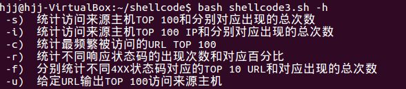
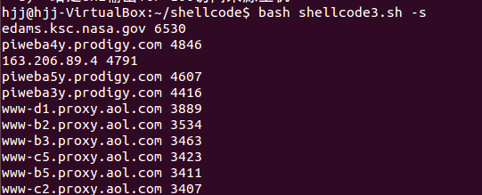
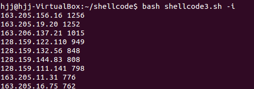
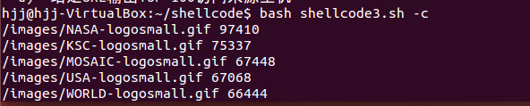
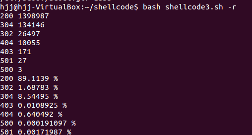
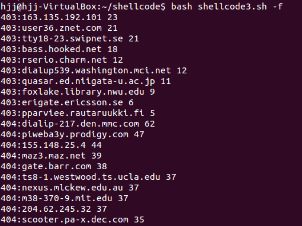
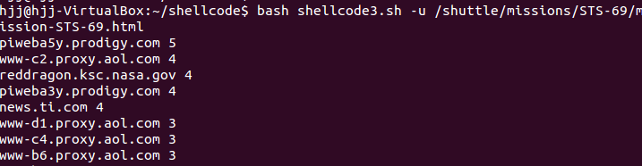

# 帮助信息

 
# -s)  统计访问来源主机TOP 100和分别对应出现的总次数

# -i)  统计访问来源主机TOP 100 IP和分别对应出现的总次数 

# -c)  统计最频繁被访问的URL TOP 100

# -r)  统计不同响应状态码的出现次数和对应百分比 

# -f)  分别统计不同4XX状态码对应的TOP 10 URL和对应出现的总次数  

# -u)  给定URL输出TOP 100访问来源主机 

