# 实验五 搭建服务器并进行安全加固

-----

## 环境配置
### 两台ubuntu16.04 虚拟机
* 虚拟机1：用于配置verynginx，双网卡分别以host-only和nat网络形式  
ip地址：  
host-only 192.168.25.1  
NAT网络  10.0.2.7
* 虚拟机2：用于配置wordpress和dvwa，单网卡以nat网络形式  
ip地址：10.0.2.8   
开放端口：80（http://wp.sec.cuc.edu.cn);  
8080(http://dvwa.sec.cuc.edu.cn);  
443(https://wp.sec.cuc.edu.cn) 

## 实验过程
### 安装verynginx
* [VeryNginx](https://github.com/alexazhou/VeryNginx/blob/master/readme_zh.md)
### 安装wordpress
* [LEMP安装](https://www.digitalocean.com/community/tutorials/how-to-install-linux-nginx-mysql-php-lemp-stack-in-ubuntu-16-04)
* [wordpress](https://www.digitalocean.com/community/tutorials/how-to-install-wordpress-with-lemp-on-ubuntu-16-04)
### 安装DVWA
* [DVWA](https://github.com/ethicalhack3r/DVWA)

## 基本需求
### 配置verynginx实现反向代理
* 使用matcher和upstream和proxypass 进行反向代理
 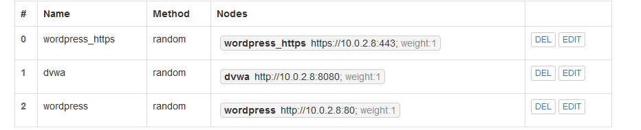
 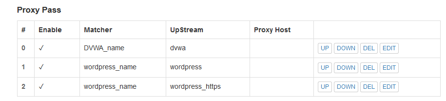
* 实现效果
 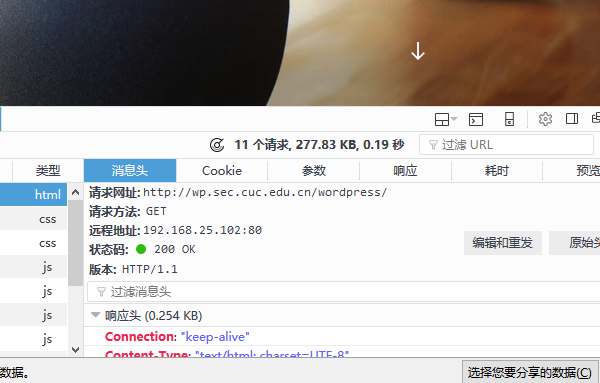
 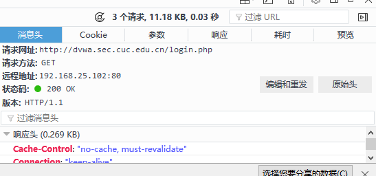  
请求地址均为192.168.25.102
### 配置证书实现wordpress的https访问
* [nginx 自签发证书制作](https://www.digitalocean.com/community/tutorials/how-to-create-a-self-signed-ssl-certificate-for-nginx-in-ubuntu-16-04)
* 实现效果  
 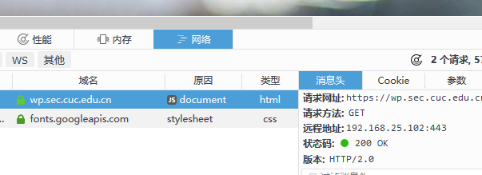
## 安全加固要求
使用VeryNginx的Matcher,Response,Filter功能模块实现
### 禁止IP访问
*  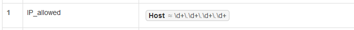
*  友好的错误提示信息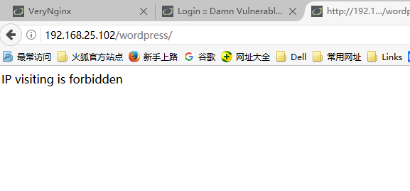
### dvwa白名单限制登录
*  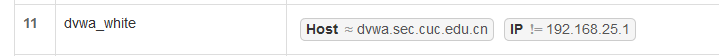
*  友好的错误提示信息
*   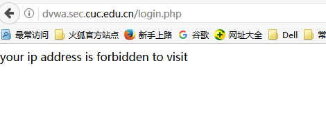
### verynginx白名单限制登录
*  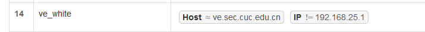
*  友好的错误提示信息
*   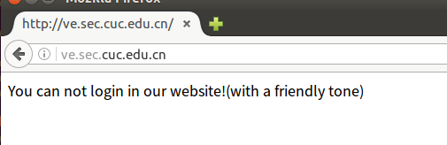
### 热修复<Wordpress4.7.1漏洞
* 漏洞描述：即通过访问/wp-json/wp/v2/users/可以获取wordpress用户信息的json数据
* 修复方法：禁止访问站点的/wp-json/wp/v2/users/路径
* 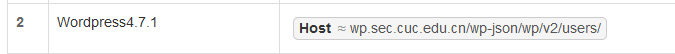
### 限制访问频率
* 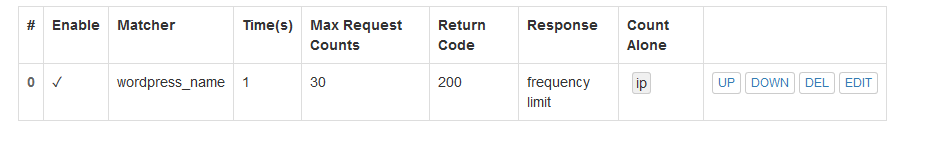
* 友好的错误提示信息
* 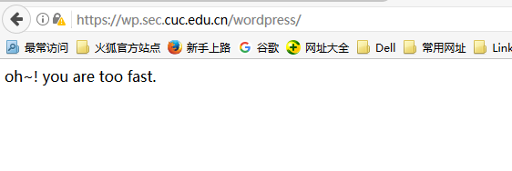
### SQL注入漏洞防御
* 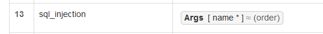
* 实现效果（友好的报错）
* 
### 禁止curl访问
* 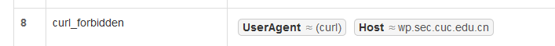

-----
## 实验中的问题
* 配置反向代理的时候，出现了502无法连接的错误，当时采用的是两台虚拟机均用host—only配置，无法解决此问题；更换为nat网络后，连接变为正常
*  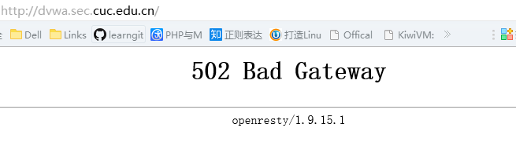

# 配置文件
* [wordpress的nginx配置文件](./default)
* [DVWA的nginx配置文件](./dvwa)
* [openresty的nginx配置](./nginx.conf) 
* [verynginx中的规则配置](./config.json)
