* 这个实验我只完成了手工配置的部分。
# FTP
    [ ] 配置一个提供匿名访问的FTP服务器，匿名访问者可以访问1个目录且仅拥有该目录及其所有子目录的只读访问权限；
    [ ] 配置一个支持用户名和密码方式访问的账号，该账号继承匿名访问者所有权限，且拥有对另1个独立目录及其子目录完整读写（包括创建目录、修改文件、删除文件等）权限；
        该账号仅可用于FTP服务访问，不能用于系统shell登录；

    [ ] FTP用户不能越权访问指定目录之外的任意其他目录和文件；
    [ ] 匿名访问权限仅限白名单IP来源用户访问，禁止白名单IP以外的访问；
    [ ] （可选加分任务）使用FTPS服务代替FTP服务，上述所有要求在FTPS服务中同时得到满足；
* 实现效果
  * 匿名访问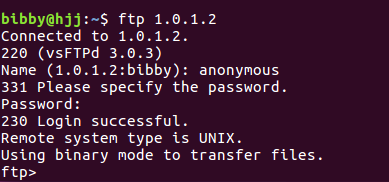
  * 用户名访问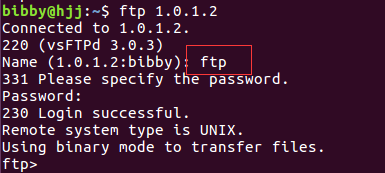
  * 根目录不允许写，不允许越权访问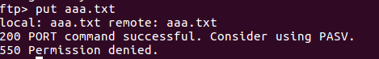
  * 该账号不能用于shell登录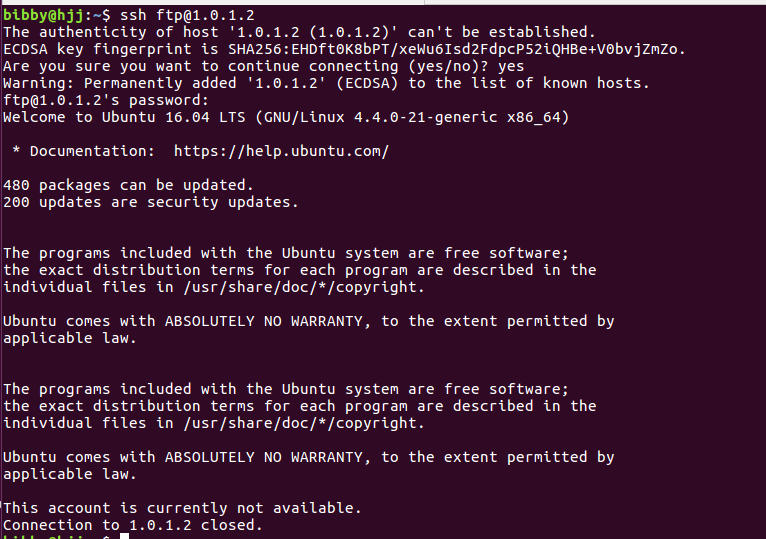
  * 白名单和黑名单——通过hosts.allow和hosts.deny进行控制
  * 在hosts.allow和hosts.deny中做限制
		
			hosts.allow配置规则:
			vsftpd:1.0.1.100 #客户端IP

			host.deny配置规则
			vsftpd:ALL
# NFS

    [ ] 在1台Linux上配置NFS服务，另1台电脑上配置NFS客户端挂载2个权限不同的共享目录，分别对应只读访问和读写访问权限；
    [ ] 实验报告中请记录你在NFS客户端上看到的：
        共享目录中文件、子目录的属主、权限信息
        你通过NFS客户端在NFS共享目录中新建的目录、创建的文件的属主、权限信息
        上述共享目录中文件、子目录的属主、权限信息和在NFS服务器端上查看到的信息一样吗？无论是否一致，请给出你查到的资料是如何讲解NFS目录中的属主和属主组信息应该如何正确解读
	[ ] （可选加分任务）在客户端或NFS服务器上抓包分析使用NFS协议时的远程文件下载、上传、移动、删除等操作是否是明文？远程的文件传输数据流是否可以被恢复出完整的传输文件？
* 实现效果
  * 在服务器上配置好后，在客户端机器上进行挂载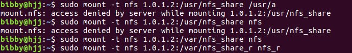
  * 挂载信息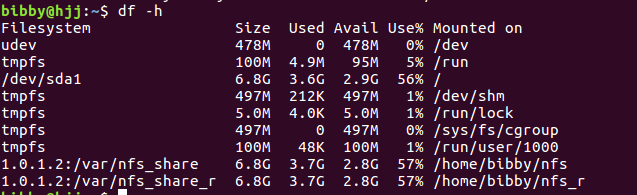
  * 拥有读写权限的挂载目录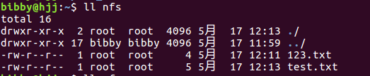
  * 只拥有读权限的挂载目录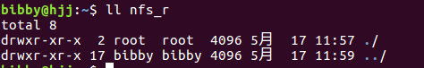  
  验证

# DHCP

* 实现效果
  * 通过虚拟机内部网络实现
  * dhcp服务器配置信息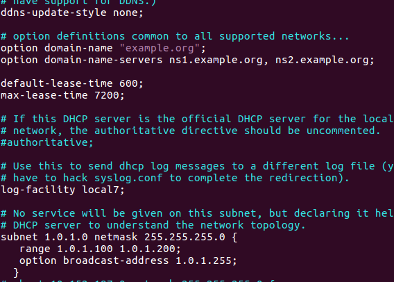 
  * 客户端分配得到IP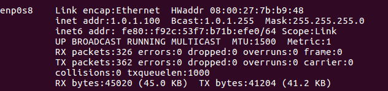 

# Samba

* 实现效果
  * 这个实验我手工配置了linux上的服务器，但根据demo配置文件，在客户端连接需要的是windows服务器所以发生了报错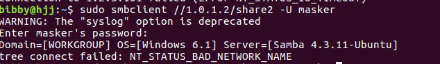 
  * 而如果需要脚本的自动化配置，就需要涉及windows系统的自动部署，所以这一块暂时没有完成

# DNS
* 实现效果
  * dns服务器域名解析文件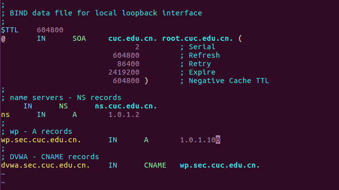
  * 客户端配置文件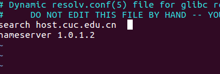
  * 测试域名效果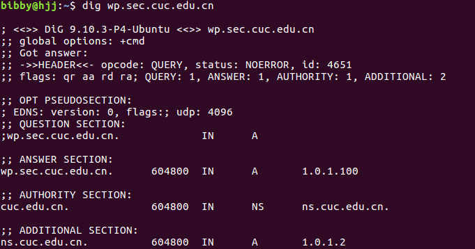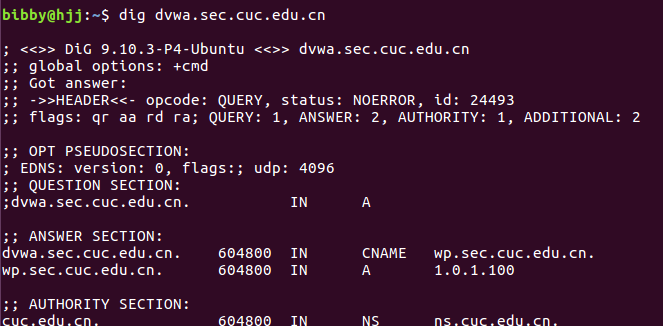
