# ansible 配置实验
* 实验环境
  * 控制主机 ip：1.2.3.10
  * 目标主机 ip：1.2.3.20
  * 均使用内部网络和桥接网卡两种网络链接模式

* 运行结果 
  *   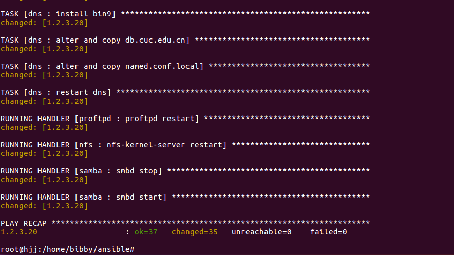
* 执行后目标机状态  
  * dhcp分配地址
  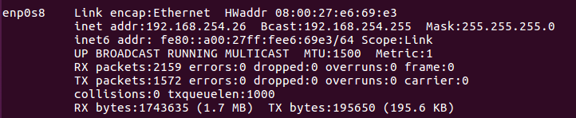
  * nfs配置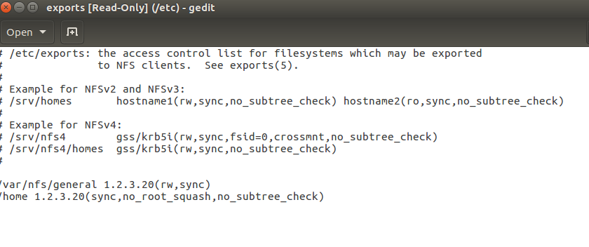
  * ftp服务器配置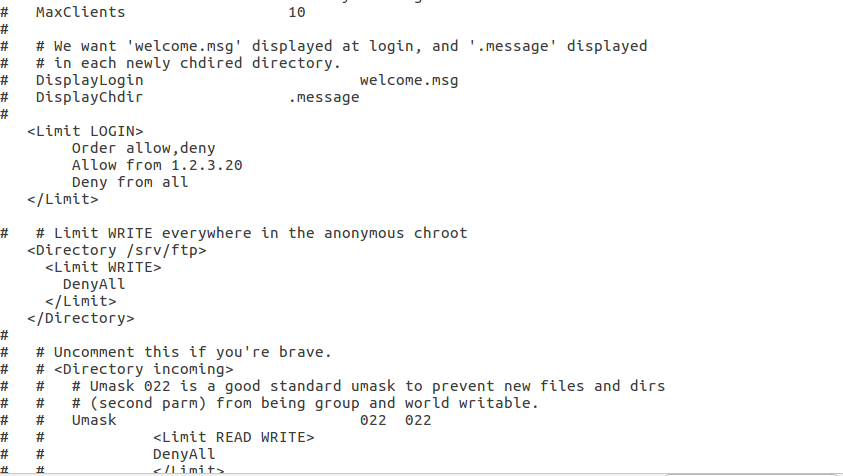
  * samba服务器配置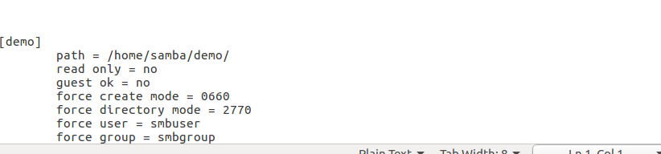
  * dns服务器配置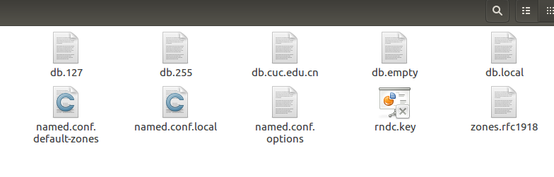
* 实验流程
 * 配置ssh免密登录  
 ssh-copy-id -i ~/.ssh/id_rsa.pub root@1.2.3.20
 * 控制主机下载ansible，并测试是否可达目标机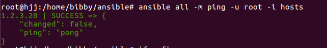
* 配置参数 all
  * 
 
* nfs 
   * 配置install.yml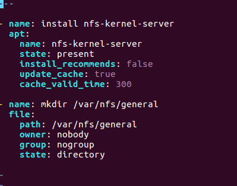
   * 复制export文件到目标机并启用nfs服务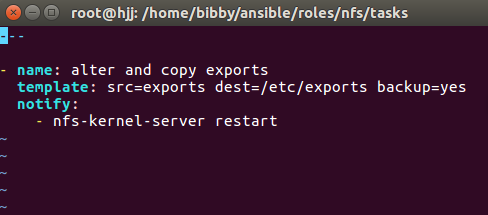
* dns
   * 配置install.yml  
    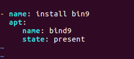
   * 拷贝域名解析文件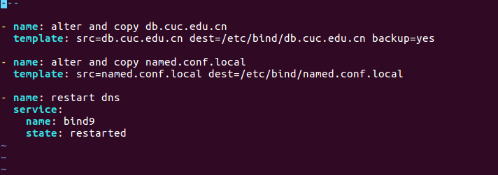
* dhcp
   * 配置install.yml
   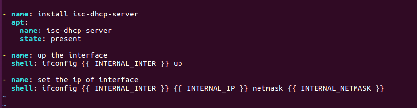 
   * 拷贝dhcp服务器配置文件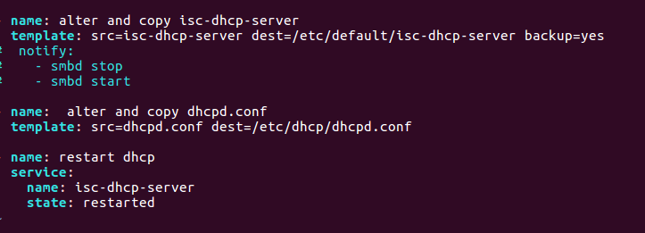
* ftp（此次实验使用proftpd）
   * 安装ftp服务器，新建FTP服务器的使用用户，以及建立ftp服务器的管理文件夹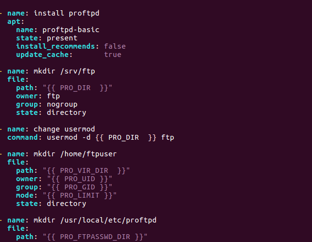
   * 拷贝ftp服务器的访问规则的文件conf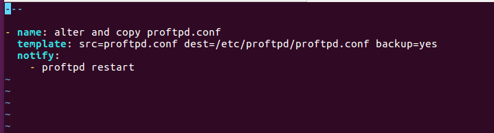
* samba
   * 配置install.yml,用于新建samba服务器用户，及配置权限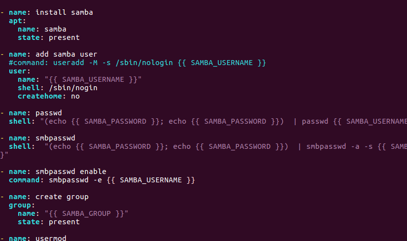
   * 拷贝服务器配置文件到目标机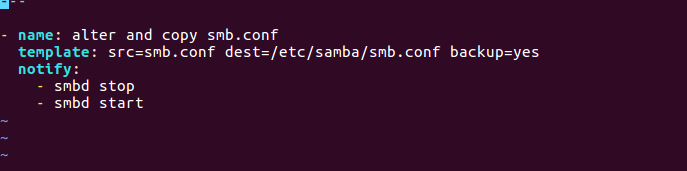

