# SHELL脚本编程基础  
## 任务一：用bash编写一个图片批处理脚本  
### 一、使用工具：imagemagick  
### 二、实验思路：  
1. 了解getopt和getopts，getopts不支持长参数，因此选择了getopt  
（参考链接：https://my.oschina.net/leejun2005/blog/202376）  
2. 用getopt设置短参数和长参数  
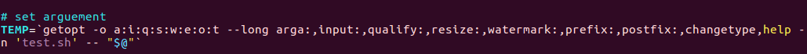  
3. 通过设置QUALITY、RESIZE、WATERMARK、PROFIX、POSTFIX来记录用户输入的参数  
4. 通过设置FLAG来记录是否需要拼接该命令  
5. 通过设置TYPE来限制处理图像的格式  
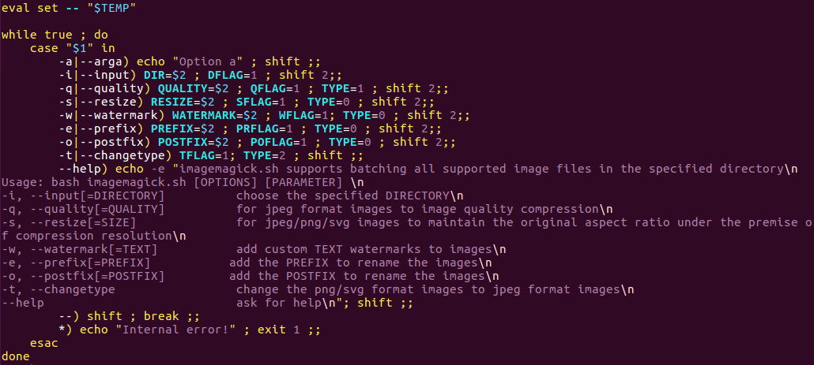  
### 三、实验结果：  
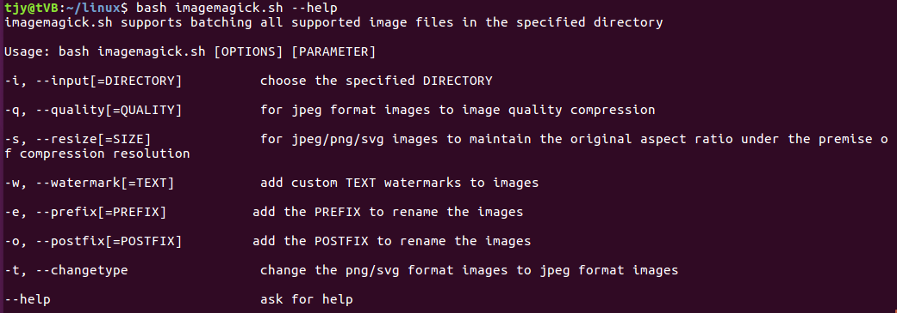  
  
### 四、问题及解决：  
1. find命令会处理当前目录及其自目录下所有匹配的文件，若要只处理当前目录，只用maxdepth 1  
参考链接：http://blog.csdn.net/guoguo1980/article/details/2846667

## 任务二：用bash编写一个文本批处理脚本，对附件“2014世界杯运动员数据”进行批量处理完成相应的数据统计任务  
### 一、使用工具：awk sort uniq  
参考链接：http://bbs.chinaunix.net/thread-4250622-1-1.html  
### 二、实验结果：  
1. 帮助信息  
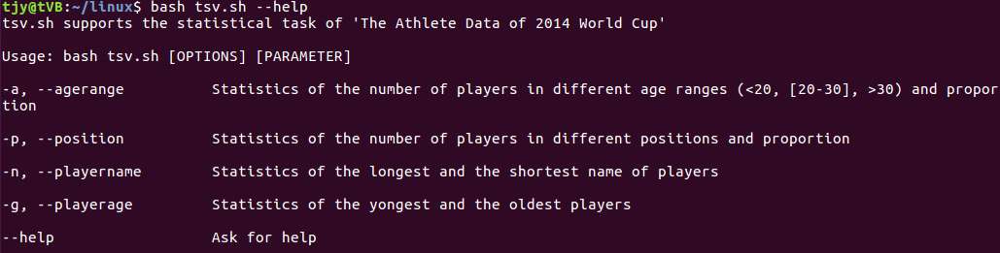  
2. 统计不同年龄区间范围（20岁以下、[20-30]、30岁以上）的球员数量、百分比  
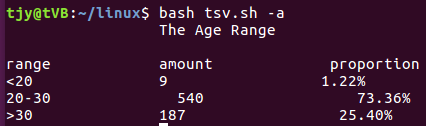  
3. 统计不同场上位置的球员数量、百分比  
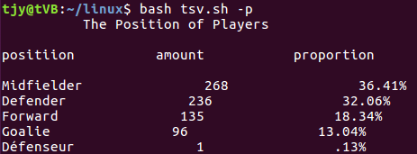 
4. 名字最长的球员是谁？名字最短的球员是谁？  
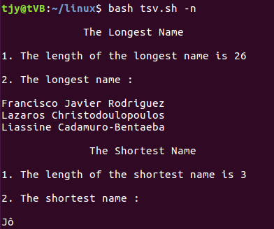 
5. 年龄最大的球员是谁？年龄最小的球员是谁？  
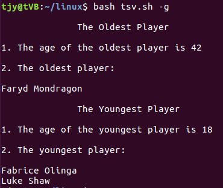  
6. 实验结果详见task2.txt     

### 三、问题及解决：  
1. cat命令会把tsv文件的表头也获取，从而影响之后的统计工作，因此可以把cat换成more +2，即从第二行开始获取  
2. awk传参问题（参考链接：http://www.cnblogs.com/chengmo/archive/2010/10/03/1841753.html）  
3. 修改文件前缀后缀参考链接：http://www.1987.name/264.html  

## 任务三：用bash编写一个文本批处理脚本，对附件“Web服务器访问日志”分别进行批量处理完成相应的数据统计任务  
### 一、使用工具：awk sort uniq grep  
### 二、实验结果：  
1. 帮助信息  
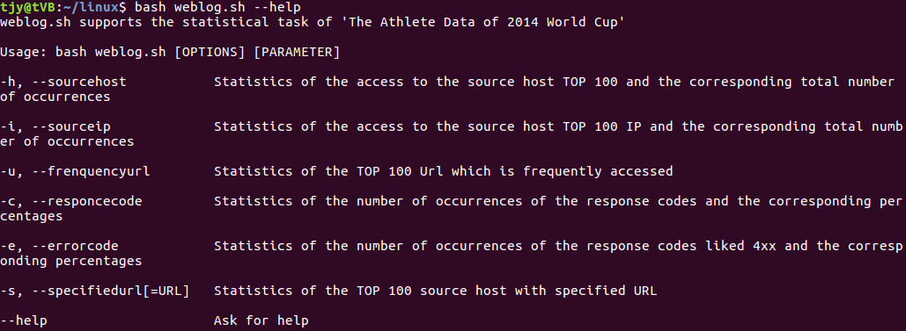  
2. 统计访问来源主机TOP 100和分别对应出现的总次数  
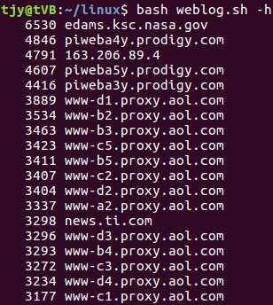  
3. 统计访问来源主机TOP 100 IP和分别对应出现的总次数  
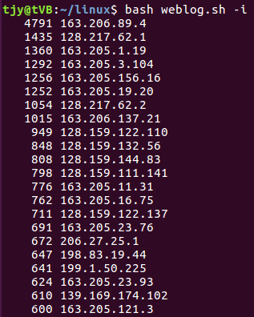  
4. 统计最频繁被访问的URL TOP 100  
 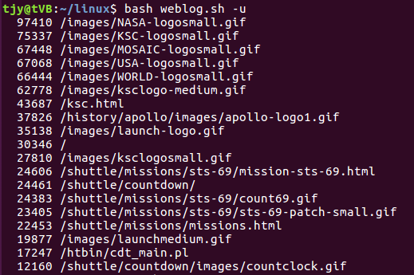  
5. 统计不同响应状态码的出现次数和对应百分比  
 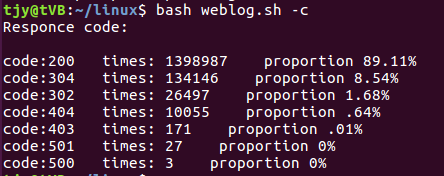  
6. 分别统计不同4XX状态码对应的TOP 10 URL和对应出现的总次数  
 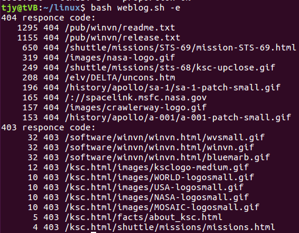  
7. 给定URL输出TOP 100访问来源主机  
 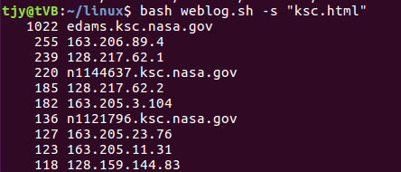 
8. 实验结果详见task3_1.txt task3_2.txt task3_3.txt   

### 三、问题及解决  
1. 参考链接：http://7177526.blog.51cto.com/7167526/1385469  