# 支持反向代理、流量控制、关键词过滤等功能的高级Web服务器配置  
*** 
## 一、实验环境  
* Ubuntu16.04 Server  
* nginx/1.10.0  
* openresty/1.9.15.1  
* WordPress 4.7  
* Damn Vulnerable Web Application (DVWA) 1.10  
*** 
## 二、实验过程  
## 1.安装VeryNginx  
* 在sudo python install.py install之后要先安装libpcre3-dev、libssl-dev和build-essential  
	* sudo apt-get install libpcre3-dev  
	* sudo apt-get install libssl-dev  
	* sudo apt-get install build-essential  
* 编辑/opt/verynginx/openresty/nginx/conf/nginx.conf 修改user=www-data  
* 启动verynginx必须使用sudo /opt/verynginx/openresty/nginx/sbin/nginx方式，不可以切换到该目录下再运行sudo nginx  
## 2.在VeryNginx中搭建SSL  
* verynginx的证书域名要写verynginx.tjy.com  
* 其中self-signed.conf和ssl-params.conf都保存在/opt/verynginx/openresty/nginx/conf/
* 参照/etc/nginx/sites-available/default修改/opt/verynginx/openresty/nginx/conf/nginx.conf  
## 3.DVWA搭建  
* 软链接  
	* cuc@cuc:/etc/nginx/sites-available$ sudo cp default default_dvwa  
	* cuc@cuc:/etc/nginx/sites-available$ sudo vim default_dvwa  
	* sudo ln -s /etc/nginx/sites-available/default_dvwa /etc/nginx/sites-enabled/default_dvwa  
	* sudo nginx -s reload  
* 解决function allow_url_include问题：修改/etc/php/7.0/fpm/php.ini中的allow_url_include = On  
* 重启php服务：sudo systemctl restart php7.0-fpm  
* 添加reCAPTCHA key：修改/var/www/html/dvwa/config/config.inc.php中的数据库密码，在https://www.google.com/recaptcha/admin#list中生成公私钥，添加进config.inc.php中  
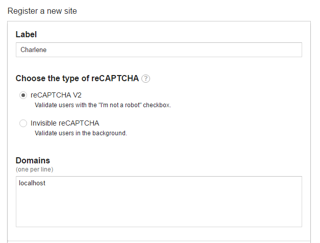
* 使/var/www/html/dvwa/hackable/uploads/和 /var/www/html/dvwa/external/phpids/0.6/lib/IDS/tmp/phpids_log.txt可写：
	* sudo chgrp www-data hackable/uploads  
	* sudo chgrp www-data /var/www/html/dvwa/external//phpids/0.6/lib/IDS/tmp/phpids_log.txt  
	* sudo chmod g+w hackable/uploads/  
	* sudo chmod g+w /var/www/html/dvwa/external/phpids/0.6/lib/IDS/tmp/phpids_log.txt  
* 参考YouTube视频[How to setup DVWA](https://www.youtube.com/watch?v=5BG6iq_AUvM)  
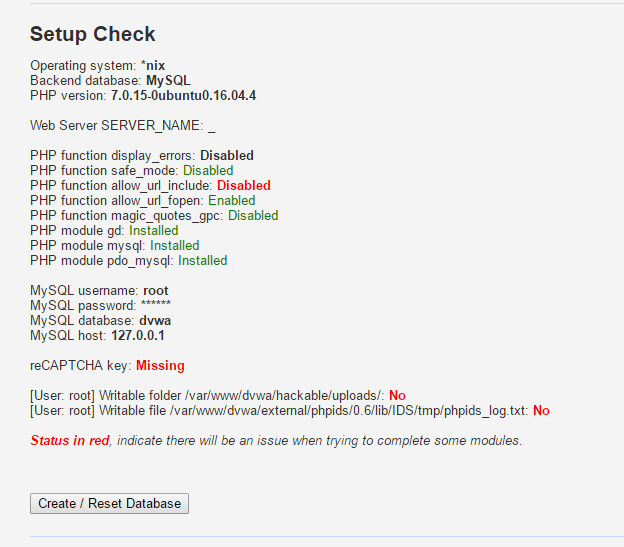  
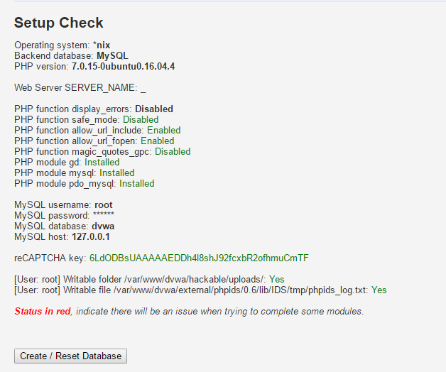  
## 4.搭建VeryNginx主要过程[参考链接](https://www.digitalocean.com/community/tutorials/how-to-install-wordpress-with-lemp-on-ubuntu-16-04)  
*** 
## 三、服务器配置  
## 1.WordPress  
### HTTP  
* nginx:  
	* 端口：8080  
### SSL  
* verynginx：  
	* 端口：443  
* nginx:  
	* 端口：4433  

## 2.DVWA  
### HTTP  
* nginx:  
	* 端口：8181  
***  
## 四、问题及解决方法和注意事项  
1. 代理规则要https优先  
2. WordPress的数据库会第一次访问安装的那个IP当作了他的域名，要是第一次安装用IP访问，那么数据库中就会把IP当作是他的域名，对于后面在verynginx中针对域名wp.sec.cuc.edu.cn配置的反向代理就会无效，无法加载js等资源  
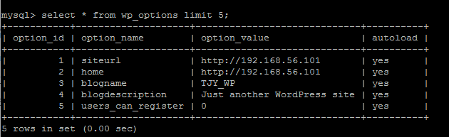  
[官方修改域名参考链接](https://codex.wordpress.org/Changing_The_Site_URL)  
3. 如果通过verynginx反向代理来安装WordPress，那么这个/wp-json/wp/v2/users/路径就无法访问了  
	* 上述两个问题解决方法：关闭verynginx服务，修改nginx配置使得能通过域名访问wp.sec.cuc.edu.cn，再安装WordPress，安装成功后再修改nginx配置并开启verynginx服务，回复反向代理功能  
4. 自定义要求：对于目录/wp-json/wp/v2/users/，已登录用户可以访问，未登陆用户不可以访问，通过检查登陆认证cookie：wordpress_logged_in实现  
***  
## 五、相关配置文件  
1. [WordPress配置文件](file/dafault)  
2. [DVWA配置文件](file/default_dvwa)  
3. [VeryNginx配置文件](file/nginx.conf)  
4. [VeryNginx规则](file/config.json)  
***  
## 六、相关结果截图  
1. 使用IP地址方式均无法访问上述任意站点，并向访客展示自定义的友好错误提示信息页面-1  
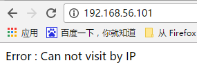  
2. Damn Vulnerable Web Application (DVWA)只允许白名单上的访客来源IP，其他来源的IP访问均向访客展示自定义的友好错误提示信息页面-2  
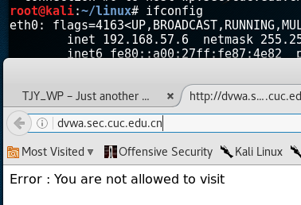  
3. 在不升级Wordpress版本的情况下，通过定制VeryNginx的访问控制策略规则，热修复WordPress < 4.7.1 - Username Enumeration  
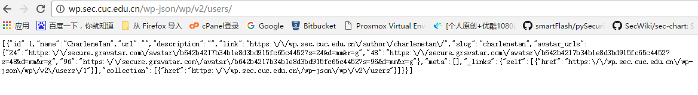
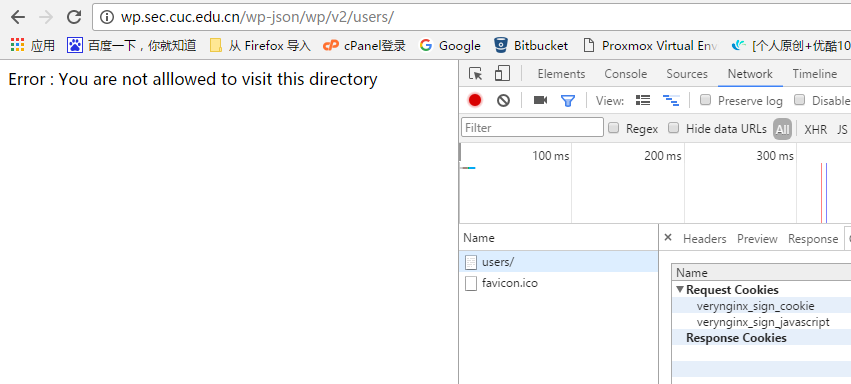  
4. 通过配置VeryNginx的Filter规则实现对Damn Vulnerable Web Application (DVWA)的SQL注入实验在低安全等级条件下进行防护  
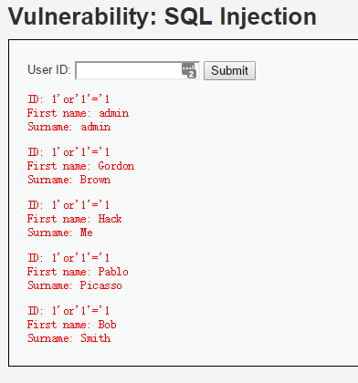  
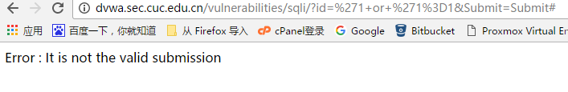  
5. VeryNginx的Web管理页面仅允许白名单上的访客来源IP，其他来源的IP访问均向访客展示自定义的友好错误提示信息页面-3  
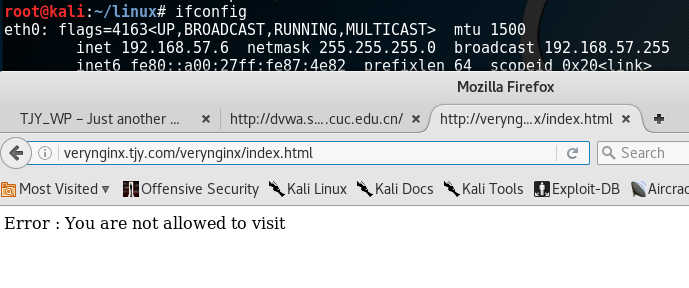  
6. 限制DVWA站点的单IP访问速率为每秒请求数 < 50和限制Wordpress站点的单IP访问速率为每秒请求数 < 20，超过访问频率限制的请求直接返回自定义错误提示信息页面-4  
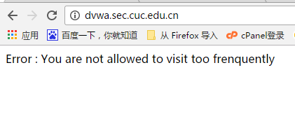  
7. 禁止curl访问  
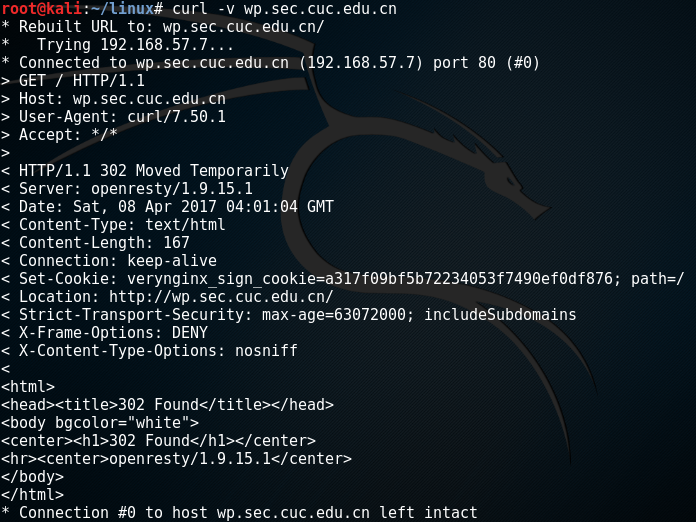