## proftpd  
### 配置一个提供匿名访问的FTP服务器，匿名访问者可以访问1个目录且仅拥有该目录及其所有子目录的只读访问权限  
* 修改proftpd.conf文件  

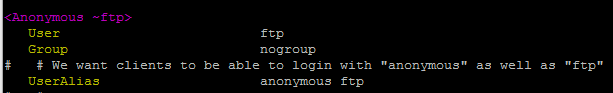  
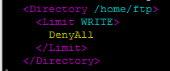  

* 设置RequireValidShell off  
* 默认共享目录为/srv/ftp  
* 若要修改共享目录，需要执行  
	* sudo chown -R ftp:nogroup /home/ftp  
	* sudo usermod -d /home/ftp ftp   
### 配置一个支持用户名和密码方式访问的账号，该账号继承匿名访问者所有权限，且拥有对另1个独立目录及其子目录完整读写（包括创建目录、修改文件、删除文件等）权限（该账号仅可用于FTP服务访问，不能用于系统shell登录）  
* 修改proftpd.conf文件  
	> AuthOrder                       mod_auth_file.c mod_auth_unix.c    
	> AuthUserFile                    /usr/local/etc/proftpd/passwd  
	> AuthGroupFile                   /usr/local/etc/proftpd/group  
	> PersistentPasswd                off  
	> RequireValidShell              off  

* 使用ftpasswd创建passwd和group文件  
	* 创建了一个user1和user2用户:sudo ftpasswd --passwd --file=/usr/local/etc/proftpd/passwd --name=user1 --uid=1024 --home=/home/user1 --shell=/bin/false  
	* 创建了一个virtualusers组:sudo ftpasswd --file=/usr/local/etc/proftpd/group --group --name=virtualusers --gid=1024  
	* 把user1和user2加入virtualusers组：sudo ftpasswd --group --name=virtualusers --gid=1024 --member=user1 --member=user2 --file=/usr/local/etc/proftpd/group  

* 修改/home/user1权限  
	* sudo chown -R 1024:1024 /home/user1  
	* sudo chmod -R 700 /home/user1  

### FTP用户不能越权访问指定目录之外的任意其他目录和文件  
* 修改proftpd.conf文件，添加DefaultRoot ~  

### 匿名访问权限仅限白名单IP来源用户访问，禁止白名单IP以外的访问  
* 修改proftpd.conf文件  

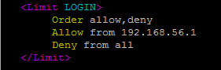   

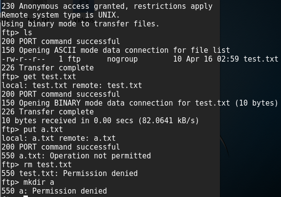
* [参考链接](http://www.cnblogs.com/h2appy/archive/2008/05/20/1203210.html)  

## NFS  
### 在1台Linux上配置NFS服务，另1台电脑上配置NFS客户端挂载2个权限不同的共享目录，分别对应只读访问和读写访问权限  
* IP：  
	* Host：192.168.57.7  
	* Client：192.168.57.8  
* Host:  
	* sudo apt-get update  
	* sudo apt-get install nfs-kernel-server  
* Client:  
	* sudo apt-get update  
	* sudo apt-get install nfs-common  
* 在Host上创建一个用于挂载的（可读写）文件夹  
	* sudo mkdir /var/nfs/general -p  
	* sudo chown nobody:nogroup /var/nfs/general  
* 另一个用于挂载的文件夹为/home（不可读写），不需要创建  
* 在Host上修改/etc/exports文件  
	* /var/nfs/general    192.168.57.8(rw,sync,no_subtree_check)  
	* /home       192.168.57.8(sync,no_root_squash,no_subtree_check)  
* 在Client上创建相应的挂载文件  
	* sudo mkdir -p /nfs/general  
	* sudo mkdir -p /nfs/home  
* 在Client上挂载文件夹  
	* sudo mount 192.168.57.7:/var/nfs/general /nfs/general  
	* sudo mount 192.168.57.7:/home /nfs/home  
* NFS目录中的属主和属主组信息应该如何正确解读:  
	* 在/etc/exports配合文件中设置共享文件夹属性时，会涉及到一个参数no_root_squash，没有设置了这个参数的话，即使在客户端使用sudo创建目录文件，属主和权限信息都是该客户端用户及其所在用户组，并不是root:root；相反，设置了该参数，以sudo创建的目录文件就会是root:root  

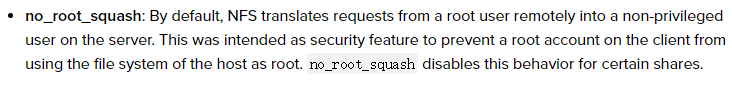  
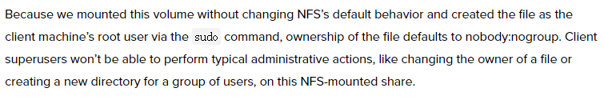  
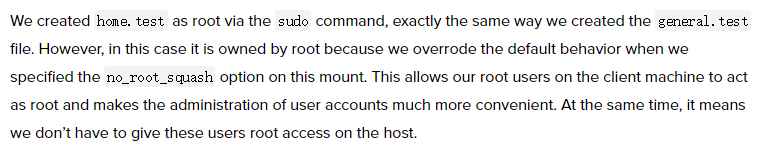  

### [参考链接](https://www.digitalocean.com/community/tutorials/how-to-set-up-an-nfs-mount-on-ubuntu-16-04)  

## Samba  
### Server：Linux & Client：Windows  
* 安装Samba服务器  
	* sudo apt-get install samba  
* 创建Samba共享专用的用户  
	* sudo useradd -M -s /sbin/nologin smbuser  
	* sudo passwd smbuser   
* 创建的用户必须有一个同名的Linux用户，密码是独立的  
	* sudo smbpasswd -a smbuser  
* 在/etc/samba/smb.conf 文件尾部追加以下“共享目录”配置，guest为匿名用户可以访问的目录（不可写），demo为虚拟用户才能访问的目录（可读写）  
	* [guest]  
        path = /home/samba/guest/  
        read only = yes  
        guest ok = yes  

	* [demo]  
        path = /home/samba/demo/  
        read only = no  
        guest ok = no  
        force create mode = 0660  
        force directory mode = 2770  
        force user = smbuser  
        force group = smbgroup  

* To enable the Samba account：smbpasswd -e smbuser  
* 创建用户组  
	* sudo groupadd smbgroup  
	* sudo usermod -G smbgroup smbuser  
* 创建用于共享的文件夹并修改用户组  
	* mkdir -p /home/samba/guest/  
	* mkdir -p /home/samba/demo/  
	* sudo chgrp -R smbgroup /home/samba/guest/  
	* sudo chgrp -R smbgroup /home/samba/demo/  
	* sudo chmod 2775 /home/samba/guest/  
	* sudo chmod 2770 /home/samba/demo/  
* 启动samba：smbd  
* Client为Windows 7，访问共享文件：  
	* 在浏览器上访问需要用户名密码的可读写文件：\\\192.168.57.7\demo   
	* 在浏览器上访问可匿名访问的不可读写文件：\\\192.168.57.7\guest   
* [参考链接](https://wiki.samba.org/index.php/Setting_up_Samba_as_a_Standalone_Server)  

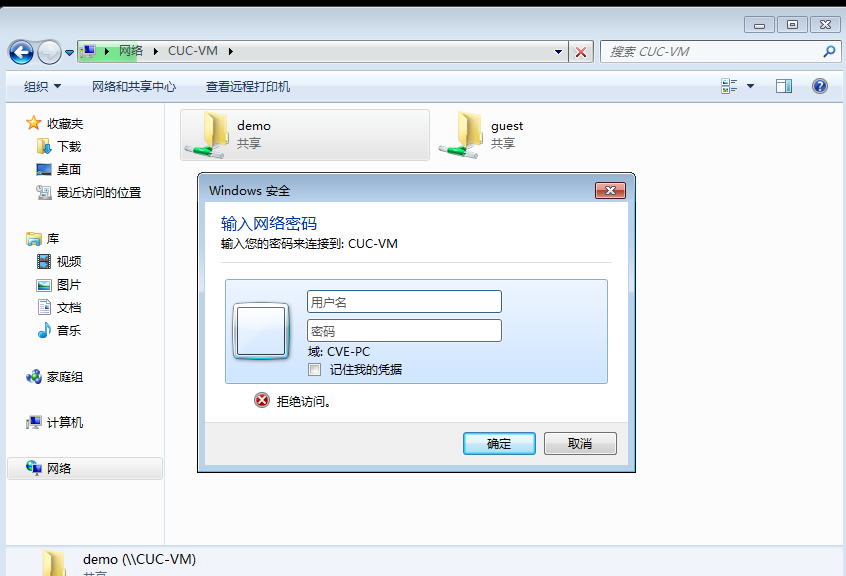  
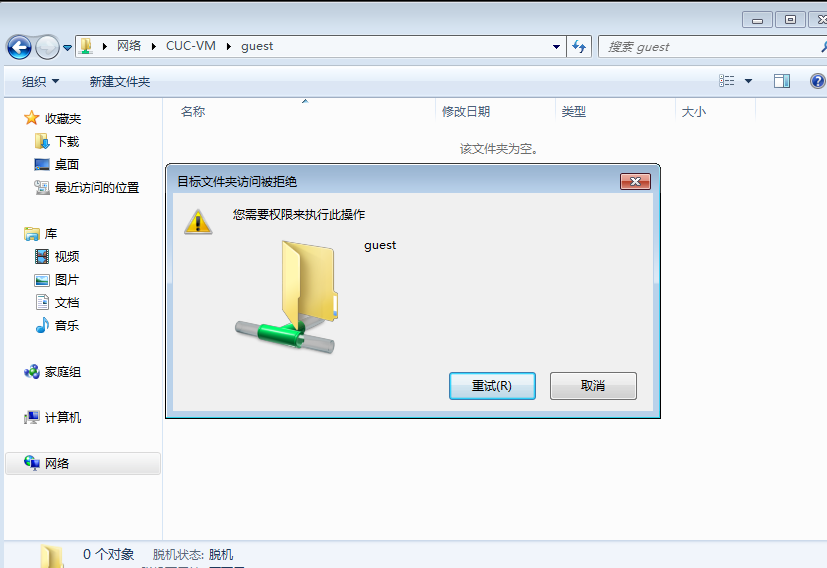  

### Server：Windows & Client：Linux  
* 在Windows指定目录设置为共享  
* 在Linux上下载安装smbclient  
	* sudo apt-get install smbclient  
* 查看所有共享目录：  
	* smbclient  -L 192.168.57.9 -U cve  
	* -U指定的用户名必须为服务器端已存在的用户名  
* 访问共享目录：  
	* smbclient -U cve //192.168.57.9/sharetest  
* 下载整个目录：  
	* prompt  
	* recurse  
	* 默认无法下载目录，只能下载文件，上述两条命令是smbclient可以下载目录  
	* mget b  

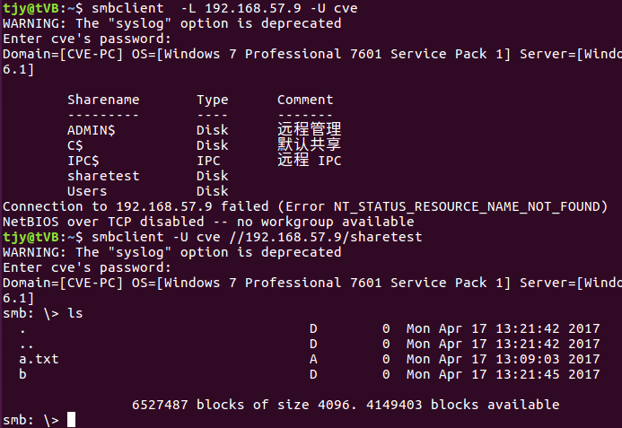  

## DHCP  
* 修改server的/etc/network/interfaces文件  
	* auto enp0s9  
	* iface enp0s9 inet static  
	* address 192.168.254.25  
	* netmask 255.255.255.0  
	* gateway 192.168.254.25  
* 修改server的/etc/default/isc-dhcp-server文件  
	* INTERFACES="enp0s9"
* 修改server的/etc/dhcp/dhcpd.conf文件  
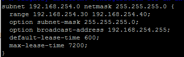  

## DNS  
### Server  
* 安装bind9  
	* sudo apt install bind9  
	* sudo apt install dnsutils  
* 编辑/etc/bind/named.conf.local文件，添加一下内容  
	zone "cuc.edu.cn" {  
        type master;  
        file "/etc/bind/db.cuc.edu.cn";  
	};  
* 创建保存域名解析的db文件  
	* sudo cp /etc/bind/db.local /etc/bind/db.cuc.edu.cn  
* 编辑/etc/bind/db.cuc.edu.cn文件  
  

* 重启服务：sudo systemctl restart bind9.service  
 
### Client  
* 添加解析服务器  
	* sudo vim /etc/resolvconf/resolv.conf.d/head  
		> search cuc.edu.cn  
  		> nameserver 192.168.254.25  

* 更新resolv.conf文件  
	* sudo resolvconf -u  
* [参考链接](https://www.digitalocean.com/community/tutorials/how-to-configure-bind-as-a-private-network-dns-server-on-ubuntu-14-04)  

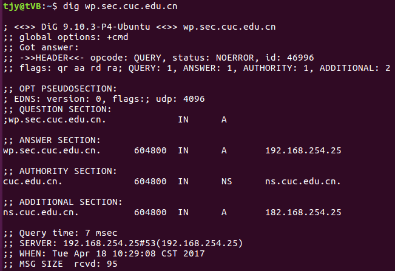  
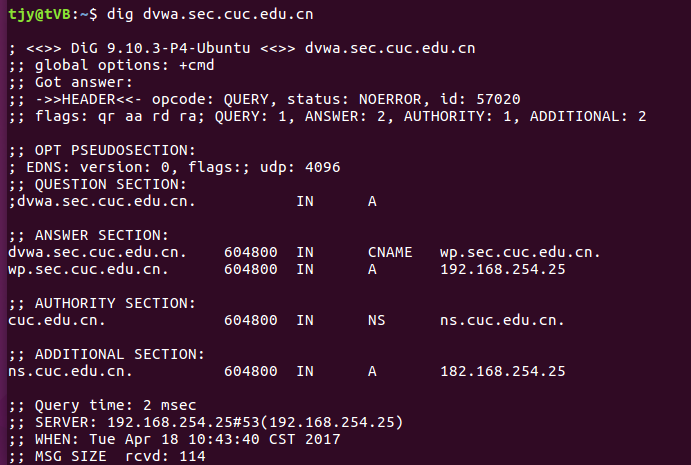  

