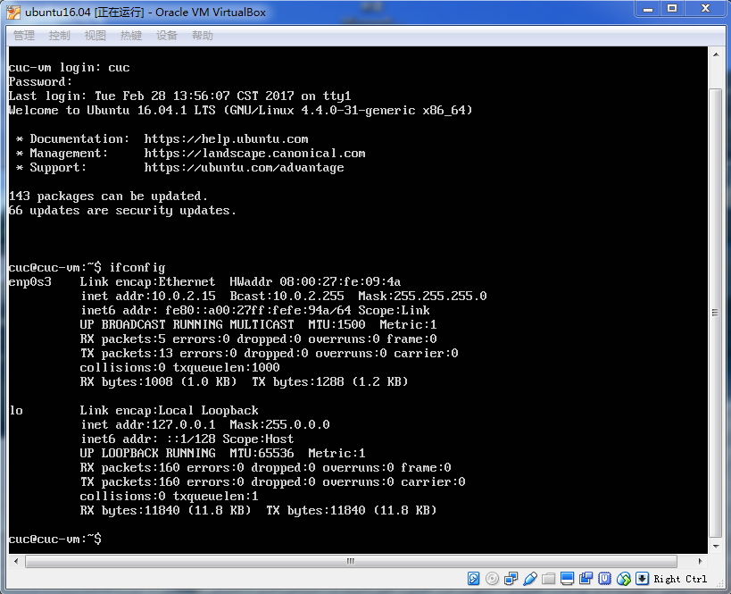
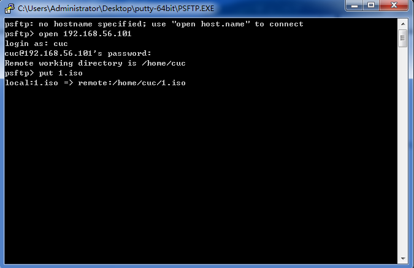
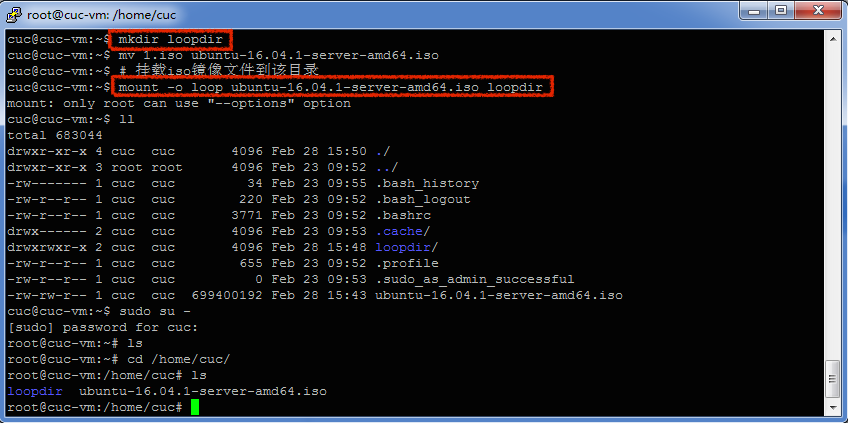
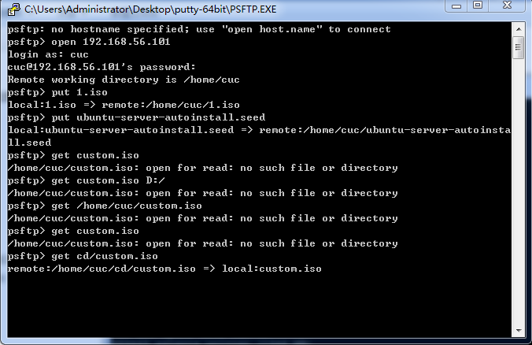
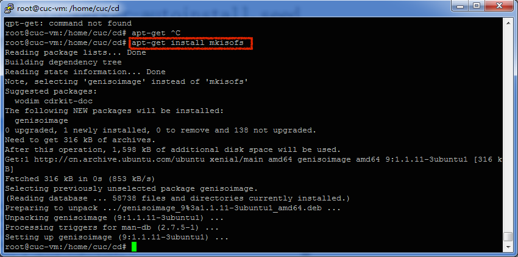
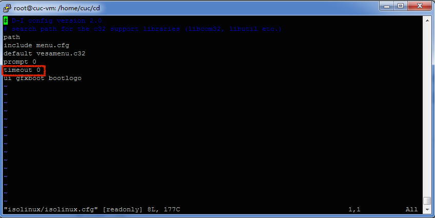
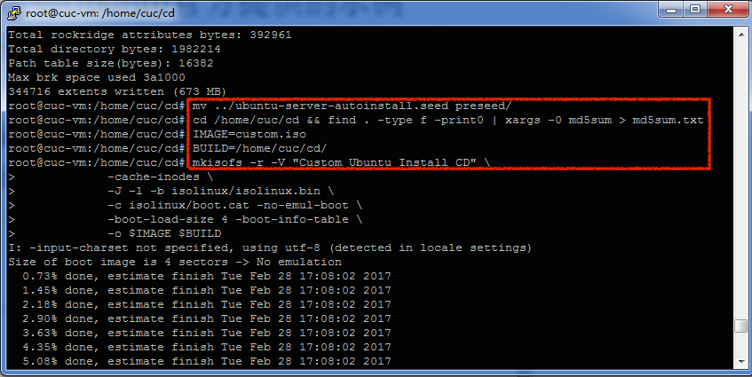
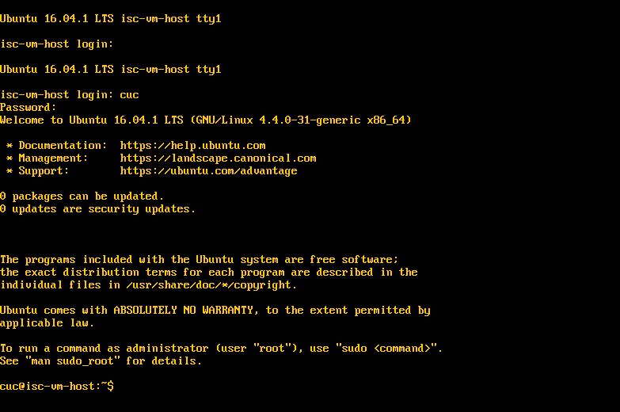

# 实验一

## 实验步骤

### step1 添加网卡

> 启动制作镜像的虚拟机前，在网络设置中添加一块host-only的网卡，启动虚拟机并登录后，为该网卡enp0s8获取IP
```
[sudo dhclient enp0s8]
```



### step2 传送镜像

> 通过putty中的psftp将镜像从宿主机传送至虚拟机
```
［put 1.iso］
```


### step3 创建挂载目录＋挂载镜像

>在当前用户目录下创建一个用于挂载ios镜像文件的目录，并挂载ios镜像文件到该目录
```
[mkdir loopdir]
[mount -o loop ubuntu-16.04.1-server-amd64.iso loopdir]
```


### step4  创建工作目录＋克隆光盘

> 创建一个工作目录用于克隆光盘内容，同步光盘内容到目标工作目录，并卸载iso镜像
```
［mkdir cd］
［rsync -av loopdir/ cd］
［umount loopdir］
```

### step5  编辑Ubuntu安装引导界面

> 进入目标工作目录，编辑Ubuntu安装引导界面，粘贴并强制保存所给代码以增加一个新菜单项入口
```
［cd cd/］
［vim isolinux/txt.cfg］
```


### step6 下载并传送.seed文件

```
［put ubuntu-server-autoinstall.seed］
```


### step7 生成无人值守镜像custom.iso

#### (1)下载mkisofs工具包；
#### (2)将isolinux/isolinux.cfg文件中的timeout 0修改为timeout 10；
#### (3)将传送至虚拟机中的.seed文件移动到创建的工作目录下的preseed目录下；
#### (4)重新生成md5sum.txt文件；(4)封闭改动后的目录到.iso
```
［apt-get install  mkisofs］
［cd ~/cd && find . -type f -print0 | xargs -0 md5sum > md5sum.txt］
［IMAGE=custom.iso］
［BUILD=home/cuc/cd/］
［mkisofs -r -V "Custom Ubuntu Install CD" \
            -cache-inodes \
            -J -l -b isolinux/isolinux.bin \
            -c isolinux/boot.cat -no-emul-boot \
            -boot-load-size 4 -boot-info-table \
            -o $IMAGE $BUILD］            
```




### step8 将生成的镜像custom.iso从虚拟机传送至宿主机

```
[get cd/custom.iso]
```


### step9 新建一个虚拟机，挂载自制的无人值守镜像，安装并登录成功




## 小结
### 实验中遇到的问题
#### 因为所给步骤及具体操作其实已经十分的全面，一步步参照完成基本没有什么原则上的问题［何况机智如我还高举手机录了一个小时的视频（≧∇≦）］，只是在最后将制作好的镜像custom.iso传送从虚拟机传送至宿主机的一步中，开始总是报错找不到该镜像文件，在小伙伴的指点下发现是文件路径没有弄清楚，及时修正后得以继续顺利进行

### 特别鸣谢
> 编撰了详尽实验手册并真人出镜录制了我的教程视频的wuli黄大大🌹
> 在关键时刻一语惊醒梦中人的wuli可亲可爱的祝小玟童鞋😘


