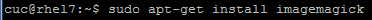
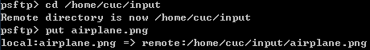
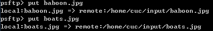
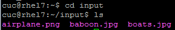
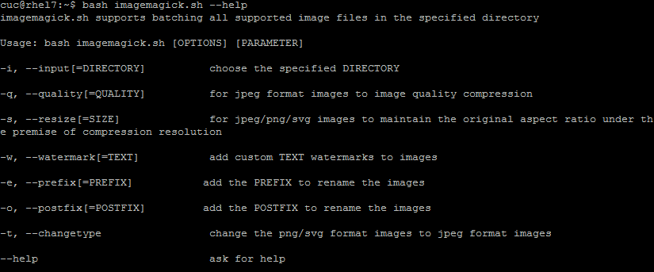
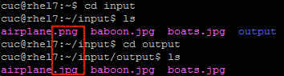
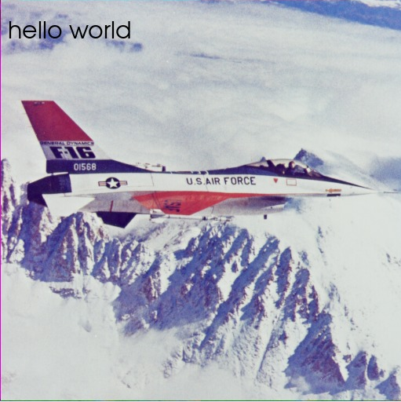

# task1 图片批处理脚本

## 前言

#### 笔者认真研读了课件、同学们的实验报告和代码，最终借鉴了谭嘉怡同学的代码作为蓝本，结合课件四和实验一中putty工具包的使用独立梳理了实验过程，开展了本次实验

#### 版权声明：以下代码转自https://github.com/CUCCS/linux/blob/master/2017-1/TJY/bash/imagemagick.sh

## 实验步骤

### step1 安装imagemagick

### step2 创建.sh脚本文件

>打开创建好的.sh文件，“a”输入编辑-->ESC-->“:wq”保存退出编辑

### step3 使.sh文件可执行

### step4 将实验图片从宿主机传入虚拟机

>在/home/cuc/目录下创建目录input，通过putty工具包中的psftp将图片从宿主机传入虚拟机input目录下

### step5 组合检测&&实验结果

>批量为input目录下所有的图片添加水印“hello world”，并将png格式的图片转换为jpeg格式

#### 特别鸣谢：本实验imagemagick.sh代码提供者谭嘉怡同学～

