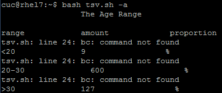
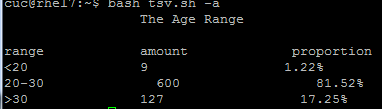
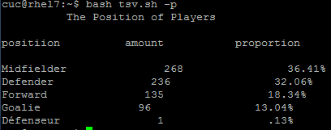
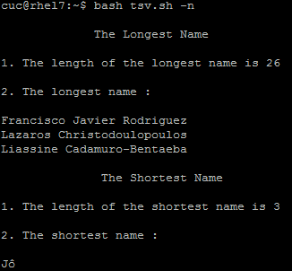
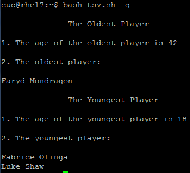
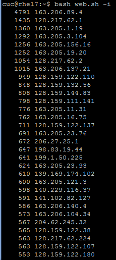
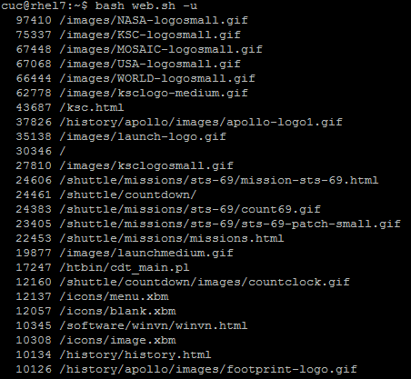
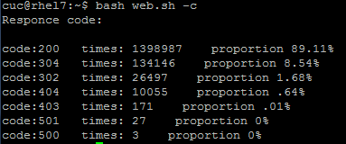
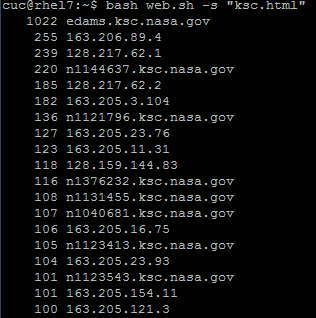

# task2&&task3 文本批处理脚本

## 前言

#### 笔者认真研读了课件、同学们的实验报告和代码，最终借鉴了谭嘉怡同学的代码作为蓝本，结合课件四和实验一中putty工具包的使用独立梳理了实验过程，开展了本次实验

#### 版权声明：以下代码转自
#### https://github.com/CUCCS/linux/blob/master/2017-1/TJY/bash/tsv.sh
#### https://github.com/CUCCS/linux/blob/master/2017-1/TJY/bash/weblog.sh

#### task2、task3的实验过程总体上分为利用putty传送.tsv文件-->创建.sh文件-->运行.sh文件三步，与task1相同，详情参见task1的实验报告，此处不赘述。值得注意的是，在实验之前需要检查实验环境是否安装好代码相关的工具,否则就会出现如下情况：

#### 笔者查看了报错发现是环境中没有安装bc命令(用于命令行计算器)，安装后顺利进行了余下步骤

## task2

#### 统计不同年龄区间范围（20岁以下、［20～30］、30岁以上）的球员数量、百分比

#### 统计不同场上位置的球员数量、百分比

#### 名字最长的球员是谁？名字最短的球员是谁？

#### 年龄最大的球员是谁？年龄最小的球员是谁？

## task3

#### 统计访问来源主机TOP 100和分别对应出现的总次数

#### 统计访问来源主机TOP 100的IP和分别对应出现的总次数

#### 统计最频繁被访问的URL TOP 100

#### 统计不同响应状态码的出现次数和对应百分比

#### 给定url输出TOP 100访问来源主机

#### 特别鸣谢：本实验tsv.sh和web.sh代码提供者谭嘉怡同学～

