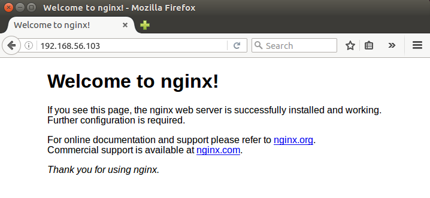
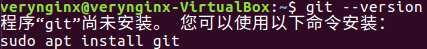
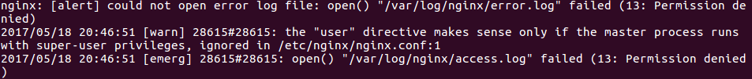
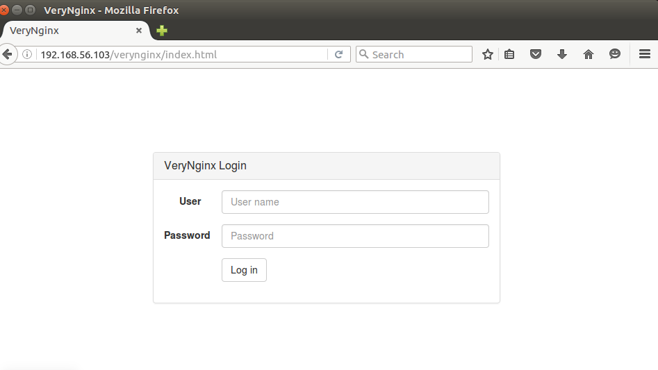
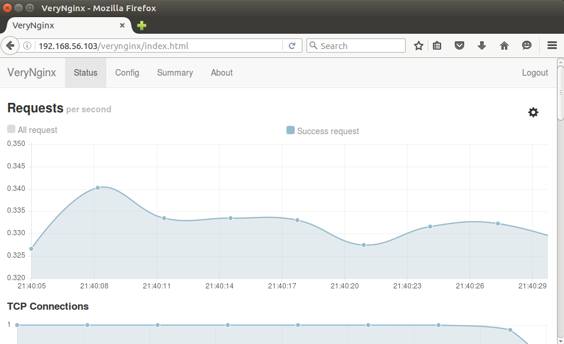
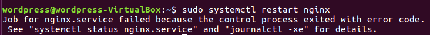
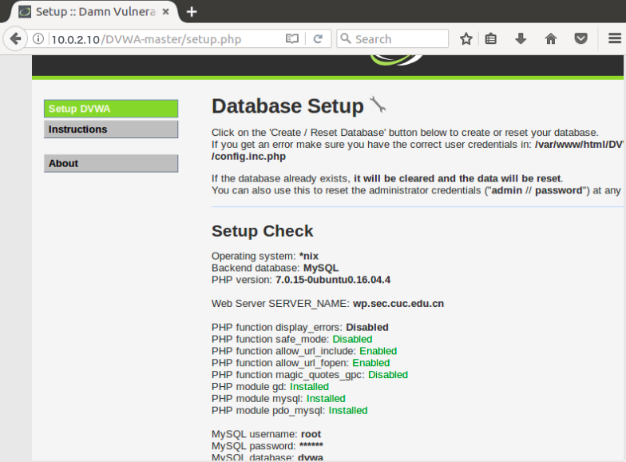

# 实验五

## 实验环境

#### 3台ubuntu 16.04 desktop 
```
verynginx（双网卡）：［NAT网络：10.0.2.5］［host-only：192.168.56.103］
dvwa：［NAT网络：10.0.2.10］
wordpress：［NAT网络：10.0.2.15］

```
##### sudo ifconfig enp0s3 10.0.2.x netmask 255.255.255.0

## 实验过程

### 一、安装VeryNginx

* [VeryNginx安装指南](https://github.com/alexazhou/VeryNginx/blob/master/readme_zh.md)

#### 注意事项：

1.安装VeryNginx之前需要先安装nginx
```
sudo apt-get update
sudo apt-get install nginx
```


2.克隆VeryNginx到本地之前注意查验是否安装git



3.启动verynginx时产生如下图报错，经查阅资料和多次试验，可尝试查看nginx进程号，杀掉nginx进程
```
ps aux | grep nginx
sudo kill -9 进程号
```


4.如果需要重启nginx或verynginx，不要执行指南中所给reload指令，否则会产生如下图报错，经验证，建议使用以下指令
```
sudo systemctl restart nginx
```


#### 安装成功





### 二、安装WordPress

* [WordPress安装指南](https://www.digitalocean.com/community/tutorials/how-to-install-wordpress-with-lemp-on-ubuntu-16-04)

#### 注意事项：

1.安装WordPress之前需要先配置LEMP，详情参见[LEMP安装指南](https://www.digitalocean.com/community/tutorials/how-to-install-linux-nginx-mysql-php-lemp-stack-in-ubuntu-16-04)

2.查验hosts文件的配置

3.及时备份。在安装过程中数次出现如下错误，截止目前还没有找到相关资料能够有效解决



### 三、安装DVWA

* [DVWA安装指南](https://github.com/ethicalhack3r/DVWA/blob/master/README.md)

#### 注意事项：

1.安装DVWA之前需要先配置LEMP，详情参见[LEMP安装指南](https://www.digitalocean.com/community/tutorials/how-to-install-linux-nginx-mysql-php-lemp-stack-in-ubuntu-16-04)

2.注意查验配置/etc/php/7.0/fpm/php.ini
```
allow_url_include=Off-->allow_url_include=On
```
#### 安装成功



## 小结

#### 笔者认真研读了课件和同学们的实验报告，并寻求了同学的帮助，但是截止到现在WordpPress环境仍然频频出现bug，后续实验无法进行，而且尚未可知问题出在哪里。不过还是很感谢小伙伴们的帮助～


