# 实验5-WEB服务器
## 一、实验环境
+ Ubuntu16.04 Server（虚拟机-服务器）	
+ Windows 10（宿主机-客户端）
+ Nginx
+ VeryNginx
+ Wordpress
+ WordPress 4.7
+ Damn Vulnerable Web Application (DVWA)
## 二、实验要求
+ [实验要求](http://sec.cuc.edu.cn/huangwei/course/LinuxSysAdmin/chap0x05.exp.md.html#/verynginx "实验要求")
## 三、主要步骤
### 1. 安装WordPress
+ [安装WordPress](https://www.digitalocean.com/community/tutorials/how-to-install-wordpress-with-lemp-on-ubuntu-16-04)
+ [LEMP配置](https://www.digitalocean.com/community/tutorials/how-to-install-linux-nginx-mysql-php-lemp-stack-in-ubuntu-16-04)
### 2. 搭建SSL
+ [SSL搭建教程](https://www.digitalocean.com/community/tutorials/how-to-create-a-self-signed-ssl-certificate-for-nginx-in-ubuntu-16-04)
### 3.安装VeryNignx
+ 将VeryNignx仓库克隆到本地
	+ 运行sudo python install.py install
		+ 需要安装libpcre3-dev、libssl-dev和build-essential
			+ sudo apt-get install libpcre3-dev
			+ sudo apt-get install libssl-dev
			+ sudo apt-get install build-essential
	+ 编辑/opt/verynginx/openresty/nginx/conf/nginx.conf 修改user=www-data
	+ 启动VeryNignx：
		+ sudo /opt/verynginx/openresty/nginx/sbin/nginx
### 4. 搭建DVWA
+ 软链接
	+ cuc@cuc:/etc/nginx/sites-available$ sudo cp default default_dvwa
	+ cuc@cuc:/etc/nginx/sites-available$ sudo vim default_dvwa
	+ sudo ln -s /etc/nginx/sites-available/default_dvwa /etc/nginx/sites-enabled/default_dvwa
	+ sudo nginx -s reload
+ 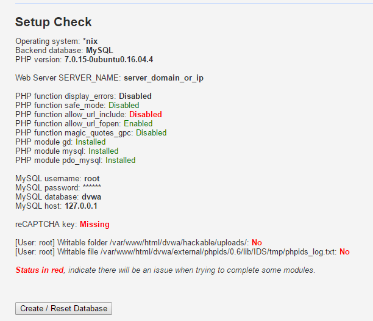
+ 解决function allow_url_include问题：修改/etc/php/7.0/fpm/php.ini中的allow_url_include = On
+ 重启php服务：sudo systemctl restart php7.0-fpm
+ 添加reCAPTCHA key：修改/var/www/html/dvwa/config/config.inc.php中的数据库密码，在https://www.google.com/recaptcha/admin#list 中生成公私钥，添加进config.inc.php中
+ 使/var/www/html/dvwa/hackable/uploads/和 /var/www/html/dvwa/external/phpids/0.6/lib/IDS/tmp/phpids_log.txt可写：
	+ sudo chgrp www-data hackable/uploads
	+ sudo chgrp www-data /var/www/html/dvwa/external//phpids/0.6/lib/IDS/tmp/phpids_log.txt
	+ sudo chmod g+w hackable/uploads/
	+ sudo chmod g+w /var/www/html/dvwa/external/phpids/0.6/lib/IDS/tmp/phpids_log.txt
+ 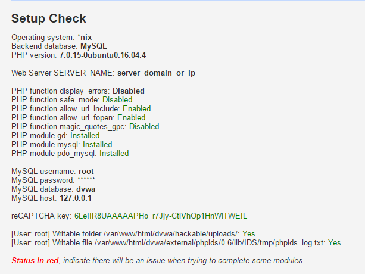
## 端口配置：
+ WordPress：
	+ http
		+ VeryNginx 端口：80
		+ Nginx 端口：8080
	+ ssl
		+ VeryNginx 端口：443
		+ Nginx 端口:4433
+ DVWA:
	+ http
		+ Nginx 端口：8081
## 四、实验结果
### 基本要求
+ 在一台主机（虚拟机）上同时配置Nginx和VeryNginx
	+ VeryNginx作为本次实验的Web App的反向代理服务器和WAF
	+ PHP-FPM进程的反向代理配置在nginx服务器上，VeryNginx服务器不直接配置Web站点服务
	+ 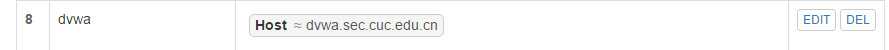
	+ 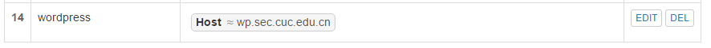
	+ 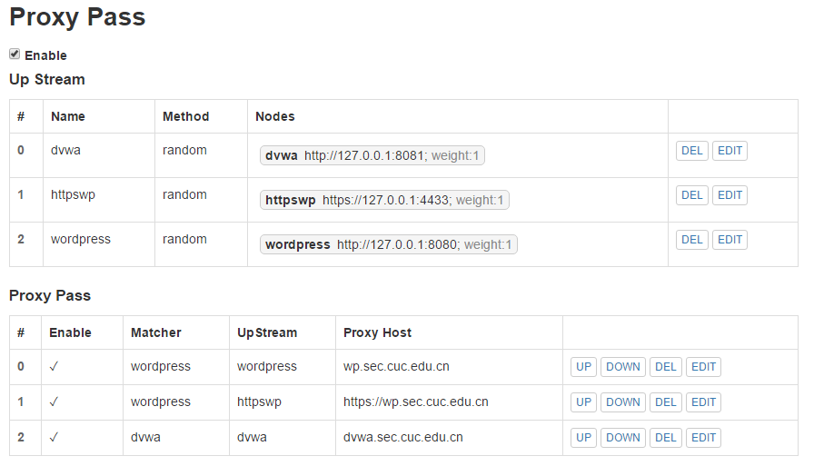
+ 使用Wordpress搭建的站点对外提供访问的地址为：
	+ https://wp.sec.cuc.edu.cn
	+ 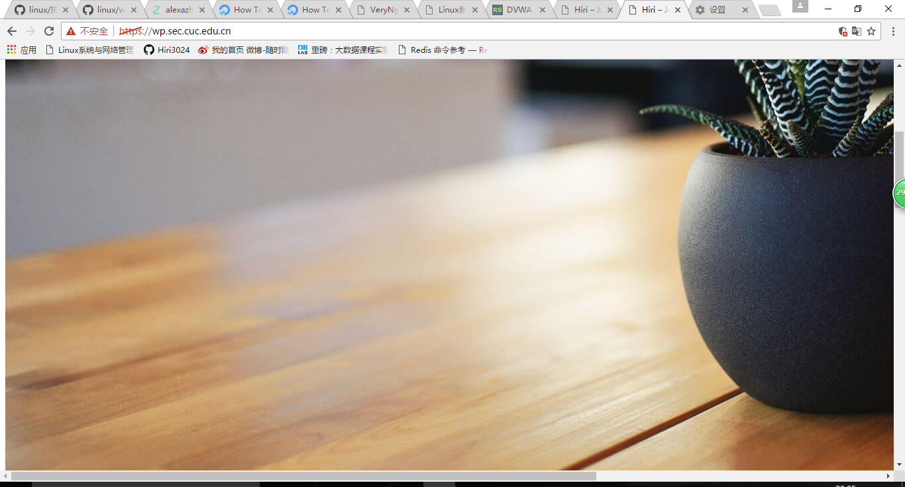
	+ http://wp.sec.cuc.edu.cn
	+ 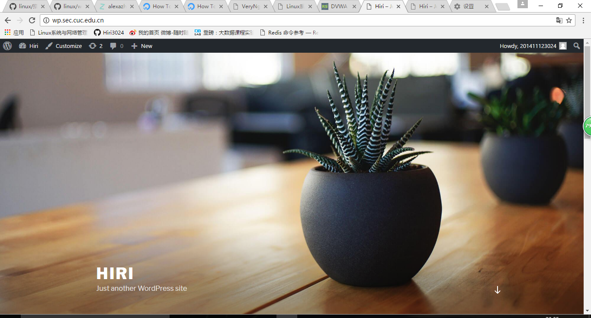
+ 使用Damn Vulnerable Web Application (DVWA)搭建的站点对外提供访问的地址为： http://dvwa.sec.cuc.edu.cn
	+ 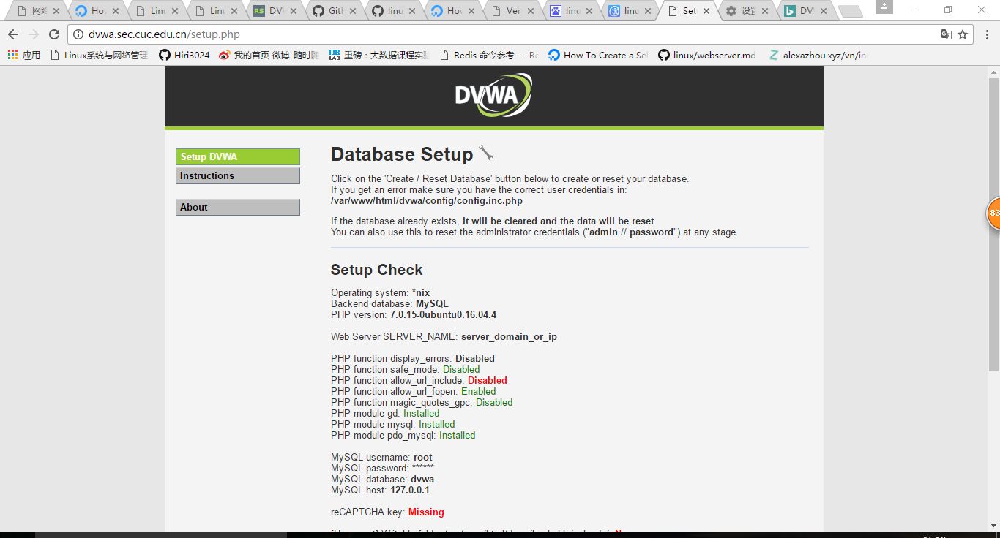
### 安全加固要求
+ 使用IP地址方式均无法访问上述任意站点，并向访客展示自定义的友好错误提示信息页面-1
	+ 通过设置Matcher Response Filter来达到要求：
	+ Matcher：
		+ 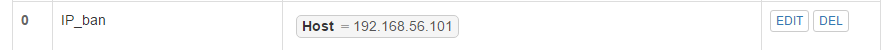
	+ Response：
		+ 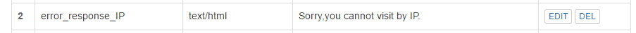
	+ Filter：
		+ 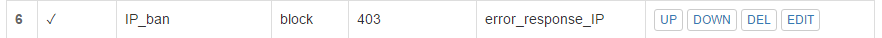
	+ 友好错误提示页面-1：
		+ 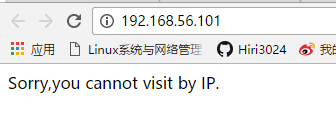
	
+ Damn Vulnerable Web Application (DVWA)只允许白名单上的访客来源IP，其他来源的IP访问均向访客展示自定义的友好错误提示信息页面-2
	+ 同样通过设置Matcher Response Filter来达到要求：
	+ Matcher：
		+ 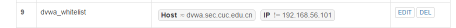
	+ Response：
		+ 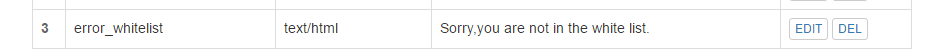
	+ Filter：
		+ 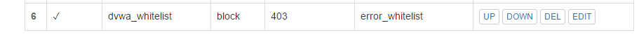
	+ 友好错误提示页面-2：
		+ 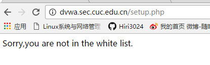
+ 在不升级Wordpress版本的情况下，通过定制VeryNginx的访问控制策略规则，热修复WordPress < 4.7.1 - Username Enumeration
	+ 漏洞描述：通过访问/wp-json/wp/v2/users/可以获取wordpress用户信息的json数据。
	+ 实现：禁止访问站点的/wp-json/wp/v2/users/路径即可。使用filter进行限制
	+ 由于无法复现漏洞，所以只是在VeryNignx中设置禁止访问
		+  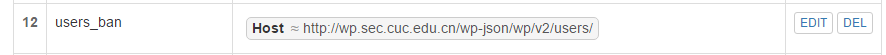
		+  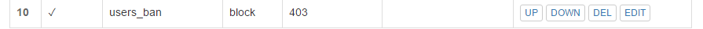
+ 通过配置VeryNginx的Filter规则实现对Damn Vulnerable Web Application (DVWA)的SQL注入实验在低安全等级条件下进行防护
	+ 在安全等级为low的条件下，可进行SQL注入攻击：
		+  
	+ 配置 Matcher Filter来进行防护：
		+  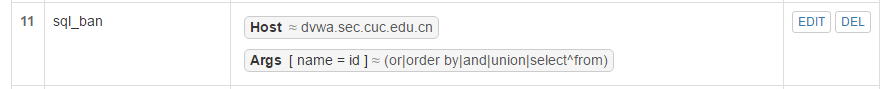
		+  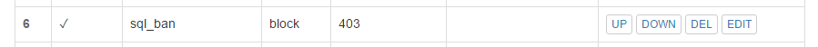
	+ 结果如下：
		+  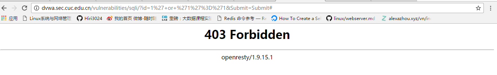  
### VERYNGINX配置要求
+ VeryNginx的Web管理页面仅允许白名单上的访客来源IP，其他来源的IP访问均向访客展示自定义的友好错误提示信息页面-3
	+ 同样通过设置Matcher Response Filter来达到要求：
	+ Matcher：
		+ 
	+ Filter：
		+ 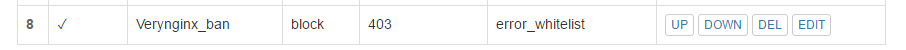
	+ 友好错误提示页面-2：
		+ 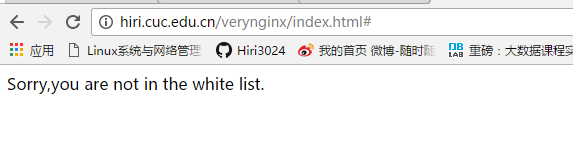
+ 通过定制VeryNginx的访问控制策略规则实现：
	+ 限制DVWA站点的单IP访问速率为每秒请求数 < 50
	+ 限制Wordpress站点的单IP访问速率为每秒请求数 < 20
	+ 超过访问频率限制的请求直接返回自定义错误提示信息页面-4
	+ 禁止curl访问
		+ 通过配置Frequency Limit来限制访问速率
			+ 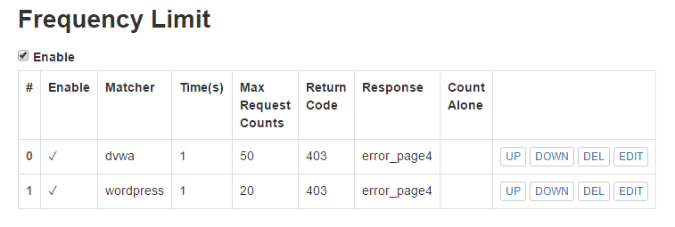
		+ 若超过此限制，则会显示Forbidden
			+ 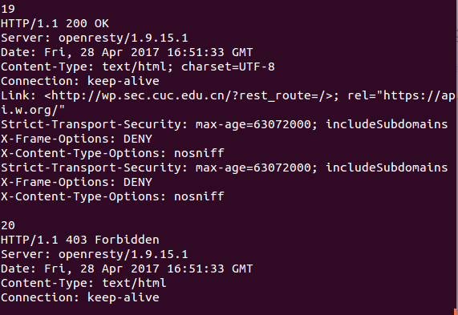
		+ 禁止curl访问：
			+ 
## 实验中遇到的问题
+ 创建wordpress用户时，提示密码强度不够。
	+ 密码强度需要有大写字母，小写字母，数字以及特殊符号组成。
+ 无法复现wordpress的漏洞。
+ 配置VeryNginx的Web管理页面仅允许白名单上的访客来源IP时，将来白名单设置为服务器所在server版Ubuntu系统IP后，本机无法访问VeryNignx修改配置。
	+ 配置信息储存在/opt/verynignx/verynginx/confs目录下的config.json文件中。
	+ 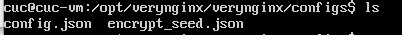
	+ 将白名单IP修改为本机IP即可正常访问。
	+ 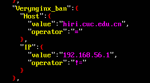
	
+ 
