#实验五：WEB服务器

----------

#一、实验要求
###1.基本要求

    在一台主机（虚拟机）上同时配置Nginx和VeryNginx
        VeryNginx作为本次实验的Web App的反向代理服务器和WAF
        PHP-FPM进程的反向代理配置在nginx服务器上，VeryNginx服务器不直接配置Web站点服务
    使用Wordpress搭建的站点对外提供访问的地址为： https://wp.sec.cuc.edu.cn 和 http://wp.sec.cuc.edu.cn
    使用Damn Vulnerable Web Application (DVWA)搭建的站点对外提供访问的地址为： http://dvwa.sec.cuc.edu.cn

###2.安全加固要求

    使用IP地址方式均无法访问上述任意站点，并向访客展示自定义的友好错误提示信息页面-1
    Damn Vulnerable Web Application (DVWA)只允许白名单上的访客来源IP，其他来源的IP访问均向访客展示自定义的友好错误提示信息页面-2
    在不升级Wordpress版本的情况下，通过定制VeryNginx的访问控制策略规则，热修复WordPress < 4.7.1 - Username Enumeration
    通过配置VeryNginx的Filter规则实现对Damn Vulnerable Web Application (DVWA)的SQL注入实验在低安全等级条件下进行防护

###3.VeryNginx配置要求

    VeryNginx的Web管理页面仅允许白名单上的访客来源IP，其他来源的IP访问均向访客展示自定义的友好错误提示信息页面-3
    通过定制VeryNginx的访问控制策略规则实现：
        限制DVWA站点的单IP访问速率为每秒请求数 < 50
        限制Wordpress站点的单IP访问速率为每秒请求数 < 20
        超过访问频率限制的请求直接返回自定义错误提示信息页面-4
        禁止curl访问  

#二、实验环境

1.虚拟机：Ubuntu16.04 Server  
2.Windows 10  
3.Nginx  
4.VeryNginx  
5.Wordpress 4.7  
6.Damn Vulnerable Web Application (DVWA)

#三、实验过程
##端口配置：
**WordPress：**  

- http  
VeryNginx 端口：80  
Nginx 端口：8080
- ssl  
VeryNginx 端口：443  

**DVWA:**

- http  
Nginx 端口：8081

###1. LEMP配置（安装Nginx等）
- [LEMP配置](https://www.digitalocean.com/community/tutorials/how-to-install-linux-nginx-mysql-php-lemp-stack-in-ubuntu-16-04)  
 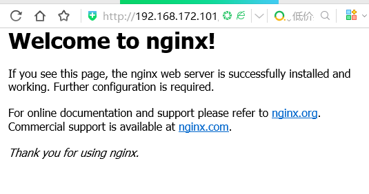
###2.WordPress
- [WordPress](https://www.digitalocean.com/community/tutorials/how-to-install-wordpress-with-lemp-on-ubuntu-16-04)
- 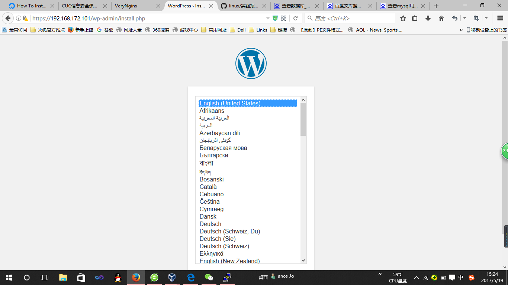
- 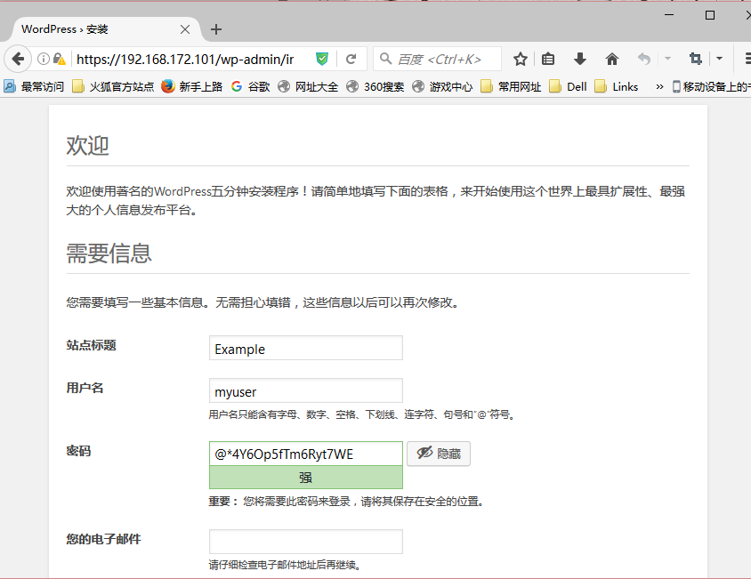
- 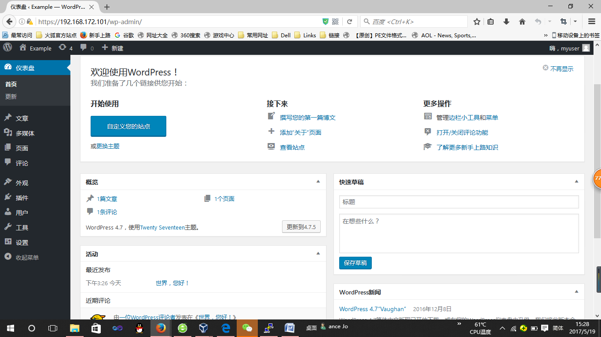
- 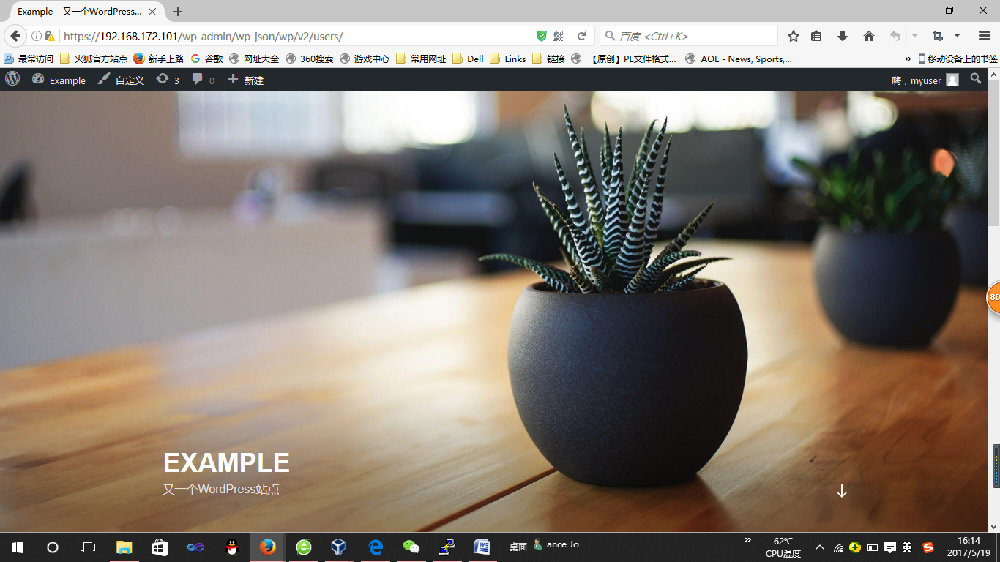
###3.安装VeryNginx
- [VeryNginx](https://github.com/alexazhou/VeryNginx)
- 将该链接git clone到本地  
- 运行sudo python install.py install
- 需要安装:  
    sudo apt-get install libpcre3-dev  
    sudo apt-get install libssl-dev  
    sudo apt-get install build-essential
- 编辑/opt/verynginx/openresty/nginx/conf/nginx.conf 修改user=www-data
- 启动VeryNignx：  
    sudo /opt/verynginx/openresty/nginx/sbin/nginx  
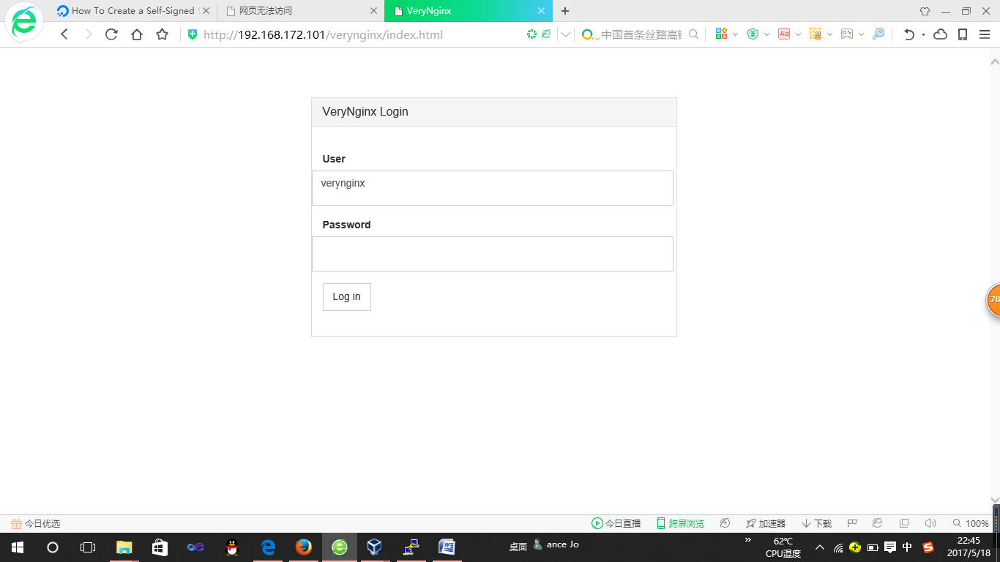

###4.搭建SSL
- [SSL](https://www.digitalocean.com/community/tutorials/how-to-create-a-self-signed-ssl-certificate-for-nginx-in-ubuntu-16-04)  
    * verynginx的证书域名要写verynginx.(随便写).com
    * 其中self-signed.conf和ssl-params.conf都保存在/opt/verynginx/openresty/nginx/conf/
    * 参照/etc/nginx/sites-available/default修改/opt/verynginx/openresty/nginx/conf/nginx.conf

###5.搭建DVWA
- [DVWA下载链接](https://github.com/ethicalhack3r/DVWA/archive/master.zip)    
- 软链接

    * cuc@cuc-vm:/etc/nginx/sites-available$ sudo cp default default_dvwa
    * cuc@cuc-vm:/etc/nginx/sites-available$ sudo vim default_dvwa
    * sudo ln -s /etc/nginx/sites-available/default_dvwa /etc/nginx/sites-enabled/default_dvwa
    * sudo nginx -s reload
    * 解决function allow_url_include问题：修改/etc/php/7.0/fpm/php.ini中的allow_url_include = On
    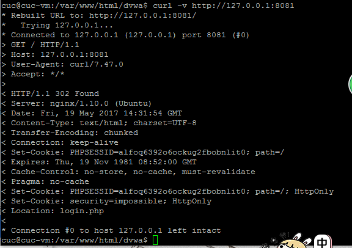
    * 重启php服务：sudo systemctl restart php7.0-fpm
- 使/var/www/html/dvwa/hackable/uploads/和 /var/www/html/dvwa/external/phpids/0.6/lib/IDS/tmp/phpids_log.txt可写：

    * sudo chgrp www-data hackable/uploads
    * sudo chgrp www-data /var/www/html/dvwa/external//phpids/0.6/lib/IDS/tmp/phpids_log.txt
    * sudo chmod g+w hackable/uploads/
    * sudo chmod g+w /var/www/html/dvwa/external/phpids/0.6/lib/IDS/tmp/phpids_log.txt
    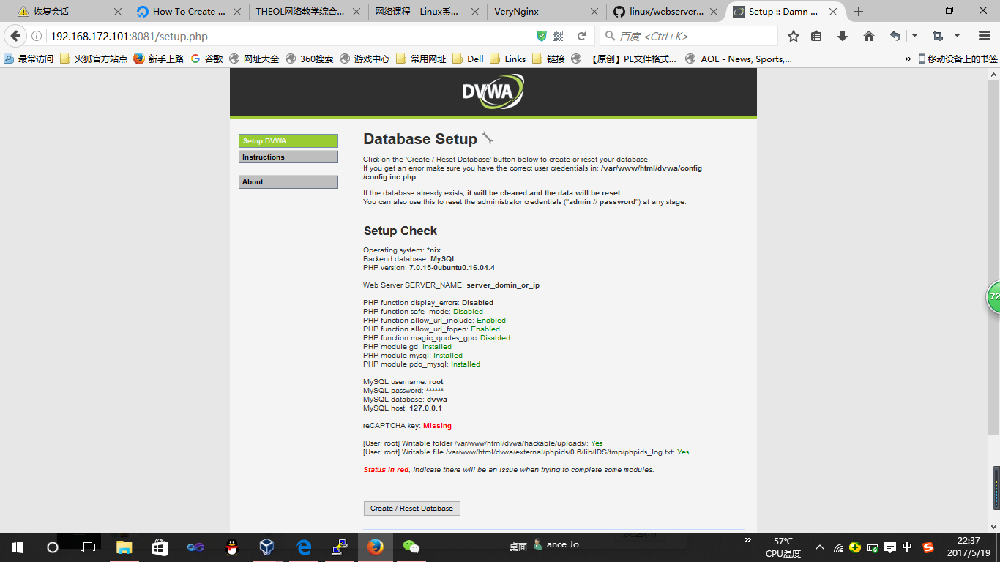
###6.配置VeryNginx
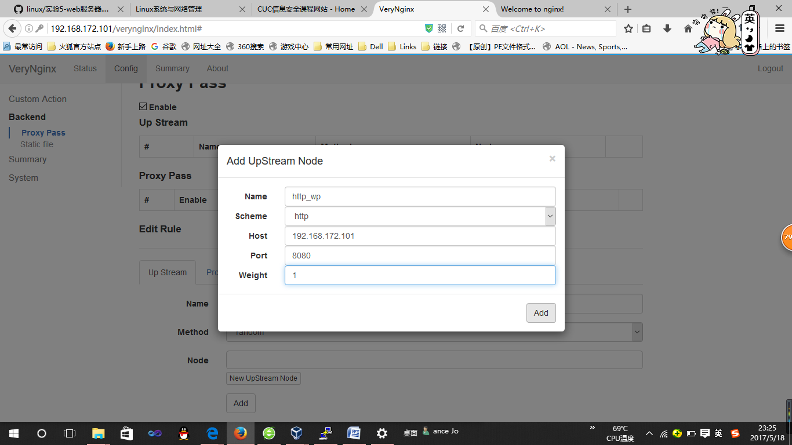
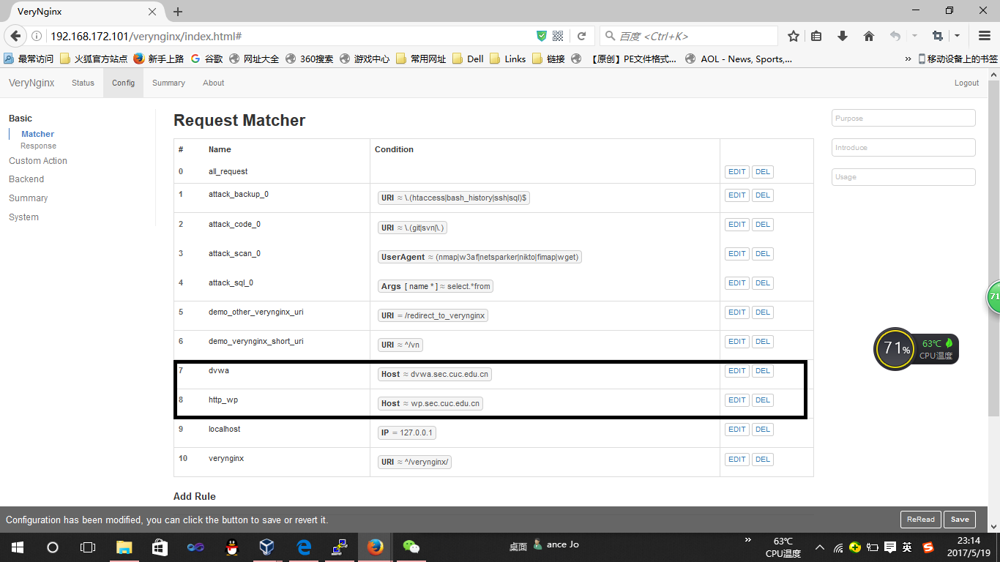

- 设置规则：白名单 以及进制IP访问
* 增加matcher
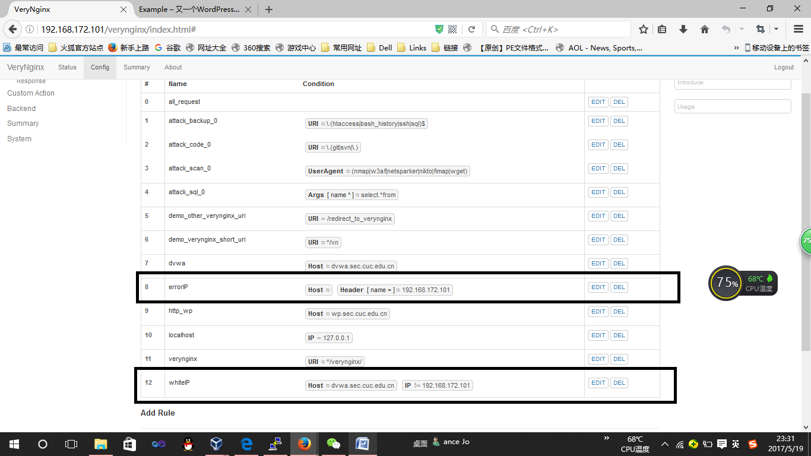
* 增加response
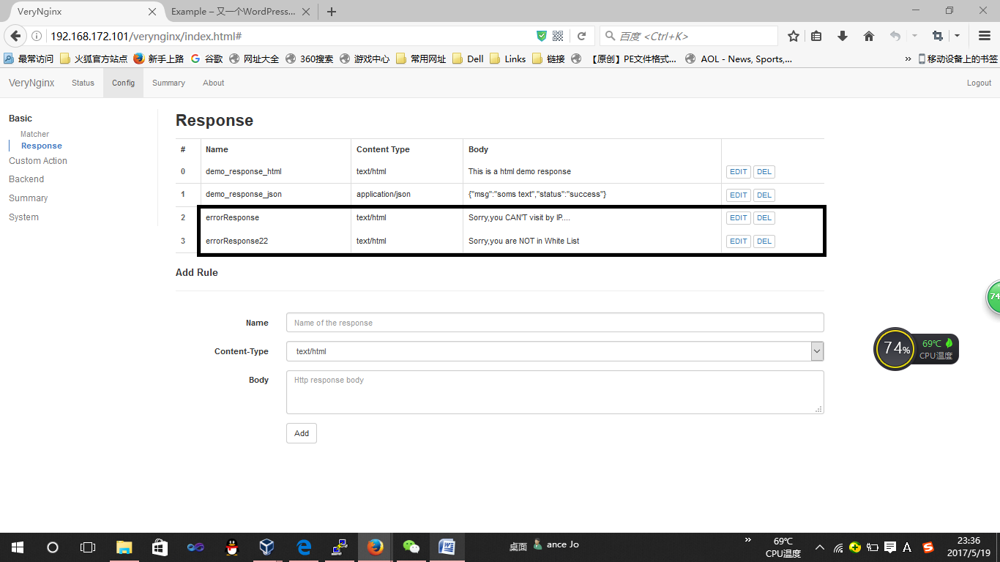
* 设置Filter
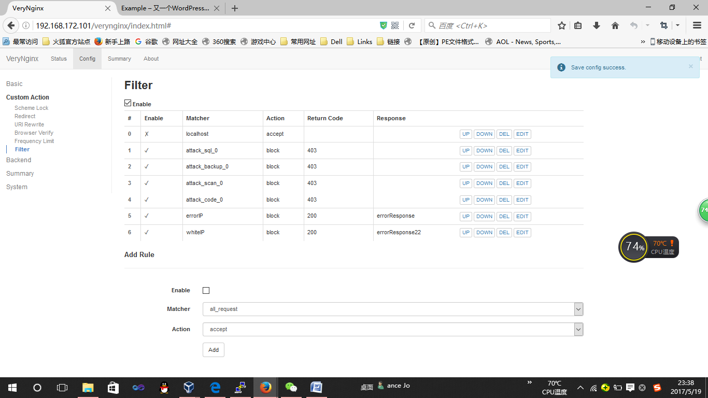

#实验结果
1.未能成功显示所配置的安全加固要求  

ps：非常感谢提供帮助谭嘉怡、宋楠、陈安莹以及祝小玟同学~解决了很多遇到的问题~