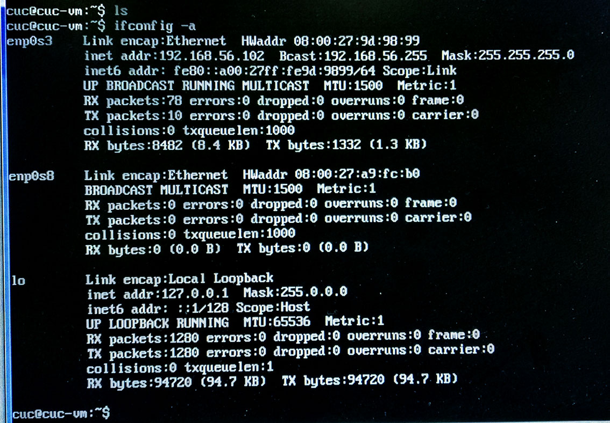
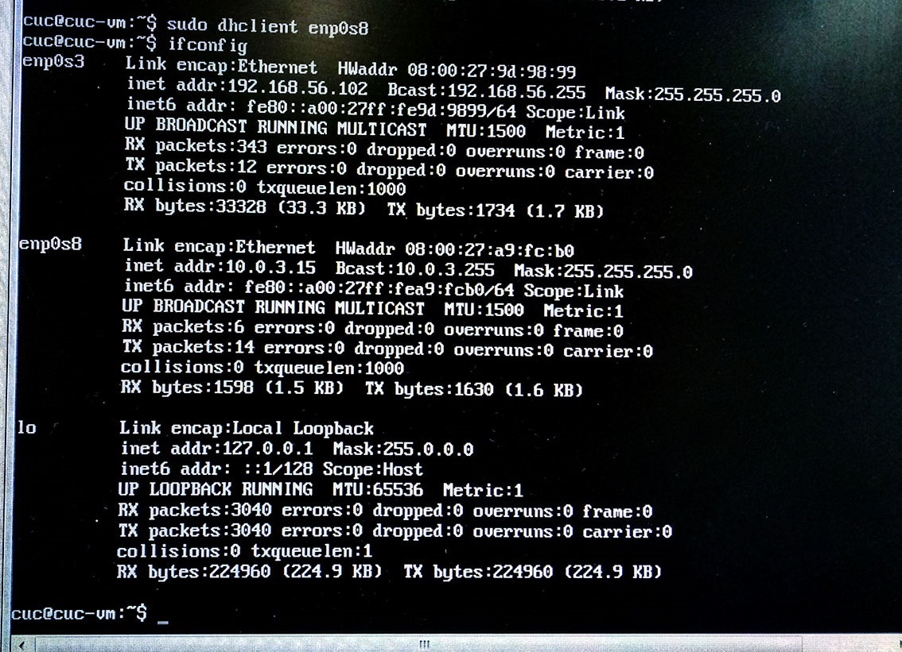
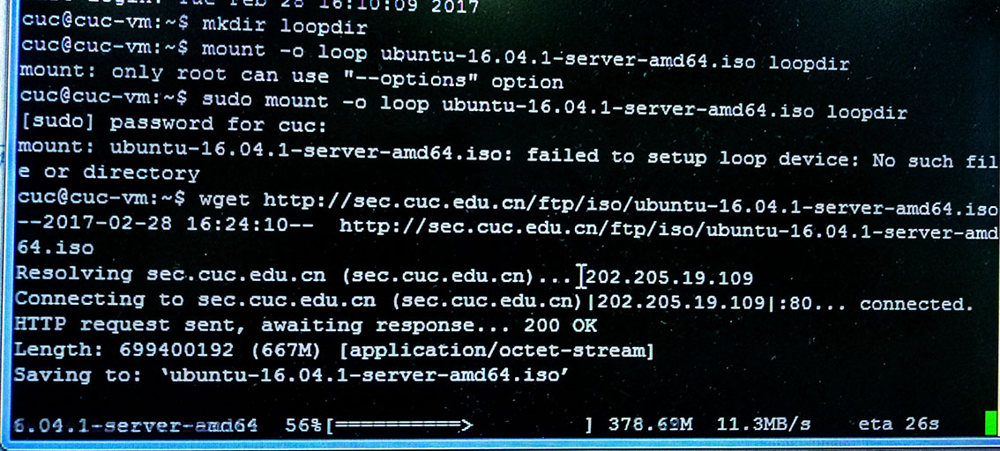
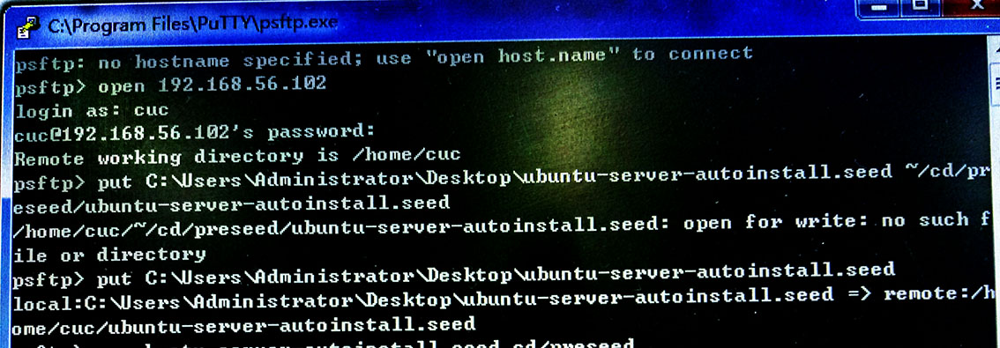
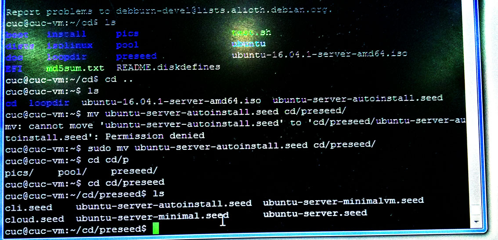
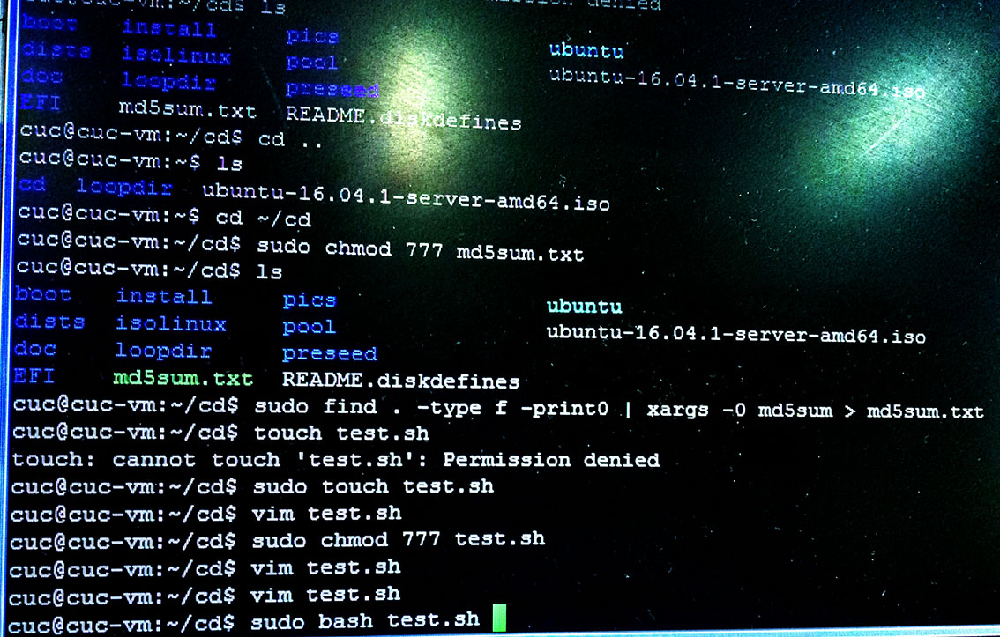
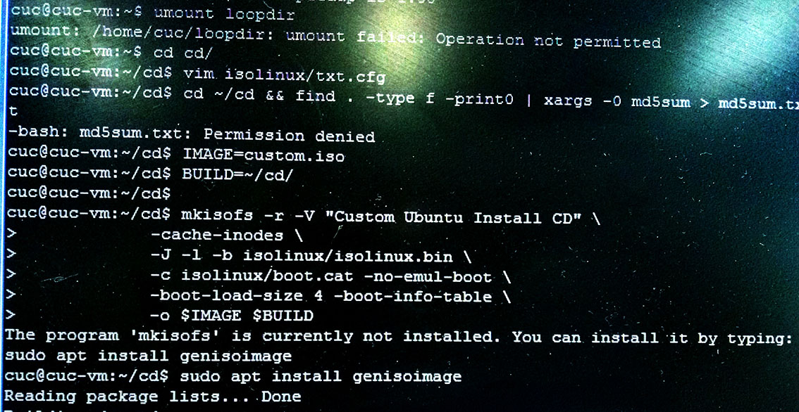
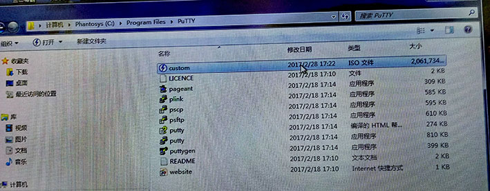
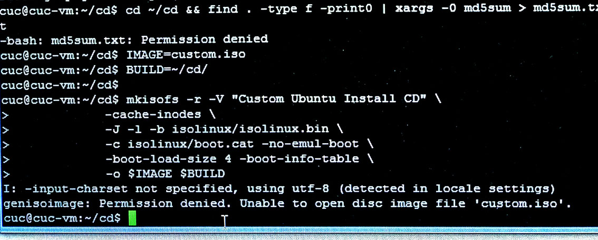

## 实验名称：
>无人值守Linux安装镜像制作


## 实验要求：
> 定制用户名和默认密码、定制安装OpenSSH Server、安装过程禁止自动联网更新软件包等


## 实验环境：
> virtualbox、LinuxUbuntu16.04、Host-only+NAT、使用了putty


## 实验步骤：
> 下载putty，利用putty登录SSH主机，它的特点是支持IPv6连接，控制ssh连接时加密协定的种类，是一种接口连接软件，跨平台的远程登录工具；其中psfpt完成文件的上传和下载。
```
 1.虚拟机设置双网卡，Host-only+NAT 
 2.ifconfig -a获得IP对应的接口:enp0s3\enp0s8\lo,发现默认下只有有线网卡是开启的 
 3.这时通过 ifconfig enp0s8 up开启enp0s8端口，dhclient enp0s8动态获取IP地址 
 4.将IP地址输入到putty中，就可以在宿主机中远程登录linux进行操作
```

>

> 在当前用户目录下创建一个用于挂载iso镜像文件的目录

>`mkdir loopdir`

> 下载并挂载iso镜像文件到该目录

>`mount -o loop ubuntu-16.04.1-server-amd64.iso loopdir`
>

>
> 创建一个工作目录用于克隆光盘内容

>`mkdir cd`

> 同步光盘内容到目标工作目录.一定要注意loopdir后的这个/，cd后面不能有/

>`rsync -av loopdir/ cd`

> 卸载iso镜像

>`umount loopdir`

> 进入目标工作目录

>`cd cd/`

> 编辑Ubuntu安装引导界面增加一个新菜单项入口

>`vim isolinux/txt.cfg`

> 添加以下内容到该文件后强制保存

```
label autoinstall
  menu label ^Auto Install Ubuntu Server
  kernel /install/vmlinuz
  append  file=/cdrom/preseed/ubuntu-server-autoinstall.seed debian-installer/locale=en_US console-setup/layoutcode=us keyboard-configuration/layoutcode=us console-setup/ask_detect=false localechooser/translation/warn-light=true localechooser/translation/warn-severe=true initrd=/install/initrd.gz root=/dev/ram rw quiet
```

> 阅读并编辑定制Ubuntu官方提供的示例preseed.cfg，并将该文件保存到刚才创建的工作目录。通过psftp put和putty move，将.seed移入cd/proceed中

> `~/cd/preseed/ubuntu-server-autoinstall.seed`




>
> 修改isolinux/isolinux.cfg，增加内容timeout 10（可选，否则需要手动按下ENTER启动安装界面）

>>修改md5sum的权限

>`sudo chmod 777 md5sum.txt`

>> 重新生成md5sum.txt

>`cd ~/cd && find . -type f -print0 | xargs -0 md5sum > md5sum.txt`

>>新建touch test.sh。在cuc用户权限下，不能直接运行修改脚本内容，这时改进方法有两种，一种是切换到root状态下，这样就有管理员的权限，另一种是在cuc用户的权限下，将改动的脚本放在新建bash中，直接运行文件（这是出现的问题之一，通过同学解答）



>
>> 封闭改动后的目录到.iso
>
>> `IMAGE=custom.iso`

>> `BUILD=~/cd/`
>
```
mkisofs -r -V "Custom Ubuntu Install CD" \
            -cache-inodes \
            -J -l -b isolinux/isolinux.bin \
            -c isolinux/boot.cat -no-emul-boot \
            -boot-load-size 4 -boot-info-table \
            -o $IMAGE $BUILD
```
>> (如果目标磁盘之前有数据，则在安装过程中会在分区检测环节出现人机交互对话框需要人工选择)



>生成.iso文件，即可使用其进行自动安装


		
## 出现问题

> 出现最多的是权限问题，上文中都有提到。例如：



主要参考篇目

[篇目一](http://askubuntu.com/questions/806820/how-do-i-create-a-completely-unattended-install-of-ubuntu-desktop-16-04-1-lts "篇目一")

[篇目二](https://github.com/netson/ubuntu-unattended "篇目二")
