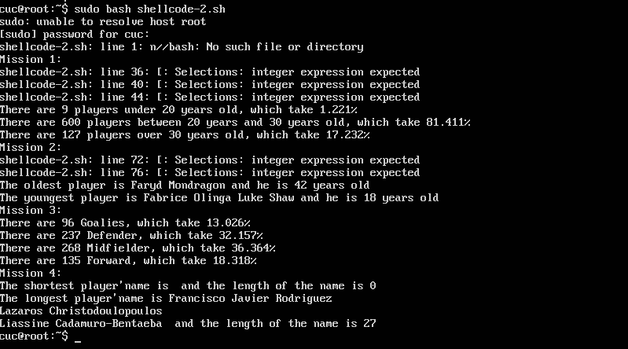
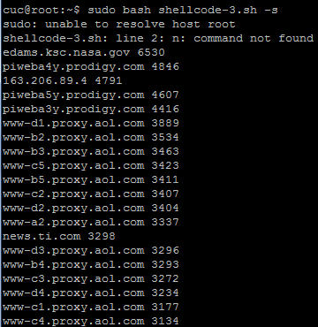
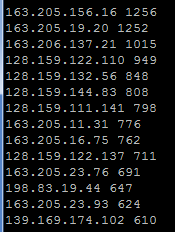
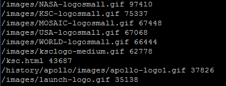
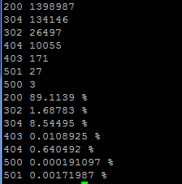
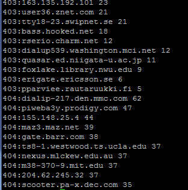
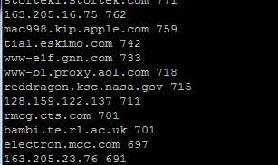

本次试验在同学的讲解帮助下完成，全部跑通

实验一

实验二、实验三使用到的方法：

1.使用more命令读取文件
2.使用awk对数据进行相关规则的匹配和统计
3.使用sort进行排序
4.使用uniq进行统计

实验二结果：

    统计不同年龄区间范围（20岁以下、[20-30]、30岁以上）的球员数量、百分比
    统计不同场上位置的球员数量、百分比
    名字最长的球员是谁？名字最短的球员是谁？
    年龄最大的球员是谁？年龄最小的球员是谁？

 

实验三结果：

    统计访问来源主机TOP 100和分别对应出现的总次数
 
    
    统计访问来源主机TOP 100 IP和分别对应出现的总次数
 
    
    统计最频繁被访问的URL TOP 100
 
    
    统计不同响应状态码的出现次数和对应百分比
 
    
    分别统计不同4XX状态码对应的TOP 10 URL和对应出现的总次数
 
    
    给定URL输出TOP 100访问来源主机
 

