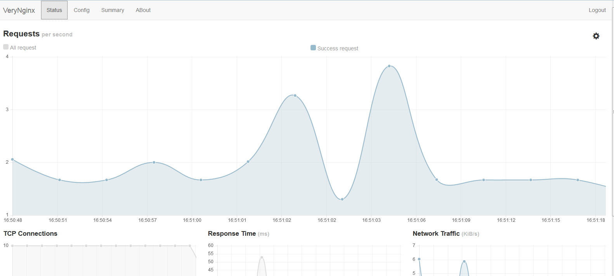
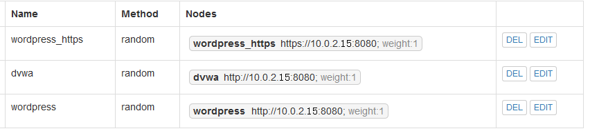
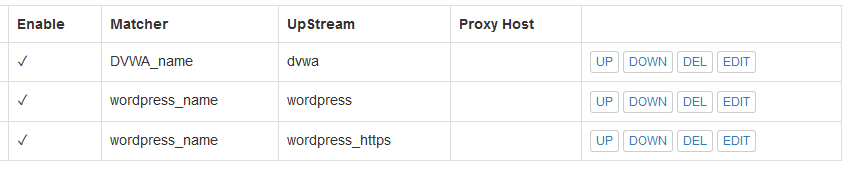
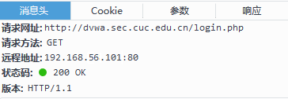
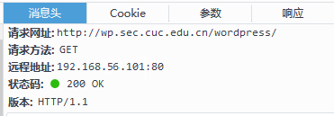
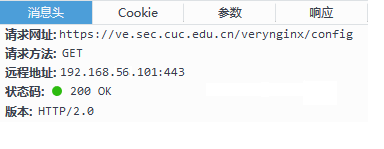
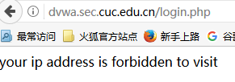
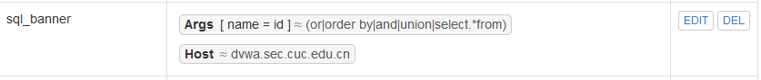
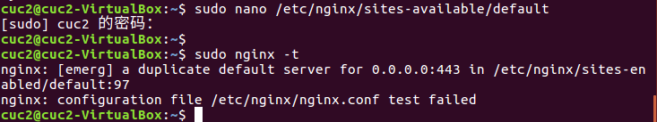

# 实验五 web服务器搭建

----
## 实验目的

搭建支持反向代理、流量控制、关键词过滤等功能的高级Web服务器，在VeryNginx，WordPress，DVWA 等软件环境中实现

## 实验环境

Ubuntu16.04 desktop 两台
       
* verynginx 设置双网卡：
 * NAT网络：10.0.2.14
 * host-only： 192.168.56.101
* wordpress+dvwa 单网卡以nat网络形式  
 * ip地址：10.0.2.15   

## 实验过程

### 安装VeryNginx

   安装准备：

* git clone https://github.com/alexazhou/VeryNginx.git
   
* 安装libpcre3-dev、libssl-dev和build-essential
（sudo apt-get install build-essential libssl-dev libpcre3-dev） 
* 将/opt/verynginx/openresty/nginx/conf/nginx.conf文件下的user nginx修改为user www-data   
    
安装 [搭建VeryNginx](https://github.com/alexazhou/VeryNginx/blob/master/readme_zh.md)

    

### 安装wordpress+DVWA

   安装准备：

* 安装Nginx+PHP7.0+MySQL=LEMP [LEMP安装](https://www.digitalocean.com/community/tutorials/how-to-install-linux-nginx-mysql-php-lemp-stack-in-ubuntu-16-04)
* 配置SSL[SSL](https://www.digitalocean.com/community/tutorials/how-to-secure-nginx-with-let-s-encrypt-on-ubuntu-16-04)

安装[wordpress](https://www.digitalocean.com/community/tutorials/how-to-install-wordpress-with-lemp-on-ubuntu-16-04)

安装[DVWA](https://github.com/ethicalhack3r/DVWA)

###配置

 配置verynginx实现反向代理：matcher+upstream+proxypass

* Up Stream

 * 相关参数：
 
    nodes:proxy pass可以代理的目标站点的节点

	method：[Module nginx upstream_module](http://nginx.org/en/docs/http/ngx_http_upstream_module.html)
	
* Proxy Pass：

 * 相关参数：
 
	 Proxy Host：反向代理的地址；

	 UpStream：目标站点的节点集合；

	 Matcher：根据规则限定访问目标地址

 配置证书实现wordpress的https访问

* nginx 自签发证书 [证书制作](https://www.digitalocean.com/community/tutorials/how-to-create-an-ssl-certificate-on-nginx-for-ubuntu-14-04)
* apache 自签发证书制作 [证书制作](https://www.digitalocean.com/community/tutorials/how-to-create-a-self-signed-ssl-certificate-for-apache-in-ubuntu-16-04)

### 安全加固

使用VeryNginx实现：Matcher+Response+Filter

* 禁止IP访问

* dvwa白名单限制登录

* VeryNginx的Web管理页面访问控制

* VeryNginx访问限制

 * 限制访问次数：Matcher+Frequency+Limit+Filter
 * 禁止curl访问

* 热修复<Wordpress4.7.1漏洞
 * 漏洞描述：即通过访问/wp-json/wp/v2/users/可以获取wordpress用户信息的json数据
 * 修复方法：禁止访问站点的/wp-json/wp/v2/users/ 路径

* sql注入漏洞防御

##实验过程中的问题

* nginx一开始启动失败
主要问题是在修改site.conf文件中的信息对应不上，反复修改之后得到解决

* 其余问题参照同学的实验报告得到解答

##参考链接

* [TZW同学第五次实验报告](https://github.com/CUCCS/linux/tree/master/2017-1/tzw/chapter5)
* [HJJ同学第五次实验报告](https://github.com/CUCCS/linux/tree/master/2017-1/HJJ/ex5)
* [VeryNginx搭建教程](https://github.com/alexazhou/VeryNginx/blob/master/readme_zh.md)
* [wordpress安装教程](https://www.digitalocean.com/community/tutorials/how-to-install-wordpress-with-lemp-on-ubuntu-16-04)
* [LEMP配置教程](https://www.digitalocean.com/community/tutorials/how-to-install-linux-nginx-mysql-php-lemp-stack-in-ubuntu-16-04)
* [DVWA安装及配置](https://github.com/ethicalhack3r/DVWA)
* [nginx 自签发证书制作](https://www.digitalocean.com/community/tutorials/how-to-create-an-ssl-certificate-on-nginx-for-ubuntu-14-04)
* [apache 自签发证书制作](https://www.digitalocean.com/community/tutorials/how-to-create-a-self-signed-ssl-certificate-for-apache-in-ubuntu-16-04)
