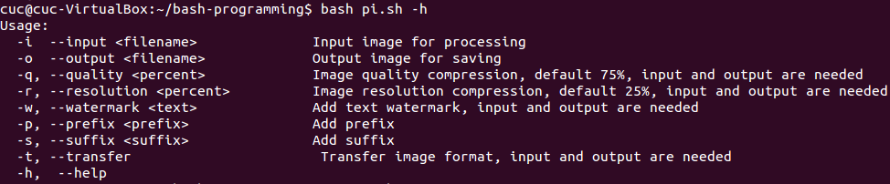
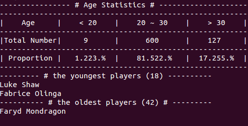
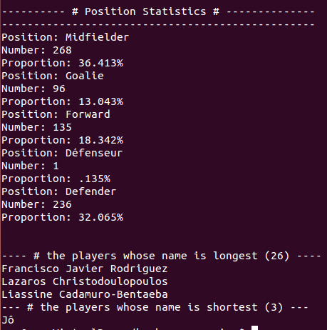
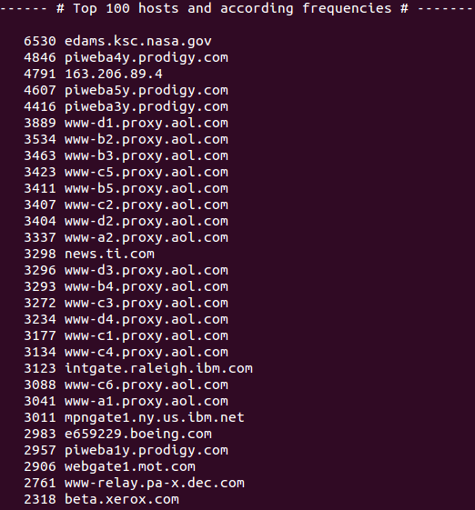
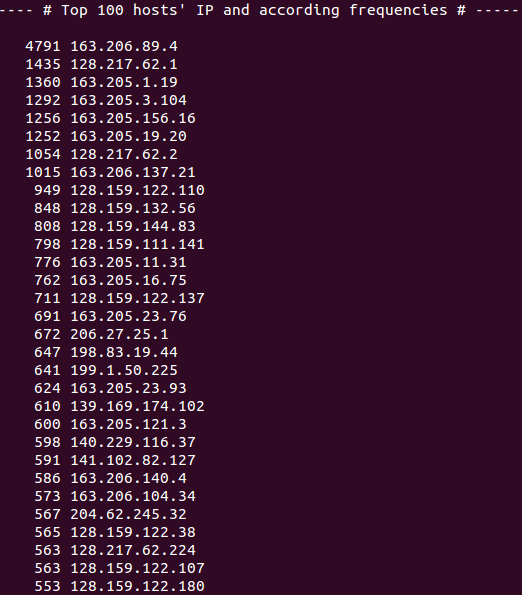
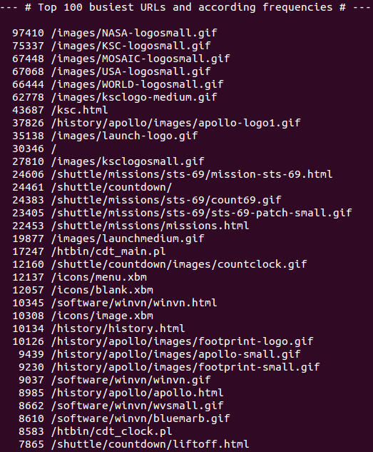
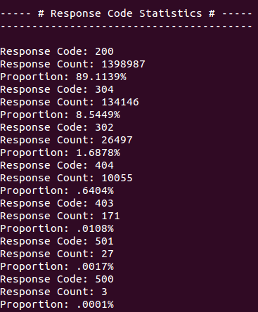
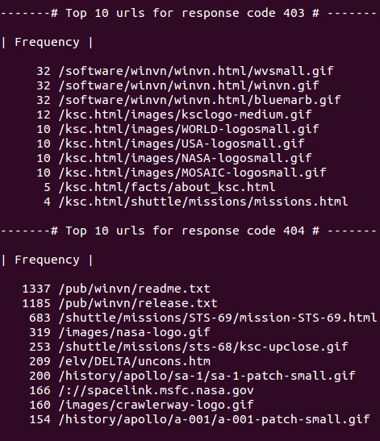
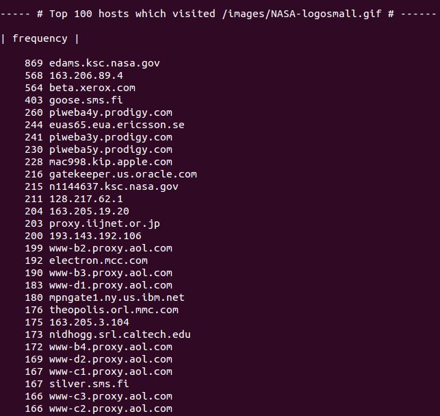

# shell脚本编程基础
* Don't repeat myself

## 任务一 图片批处理脚本

> 难点在于封装脚本选项。

### 1. 对jpeg格式图片进行图片质量压缩

	bash imagesProcess.sh -i input.jpg -o output.jpg -q [size(e.g.50)]

### 2. 对jpeg/png/svg格式图片在保持原始宽高比的前提下压缩分辨率
	
	bash imagesProcess.sh -i input.png -o output.png -r [size(e.g.50)]

### 3 .对图片批量添加自定义文本水印

	bash imagesProcess.sh -i input.png -o output.png -w 'text(e.g.'ShootForMOON')'

### 4. 支持批量重命名（统一添加文件名前缀或后缀，不影响原始文件扩展名）
	# 加前缀
	bash imagesProcess.sh -i input.png -o output.png -p test

 
	
	# 加后缀
	bash imagesProcess.sh -i input.png -o output.png -s  txt

### 5. 支持将png/svg图片统一转换为jpg格式图片

	bash imagesProcess.sh -t -i input.svg -o output.jpg

## 任务二 文本批处理脚本（2014世界杯运动员数据）

> 遇到计数与格式转换的问题

### 1. 统计不同年龄区间范围（20岁以下、[20-30]、30岁以上）的球员数量、百分比
### 2. 年龄最大的球员是谁？年龄最小的球员是谁？

### 3. 统计不同场上位置的球员数量、百分比
### 4. 名字最长的球员是谁？名字最短的球员是谁？

> 名字最短的球员拥有一个中文名。

## 任务三 文本批处理脚本（Web服务器访问日志）

> sed, awk, wc, cut, egrep, bc, substr, sort, uniq 的神奇组合

### 1. 统计访问来源主机TOP 100和分别对应出现的总次数

### 2. 统计访问来源主机TOP 100 IP和分别对应出现的总次数

### 3. 统计最频繁被访问的URL TOP 100

### 4. 统计不同响应状态码的出现次数和对应百分比

### 5. 分别统计不同4XX状态码对应的TOP 10 URL和对应出现的总次数

### 6. 给定URL输出TOP 100访问来源主机

## TO DO

1. 封装代码。 Keep it simple.
2. 提高脚本的健壮性。
3. 寻找编写脚本的技巧，简化过滤语句。

## 参考文章

[Linux 技巧: Bash 参数和参数扩展](https://www.ibm.com/developerworks/cn/linux/l-bash-parameters.html)

[在Bash shell脚本编程中，如何正确无误获取到“脚本选项参数”和“脚本参数”呢？](http://9528du.blog.51cto.com/8979089/1529634)