# 第五章：Web服务器（实验）

## 实验达成点

1. 在一台主机上同时配置Nginx和VeryNginx
	* VeryNginx作为反向代理服务器和WAF。
	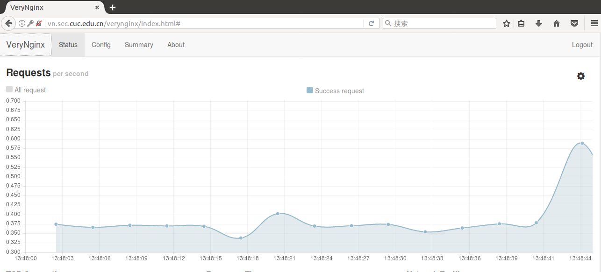
	* PHP-FPM进程的反向代理配置在nginx服务器上
	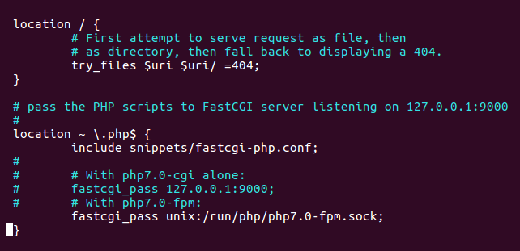
	* WordPress配置在Nginx服务器上
2. 使用WordPress搭建的站点对外提供访问地址为https://wp.sec.cuc.edu.cn和http://wp.sec.cuc.edu.cn
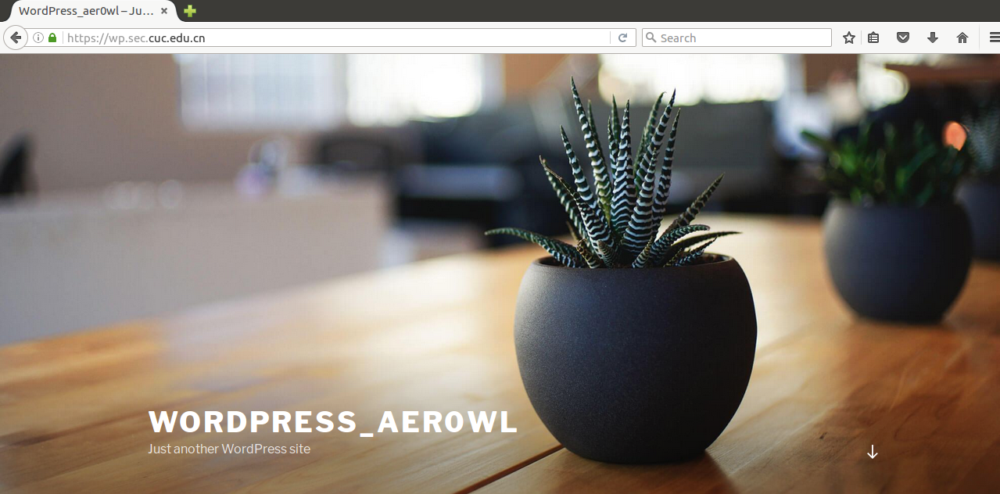
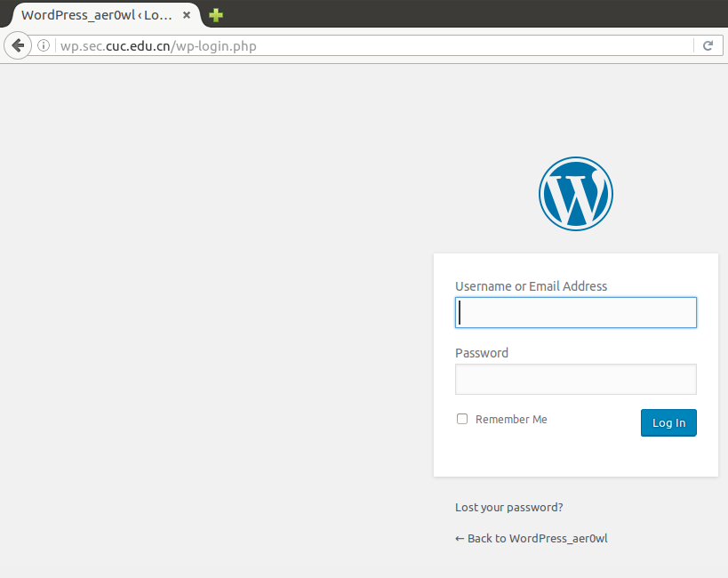
3. 使用DVWA搭建的站点对外提供访问地址为http://dvwa.sec.cuc.edu.cn
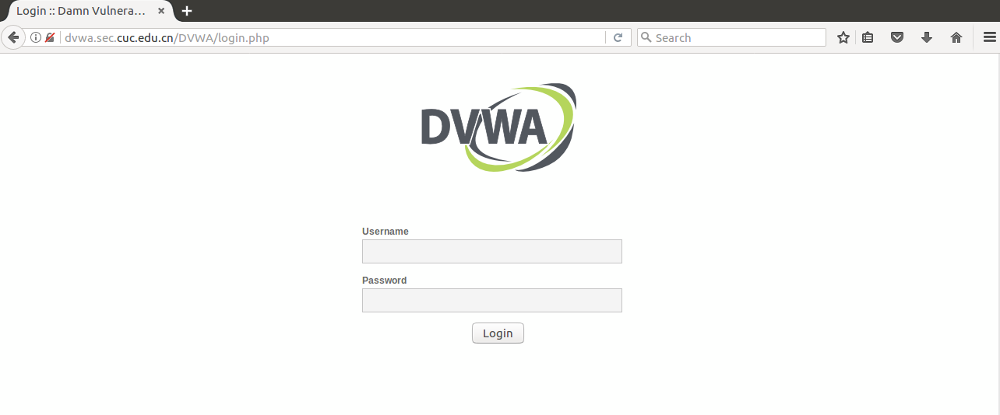
4. 限制IP访问
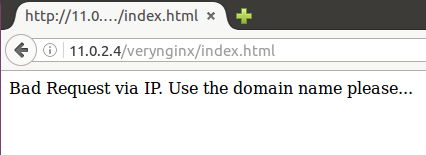
5. 创建并使用DVWA白名单
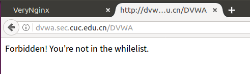
6. 对DVWA得到SQL注入实验在低安全等级条件下进行防护
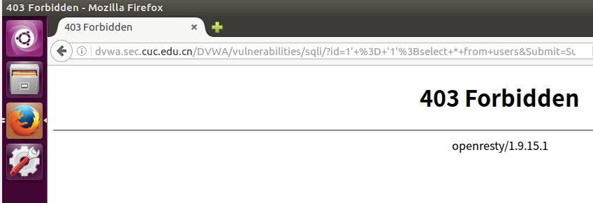
7. 创建并使用VeryNginx白名单
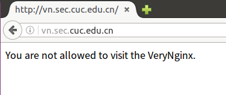
8. 定制VeryNginx访问控制策略
	* 限制DVWA站点的单IP访问速率为每秒请求数<50
	* 限制WordPress站点的单IP访问速率为每秒请求数<20
	* 自定义错误返回页面
	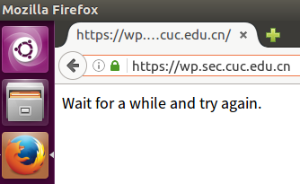
	* 禁止curl访问
	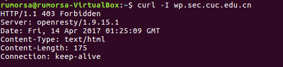

## TO DO：

	1. 完善方案一
	2. 复现Username Enumeration,并进行热修复。

## [实验环境](http://sec.cuc.edu.cn/huangwei/course/LinuxSysAdmin/chap0x05.exp.md.html#/1/1)

### 方案一

两台Ubuntu16.04主机，分别搭建[VeryNginx](https://github.com/alexazhou/VeryNginx/blob/master/readme_zh.md)/[WordPress](https://www.digitalocean.com/community/tutorials/how-to-install-wordpress-with-lemp-on-ubuntu-16-04)和[DVWA](https://github.com/ethicalhack3r/DVWA)。  
在安装VeryNginx的主机上，修改Nginx实现http和https的端口号，使VeryNginx作为唯一出入口。

### 方案二 

三台Ubuntu16.04主机，其中一台作为反向代理服务器，搭建VeryNginx。另外两台分别搭建WordPress和DVWA。

