# 搭建软件环境

## FTP服务器配置任务

* 配置一个提供匿名访问的FTP服务器，匿名访问者可以访问1个目录且仅拥有该目录及其所有子目录的只读访问权限；
* 配置一个支持用户名和密码方式访问的账号，该账号继承匿名访问者所有权限，且拥有对另1个独立目录及其子目录完整读写（包括创建目录、修改文件、删除文件等）权限； 
    * 该账号仅可用于FTP服务访问，不能用于系统shell登录；

* FTP用户不能越权访问指定目录之外的任意其他目录和文件；
* 匿名访问权限仅限白名单IP来源用户访问，禁止白名单IP以外的访问；
* 使用FTPS服务代替FTP服务，上述所有要求在FTPS服务中同时得到满足；

### Pure-ftpd

pureftpd的权限控制是通过系统目录的权限来实现的。

### 1. 建立匿名用户

默认情况下不开启匿名登录功能的。

> ref:[Linux下使用pure-ftpd建立匿名ftp访问](https://my.oschina.net/crooner/blog/727490)

开启匿名设置，匿名用户为ftp。

修改匿名用户对指定目录的权限

	sudo chmod 550 public

### 2. 建立虚拟用户

Pure-ftpd 虚拟用户登录的原理是创建一个通过用户和密码认证的数据库文件，类似apache的认证登录，这里的ftp用户将通过用户的gid和uid绑定到系统的用户，使用该ftp用户登录后就获得了相应系统用户的文件系统权限。

* [参考教程](http://wiki.ubuntu.org.cn/Pure-ftpd%E6%9C%8D%E5%8A%A1%E5%AE%89%E8%A3%85%E8%AE%BE%E7%BD%AE)

添加一个虚拟用户user1
	sudo pure-pw useradd user1 -u ftpuser -g ftpgroup -d /var/ftp

创建用户资料

	sudo pure-pw mkdb

在/etc/pure-ftpd/auth下，创建一个软链接，连接用户数据库

	ln -s /etc/pure-ftpd/conf/PureDB 60puredb

显示用户信息

	sudo pure-pw show user1

重启服务

	sudo /etc/init.d/pure-ftpd restart

__设置用户权限__

public为匿名/ftp用户的指定目录，匿名访问者可以访问1个目录且仅拥有该目录及其所有子目录的只读访问权限。

虚拟用户user1和匿名用户同属于一个用户组ftpgroup，能够继承匿名访问者所有权限，且拥有对private及其子目录完整读写的权限。

	chmod -R 700 private
	chmod -R 550 public

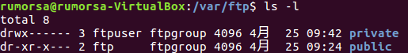

此外，ftp用户不能越权访问指定目录之外的任意其他目录和文件。

### 3. 添加防火墙规则

> PureFTP doesn't block/allow IPs, generally that's done by a firewall on the system.  (From [WebHostingTalk](http://www.webhostingtalk.com/showthread.php?t=1001235))

可改用Pro-ftpd。

### 4. 实现FTPS

	echo 1 > /etc/pure-ftpd/conf/TLS
	mkdir -p /etc/ssl/private/
	openssl req -x509 -nodes -days 7300 -newkey rsa:2048 -keyout /etc/ssl/private/pure-ftpd.pem -out /etc/ssl/private/pure-ftpd.pem
	sudo chmod 600 /etc/ssl/private/pure-ftpd.pem
	sudo /etc/init.d/pure-ftpd-mysql restart

上述图例中已实现。

> ref: [How To Configure PureFTPd To Accept TLS Sessions On Debian Lenny](https://www.howtoforge.com/how-to-configure-pureftpd-to-accept-tls-sessions-on-debian-lenny)

### Pro-ftpd

>ref:[Linux network - Install and configure proftpd in Ubuntu Server](http://www.basicconfig.com/linuxnetwork/install_configure_proftpd_ubuntu_server)

sudo apt-get install proftpd
cd /etc/proftpd
sudo cp proftpd.conf proftpd.conf.bak

__修改proftpd.conf文件，设置匿名用户__

	<Anonymous ~ftp>
	User ftp
	Group nogroup
	
	# We want clients to be able to login with "anonymous" as well as "ftp"
	UserAlias anonymous ftp
	# Cosmetic changes, all files belongs to ftp user
	
	DirFakeUser on ftp
	DirFakeGroup on ftp
	
	RequireValidShell off
	# Limit the maximum number of anonymous logins
	MaxClients 10
	
	# We want 'welcome.msg' displayed at login, and '.message' displayed
	# in each newly chdired directory.
	
	DisplayLogin welcome.msg
	DisplayChdir .message
	
	# Limit WRITE everywhere in the anonymous chroot
	
	<Directory *>
	<Limit WRITE>
	DenyAll
	</Limit>
	</Directory>
	
	</Anonymous>
	(END) 

	
__设置虚拟用户__

1. 修改proftpd.conf文件

		AuthOrder mod_auth_file.c mod_auth_unix.c
		AuthUserFile /usr/local/etc/proftpd/passwd
		AuthGroupFile /usr/local/etc/proftpd/group
		PersistentPasswd off
		#用户有没shell也可以使用FTP
		RequireValidShell off
		#  限定用户只能访问自己的目录
		DefaultRoot ~

2. 创建用于认证用户和口令的文件
	
		# 创建虚拟用户的本地ftp文件夹
		sudo mkdir /home/virtual
		# 创建用户
		sudo ftpasswd --passwd --file=/usr/local/etc/proftpd/passwd --name=virtual --uid=1025 --home=/home/virtual --shell=/bin/false
		# 创建virtualuser 用户组
		sudo ftpasswd --file=/usr/local/etc/proftpd/group --group --name=virtualusers --gid=1024
		# 将用户virtual 加入到virtualuser 用户组
		sudo ftpasswd --group --name=virtualusers --gid=1024 --member=virtual --file=/usr/local/etc/proftpd/group

## NFS服务器配置任务

* 在1台Linux上配置NFS服务，另1台电脑上配置NFS客户端挂载2个权限不同的共享目录，分别对应只读访问和读写访问权限；
* 实验报告中请记录你在NFS客户端上看到的： 
	* 共享目录中文件、子目录的属主、权限信息
	* 你通过NFS客户端在NFS共享目录中新建的目录、创建的文件的属主、权限信息
	* 上述共享目录中文件、子目录的属主、权限信息和在NFS服务器端上查看到的信息一样吗？无论是否一致，请给出你查到的资料是如何讲解NFS目录中的属主和属主组信息应该如何正确解读。

* （可选加分任务）在客户端或NFS服务器上抓包分析使用NFS协议时的远程文件下载、上传、移动、删除等操作是否是明文？远程的文件传输数据流是否可以被恢复出完整的传输文件？ 
	* 提示：我们在《网络安全》第4章《网络监听》中介绍过的工具filesnarf

### 搭建过程

	sudo apt-get install nfs-kernel-server
	sudo mkdir /var/nfs/general -p
	sudo chown nobody:nogroup /var/nfs/general

修改配置文件/etc/exports

	/var/nfs/general    CLIENT_IP(rw,sync,no_subtree_check)

	/home       CLIENT_IP(sync,no_root_squash,no_subtree_check)

重启服务

	sudo systemctl restart nfs-kernel-server

> ref:[How To Set Up an NFS Mount on Ubuntu 16.04](https://www.digitalocean.com/community/tutorials/how-to-set-up-an-nfs-mount-on-ubuntu-16-04)

Host: WordPress(11.0.2.7)  
Client: Rumorsa(11.0.2.5)

成功挂载并实现开机自启动

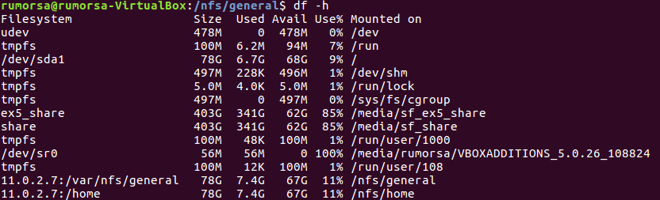

### 修改NFS客户端权限

NFS服务端的输出规则

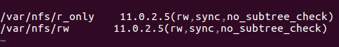

* 只能将权限写作rw，写成只读r会报错。

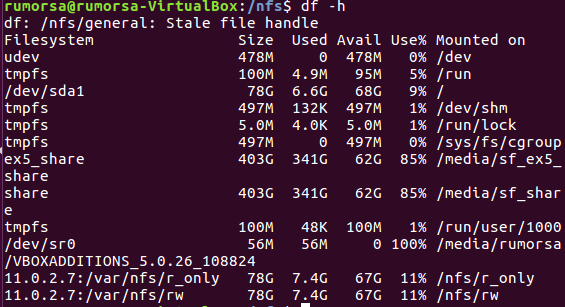  

成功挂载后，在NFS客户端客户端设置共享目录的权限。

1. 共享目录中文件、子目录的属主、权限信息
	
	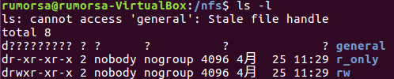

2. 通过NFS客户端在NFS共享目录中新建的目录、创建的文件的属主、权限信息

	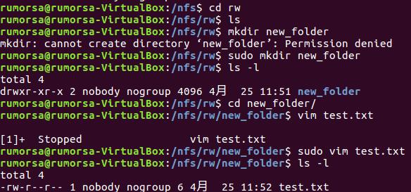
	
	子目录继承了NFS共享目录的权限。

### 抓包分析

探无一物。

## SAMBA独立共享目录

Linux samba server : 11.0.2.4  
Linux samba client : 11.0.2.5

添加同名登录用户：

### Linux设置匿名访问共享目录

	mkdir -p /srv/samba/guest/
	chgrp -R demoGroup /srv/samba/guest/
	chmod 2775 /srv/samba/guest/

	smbclient -L 11.0.2.4  //SA/guest demoUser

### Linux设置用户名密码方式的共享目录

	mkdir -p /srv/samba/demo/
	chgrp -R demoGroup /srv/samba/demo/
	chmod 2770 /srv/samba/demo/

	smbclient -L 11.0.2.4 -U demoUser //SA/demo demoUser

不指定连接IP，报错如下：

	Connection to SA failed (Error NT_STATUS_UNSUCCESSFUL)

### Linux访问Windows的匿名共享目录

Windows配置做如下修改：

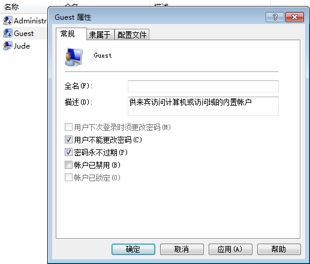

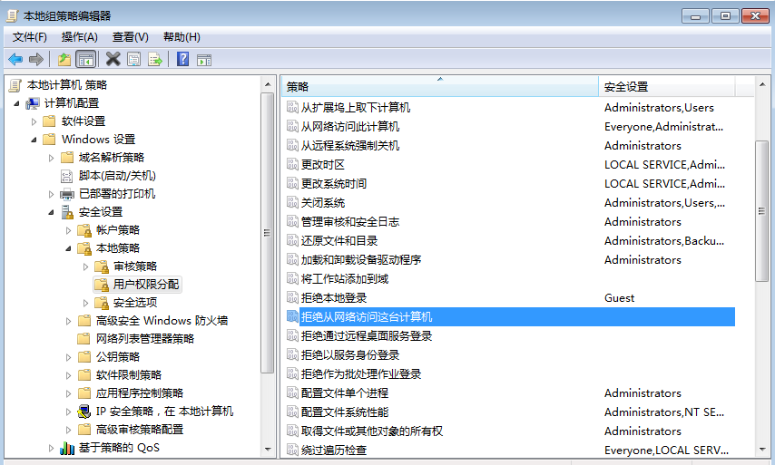

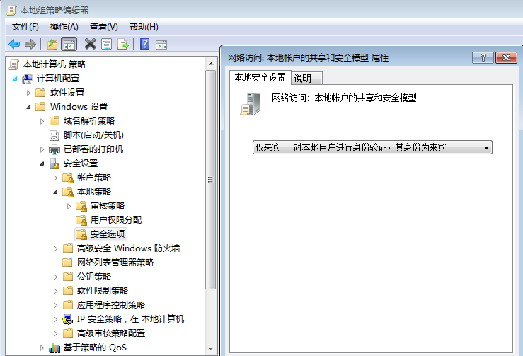

> ref:[Windows7如何开启局域网中的匿名访问共享](https://wenku.baidu.com/view/d86d960516fc700abb68fc5a.html)

访问匿名共享文件夹：

	smbclient -L dst-ip

### Linux访问Windows的用户名密码方式共享目录 

	smbclient -U user //HOSTNAME/share-folder password

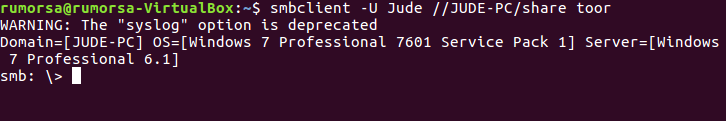

### 下载整个目录

> ref: [Getting whole folder using Smbclient](https://indradjy.wordpress.com/2010/04/14/getting-whole-folder-using-smbclient/)

## DHCP   

* 2台虚拟机使用Internal网络模式连接，其中一台虚拟机上配置DHCP服务，另一台服务器作为DHCP客户端，从该DHCP服务器获取网络地址配置。

  
__Linux server 10.0.2.4__

安装 dhcpd  

	sudo apt install isc-dhcp-server

为enp0s8分配IP

	sudo ifconfig enp0s8 10.0.2.5 netmask 255.255.255.0

在/etc/default/isc-dhcp-server中设定intnet网卡

	INTERFACES="enp0s8"

在/etc/dhcp/dhcpd.conf中添加如下设置

	subnet 10.0.2.0 netmask 255.255.255.0 {
	  range dynamic-bootp 10.0.2.20 10.0.2.100;
	  option broadcast-address 10.0.2.255;
	  option subnet-mask 255.255.255.0;
	  default-lease-time 600;
	  max-lease-time 7200;
	}

重启dhcpd服务

	sudo systemctl restart isc-dhcp-server.service

## DNS

* 基于上述Internal网络模式连接的虚拟机实验环境，在DHCP服务器上配置DNS服务，使得另一台作为DNS客户端的主机可以通过该DNS服务器进行DNS查询
* 在DNS服务器上添加 zone "cuc.edu.cn" 的以下解析记录

	* ns.cuc.edu.cn NS
	* ns A <自行填写DNS服务器的IP地址>
	* wp.sec.cuc.edu.cn A <自行填写第5章实验中配置的WEB服务器的IP地址>
	* dvwa.sec.cuc.edu.cn CNAME wp.sec.cuc.edu.cn

__服务端__

安装

	sudo apt-get install bind9

在配置文件/etc/bind/named.conf.local 中添加

	zone "cuc.edu.cn" {
	    type master;
	    file "/etc/bind/db.cuc.edu.cn"
	};  

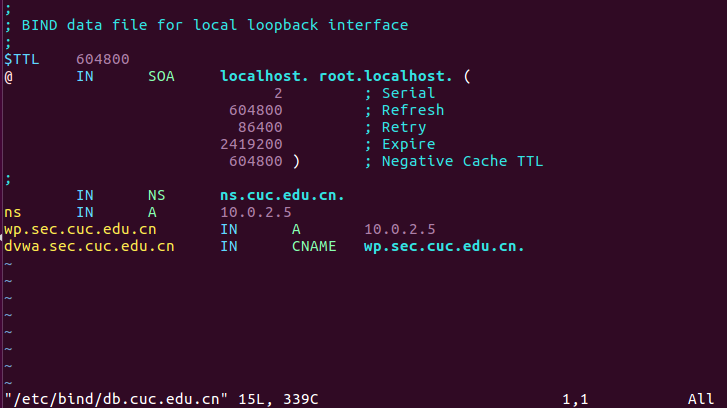

__客户端__

修改/etc/resolvconf/resolv.conf.d/head

	search cuc.edu.cn  
	nameserver 192.168.56.5
 
更新resolv.conf文件

	sudo resolvconf -u

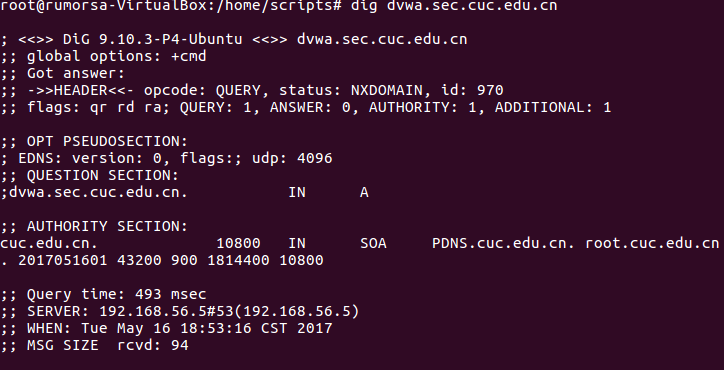

# 自动安装与自动配置

__远程服务器：__

	sudo apt-get install openssh-server  
	# 编辑/etc/ssh/sshd_config文件，修改PermitRootLogin yes,使root用户可以远程登录  
	mkdir /root/.ssh   
	touch /root/.ssh/authorized_keys   
	chmod 700 -R /root/.ssh   
	# 重启 ssh 服务  
	sudo systemctl restart ssh

__部署主机：__

	# 使用root用户
	sudo su -
	# 创建公钥
	ssh-keygen -t rsa  
	# 安装expect
	apt-get install expect  
	touch /root/.ssh/authorized_keys.pub  
	# 安装sshpass
	sudo apt-get install sshpass
	
	bash go.sh

脚本入口为go.sh

auto-ssh.sh进行首次ssh连接
set-vars.sh存放目标环境相关参数  
pre-install.sh用于安装相关软件  
config.sh对不同服务进行配置
