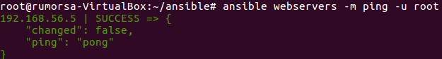
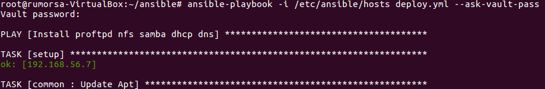
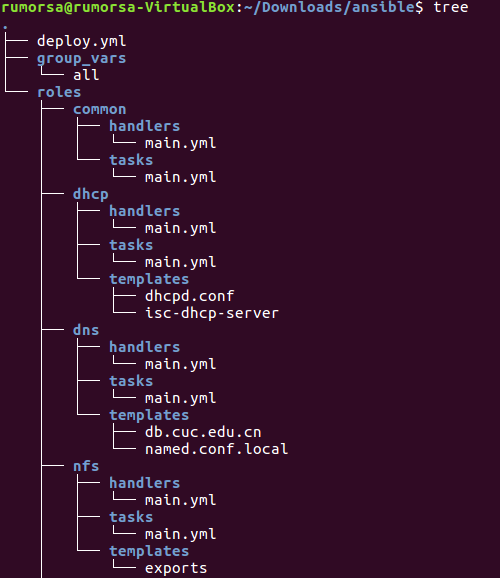
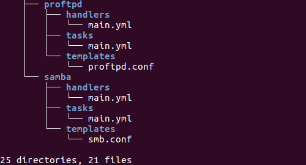
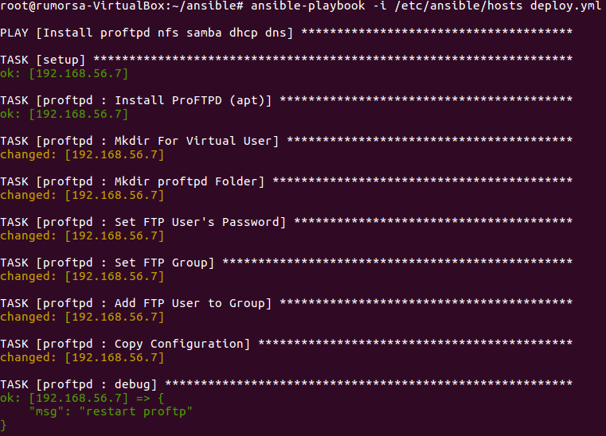
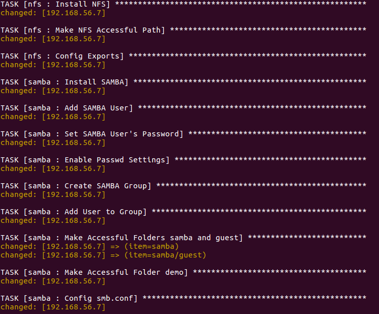
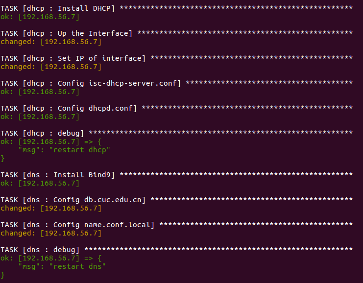
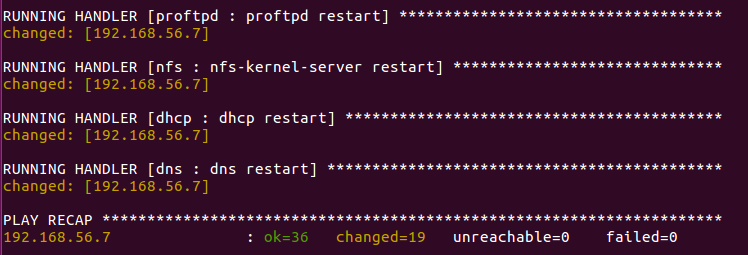

# 使用ansible技术重构FTP、NFS、DHCP、DNS、Samba服务器的自动安装与自动配置

## Basic Knowledge

>ref: [Automating Server Setup with Ansible](https://deliciousbrains.com/automating-server-setup-ansible/)

>Ansible is an automation tool for provisioning, application deployment, and configuration management. Gone are the days of SSH’ing into your server to run a command or hacking together bash scripts to semi-automate laborious tasks. Whether you’re managing a single server or an entire fleet, Ansible can not only simplify the process, but save you time.   

## Write deploy.yml

### 预设置

> ref: [galaxyproject/ansible-proftpd](https://github.com/galaxyproject/ansible-proftpd) / [debops/ansible-dhcpd](https://github.com/debops/ansible-dhcpd)

远程主机(192.168.56.7/10.0.2.5)和部署主机(192.168.56.6)配置如实验6&7,需要手工配置SSH免密登录。

> ansible版本信息：

> * ansible 2.0.0.2
>     * config file = /etc/ansible/ansible.cfg
>     * configured module search path = Default w/o overrides

### 加入Vault模块，对SSH连接密码进行加密

> ref: [How do I generate crypted passwords for the user module?](http://docs.ansible.com/ansible/faq.html#how-do-i-generate-crypted-passwords-for-the-user-module)

### 完整文件结构

## Finally, ansible-playbook -i /etc/ansible/hosts deploy.yml

