#Linux基础实验
##实验要求：  
1.在虚拟机上安装ubuntu-16.04.1-server-amd64.iso镜像。  
2.配置无人值守安装iso并在Virtualbox中完成自动化安装。  
3.使用sftp在虚拟机和宿主机之间传输文件。
###实验环境及工具：
1.virtualbox  
2.Ubuntu 16.04 Server 64bit  
3.putty.exe  
4.psftp.exe  
####实验步骤： 
1. 在VirtualBoxs上安装虚拟机，并创建用户名和密码。
  
2.在Virtual Box全局设定内添加一块网卡（Host-only网络）  
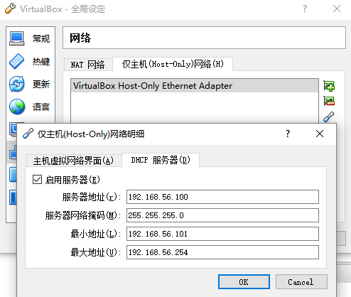  
3.打开虚拟机，激活新添加的网卡。  
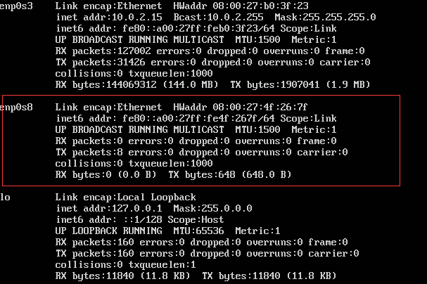  
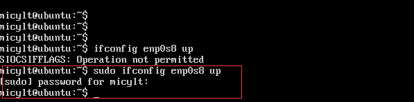  
4.为新添加的网卡分配IP地址
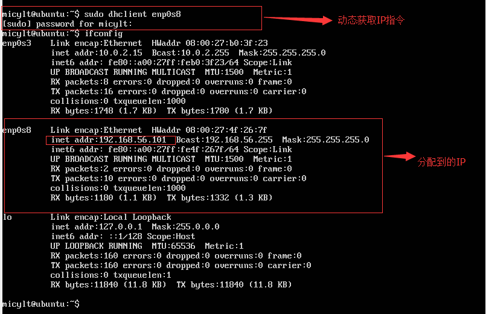     
5.安装OpenSSh Server。（在自己电脑上安装的镜像没有自带ssh软件，需要自行下载安装包）  
6.启动ssh服务。  
7.使用putty对虚拟机进行远程连接。         
 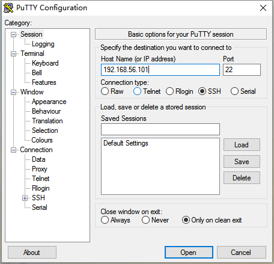  
 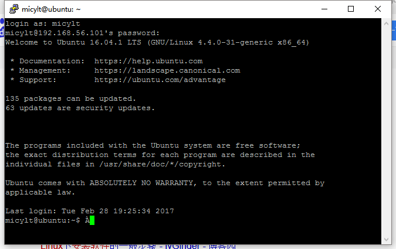  
 如图所示，显示远程连接成功，现在我们就可以在宿主机上通过putty远程连接到虚拟机，因为putty支持复制粘贴，这样就大大的方便了我们的操作。    
8.在当前用户目录下创建一个用于挂载iso镜像文件的目录-mkdir loopdir  
9.挂载iso镜像文件到该目录-mount -o loop ubuntu-16.04.1-server-amd64.iso loopdir  
10.创建一个工作目录用于克隆光盘内容-mkdir cd
11.同步光盘内容到目标工作目录-rsync -av loopdir/ cd
12.卸载iso镜像-umount loopdir  
13.进入目标工作目录，编辑Ubuntu安装引导界面增加一个新菜单项入口  
14.添加以下内容后强制保存退出。  
   label autoinstall  
  menu label ^Auto Install Ubuntu Server  
  kernel /install/vmlinuz  
  append  file=/cdrom/preseed/ubuntu-server-autoinstall.seed debian-installer/locale=en_US console-setup/  layoutcode=us keyboard-configuration/layoutcode=us console-setup/ask_detect=false localechooser/translation/warn-light=true localechooser/translation/warn-severe=true initrd=/install/initrd.gz root=/dev/ram rw quiet  
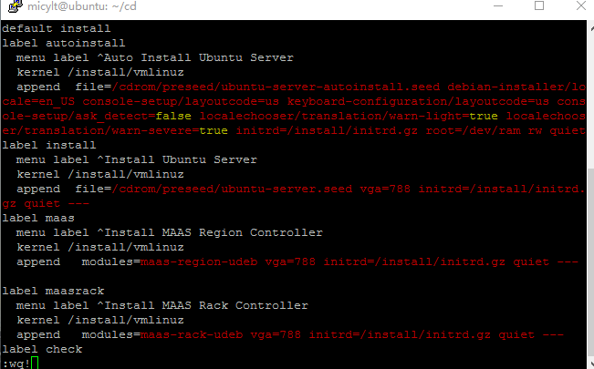  
15.阅读并编辑定制Ubuntu官方提供的示例preseed.cfg，并将该文件保存到刚才创建的工作目录  
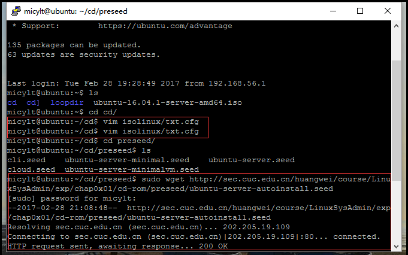  
16.重新生成md5sum.txt，并封闭改动后的目录到.iso。  
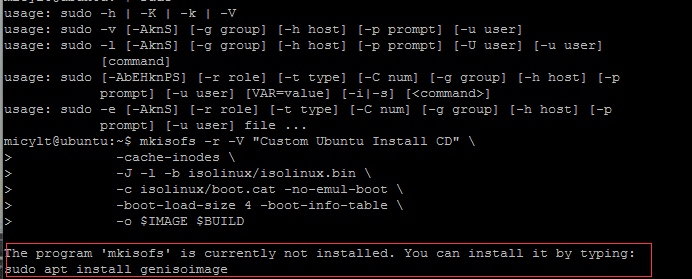  
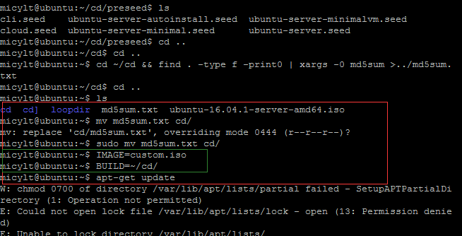  
17.最后使用psftp将修改好的镜像从虚拟机下载到宿主机。  
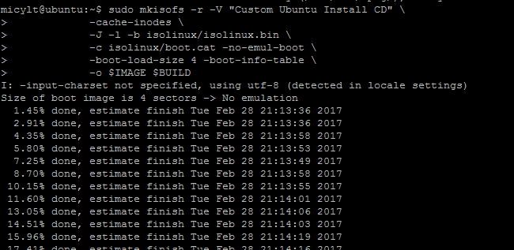  
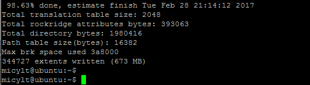
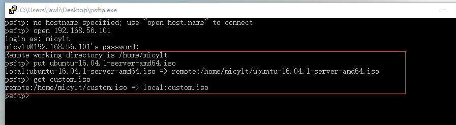      
  
至此，无人值守Linux安装镜像制作就完成了    
##实验总结：
1.使用putty远程操作可以大大减少操作的繁琐度  
2.本次实验在宿舍自己的笔记本环境下完成，由于无法连接到sec.cuc.edu.cn/ftp下载镜像，我使用了paftp工具将原来的ubantu镜像从宿主机上传到了虚拟机来进行修改制作，最后同样适用psftp将制作好的自动化安装镜像从虚拟机下载到宿主机    
3.由于自己电脑上的镜像没有预装ssh，所以要使用putty远程连接还需要先在虚拟机内安装openssh-server.安装指令为：sudo apt-get install openssh-server ,安装完成后检查ssh是否在启动状态，如果是则可进行远程连接  
4.实验中有一次无法连接到虚拟机是因为没有在全局设置的网络里开启host-only的dhcp服务  
5.为了能commmit做的修改  
 

