# Shell脚本编程基础  
任务二:  
 用bash编写一个文本批处理脚本，对附件“2014世界杯运动员数据”进行批量处理完成相应的数据统计任务  
一、实验前准备:  
1.下载“2014世界杯运动员数据”，并使用psftp上传到虚拟机。  
二、实验步骤   
1.使用more命令读取文件  
2.使用awk对数据进行相关规则的匹配和统计  
3.使用sort进行排序  
4.使用uniq进行统计  
三、实验结果  
1.帮助信息  
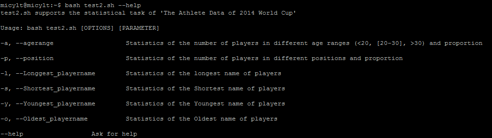  
2.统计不同年龄区间范围（20岁以下、[20-30]、30岁以上）的球员数量、百分比  
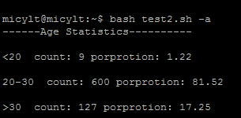  
3.统计不同场上位置的球员数量、百分比  
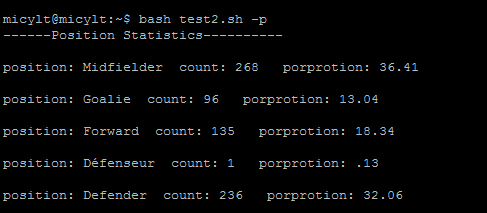  
4.统计名字最长的球员  
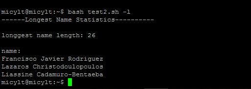  
5.统计名字最短的球员  
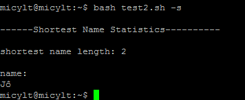   
6.统计年龄最大的球员  
  
7.统计年龄最小的球员  
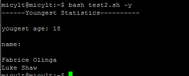  
ps：详细实验结果在data/test2.txt中  

任务三：  
用bash编写一个文本批处理脚本，对附件“Web服务器访问日志”分别进行批量处理完成相应的数据统计任务：  
1.统计访问来源主机TOP 100和分别对应出现的总次数  
2.统计访问来源主机TOP 100 IP和分别对应出现的总次数  
3.统计最频繁被访问的URL TOP 100  
4.统计不同响应状态码的出现次数和对应百分比  
5.分别统计不同4XX状态码对应的TOP 10 URL和对应出现的总次数  
6.给定URL输出TOP 100访问来源主机  
一、实验思路  
与任务二相同  
二、实验结果  
1.--help信息  
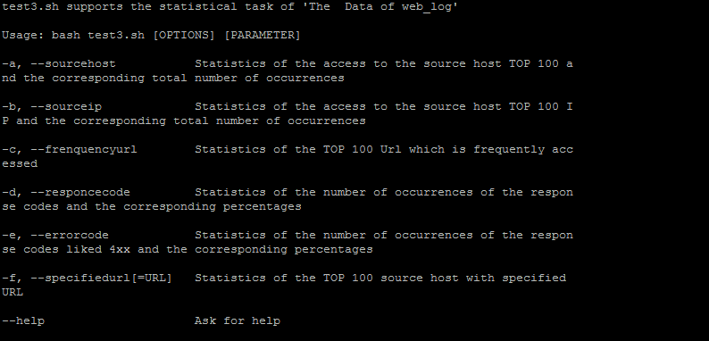  
2.统计访问来源主机TOP 100和分别对应出现的总次数  
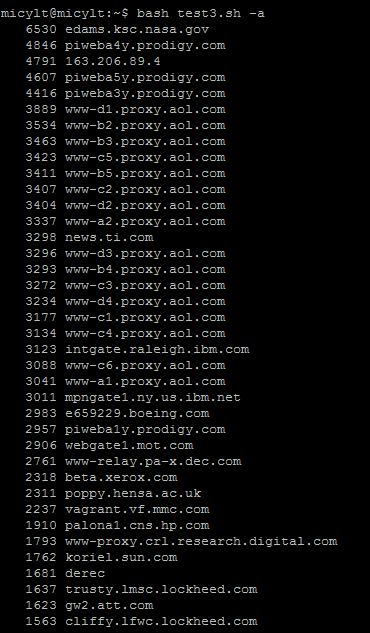  
3.统计访问来源主机TOP 100 IP和分别对应出现的总次数    
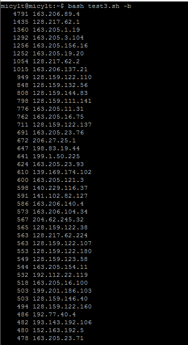  
4.统计最频繁被访问的URL TOP 100    
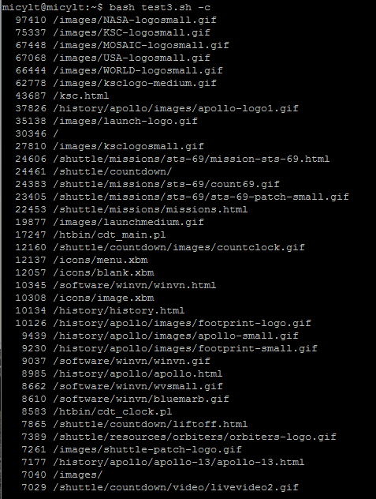  
5.统计不同响应状态码的出现次数和对应百分比    
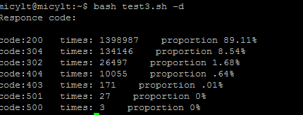  
6.分别统计不同4XX状态码对应的TOP 10 URL和对应出现的总次数    
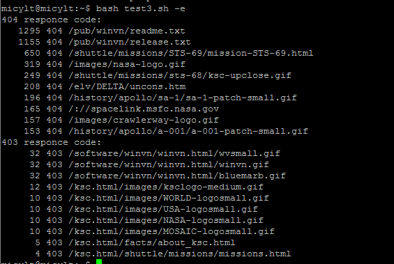  
7.给定URL输出TOP 100访问来源主机    
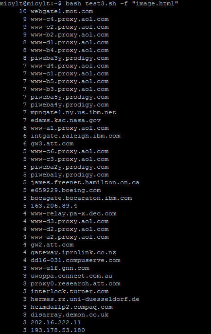  
ps:详细实验结果在data目录下    

注:任务一没有成功调通暂不提交，先提交任务二三。待任务一完全搞懂后再进行提交。

