# 实验五 搭建高级的Web服务器
## 一、[实验要求](https://sec.cuc.edu.cn/huangwei/course/LinuxSysAdmin/chap0x05.exp.md.html#/)
## 二、实验环境
* Ubuntu16.04 desktop（两台）   
* VeryNginx  
* WordPress 4.7  
* Damn Vulnerable Web Application (DVWA)  
## 实验过程
### 安装verynginx
1.先安装libpcre3-dev、libssl-dev和build-essential  
2.根据[教程](https://github.com/alexazhou/VeryNginx/blob/master/readme_zh.md)安装verynginx  
3.修改nginx.conf中的user改为www-data  
4.配置ssl（配置ssl[参考链接](https://www.digitalocean.com/community/tutorials/how-to-install-wordpress-with-lemp-on-ubuntu-16-04))
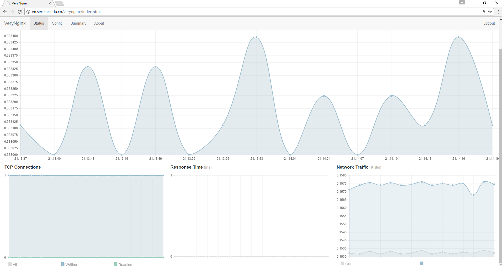  
### 安装wordpress  
1.修改nginx配置文件，使其监听127.0.0.1:8080 和 127.0.0.1:4433
2.安装LEMP环境（[参考链接](https://www.digitalocean.com/community/tutorials/how-to-install-wordpress-with-lemp-on-ubuntu-16-04)）  
3.安装wordpress
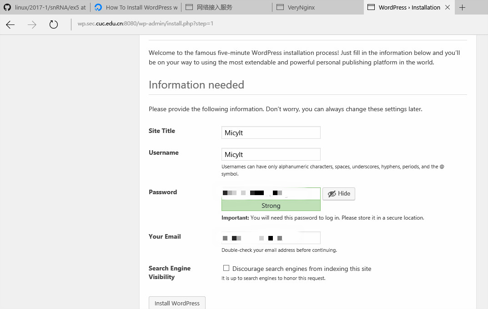
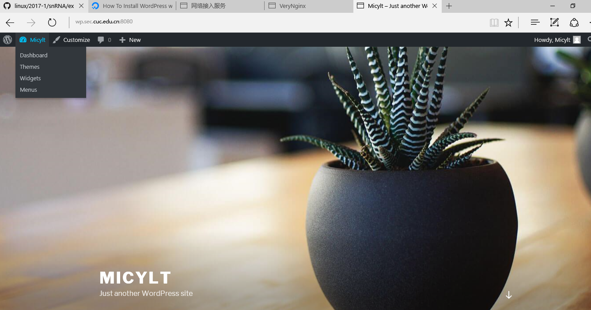  
### 安装dvwa
* 安装完成结果如图  
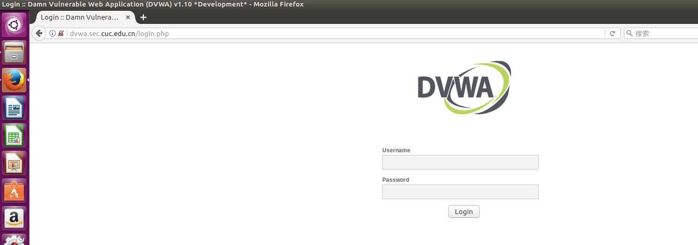
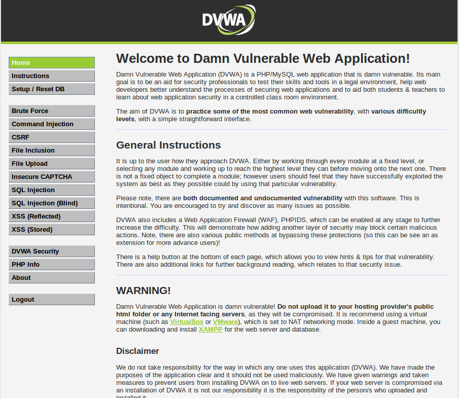  
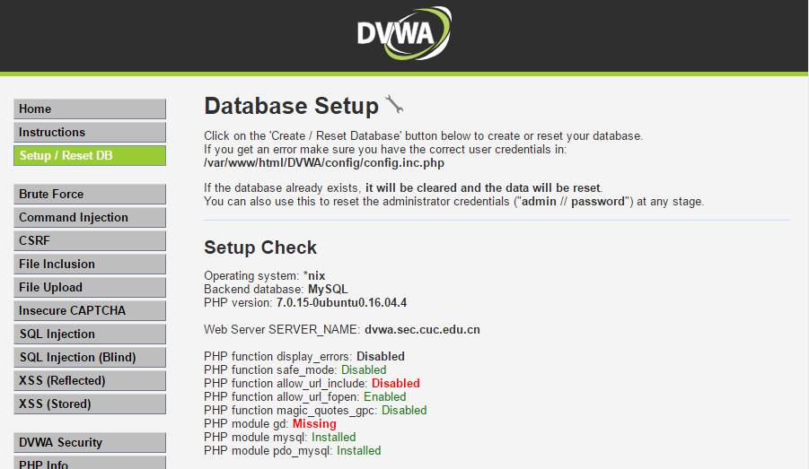  
### 相关安全加固要求  
1.配置反向代理  
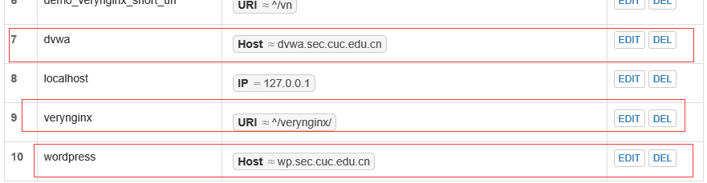  
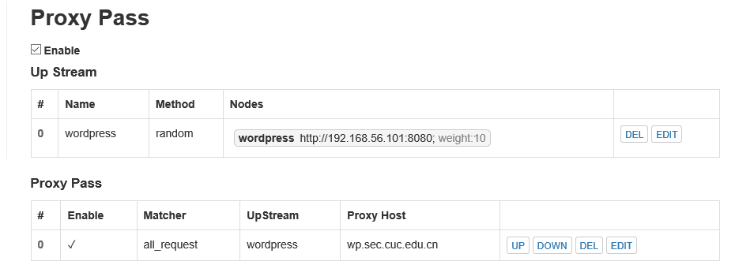  
2.限制IP访问，并向访客展示自定义的友好错误提示信息页面   
* 如图所示
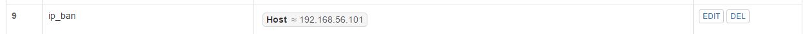   
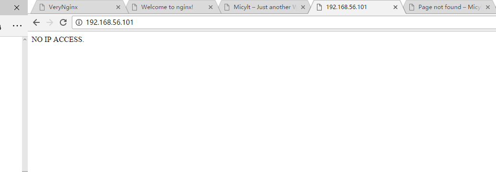    
3.限制Wordpress站点的单IP访问速率为每秒请求数 < 20  
* 使用脚本进行访问测试，当访问每秒访问次数达到20次时，访问失败并返回说明。结果如图 
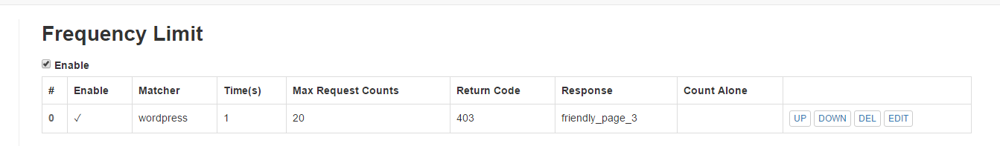 
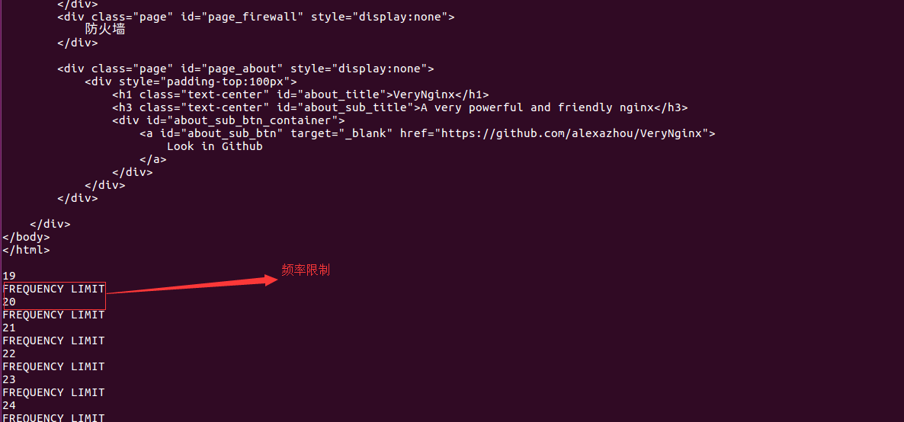  
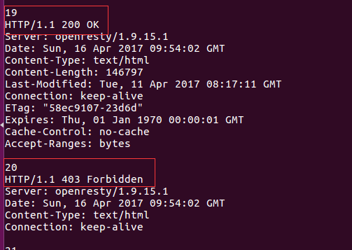  
* 测试脚本如下  
<pre><code>
  count=0  
  while [[ $count -lt 25 ]]  
  do  
      echo $count  
      curl -I wp.sec.cuc.edu.cn/verynginx/index.html  
  count=$[ $count + 1 ]  
  done  

</code></pre>  
4.禁止curl访问
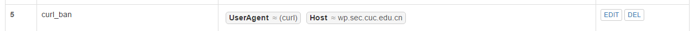  
  
禁止curl访问后自定义提示信息为：NO CURL！！！   

5.DVWA在低安全等级时测试sql注入实验
   
针对DVWA的SQL注入实验低安全等级下的防护  
匹配参数中出现的特殊敏感字符如order、union、select、from等  
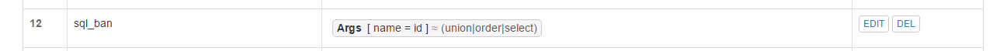  
设置后再次注入效果如下：  
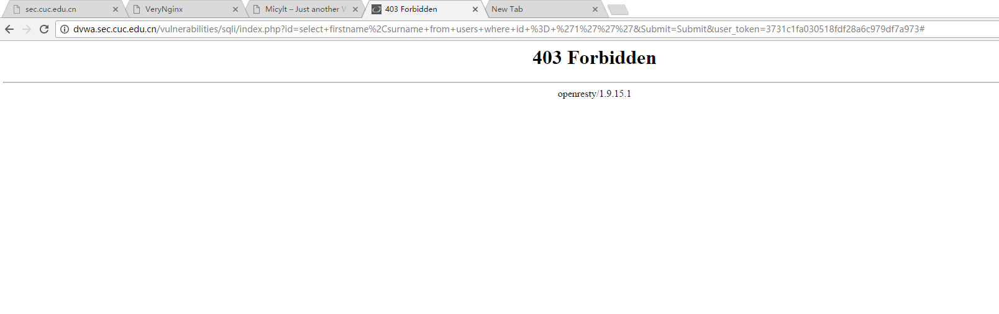     
6.DVWA只允许白名单访问,其他来源的IP访问均向访客展示自定义的友好错误提示信息页面    
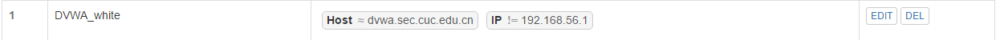  
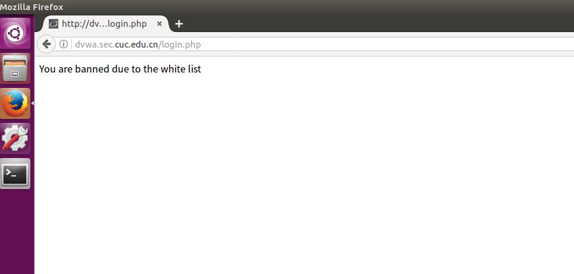 

### 说明
1.https没有配置成功，重新签发了好几遍还是不行，不知道是什么问题  
2.因为未知原因无法使用api查询，使得漏洞无法复现，暂时没有找到解决方法  
3.由于备份文件同名的原因导致端口占用，后来删除备份文件后解决该问题  
4.本次报告中没有提到的内容均为没有完成或没有成功的实验要求  
5.config目录下存放了相关配置文件  
  
 
