## 无人值守Linux安装镜像制作实验报告##

* **实验内容**
	* 目的：
		* 学习操作系统安装，配置无人值守安装iso并在Virtualbox中完成自动化安装 
		* Virtualbox安装完Ubuntu之后新添加的网卡实现系统开机自动启用和自动获取IP
		* 使用sftp在虚拟机和宿主机之间传输文件
	* 要求：
		* 定制用户名和默认密码
		* 定制安装OpenSSH Server
		* 安装过程禁止自动联网更新软件包
		
* **实验环境**
	* 环境：
		* 虚拟机 ：
		   * linux ubuntu-16.04.1-server 

	* 网络模式：
		* NAT + host-only （双网卡解决地址冲突问题）
		
	* 实验工具：
		* PuTTY ：
		  * PuTTY是一个Telnet、SSH、rlogin、纯TCP以及串行接口连接软件，在大三上学期的网络安全课程中也有接触过，为了便于操作，在这个实验中，我们使用PuTTY远程登录工具连接Linux主机
		  
		  	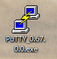

             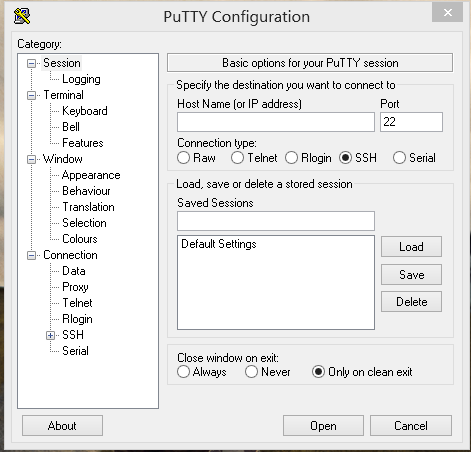
		* PSFTP： 
		  * PuTTY SFTP客户端， 用于本地与服务器间安全传输文件 
		  * 下载地址：[http://www.chiark.greenend.org.uk/~sgtatham/putty/latest.html](http://www.chiark.greenend.org.uk/~sgtatham/putty/latest.html)
	
	
* **实验过程**
	* 设置双网卡：
		* 在Ubuntu的网络设置中添加网卡 host-only连接：
		
        
		  
	* 在虚拟机Ubuntu上登录用户名后，使用dhclient命令为新添加的网卡动态分配地址，然后使用ifconfig查看网络设备观察是否成功分配地址，由下图可以看到新分配的网卡地址为 192.168.56.101：
		
        `sudo dhclient enp0s8`
	
        

	* PuTTY远程登录：
		* 下载PuTTY成功后，双击打开PuTTY.exe程序，输入远程主机IP即 192.168.56.101，命名对话后保存：
		
        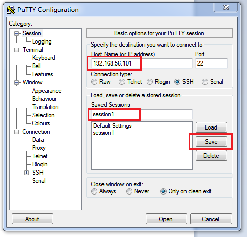
 
        * 双击对话名称后进入putty连接界面，输入用户名和密码，此时已经成功连接到linux主机：
        
        
	* PuTTY连接虚拟机后相关操作：
		* 使用wget命令下载Ubuntu 16.04.1 server的iso镜像：
        
  <pre># 在当前用户目录下创建一个用于挂载iso镜像文件的目录
	mkdir loopdir

	# 挂载iso镜像文件到该目录
        mount -o loop ubuntu-16.04.1-server-amd64.iso loopdir

        # 创建一个工作目录用于克隆光盘内容
        mkdir cd
 
        # 同步光盘内容到目标工作目录
        # 一定要注意loopdir后的这个/，cd后面不能有/
        rsync -av loopdir/ cd

        # 卸载iso镜像
        umount loopdir

        # 进入目标工作目录
        cd cd/

        # 编辑Ubuntu安装引导界面增加一个新菜单项入口
        vim isolinux/txt.cfg</pre>

   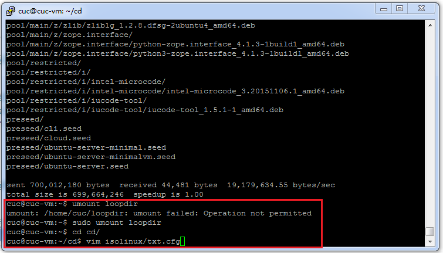
      
   * 添加以下内容到该文件后强制保存退出
   <pre>label autoinstall
  menu label ^Auto Install Ubuntu Server
  kernel /install/vmlinuz
  append  file=/cdrom/preseed/ubuntu-server-autoinstall.seed debian-installer/locale=en_US console-setup/layoutcode=us keyboard-configuration/layoutcode=us console-setup/ask_detect=false localechooser/translation/warn-light=true localechooser/translation/warn-severe=true initrd=/install/initrd.gz root=/dev/ram rw quiet
</pre> 
   

  * 下载修改定制好的ubuntu-server-autoinstall.seed ，并将该文件保存到刚才创建的工作目录~/cd/preseed/ubuntu-server-autoinstall.seed
  
   

  * 修改isolinux/isolinux.cfg，增加内容timeout 10
  
   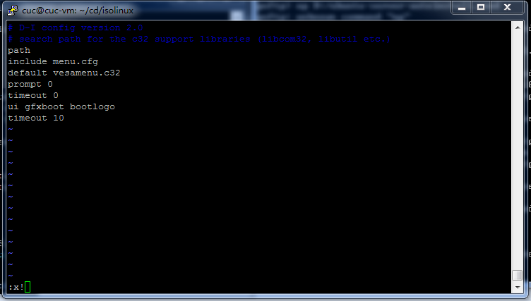

  * 重新生成md5sum.txt，实验过程中当尝试生成md5sum.txt时，发现系统提示permission denied ，意味着此时的权限不够高，然后我们尝试使用命令chmod 777 md5sum.txt，这样的结果便是任何人对md5sum.txt这个文件都有读、写、运行三项权限。
  
   

  * 创建test.sh文件，然后进行编辑，添加以下内容后保存退出
  <pre># 封闭改动后的目录到.iso
IMAGE=custom.iso
BUILD=~/cd/

            mkisofs -r -V "Custom Ubuntu Install CD" \
            -cache-inodes \
            -J -l -b isolinux/isolinux.bin \
            -c isolinux/boot.cat -no-emul-boot \
            -boot-load-size 4 -boot-info-table \
            -o $IMAGE $BUILD

       # 如果目标磁盘之前有数据，则在安装过程中会在分区检测环节出现人机交互对话框需要人工选择 
     </pre>

  * 在运行test.sh脚本文件时，出现mkisofs：commad not found 的问题，发现是由于mkisofs包没下载，无法将指定的目录与文件做成ISO格式的映像文件，下载mkisofs包后，再次运行test.sh 问题就解决啦,镜像封装完成！
  
   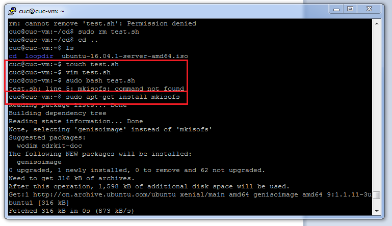
   
   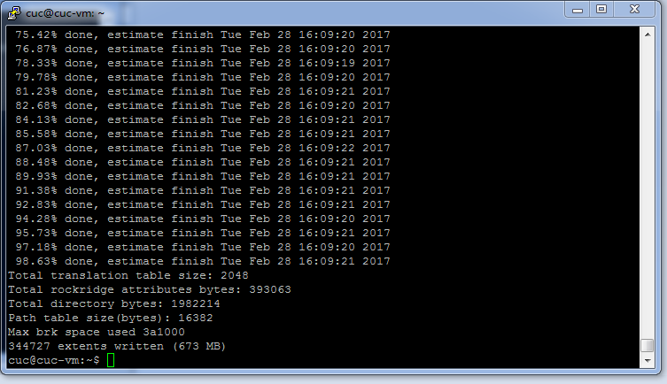

  * 使用psftp将封装好的ISO镜像文件传输到本地
  
     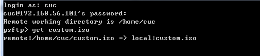

  * 由下图可以看到我们已经成功地把ISO文件下在了本地
  
     

	* 使用无人值守iso安装虚拟机
		* 新建一个linux Ubuntu（64bit）的虚拟机，在存储设置中控制器IDE栏下添加虚拟光盘文件即我们之前就已经封装好的custom.iso：

        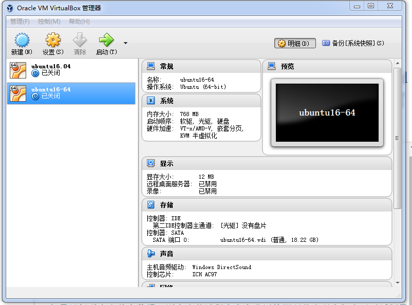		
        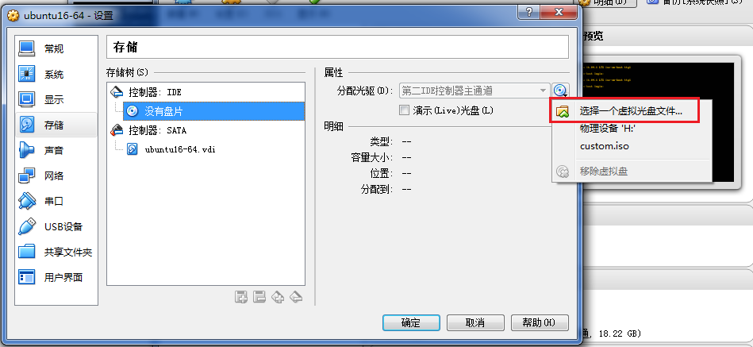
        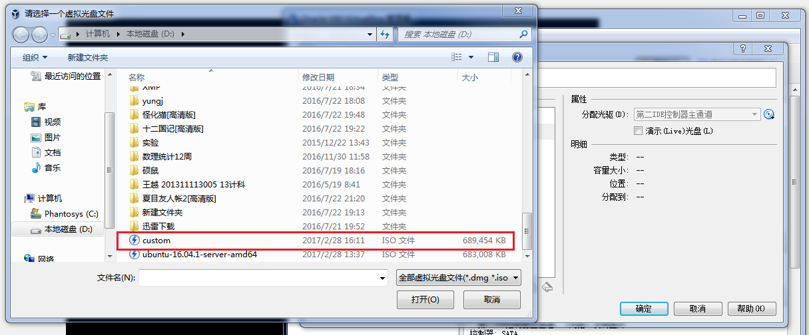
		* 设置完成后启动虚拟机，发现无人值守iso安装虚拟机成功，进入系统：
		
         
         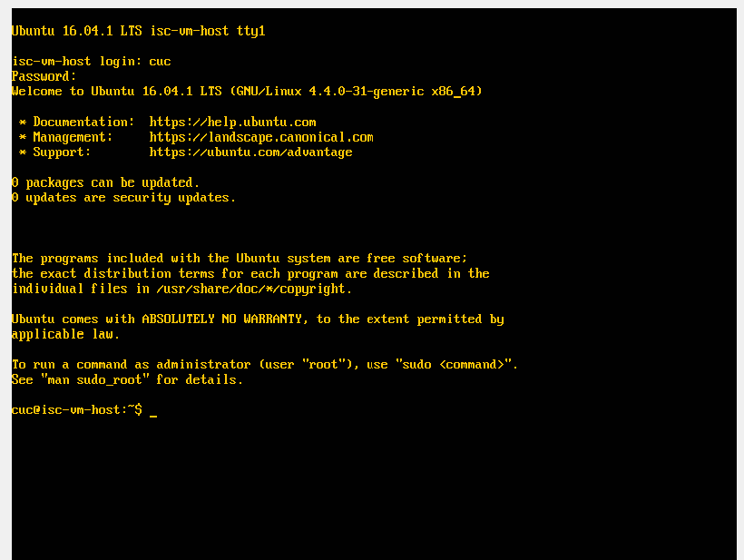

* **实验问题**
	* 在进行 将文件保存到创建的工作目录~/cd/preseed/ubuntu-server-autoinstall.seed 步骤时我尝试在psftp中将该文件上传到虚拟机的指定目录即cd/preseed/下，发现permission denied，故而就先将该文件上传到虚拟机的默认目录下，然后再使用putty 将上传后的文件rm到指定目录下，问题得以解决
         
         

   * 在运行test.sh脚本文件时，出现mkisofs：commad not found 的问题，发现是由于mkisofs包没下载，无法将指定的目录与文件做成ISO格式的映像文件，下载mkisofs包后，再次运行test.sh 问题就解决啦,镜像封装完成！
