# 实验报告五 web服务器搭建

----
## 实验目的

本次实验主要是搭建支持反向代理、流量控制、关键词过滤等功能的高级Web服务器，在VeryNginx，WordPress，DVWA 等软件环境中实现

## 一，实验环境

* Ubuntu16.04 desktop（3台）
       * verynginx（设置双网卡）：
           * NAT网络：10.0.2.8
           * host-only： 192.168.92.101
       * WordPress（单网卡）：
           * NAT网络：10.0.2.9
       * Damn Vulnerable Web Application (DVWA)（单网卡）：
           *  NAT网络：10.0.2.10
 
## 二，实验过程

* **安装VeryNginx**

    * [怎么搭建VeryNginx](https://github.com/alexazhou/VeryNginx/blob/master/readme_zh.md)
    * 【**注意事项**】
      * 先克隆VeryNginx到本地
         * 
         `git clone https://github.com/alexazhou/VeryNginx.git`
      * 并且在sudo python install.py install 之前安装libpcre3-dev、libssl-dev和build-essential
         * 
         `sudo apt-get install build-essential libssl-dev libpcre3-dev  ` 
      * 将/opt/verynginx/openresty/nginx/conf/nginx.conf文件下的user nginx修改为user www-data   
    
    * 搭建完成！
    * 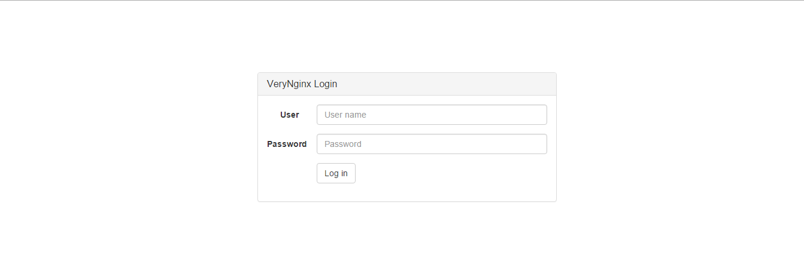
    * 

* **安装WordPress**
   *  在安装WordPress之前需要先安装Nginx+PHP7.0+MySQL（LEMP） 详情参见[LEMP配置教程](https://www.digitalocean.com/community/tutorials/how-to-install-linux-nginx-mysql-php-lemp-stack-in-ubuntu-16-04)
   *  [wordpress安装教程](https://www.digitalocean.com/community/tutorials/how-to-install-wordpress-with-lemp-on-ubuntu-16-04)
   *  【**注意事项**】
     * 关于WordPress的HTTPS搭建，详情参见[nginx 自签发证书制作](https://www.digitalocean.com/community/tutorials/how-to-create-an-ssl-certificate-on-nginx-for-ubuntu-14-04)  
     * 还有一点就是，为了使得使用Wordpress搭建的站点对外提供访问的地址为： https://wp.sec.cuc.edu.cn 和 http://wp.sec.cuc.edu.cn 还需配置一下服务器的hosts文件，添加以下内容
      
   *  安装完成
   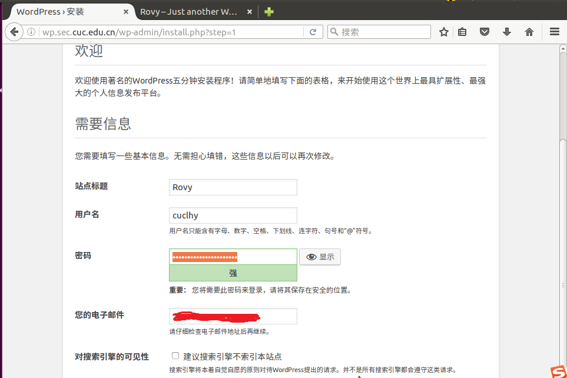
   * 完成功能点（使用Wordpress搭建的站点对外提供访问的地址为： https://wp.sec.cuc.edu.cn和 http://wp.sec.cuc.edu.cn）
   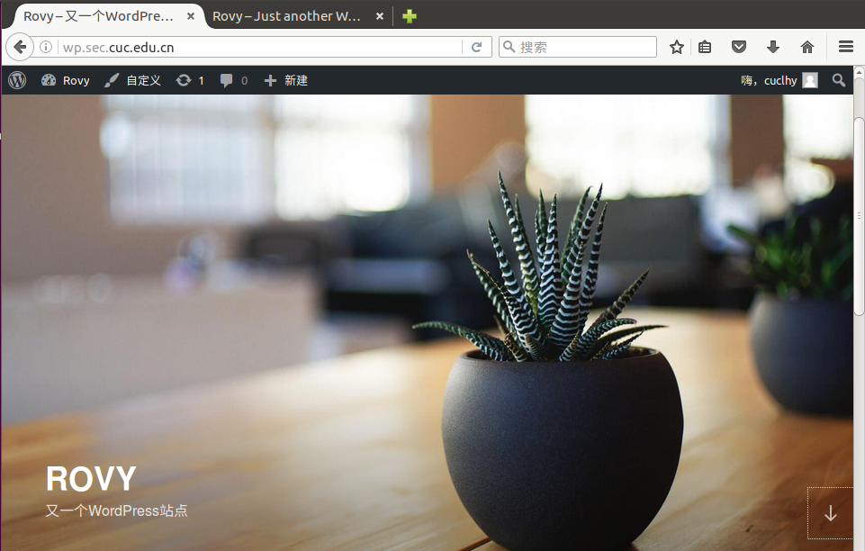
   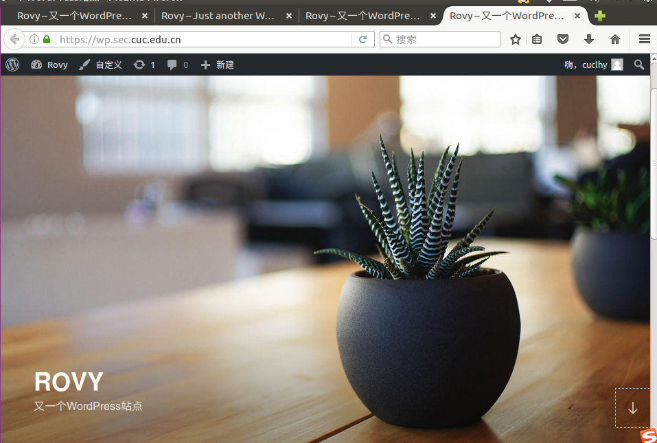
   
* **安装DVWA**
   *  和WordPress一样在安装DVWA之前需要先安装Nginx+PHP7.0+MySQL（LEMP）
   *  DVWA的安装和配置具体参见 [如何安装DVWA](https://github.com/ethicalhack3r/DVWA)
   * 【**注意事项**】
     *  配置一下服务器的hosts文件，添加以下内容
      
     * 我在刚开始配置完的时候无法直接访问到dvwa.sec.cuc.edu.cn/login.php，然后发现关于dvwa的内容保存在了DVWA文件夹下面，应该是在下载的时候没有更改目录， 而系统默认的根目录是/var/www/html,所以没法儿直接打开，就先尝试了下面的访问 
     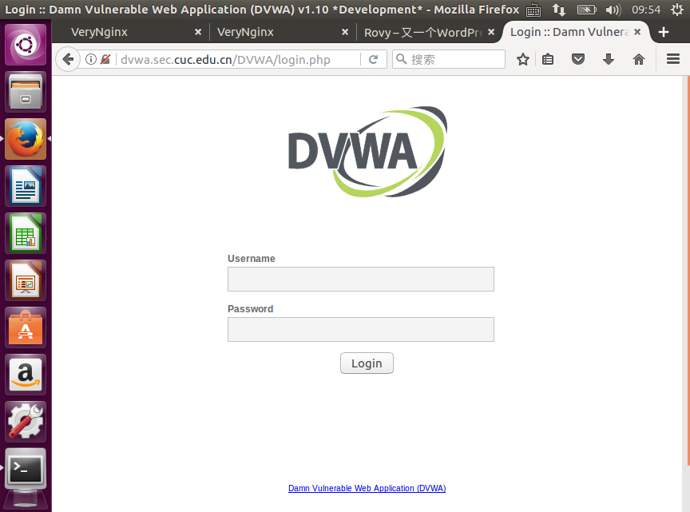
     后来把默认根目录修改为 /var/www/html/DVWA 便可以直接访问成功如下图所示。
   *  搭建完成
      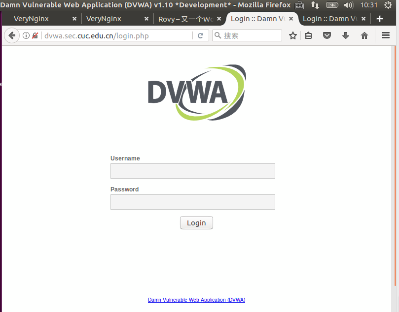
      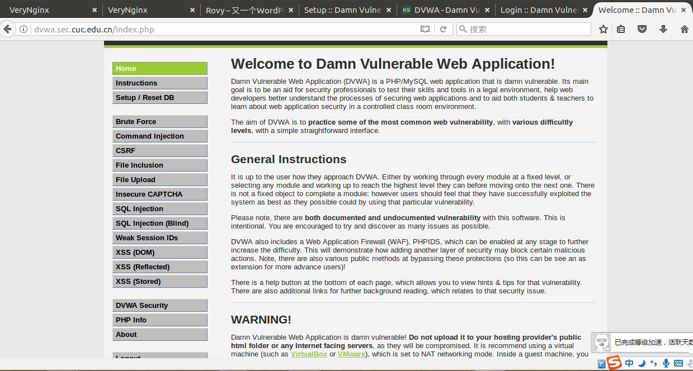

* **安全加固要求**
   * 前提--通过配置verynginx进行反向代理
     * proxy Pass
     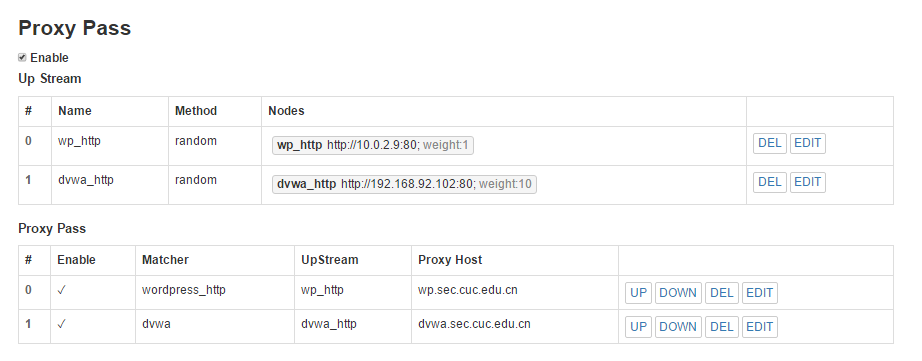
   * 使用IP地址方式均无法访问上述任意站点，并向访客展示自定义的友好错误提示信息页面-1
     * 通过添加以下规则实现 
          * Matcher 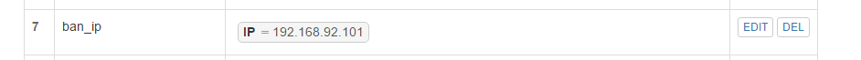
          * filter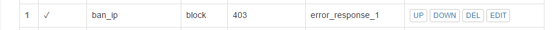
          * Response 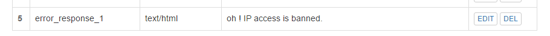
     * 实现效果
      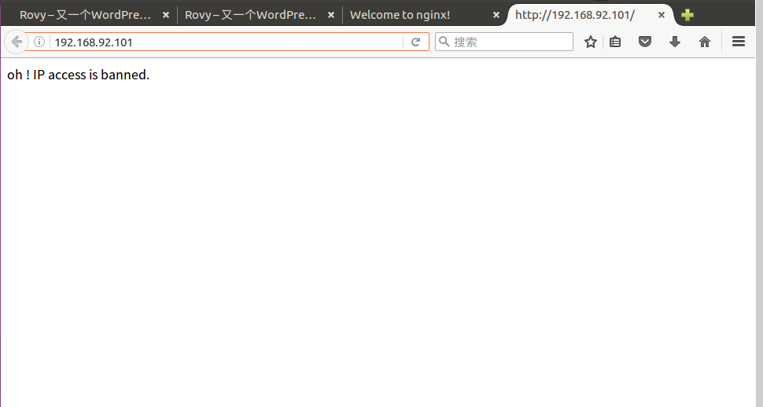
   * Damn Vulnerable Web Application (DVWA)只允许白名单上的访客来源IP，其他来源的IP访问均向访客展示自定义的友好错误提示信息页面-2
     * 通过添加以下规则实现 
          * Matcher 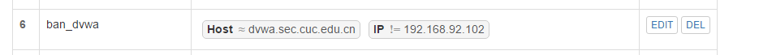
          * filter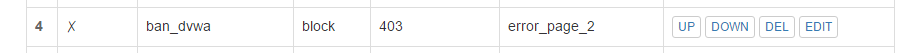
          * Response 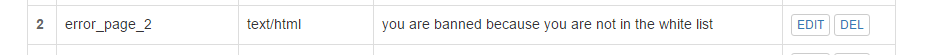
     * 实现效果
      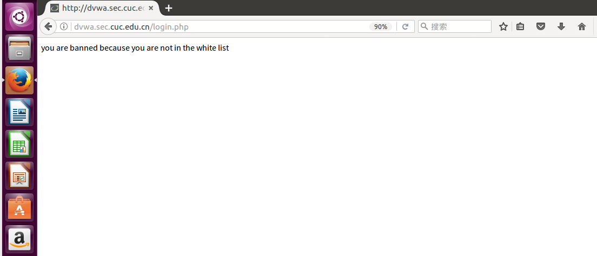

    * 在不升级Wordpress版本的情况下，通过定制VeryNginx的访问控制策略规则，热修复[WordPress < 4.7.1 - Username Enumeration](https://www.exploit-db.com/exploits/41497/)
     * 通过添加以下规则实现 
          * Matcher 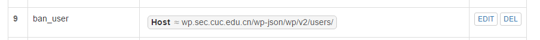
          * filter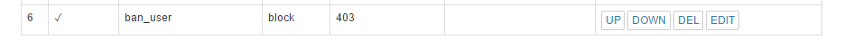
    * 通过配置VeryNginx的Filter规则实现对Damn Vulnerable Web Application (DVWA)的SQL注入实验在低安全等级条件下进行防护
      *  先把DVWA安全保护级别改为low
      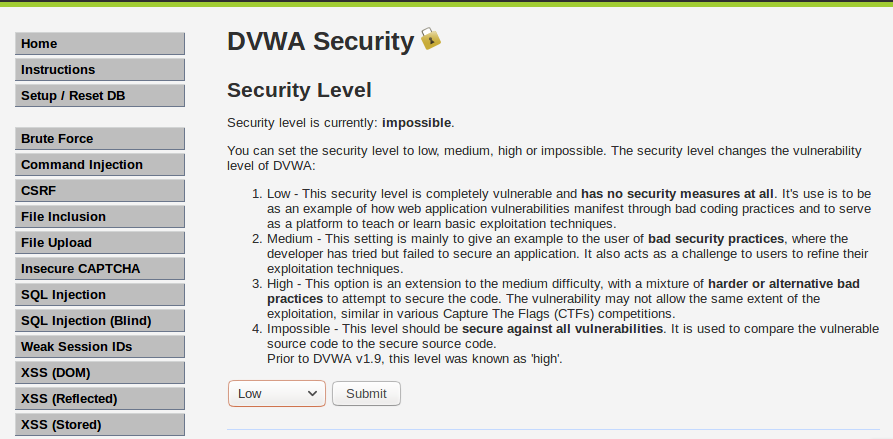 
      *  进行sql注入实验 
        
      * 添加以下规则
          *  Matcher  
          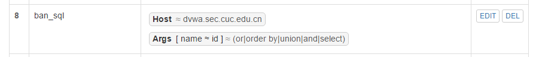
          * filter
          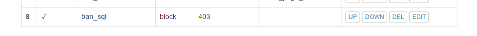
      * 实现效果
      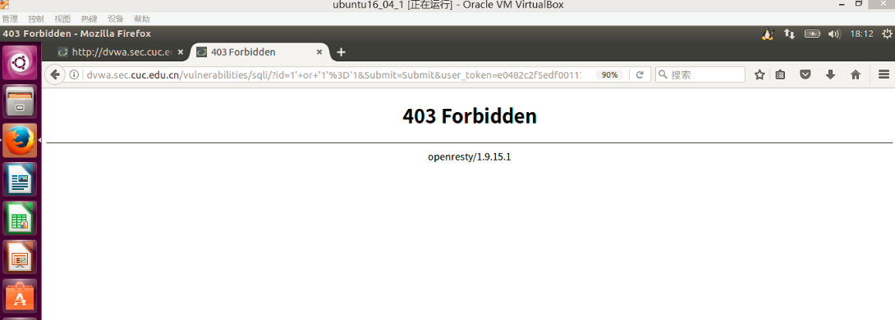
* **VeryNginx配置要求**
  *  通过定制VeryNginx的访问控制策略规则实现：
     * 限制DVWA站点的单IP访问速率为每秒请求数 < 50
     * 限制Wordpress站点的单IP访问速率为每秒请求数 < 20
           * Frequency Limit 
            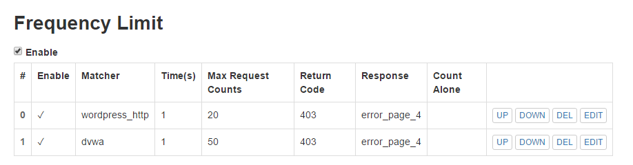
           * 使用脚本进行测试，脚本内容如下所示
            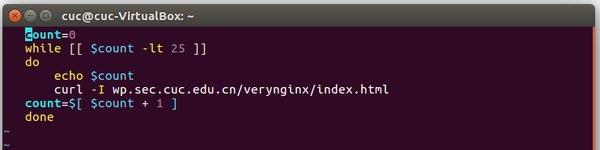
           * 完成效果，通过下图可以看出当访问速率低于20的时候，对WordPress站点的访问还是可以进行的，一旦 >= 20便禁止访问，并提示403 Forbidden
            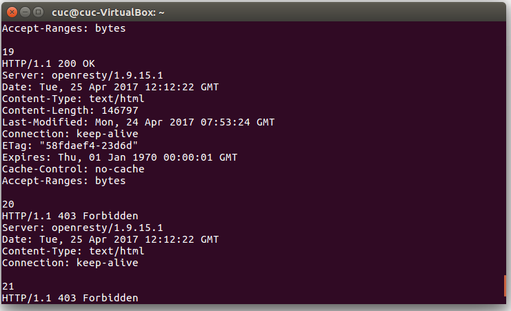
     * 禁止curl访问
         * Matcher
         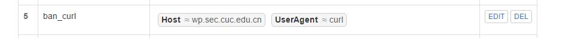
         * Response
         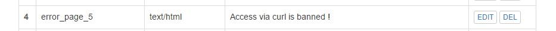
         * 完成效果
         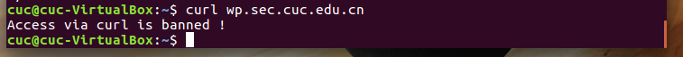

* **遇到的问题**
   * 在进行热修复[WordPress < 4.7.1 - Username Enumeration](https://www.exploit-db.com/exploits/41497/)漏洞的时候,访问wp.sec.cuc.edu.cn/wp-json/wp/v2/users/,没法实现漏洞的复现，所以做实验的时候只是添加了控制规则，并没有实现效果
   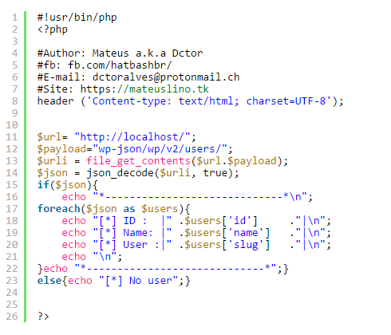
   * 其他遇到的一些小问题忘了记录下来但是通过上面说的注意事项出现的小问题大致可以解决。
   

* **主要参考链接**
  

     [VeryNginx安装教程](https://github.com/alexazhou/VeryNginx/blob/master/readme_zh.md)

     [LEMP配置教程](https://www.digitalocean.com/community/tutorials/how-to-install-linux-nginx-mysql-php-lemp-stack-in-ubuntu-16-04)

     [wordpress安装教程](https://www.digitalocean.com/community/tutorials/how-to-install-wordpress-with-lemp-on-ubuntu-16-04)

     [nginx 自签发证书制作](https://www.digitalocean.com/community/tutorials/how-to-create-an-ssl-certificate-on-nginx-for-ubuntu-14-04)

     [DVWA安装教程](https://github.com/ethicalhack3r/DVWA)

     [tjy搭建web服务器实验报告](https://github.com/CharleneTan/linux/blob/master/2017-1/TJY/webserver/webserver.md)
     
     [tzw搭建web服务器实验报告](https://github.com/maskerwind/linux/blob/master/2017-1/tzw/chapter5/web%E6%90%AD%E5%BB%BA%E5%AE%9E%E9%AA%8C%E6%8A%A5%E5%91%8A.md)
    