# 网络资源共享_服务器手动配置流程

----
## 一，实验要求
  * FTP
     *  对照第6章课件中的要求选择一款合适的FTP服务器软件支持所有任务要求，在本实验中选取的服务器软件为proftpd 
  * NFS
     *  对照第6章课件中的NFS服务器配置任务
  * DHCP
     *  2台虚拟机使用Internal网络模式连接，其中一台虚拟机上配置DHCP服务，另一台服务器作为DHCP客户端，从该DHCP服务器获取网络地址配置2台虚拟机使用Internal网络模式连接，其中一台虚拟机上配置DHCP服务，另一台服务器作为DHCP客户端，从该DHCP服务器获取网络地址配置
  * Samba
     *  对照第6章课件中smbclient一节的3点任务要求完成Samba服务器配置和客户端配置连接测试
  * DNS
     * 基于上述Internal网络模式连接的虚拟机实验环境，在DHCP服务器上配置DNS服务，使得另一台作为DNS客户端的主机可以通过该DNS服务器进行DNS查询
     * 在DNS服务器上添加 zone "cuc.edu.cn" 的以下解析记录   

## 二，实验流程
## **FTP** 
* 安装软件（proftpd）
 *  sudo apt-get update
 *  sudo apt-get install proftpd 
* 功能点
      * 配置一个提供匿名访问的FTP服务器，匿名访问者可以访问1个目录且仅拥有该目录及其所有子目录的只读访问权限； 
           * 实现效果 
          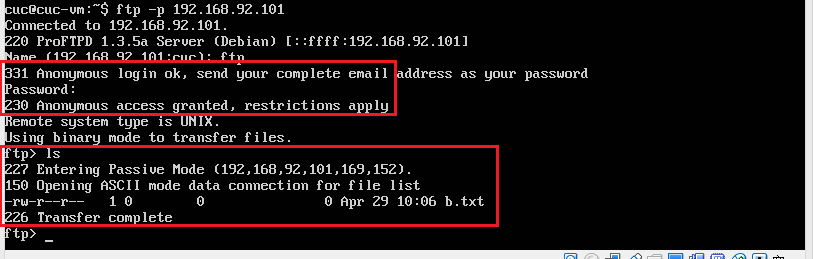
           * 具体步骤
             * 第一步，编辑 /etc/proftpd目录下的proftpd.conf文件
                   * sudo vim  /etc/proftpd/proftpd.conf  
                   * 添加以下内容
                   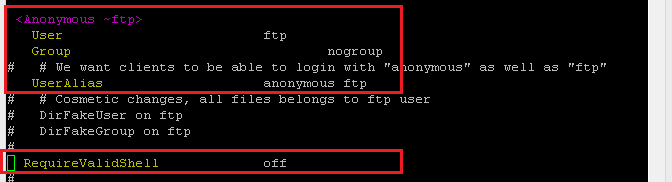
                   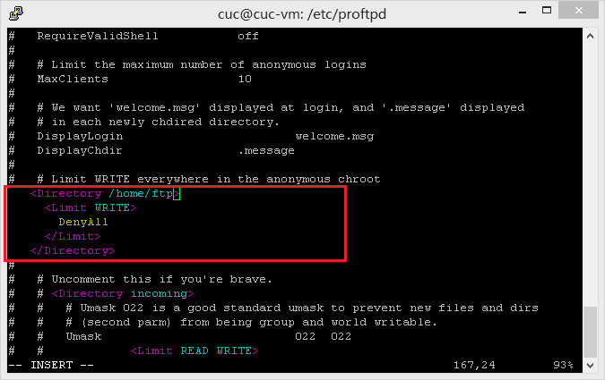
             * 第二步
                  * 创建共享文件夹
                      * sudo mkdir ftp  
                  * 更改用户共享目录
                     * sudo chown -R ftp:nogroup /home/ftp 
                     * sudo usermod -d /home/ftp ftp
 
      * 配置一个支持用户名和密码方式访问的账号，该账号继承匿名访问者所有权限，且拥有对另1个独立目录及其子目录完整读写（包括创建目录、修改文件、删除文件等）权限（该账号仅可用于FTP服务访问，不能用于系统shell登录）
          *  实现效果 
             *  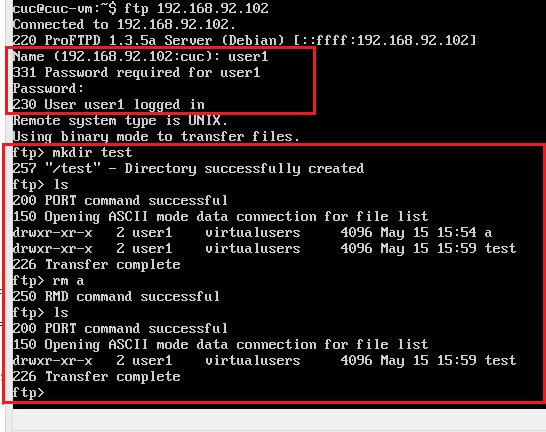  
             *   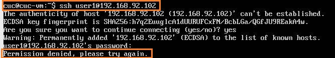  
          *  具体步骤
             *  第一步， 编辑 /etc/proftpd目录下的proftpd.conf文件
                  * sudo vim  /etc/proftpd/proftpd.conf 
                  * 添加以下内容   
           
	                > PersistentPasswd off
	                > AuthUserFile /usr/local/etc/proftpd/passwd
	                > AuthGroupFile /usr/local/etc/proftpd/group
	                
                    > AuthOrder mod_auth_file.c mod_auth_unix.c

	                 > RequireValidShell off
          
             * 第二步，新建passwd和group文件夹
                  *  先创建一个名为user1的目录
                      * sudo mkdir user1
                  *  再创建两个用户user1和user2
                      * sudo ftpasswd --passwd --file=/usr/local/etc/proftpd/passwd --name=user1 --uid=1024 --home=/home/user1 --shell=/bin/false
                  *  创建一个用户组virtualusers
                      * sudo ftpasswd --file=/usr/local/etc/proftpd/group --group --name=virtualusers --gid=1024
                  *  将创建的两个用户添加到新创建的用户组virtualusers
                      * sudo ftpasswd --group --name=virtualusers --gid=1024 --member=user1 --member=user2 --file=/usr/local/etc/proftpd/group  
               * 第三步，修改权限，改变指定目录以及对其子目录下的所有文件的权限
                  * sudo chown -R 1024:1024 /home/user1
                  * sudo chmod -R 700 /home/user1           
      ### FTP用户不能越权访问指定目录之外的任意其他目录和文件 
      *  编辑 /etc/proftpd目录下的proftpd.conf文件
             
        * sudo vim  /etc/proftpd/proftpd.conf 
                  
      * 添加以下内容
                  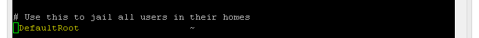 
  
                 
      * 匿名访问权限仅限白名单IP来源用户访问，禁止白名单IP以外的访问
          *   实现效果
             *  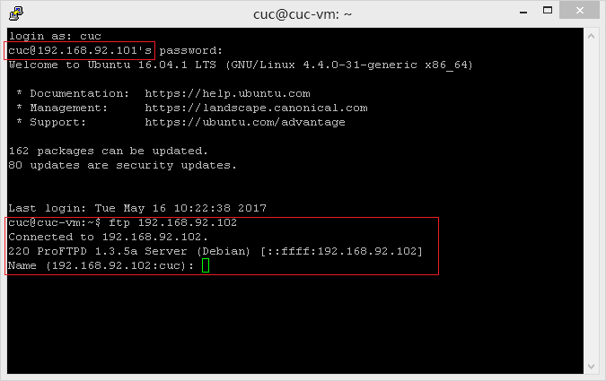 
              
          *  具体步骤
             *  编辑 /etc/proftpd目录下的proftpd.conf文件
                  * sudo vim  /etc/proftpd/proftpd.conf 
                  * 添加以下内容，即IP在白名单中的192.168.92.101可以对ftp服务器进行访问，白名单外的IP不能访问
                  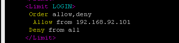
 

* **NFS**   
   *  在1台Linux上配置NFS服务，另1台电脑上配置NFS客户端挂载2个权限不同的共享目录，分别对应只读访问和读写访问权限      

   *  Host
      *  IP：192.168.92.101 
      *  配置NFS服务
         * sudo apt-get update
         * sudo apt-get install nfs-kernel-server 
      *  创建一个用于挂载的（可读写）文件夹
         *  sudo mkdir /var/nfs/general -p
         *  sudo chown nobody:nogroup /var/nfs/general
      *  修改/etc/exports文件（即NFS服务的主要配置文件）
         *  /var/nfs/general 192.168.92.102(rw,sync,no_subtree_check)   
         *  /home 192.168.92.102(sync,no_root_squash,no_subtree_check)  
    *  Client
      *  IP：192.168.92.102
      *  配置NFS服务
         *  sudo apt-get update
         *  sudo apt-get install nfs-common 
      *  创建相应的挂载文件
         *  sudo mkdir -p /nfs/general
         *  sudo mkdir -p /nfs/home
      *  挂载文件夹
         *   sudo mount 192.168.92.101:/var/nfs/general /nfs/general 
         *   sudo mount 192.168.57.7:/home /nfs/home
             *  【注意事项】，在进行挂载的时候，可能会出现如下问题，是因为NFS服务尚未启动
             *    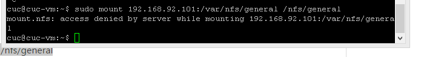         
             * 所以在执行前启动NFS服务
                   *  sudo service nfs-kernel-server restart

* **Samba**
* 
Server：Linux & Client：Windows
      *  server
         *  下载安装Samba
            *   sudo apt-get update
            *   sudo apt-get install samba
         *  创建Samba共享用户
            *   sudo useradd -M -s /sbin/nologin 用户名
            *   sudo passwd 用户名
         *  创建和Samba共享用户同名的linux 用户
            *   sudo smbpasswd -a 用户名           
         *  在 samba配置文件，即/etc/samba/smb.conf 文件尾部添加以下配置，guest为匿名用户可以访问的目录（不可写），demo为虚拟用即户才能访问的目录（可读写） 
           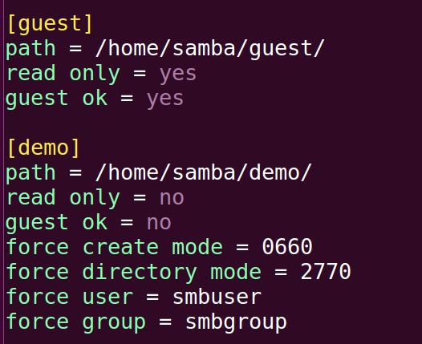 
         *   恢复一个samba用户
             * smbpasswd -e smbuser  
         *   创建用户组
            *  sudo groupadd smbgroup
            *  sudo usermod -G smbgroup smbuser
         *  创建共享文件夹和更改用户组
            *  mkdir -p /home/samba/guest/
            *  mkdir -p /home/samba/demo/
            *  sudo chgrp -R smbgroup /home/samba/guest/   #改变目录文件所属的用户组
            *  sudo chgrp -R smbgroup /home/samba/demo/
            *  sudo chmod 2775 /home/samba/guest/   #修改共享目录权限
            *  sudo chmod 2770 /home/samba/demo/
         * 启动Samba服务
            * smbd
      *  client
         *  下载安装Samba
            *   访问需要用户名密码的可读写文件：\\192.168.92.101\demo
              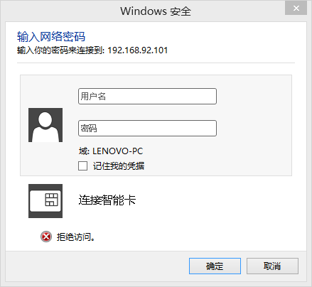 
              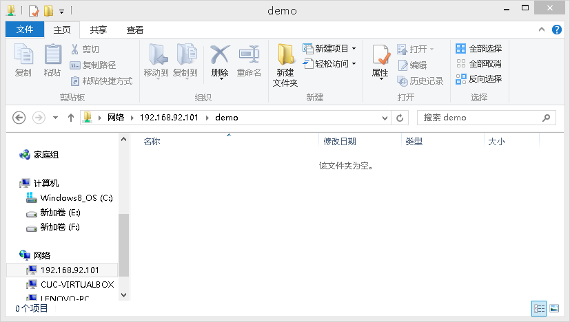 
            *   Linux设置匿名访问共享目录
              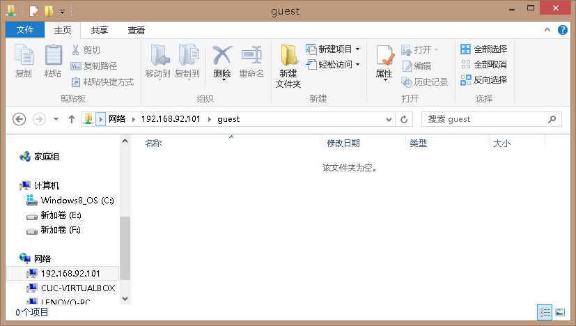 
* **ＤＨＣＰ**
     *  具体步骤
           *  编辑 server的/etc/network/interfaces文件，添加以下内容
                        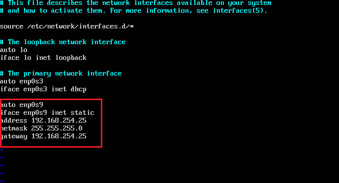    
           *  编辑server的/etc/default/isc-dhcp-server文件，添加以下内容　　　　　　　　　　 
                  INTERFACES="enp0s9"
           *  编辑server的/etc/dhcp/dhcpd.conf文件，添加以下内容
           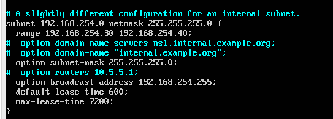

* **DNS**
      * 　实现效果 
          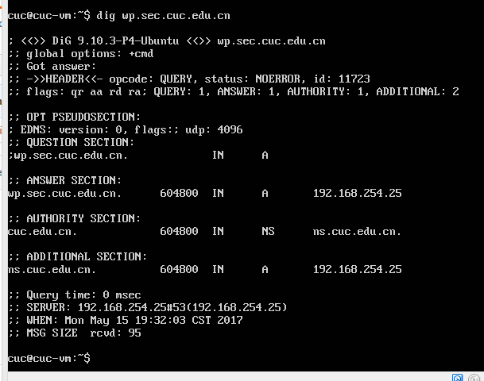
          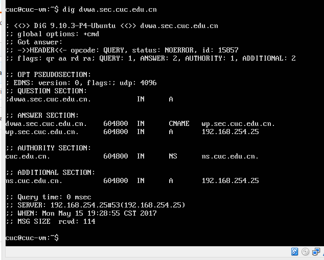
 ##　具体步骤
      *  server
         *  下载安装bind9
            *   sudo apt-get update
            *   sudo apt-get install bind9
         *  编辑 /etc/bind/named.conf.local文件，添加下面内容
                        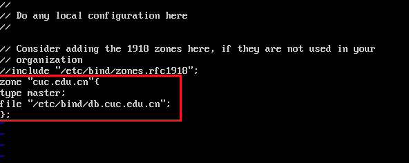
         * 创建ｄｂ文件 
            *   sudo cp /etc/bind/db.local /etc/bind/db.cuc.edu.cn
         *  编辑 /etc/bind/db.cuc.edu.cn文件，添加下面内容
                        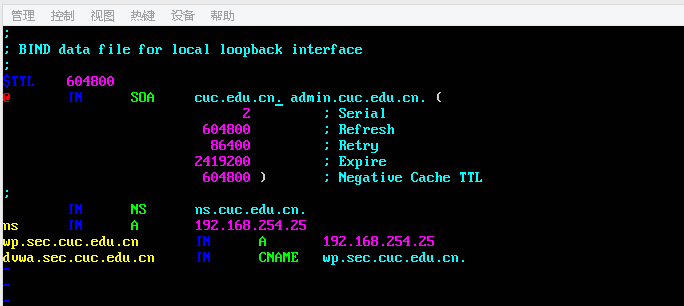 
         *　启动服务 
            *   sudo service bind9 start 
      *  client
         *  编辑 /etc/resolvconf/resolv.conf.d/head文件，添加下面内容
                        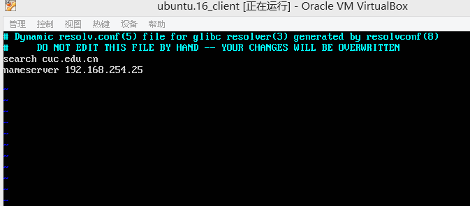
         * 更新resolv.conf文件
            *  sudo resolvconf -u
   

##　三，实验主要参考链接

   [ｔｊｙ实验六报告](https://github.com/CharleneTan/linux/blob/master/2017-1/TJY/%E7%BD%91%E7%BB%9C%E8%B5%84%E6%BA%90%E5%85%B1%E4%BA%AB/%E7%BD%91%E7%BB%9C%E8%B5%84%E6%BA%90%E5%85%B1%E4%BA%AB.md)

[ｃｙｘ实验六报告](https://github.com/FitzBC/linux/blob/master/2017-1/FitzBC/%E5%AE%9E%E9%AA%8C6/%E5%AE%9E%E9%AA%8C%E6%8A%A5%E5%91%8A6_20170416.md)

[ｔｚｗ实验六报告](https://github.com/maskerwind/linux/blob/master/2017-1/tzw/chapter6-7/%E6%89%8B%E5%8A%A8%E9%85%8D%E7%BD%AE%E8%AE%B0%E5%BD%95.md)

[Setting Up an NFS Mount on Ubuntu 16.04](https://www.digitalocean.com/community/tutorials/how-to-set-up-an-nfs-mount-on-ubuntu-16-04)

[Setting up Samba as a Standalone Server](https://wiki.samba.org/index.php/Setting_up_Samba_as_a_Standalone_Server)

[Configure BIND as a Private Network DNS Server on Ubuntu 14.04](https://www.digitalocean.com/community/tutorials/how-to-configure-bind-as-a-private-network-dns-server-on-ubuntu-14-04)