# 无人值守Linux安装镜像制作  
## 实验目的 
- 无人值守的Linux安装镜像制作   
- 定制用户名和默认密码 
- 定制安装OpenSSH Server  
- 安装过程禁止自动联网更新软件包  

## 实验环境  
- Virtualbox
- ubuntu16.04.1-server-amd64  

## 实验过程 
- 1. 将实验用主机添加第二块网卡，为host-only模式 
- 2. 进入实验机启用网卡，并用dhclient获取IP地址 
- 3. 使用putty远程连接主机
- 4. 使用psftp将iso文件上传目标主机(put 命令)
- 5. 根据实验指导进行挂载镜像文件和克隆光盘  
[实验指导](https://sec.cuc.edu.cn/huangwei/course/LinuxSysAdmin/chap0x01.exp.md.html#/6/2)    
目录结构如下图所示:  
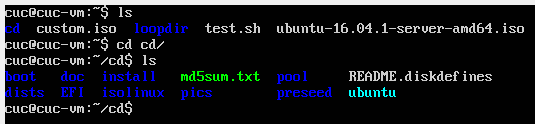  
- 6. 修改isolinux/txt.cfg  
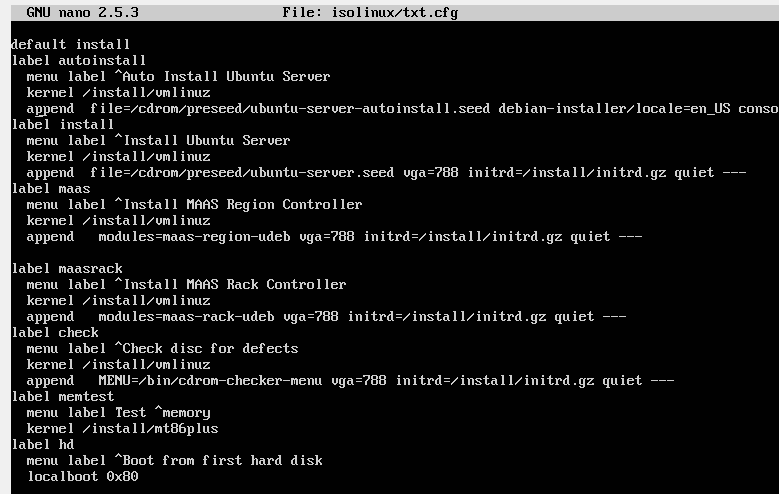  
将内容添加到default install 后面  
- 7. 将配置好的ubuntu-server-autoinstall.seed移入到指定路径下  
- 8. 修改isolinux.cfg的timeout 重新计算md5sum  
- 9. 按照指令重新封装iso镜像  
- 10. 用psftp get命令导出镜像，即可在vbox中安装  

## 实验中遇到的问题及其解决 
1.对于实验过程4，虚拟机与真机的传输多样化，最开始采用的是安装增强功能共享文件夹的方式 
其中涉及到gcc make的安装，镜像或共享文件夹的挂载等  

解决方法 参考链接 
[http://jingyan.baidu.com/article/b2c186c8ffb607c46ff6ff61.html](http://jingyan.baidu.com/article/b2c186c8ffb607c46ff6ff61.html)  

2.实验过程5-9中出现权限问题可以用sudo解决，有的未安装的软件，可以直接apt-get install  
md5sum.txt修改时先用chmod 命令修改其权限后可以使命令正确运行  

3.对与实验过程6 注意添加 label的位置应该在前面  

## 实验细节补充  
通过使用[文本对比工具](http://mergely.com/editor)可以观察自定义的autoinstall.seed与官网给的区别：   
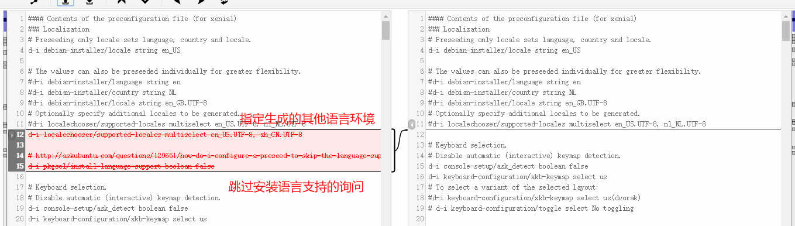    
  
---   

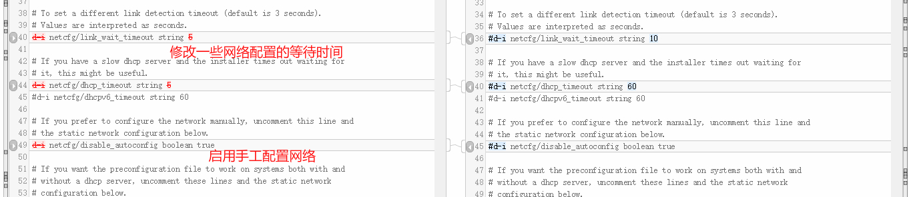  
  
---  

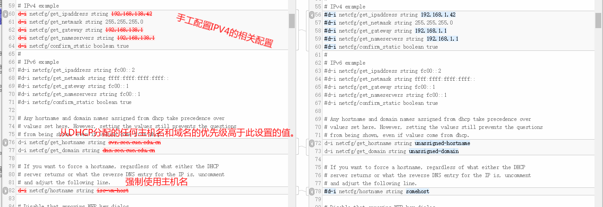   

---  
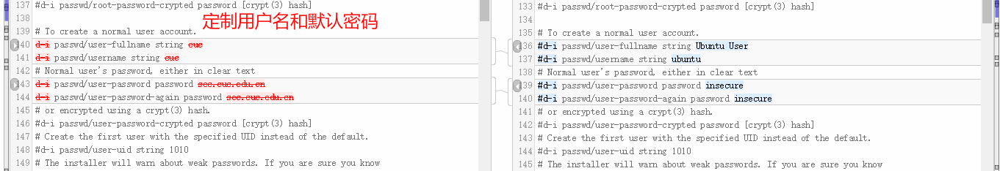  

---
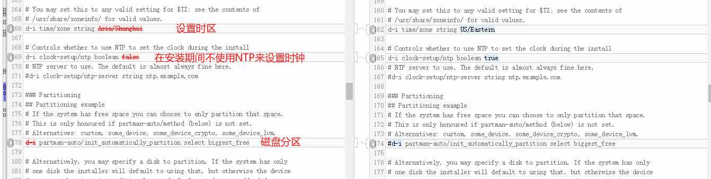  
  
---
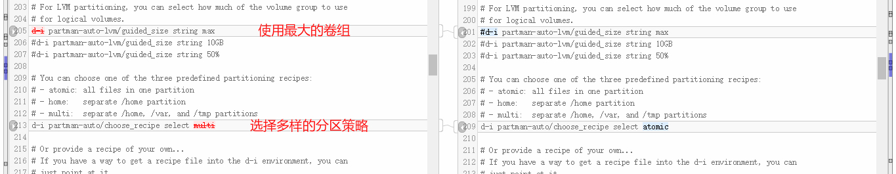  

---  
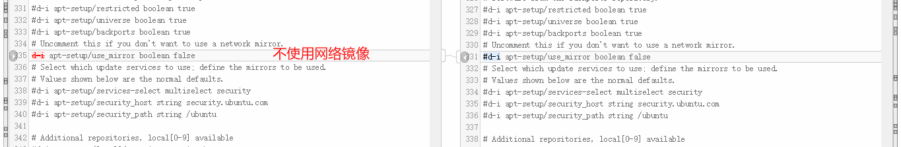  
 
---  
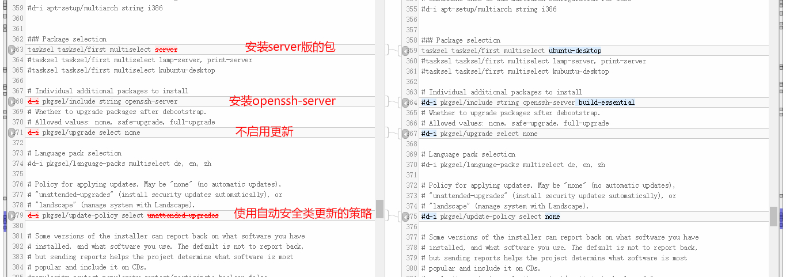
  

参考链接：  
[https://help.ubuntu.com/lts/installation-guide/armhf/apbs04.html](https://help.ubuntu.com/lts/installation-guide/armhf/apbs04.html)  

## 实验问题及其解答   
1.如何配置无人值守安装iso并在Virtualbox中完成自动化安装。  

关键是txt.cfg添加新的label选项，并且在seed文件中添加自定义的特性安装配置  

2.Virtualbox安装完Ubuntu之后新添加的网卡如何实现系统开机自动启用和自动获取IP？   

  修改 /etc/network/interfaces  

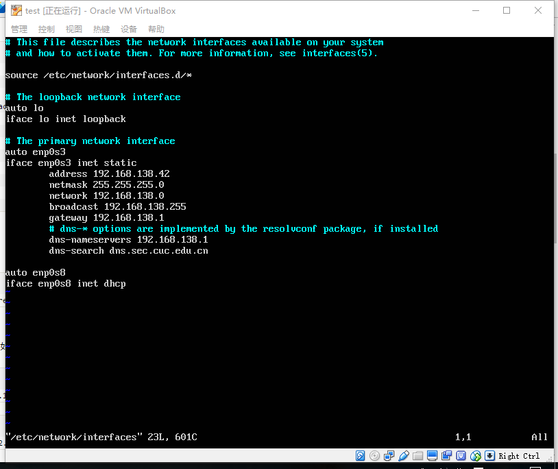  
之后重新载入网卡配置文件  
> sudo /etc/init.d/networking restart  

3.如何使用sftp在虚拟机和宿主机之间传输文件？  

  当虚拟机开启了SSH后，宿主机可以使用psftp连接，使用get/up来下载或上传文件   
  
## git操作  
参考链接:  

[Git-教程 廖雪峰的官方网站](http://www.liaoxuefeng.com/wiki/0013739516305929606dd18361248578c67b8067c8c017b000)  

## 问题  
为什么安装无人值守的Linux中，刚进入安装界面仍会弹出选择语言的情况，并且覆盖了后面的安装选择label  
  
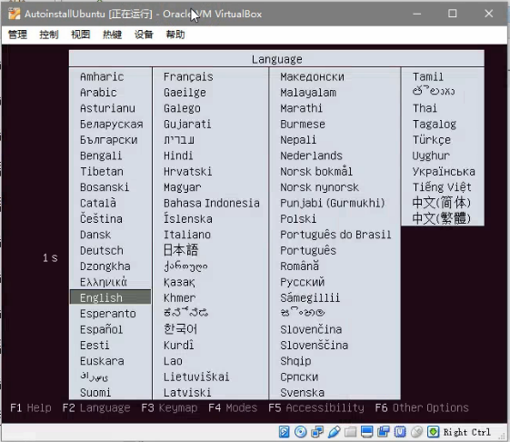
