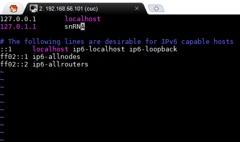

# systemd   
----   
  
URL：   

[命令篇1-4](https://asciinema.org/a/3qfkymkg3d52m6ec2mfpl0cpm)  
[命令篇5-7](https://asciinema.org/a/dvnln31xn9hiq1zgrthmzdzjh)   
[实战篇](https://asciinema.org/a/74ynipc4xtjx2cutovglt6e3n)   
  
对于其中出现的使用hostnamectl更改主机名后sudo 提示 unable to resolve host 的解决方法：   

修改/etc/hosts文件   127.0.0.1 [hostname]   
  
