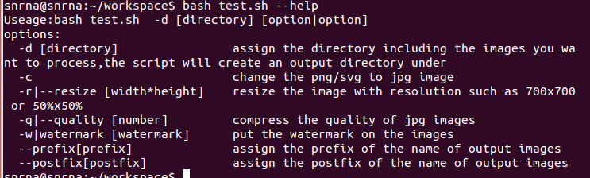
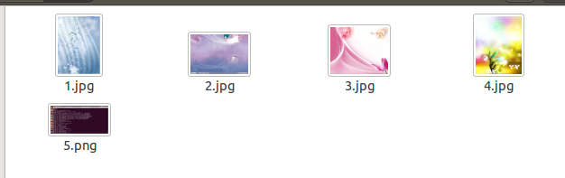
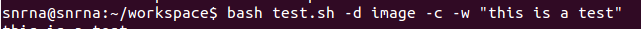
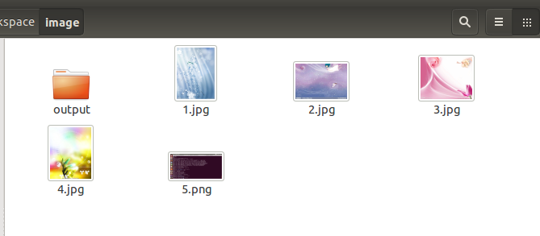
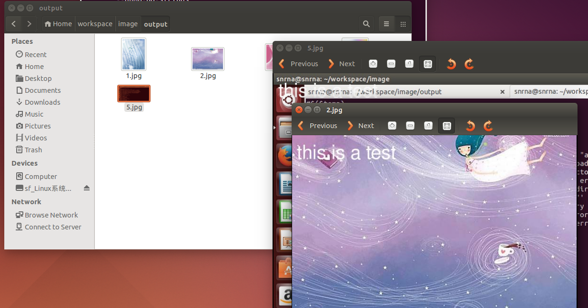
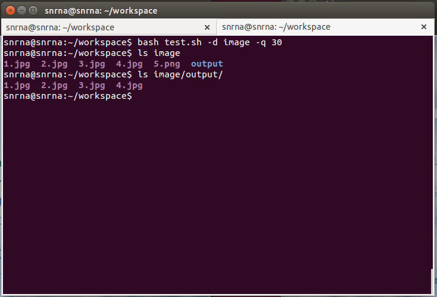
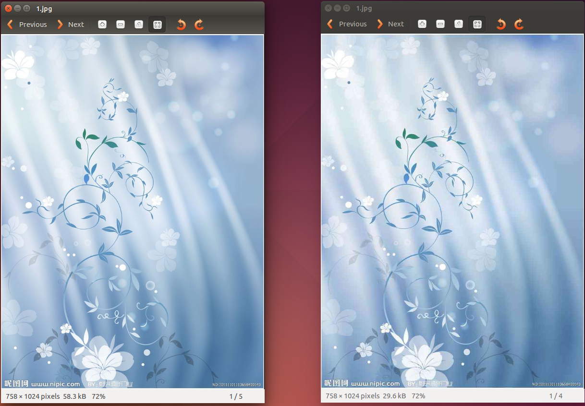
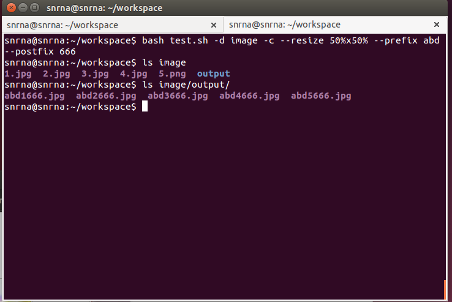
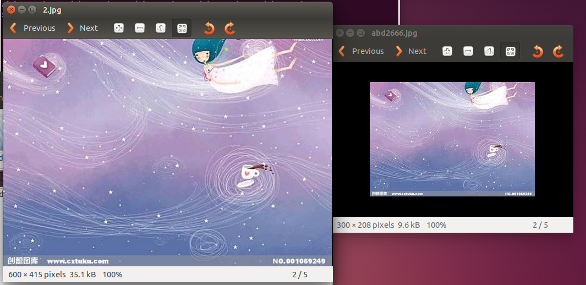

# 任务一 实验报告  
 
----  
 
## [实验要求](https://sec.cuc.edu.cn/huangwei/course/LinuxSysAdmin/chap0x04.exp.md.html#/2)   
  
## 实验思路   
  
- 使用getopt和循环处理多参数和长参数的情况  
- 设置不同的flag来判断参数是否被使用开启
- 根据flag进行命令参数的拼接和修改文件类型的范围
- 通过find命令找到指定目录下面的图片
- 使用for循环遍历图片集合进行处理。   
  
## 实验结果 

#### help界面  
    
需指定目录"-d directory" 进行图片的批处理  

  
#### 多参数使用  
  
测试图片如下：  
  
  
使用命令   进行水印的添加以及png图片的转换

   
  
指定目录下产生output目录 

  
添加水印的效果，并进行png文件转成jpg文件  
   
执行对jpeg文件进行图片质量压缩，png图片会跳过  
  
质量压缩的结果 图片质量发生变化，大小也会改变  
  
转换图片 进行保持高宽比的分辨率压缩，并在生成的图片名中统一添加前缀或后缀  
  
  
图片的名字添加了统一的前后缀，并且分辨率发生了变化但是高宽比没有发生改变。  
   
 
## 实验待改进的地方   
 
参数的出错处理没有做到完善  
必须指定目录，否则默认使用当前目录  
