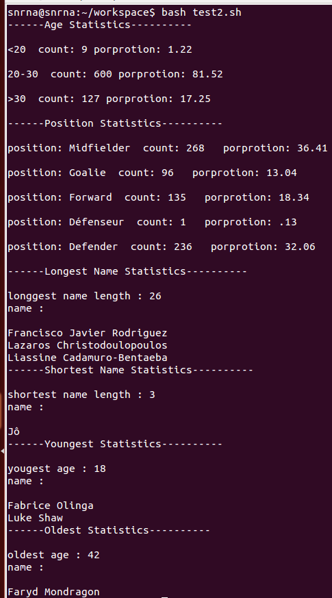
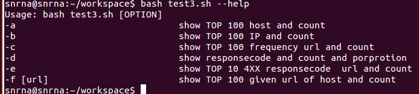
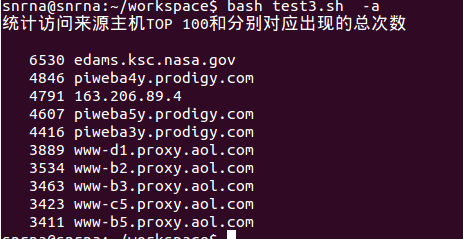
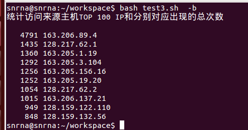
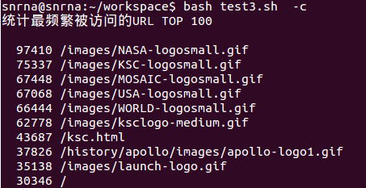
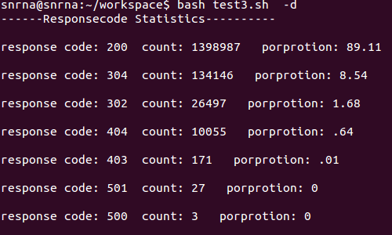
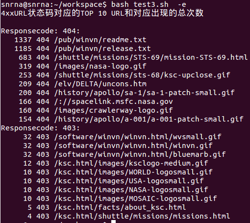
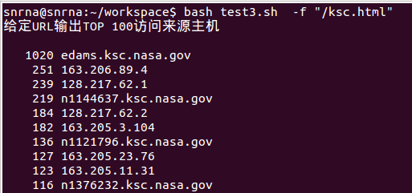

# 任务二 实验报告  
 
----  
 
## [世界杯球员统计实验要求](https://sec.cuc.edu.cn/huangwei/course/LinuxSysAdmin/chap0x04.exp.md.html#/3)  

## [服务器日志统计实验要求](https://sec.cuc.edu.cn/huangwei/course/LinuxSysAdmin/chap0x04.exp.md.html#/4)   
  
## 实验思路   
  
- 使用cat、more等命令读取文件  
- 使用管道操作将上一次命令的输出结果
- 使用grep 或者awk 对数据进行依据行或列的相关规则进行匹配和相关的统计
- 使用sort 进行排序
- 使用uniq 进行统计
- 使用head 命令输出前几行
  
## 实验结果 

#### 世界杯球员统计

  
#### 服务器日志统计 
  
help帮助信息  

  
  
统计访问来源主机TOP100并计数

   
  
统计访问来源主机TOP100IP并计数 

  
统计最频繁访问的TOP100 URL  
   
各种响应码的计数和百分比   
  
4XX状态码的对应TOP 10 和URL  
  
给定指定的URL 输出TOP 100访问来源主机  
  
    
 
## 实验待改进的地方   
 
输出的形式没有进一步的优化  
test2中使用了很多的重复代码
