# 实验五  搭建高级的Web服务器   
  
-----   
  
## [实验要求](https://sec.cuc.edu.cn/huangwei/course/LinuxSysAdmin/chap0x05.exp.md.html#/2/1)   
  
## 实验步骤 
  
### 安装过程   
   
#### 安装verynginx  
  
* 根据[官方文档](https://github.com/alexazhou/VeryNginx/blob/master/readme_zh.md)安装verynginx
* 根据报错安装pcre、libssl、bulid_essential  
* 修改nginx.conf中的user改为www-data 
* 签发ssl证书  

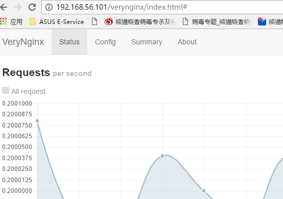
  
#### 安装wordpress  
  
* 修改nginx配置文件，使其监听127.0.0.1:8080 和 127.0.0.1:4433
* 根据[参考资料](https://www.digitalocean.com/community/tutorials/how-to-install-wordpress-with-lemp-on-ubuntu-16-04)安装LEMP环境  
* 安装wordpress并签发ssl证书   
  
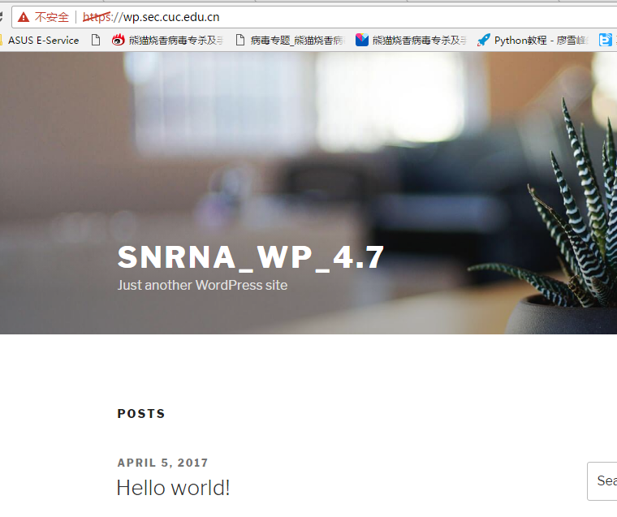
   
#### 安装DVWA   
  
* 修改nginx配置文件，使其监听127.0.0.1:5566
* 根据[官方github](https://github.com/ethicalhack3r/DVWA)安装   
  
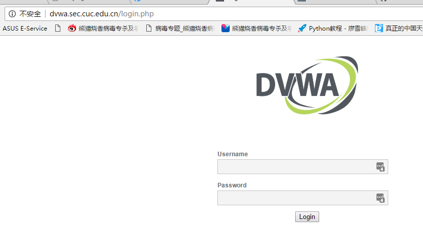   
  
-----  
  
#### 相关加固要求的实现   
  
原理：  
根据不同访问的特征定义不同的规则(matcher)，用来匹配行为，然后对于不容的matcher进行不同处理（filter、redirect等），给予不同的可定制的响应。最后都是以json的形式存储在/opt/verynginx/verynginx/configs目录下   
  

1.使用matcher和upstream和proxypass 进行反向代理  
  
    
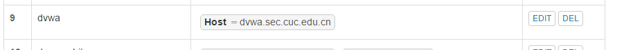  
  
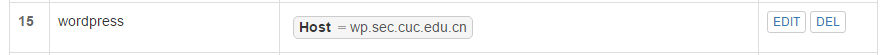
  
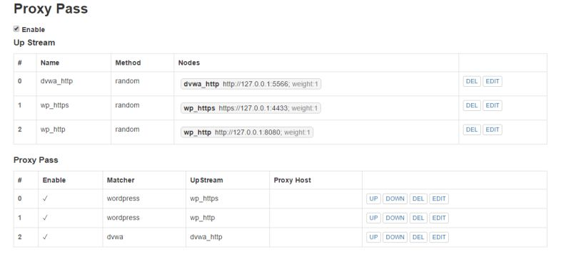   

限制IP  
  
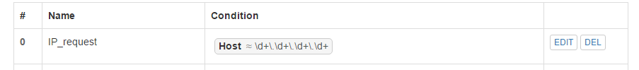    
  
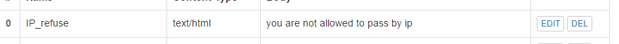  

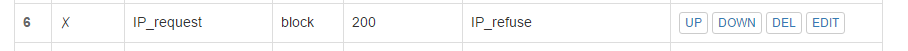  
  
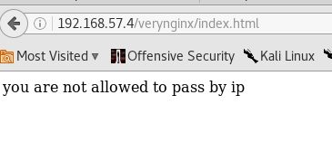  

DVWA的只允许白名单访问  
  
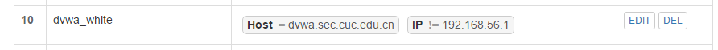
 
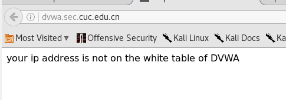  
  
Verynginx 只允许白名单访问  
  
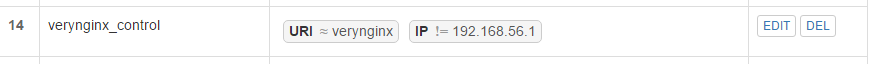

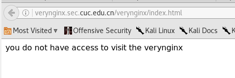  
  
   
控制站点的访问的速率  
  
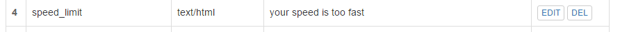  
  
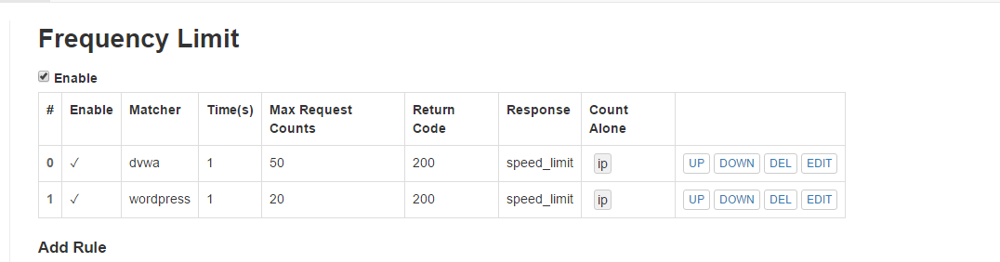  
  
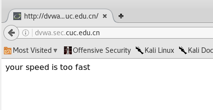

禁止curl 访问   

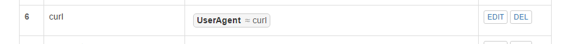   
  
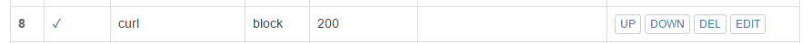  
  
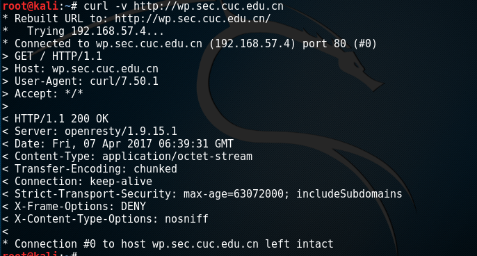    

 
针对DVWA的SQL注入实验低安全等级下的防护   
 
匹配参数中出现的特殊敏感字符如order、union、select、from等  
  
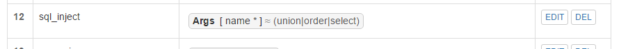  

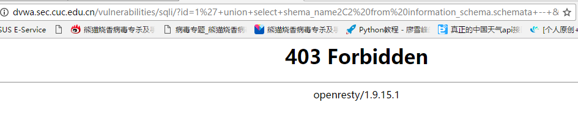    
  
针对wordpress的漏洞的热修复 
 
热修复的思路，访问指定的Url(wp-json)时，检查cookie中是否有wordpress_logged_inxxx字段（已登录的用户会存在此cookie）  
  
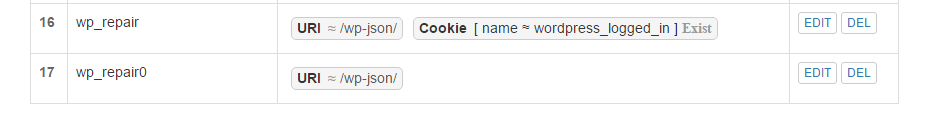  
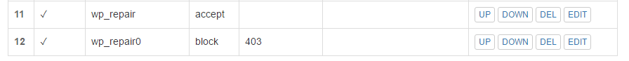  

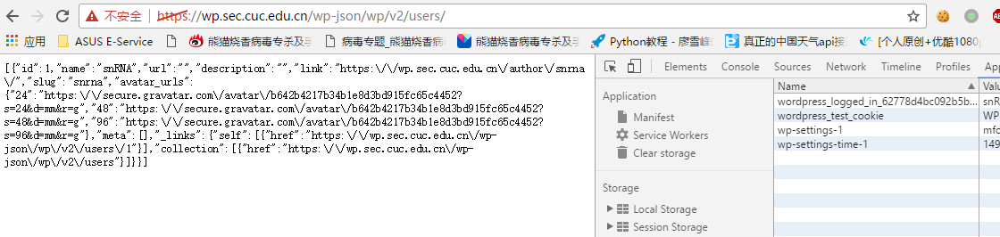  
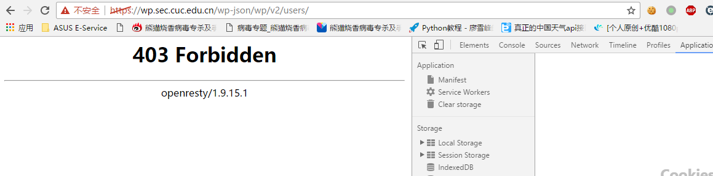  
   

 
## 说明  
configs文件夹中包含配置文件  

[verynginx中的规则过滤等的配置](configs/config.json)  
[openresty的nginx配置](configs/nginx.conf)  
[sites-available中wp.sec.cuc.edu站点配置](configs/default)  
[sites-available中dvwa.sec.cuc.edu站点配置](configs/dvwa) 