# 实验六 shell脚本编程练习进阶  
## FTP、NFS、DHCP、DNS、Samba服务器的自动安装与自动配置    

### [实验要求](https://sec.cuc.edu.cn/huangwei/course/LinuxSysAdmin/chap0x06.exp.md.html#/2/1)  
   
 
### 实验过程  
  
#### FTP  
 
根据实验要求(尤其是依据白名单匿名用户的访问)，采用proftpd  
 
> RequireValidShell off  #无shell登录用户可以使用ftp  
> <Limit LOGIN>   #实现IP白名单可以匿名访问  
> <Limit WRITE>   #限制写权限  
 
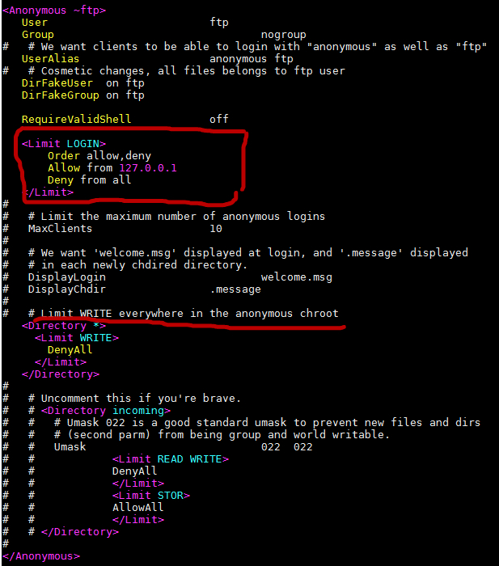
  
匿名登录和相关权限证明  
  
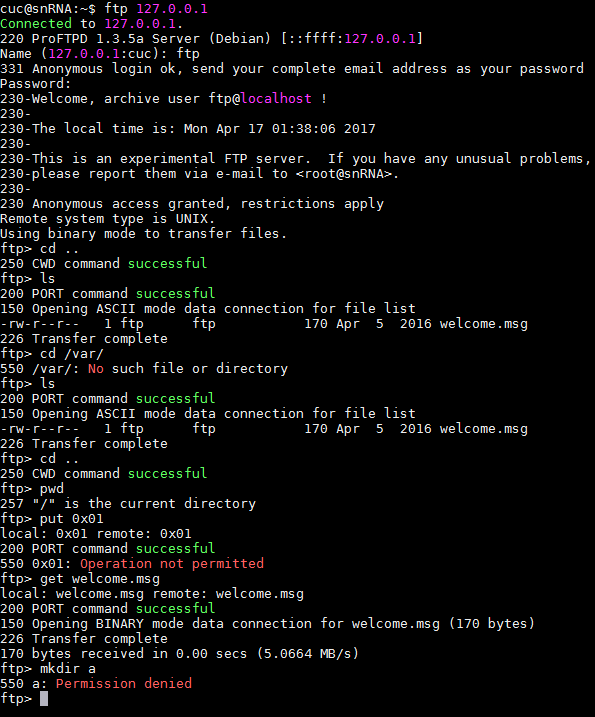   
  
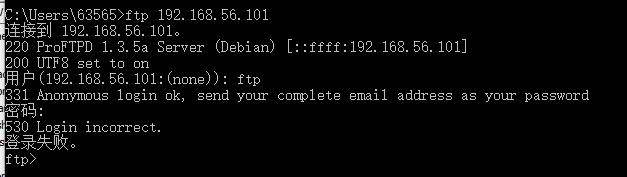  
  
虚拟用户配置  
  
* 修改proftpd.conf文件  
	> AuthOrder                       mod_auth_file.c mod_auth_unix.c    
	> AuthUserFile                    /usr/local/etc/proftpd/passwd  
	> AuthGroupFile                   /usr/local/etc/proftpd/group  
	> PersistentPasswd                off  
	> RequireValidShell              off   
	> DefaultRoot                     ~ 
* 创建用于认证用户和口令的文件   
  
    > 创建虚拟用户的本地ftp文件夹  
    > sudo mkdir /home/virtual  
    >   
    > 创建用户  
    > sudo ftpasswd --passwd --file=/usr/local/etc/proftpd/passwd --name=virtual --uid=1025 --home=/home/virtual --shell=/bin/false  
    > 创建virtualuser 用户组  
    > sudo ftpasswd --file=/usr/local/etc/proftpd/group --group --name=virtualusers --gid=1024  
    > 将用户virtual 加入到virtualuser 用户组  
    > sudo ftpasswd --group --name=virtualusers --gid=1024 --member=virtual --file=/usr/local/etc/proftpd/group  
  
虚拟用户登录和相关权限证明   
 
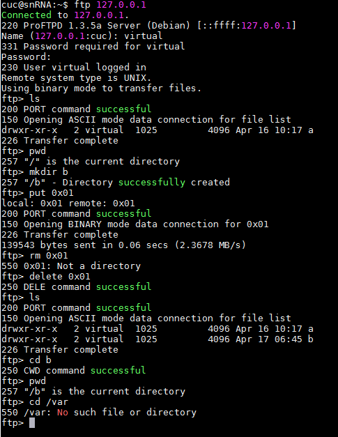   

#### NFS  
  
 
[参考链接 digitalocean](https://www.digitalocean.com/community/tutorials/how-to-set-up-an-nfs-mount-on-ubuntu-16-04)
  
HOST: 192.168.57.4  
CLIENT: 192.168.57.6  

* 只读文件和读写文件的配置  
  
	> /var/nfs/general    192.168.57.6(rw,sync,no_subtree_check)  
	> /home       192.168.57.6(sync,no_root_squash,no_subtree_check)    

读写和只读的验证与权限 
  
只读文件  

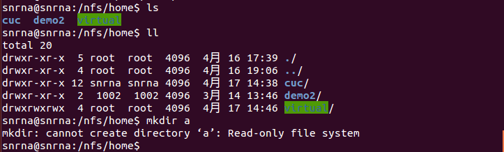   
  
读写文件  
  
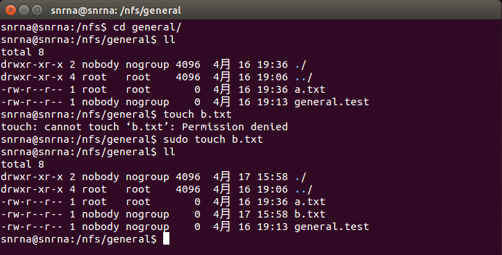  
  
原先在server中使用sudo 创建的文件，所属用户和用户组都为sudo，
但是使用NFS挂载后sudo 创建的文件，所属用户和用户组与当前文件夹的所属用户与用户组相同。  
  
参考链接中对于此的说明：  

> Because we mounted this volume without changing NFS’s default behavior and created the file as the client machine’s root user via the sudo command, ownership of the file defaults to nobody:nogroup. Client superusers won’t be able to perform typical administrative actions, like changing the owner of a file or creating a new directory for a group of users, on this NFS-mounted share.  
  
而如果添加了 no_root_squash参数，可以使用root 用户  
  
> We created home.test as root via the sudo command, exactly the same way we created the general.test file. However, in this case it is owned by root because we overrode the default behavior when we specified the no_root_squash option on this mount. This allows our root users on the client machine to act as root and makes the administration of user accounts much more convenient. At the same time, it means we don’t have to give these users root access on the host.  
  
 
#### samba   

- Server:Linux  Client:Windows  
 
修改配置文件smb.conf,追加共享目录的配置，分别设置目录guest为只读的匿名用户可访问的目录和目录demo使用虚拟账户(用户名和密码)可以进行读写的目录。   
  
	 [guest]  
        path = /srv/samba/guest/  
        read only = yes  
        guest ok = yes  
     [demo]
		path = /srv/samba/  
		read only = no  
		guest ok = no  
		force create mode = 0660  
        force directory mode = 2770  
        force user = smbuser  
        force group = smbgroup    
   
匿名访问目录只可读不可写  

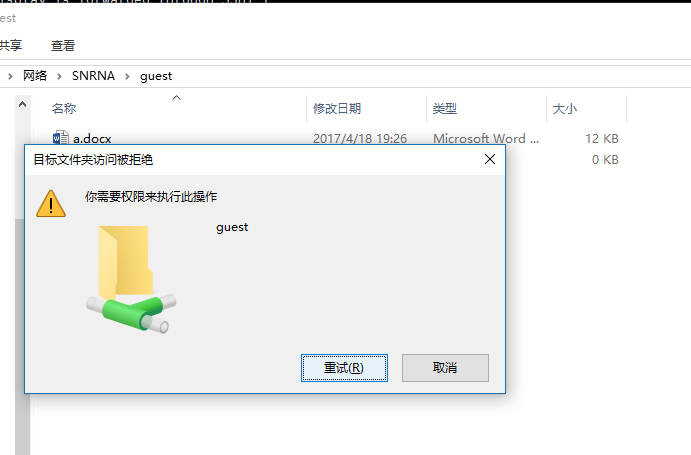    
  
  
- Server：Windows  Client：Linux   
 
 
Windows设定指定目录为共享  
  
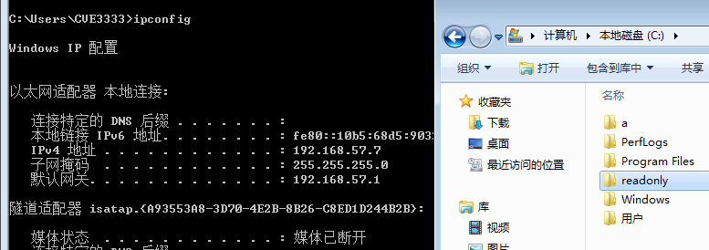  
  
  
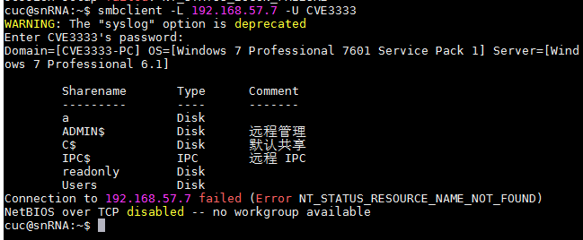  
 
下载整个文件夹  
  

 
 
[参考链接](https://wiki.samba.org/index.php/Setting_up_Samba_as_a_Standalone_Server)
 

#### DHCP   
  
配置server端的/etc/network/interface文件，静态分配interl网卡的ip地址    
  
		auto enp0s9  
		iface enp0s9 inet static  
		address 10.5.5.5	
		netmask 255.255.255.0   
		gateway 10.5.5.5	
 
 
server端安装 isc-dhcp-server   
配置server的 /etc/default/isc-dhcp-server   
  
		INTERFACES="enp0s9"   
 
配置server的 /etc/dhcp/dhcpd.conf 
  
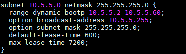  
 
server 开启 isc-dhcp-server 服务   
   
client 开启 internal 网卡，并且使用dhclient  

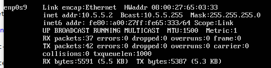  
  
#### DNS  
 

Server端 安装 bind9  
配置　/etc/bind/named.conf.local 添加   

  	zone "cuc.edu.cn" {
        type master;
        file "/etc/bind/db.cuc.edu.cn"
	};  
  
配置域名解析的db文件  
   
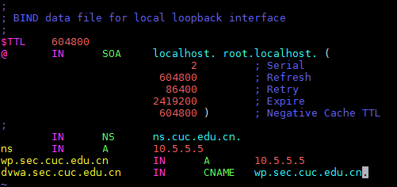  
  
重启 bind9 服务  
  
client端  
 
添加解析服务器  

* sudo vim /etc/resolvconf/resolv.conf.d/head   
 
		search cuc.edu.cn  
		nameserver 10.5.5.5  

更新resolv.conf文件   
 
* sudo resolvconf -u   
  
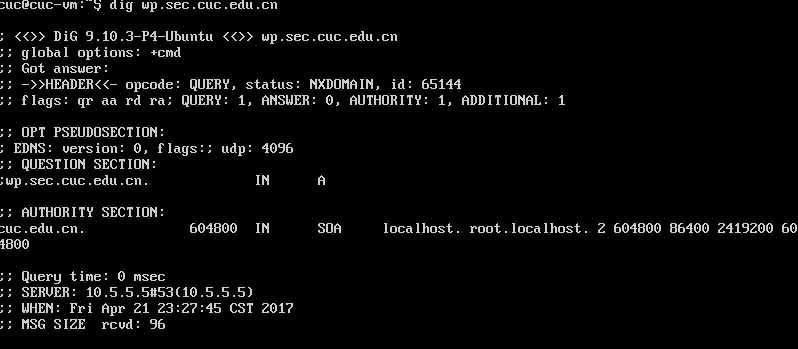    
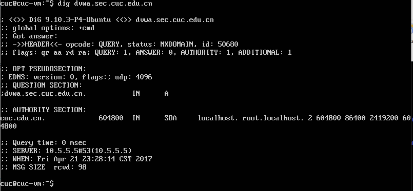  
  
 
### 一键部署  
 
- shell文件夹中的vars.sh 定义许多变量，是一键部署的配置文件。  
- configs中是已经采用大写变量挖空的待配置的各服务的配置文件。  
- main.sh是一键部署的入口脚本  
	- 调用 ssh-root.sh 配置目标机的root用户免密ssh登录  
	- 调用 apt-ins.sh 在目标机上安装必要的程序，并对原生配置文件进行备份  
	- 使用sed 进行挖空替换
	- 调用 action.sh 在目标机上进行用户创建、目录创建、修改权限、重启服务等必要的操作

