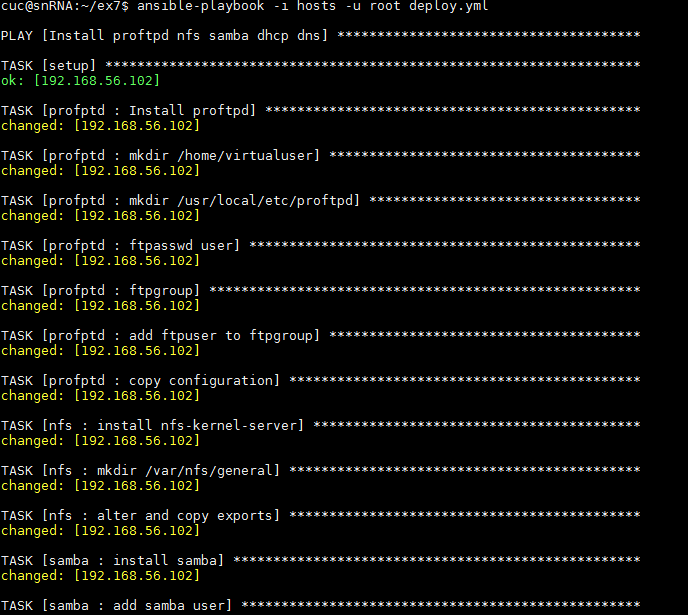
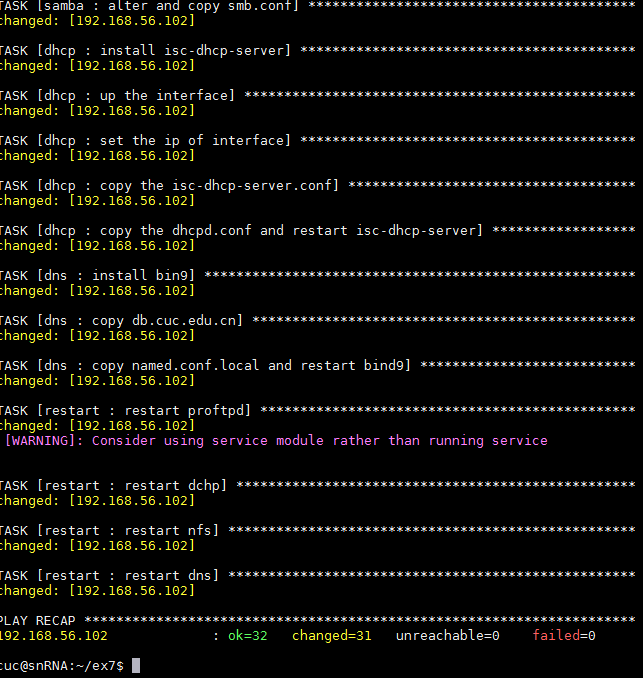

# 实验七  ansible 一键部署 dhcp nfs ftp samba dns 服务  
 

###  实验要求：  
使用ansible技术重构FTP、NFS、DHCP、DNS、Samba服务器的自动安装与自动配置

### 实验过程：

首先参考[课件上的内容](https://sec.cuc.edu.cn/huangwei/course/LinuxSysAdmin/chap0x08.md.html#/12/2)进行ansible部署的前期准备工作

编写的ansible脚本的思路与之前的bash脚本的一键部署相类似。

- 在group_vars中的all文件中声明配置的变量的信息  
 
- roles中每个目录分别承担各自服务的安装与配置  
 
- 每个roles中的tasks负责执行主要的安装配置功能  

- templates文件夹中放置各个服务的配置文件的模板
  
- handles 中进行服务的重启  
  

    
  
 
### 实验遇到的问题  
 
1. 部署服务时需要进行例如ftp 、smb 用户的添加等步骤，存在需要输入密码的情况。

   - 采用expect模块，但是一直存在问题 str object  has no attribute of decode 
   - 使用 echo password | passwd 方法使涉及密码的命令可以单行执行  
2. 使用handles进行修改后的服务重启
  
   - 通过查看服务的状态得出确实重启，但是服务重启并未成功。
   - 最后添加一个role 只执行所有服务重启的命令  
 
