# Exp for Chapter-1

### 实验目的
* 配置无人值守安装iso并在Virtualbox中完成自动化安装
* Virtualbox安装完Ubuntu之后新添加的网卡实现系统开机自动启用和自动获取IP
* 如何使用sftp在虚拟机和宿主机之间传输文件

### 实验环境
* 物理环境
	* windows10
	* linux ubuntu-16.04.1-server
* 网络环境
	* ubuntu双网卡：
		* NAT（10.0.2.1）:实现虚拟机与互联网互通
		* host-only（192.168.112.2）：实现虚拟机与宿主机ssh链接

### 实验步骤
* virtualbox安装ubuntu && 配置ssh
	* 安装ubuntu步骤略
	* 配置ssh
		* 首先需要在ubuntu设置双网卡
			* 宿主机添加host-only网卡，宿主机地址:192.168.112.1
			* `vim /etc/network/interfaces`配置第二块网卡192.168.112.10
				* 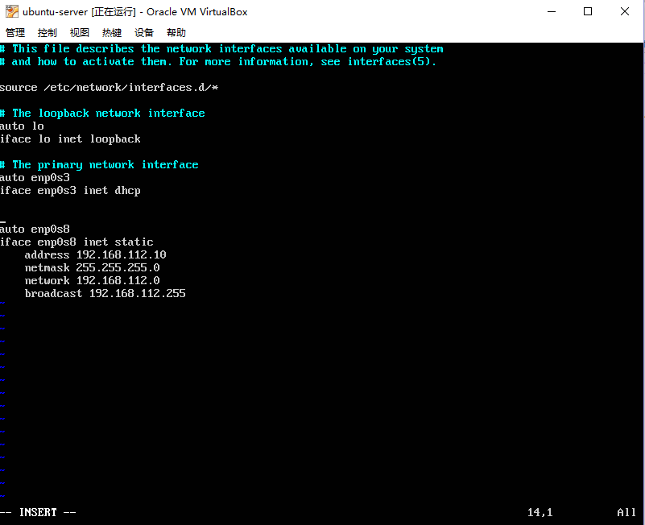
			* 完成后ifconfig查看
				* 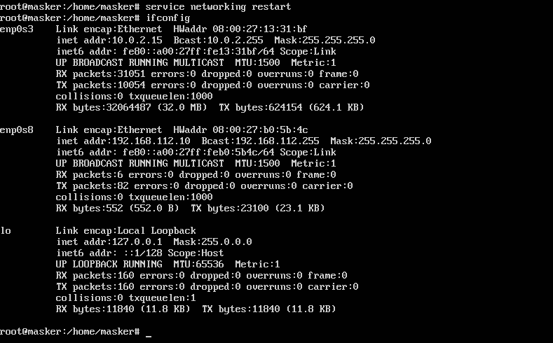
		* ubuntu中安装ssh `apt-get install ssh`
		* windows中配置putty 
			* 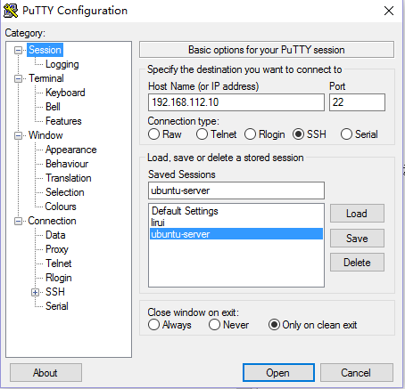
		* 完成ssh链接
			* 
* 创建iso镜像	
	* 使用当前用户下载ubuntu-server镜像
		* `wget http://sec.cuc.edu.cn/ftp/iso/ubuntu-16.04.1-server-amd64.iso`
	* 在当前用户目录下创建一个用于挂载iso镜像文件的目录 
		* `mkdir loopdir`
	* 挂载iso镜像文件到该目录
		* `mount -o loop ubuntu-16.04.1-server-amd64.iso loopdir`
		* 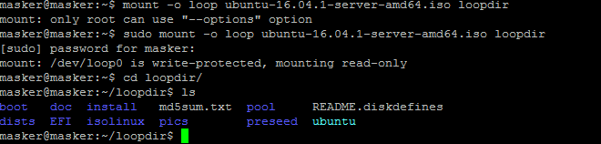
	* 创建一个工作目录用于克隆光盘内容
		* `mkdir cd`
	* 同步光盘内容到目标工作目录
		* `rsync -av loopdir/ cd`
	* 卸载iso镜像
		* `umount loopdir`
	* 进入目标工作目录
		* `cd cd/`
		* 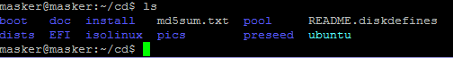
	* 编辑Ubuntu安装引导界面增加一个新菜单项入口
		* `vim isolinux/txt.cfg`
	* 添加以下内容到该文件后强制保存退出(wq!)
		* 
	* 提前阅读并编辑定制Ubuntu官方提供的示例preseed.cfg，并将该文件保存到刚才创建的工作目录~/cd/preseed/ubuntu-server-autoinstall.seed
		* 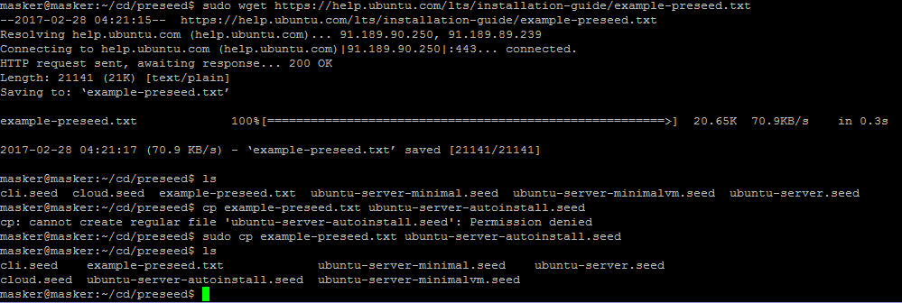
	* 修改isolinux/isolinux.cfg，增加内容timeout 10（可选，否则需要手动按下ENTER启动安装界面）
		* 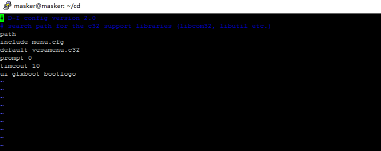
	* 重新生成md5sum.txt
		* `cd ~/cd && find . -type f -print0 | xargs -0 md5sum > md5sum.txt`
		* 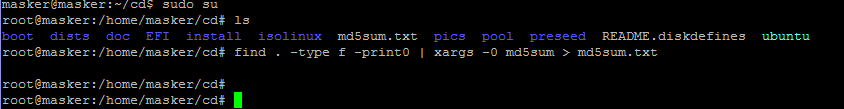
	* 建立shell脚本文件，并添加以下内容
		* 
		* 注意此处BUILD变量中的路径可以直接写为绝对路径，因为当前的用户为root
	* 执行shell脚本文件，完成镜像刻录
		* bash shell
		* 
		* 可以看到已经生成了custom.ios文件
		* 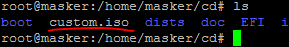
	* 最终使用winSCP将iso文件导出即可
		* 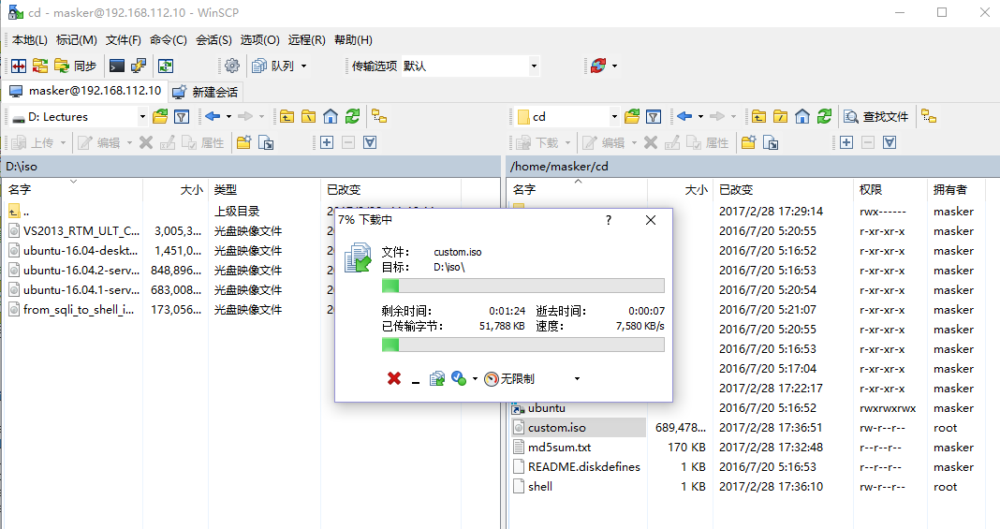
* 使用无人值守iso安装虚拟机
	* 在安装选项中可以看到增添的Auto Install Ubuntu Server
	*  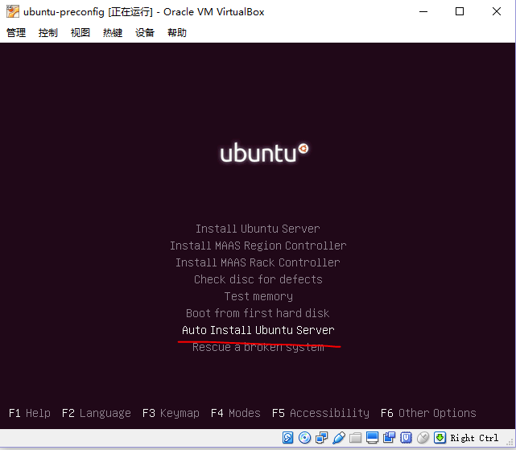
	*  使用其进行安装，即可略过人机交互，使用先前设定好的选项进行安装，实现了无人值守。

### 重要问题
* 老师定制的ubuntu-server-autoinstall.seed与官方用例区别解释
	* 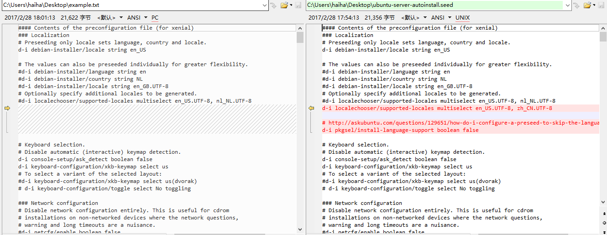
	* locales设置：
		* 解释：语言设置选项。设置了中美两国的语言环境
		* d-i localechooser/supported-locales multiselect en_US.UTF-8, zh_CN.UTF-8
		* # http://askubuntu.com/questions/129651/how-do-i-configure-a-preseed-to-skip-the-language-support-question
		* d-i pkgsel/install-language-support boolean false

	* 网络设置：
		* 解释：网络连接/dhcp超时时间5秒，关闭自动设置
		* d-i netcfg/link_wait_timeout string 5
		* d-i netcfg/dhcp_timeout string 5
		* d-i netcfg/disable_autoconfig boolean true
		* 解释：设置静态ip，关闭自动设置
		* d-i netcfg/get_ipaddress string 192.168.138.42
		* d-i netcfg/get_netmask string 255.255.255.0
		* d-i netcfg/get_gateway string 192.168.138.1
		* d-i netcfg/get_nameservers string 192.168.138.1
		* d-i netcfg/confirm_static boolean true
		* 解释：手动设置dhcp服务器
		* d-i netcfg/get_hostname string svr.sec.cuc.edu.cn
		* d-i netcfg/get_domain string dns.sec.cuc.edu.cn
		* 解释：手动设置主机名
		* d-i netcfg/hostname string isc-vm-host
	* 账户设置：
		* 解释：设置用户名和密码
		* d-i passwd/user-fullname string cuc
		* d-i passwd/username string cuc
		* d-i passwd/user-password password sec.cuc.edu.cn
		* d-i passwd/user-password-again password sec.cuc.edu.cn
	* 时区与时间设置：
		* 解释：设置时区为上海，且不在安装中获取时间
		* d-i time/zone string Asia/Shanghai 
		* d-i clock-setup/ntp boolean false
	* 分区设置
		* 解释：自动选择使用全部物理空间，LVM可使用全部空间，以及将/home, /var, 和 /tmp分至不同分区 
		* d-i partman-auto/init_automatically_partition select biggest_free
		* d-i partman-auto-lvm/guided_size string max
		* d-i partman-auto/choose_recipe select multi
	* APT设置：
		* 解释：不使用网络镜像
		* d-i apt-setup/use_mirror boolean false
	* 默认安装包选择：
		* 解释：安装server所需包，openssl-server，以及不进行自动升级，自动升级安全相关的升级
		* tasksel tasksel/first multiselect server
		* d-i pkgsel/include string openssh-server
		* d-i pkgsel/upgrade select none
		* d-i pkgsel/update-policy select unattended-upgrades
	* 完成安装后：
		* 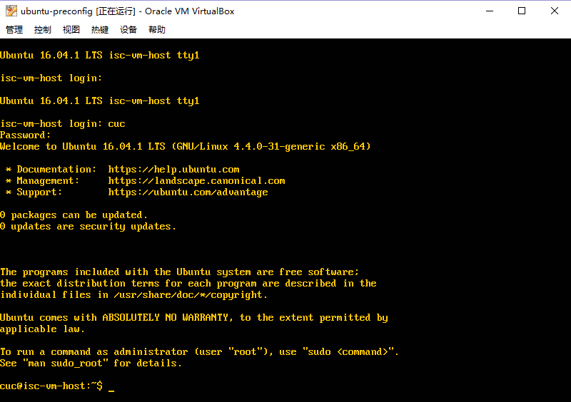
* Virtualbox安装完Ubuntu之后新添加的网卡如何实现系统开机自动启用和自动获取IP
	* 在宿主机中设置host-only的dhcp服务器
		* 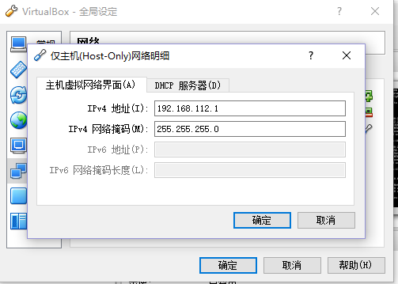
		* 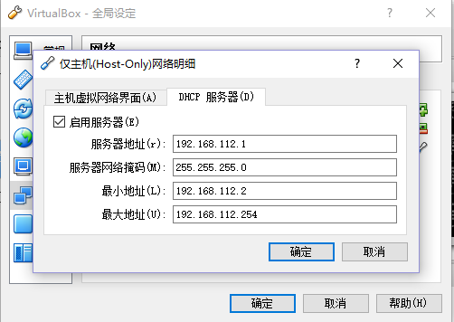
	* 重启虚拟机，配置/etc/network/interfaces文件
		* 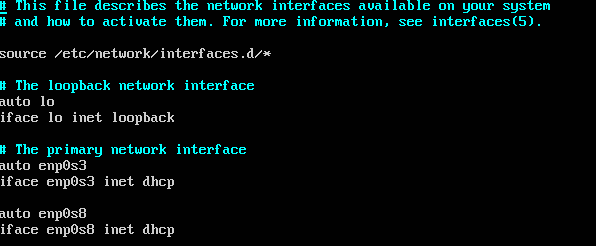
	* 再次重启即可
		* 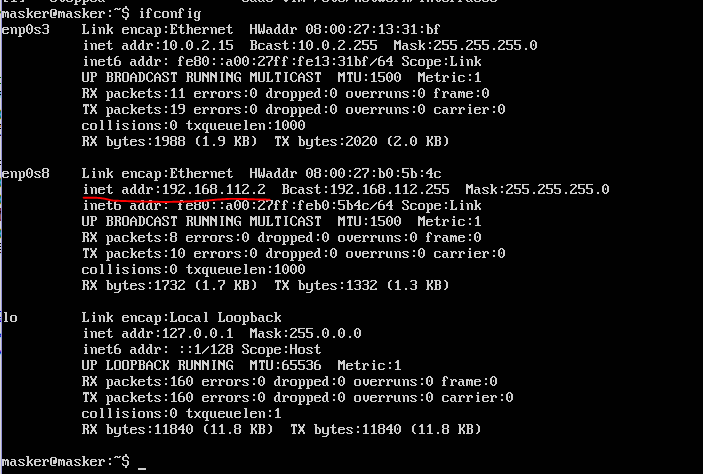

### 参考链接
* [ubuntu网卡设置]("https://bowerstudios.com/node/1015")
* [chap0x01.exp]("https://sec.cuc.edu.cn/huangwei/course/LinuxSysAdmin/chap0x01.exp.md.html")
* [基于官方iso格式安装镜像制作无人值守定制安装镜像]("https://help.ubuntu.com/community/InstallCDCustomization")
