## web服务器实验报告
* 环境配置
 	* 系统环境
	 	* 4*linux虚拟机
		 	* 3*ubuntu16.04（服务器）
		 	* 1*ubuntu16.04（客户端）（桌面版）
		* 1*windows10宿主机（客户端）
	* 网络环境
		* 3*ubuntu16.04（服务器）
			* verynginx:
				* 内部网络：1.2.3.10
				* 桥接网卡：192.168.112.10
				* NAT
			* wordpress
				* 内部网络：1.2.3.20
			* DVWA
				* 内部网络：1.2.3.30
		* 1*ubuntu16.04（客户端）
			* 桥接网卡：192.168.112.2
		* 1*windows（客户端）
			* 桥接网卡：192.168.112.1
* 搭建过程
	* verynginx
		* [VeryNginx搭建教程](https://github.com/alexazhou/VeryNginx/blob/master/readme_zh.md)
		* [安装故障排除](https://github.com/alexazhou/VeryNginx/wiki/Trouble-Shooting)
	* wordpress
		* 前提需求：Nginx+PHP7.0+Mysql(LEMP)
		* [wordpress安装教程](https://www.digitalocean.com/community/tutorials/how-to-install-wordpress-with-lemp-on-ubuntu-16-04)
		* [LEMP配置教程](https://www.digitalocean.com/community/tutorials/how-to-install-linux-nginx-mysql-php-lemp-stack-in-ubuntu-16-04)
	* DVWA
		* 前提需求：nginx+PHP7.0+Mysql(LEMP)
		* [DVWA安装及配置](https://github.com/ethicalhack3r/DVWA)
* 配置需求
	* VeryNginx作为反向代理
		* 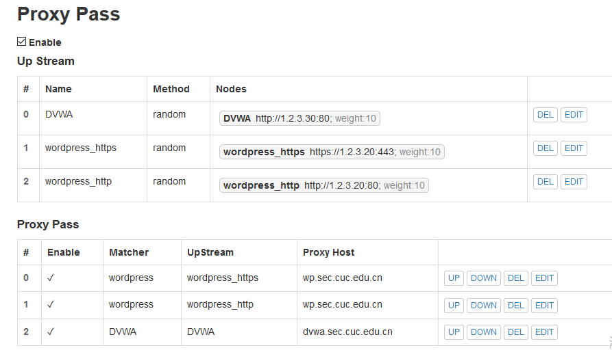
		* Up Stream
			* nodes:使用upstream规定proxy pass可以代理的目标站点的节点，在本次实验中，每一个代理只需要一个webserver作为目标节点，不牵扯负载均衡问题，因此权值weight可以随意设置。
			* method
				* ip_hash：指相同client在确立链接后与同一个server进行通信，只有当当前server出现宕机才会更换。
				* random：client与server为默认根据权值分配。
			* 参考：[Module nginx upstream_module](http://nginx.org/en/docs/http/ngx_http_upstream_module.html)
		* Proxy Pass
			* Proxy Host：反向代理的地址。此前已经在hosts中修改两个站点域名对应ip都为192.168.112.10，即反向代理服务器ip。
			* UpStream：目标站点的节点集合。
			* Matcher：根据规则限定访问目标地址。
				* 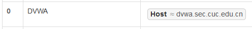
				* 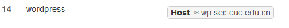
			* 参考：[Module nginx proxy_module](http://nginx.org/en/docs/http/ngx_http_proxy_module.html)
		* 完成效果
			* Wordpress: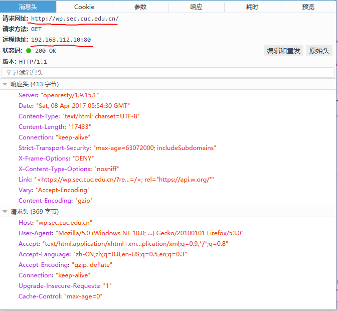
			* DVWA: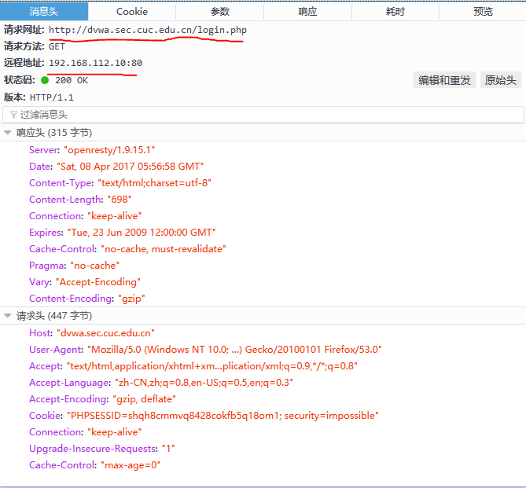
	* WordPress的HTTPS搭建
		* [nginx 自签发证书制作](https://www.digitalocean.com/community/tutorials/how-to-create-an-ssl-certificate-on-nginx-for-ubuntu-14-04)
		* [apache 自签发证书制作](https://www.digitalocean.com/community/tutorials/how-to-create-a-self-signed-ssl-certificate-for-apache-in-ubuntu-16-04)
		* 完成效果
			* 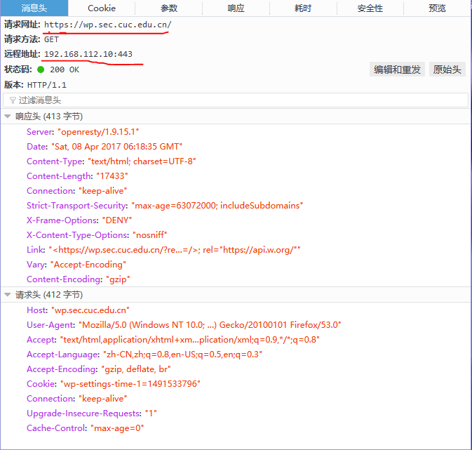
	* 安全要求加固
		* 禁止使用ip直接访问
			* 使用VeryNginx的Matcher,Response,Filter联动完成
				* Matcher：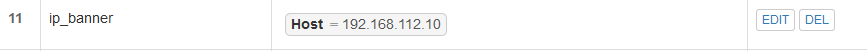
				* Response：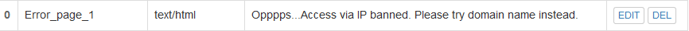
				* Filter：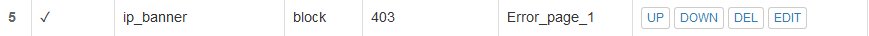
			* 完成效果：
				* 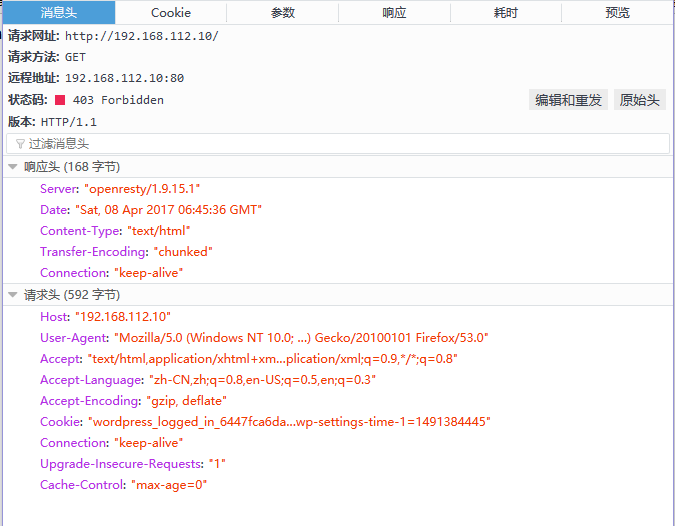
				* 
		* DVWA白名单访问控制
			* 将192.168.112.1置于白名单。
			* 使用VeryNginx的Matcher,Response,Filter联动完成
				* Matcher：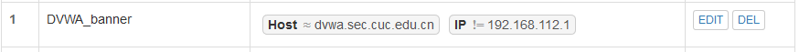
				* Response：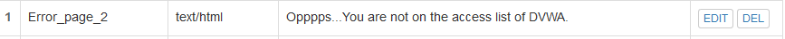
				* Filter：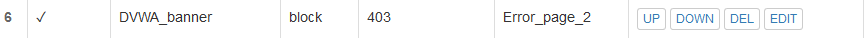
			* 完成效果：
				* 使用不在白名单的192.168.112.2进行访问：
				* 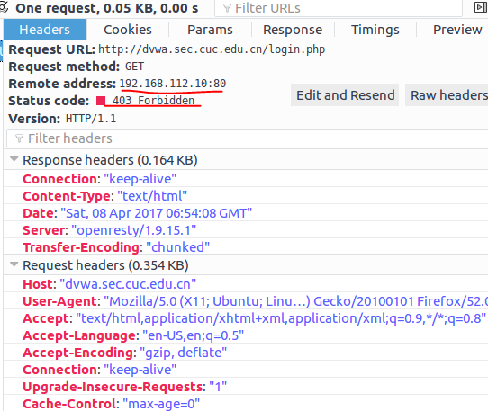
				* 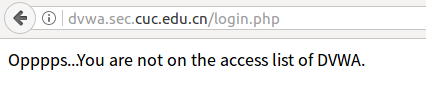 
		* VeryNginx的Web管理页面访问控制
			* 将192.168.112.1置于白名单。
			* 使用VeryNginx的Matcher,Response,Filter联动完成
				* Matcher：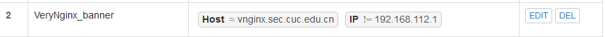
				* Response：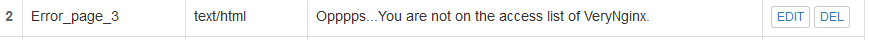
				* Filter：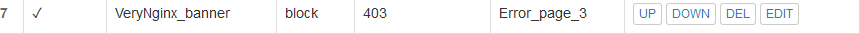
			* 完成效果：
				* 使用不在白名单的192.168.112.2进行访问：
				* 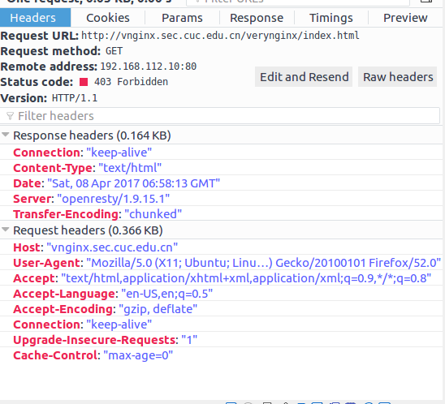
				* 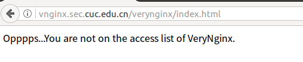
		* 热修复<Wordpress4.7.1漏洞
			* 漏洞复现：
				* 
			* 漏洞描述：即通过访问/wp-json/wp/v2/users/可以获取wordpress用户信息的json数据。
			* 实现：禁止访问站点的/wp-json/wp/v2/users/路径即可。使用filter进行限制
				* 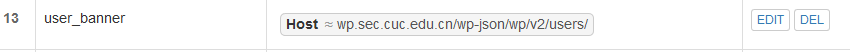
				* 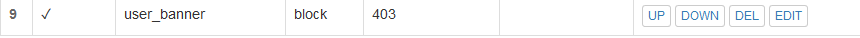
		* SQL注入实验在低安全等级条件下进行防护
			* 首先把DVWA防护等级调至low
				* 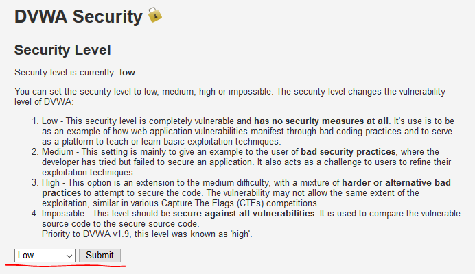
			* SQL注入：
				* 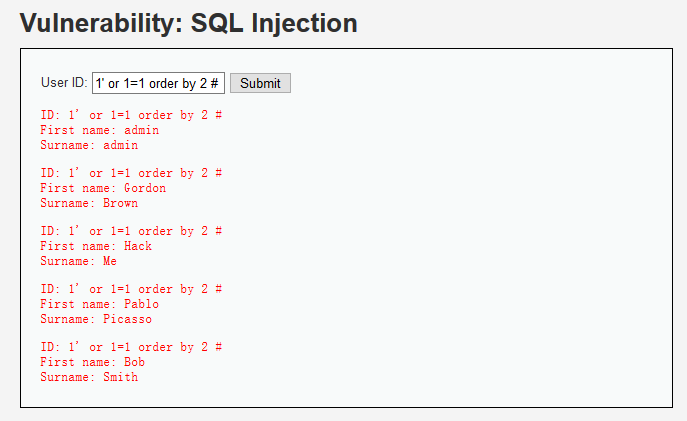
			* 进行Filter和Matcher过滤
				* 
				* 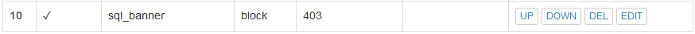
			* 效果：发现再次注入会返回403
				* 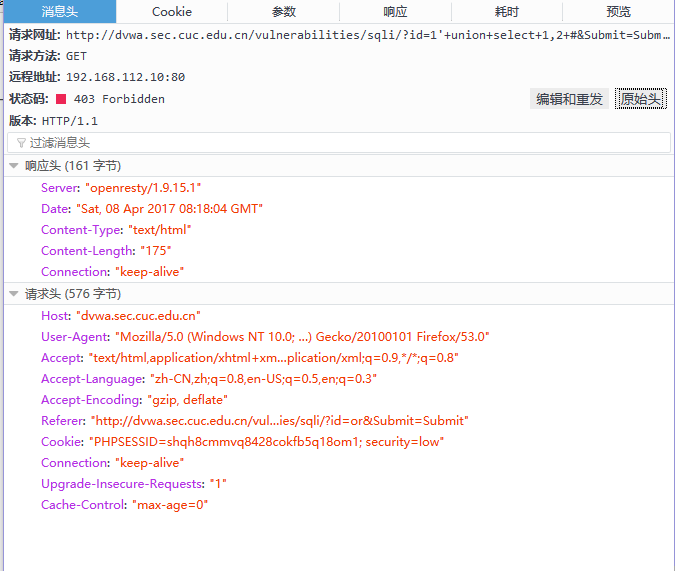
	* 通过定制VeryNginx的访问控制策略规则实现： 
		* 需求：
			* 限制DVWA站点的单IP访问速率为每秒请求数 < 50
			* 限制Wordpress站点的单IP访问速率为每秒请求数 < 20
			* 超过访问频率限制的请求直接返回自定义错误提示信息页面-4
			* 禁止curl访问
		* 实现：
			* 通过Matcher，Frequency Limit，Filter 联动完成
				* Matcher：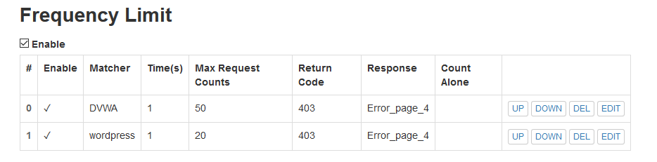
				* Frequency Limit：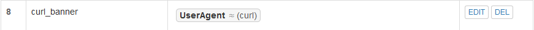
				* Filter：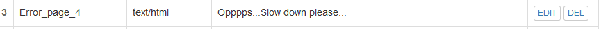
		* 效果：
			* 通过curl命令进行访问
				* 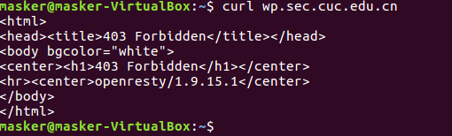
			* 高频访问受限（为方便测试，次数限制设定为2times/s，并允许curl访问）
				* 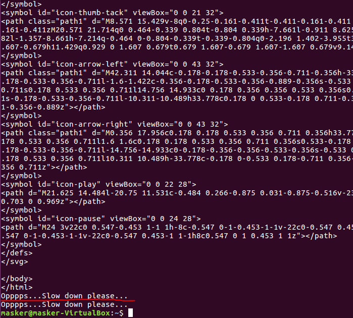
* 参考
 	* [VeryNginx搭建教程](https://github.com/alexazhou/VeryNginx/blob/master/readme_zh.md)
	* [安装故障排除](https://github.com/alexazhou/VeryNginx/wiki/Trouble-Shooting)
	* [wordpress安装教程](https://www.digitalocean.com/community/tutorials/how-to-install-wordpress-with-lemp-on-ubuntu-16-04)
	* [LEMP配置教程](https://www.digitalocean.com/community/tutorials/how-to-install-linux-nginx-mysql-php-lemp-stack-in-ubuntu-16-04)
	* [DVWA安装及配置](https://github.com/ethicalhack3r/DVWA)
	* [Module nginx upstream_module](http://nginx.org/en/docs/http/ngx_http_upstream_module.html)
	* [Module nginx proxy_module](http://nginx.org/en/docs/http/ngx_http_proxy_module.html)
	* [nginx 自签发证书制作](https://www.digitalocean.com/community/tutorials/how-to-create-an-ssl-certificate-on-nginx-for-ubuntu-14-04)
	* [apache 自签发证书制作](https://www.digitalocean.com/community/tutorials/how-to-create-a-self-signed-ssl-certificate-for-apache-in-ubuntu-16-04)
	* [DVWA-1.9全级别教程之SQL Injection](http://www.freebuf.com/articles/web/120747.html)
	* [VeryNginx官方文档](https://github.com/alexazhou/VeryNginx/blob/master/readme_zh.md)