# 第八章实验报告--ansible技术重构自动配置
## 实验环境
* 虚拟机物理环境
	* Server : Ubuntu-16.04.2-Server
	* Target : Ubuntu-16.04.2-Server
* 网络环境
	* Server
		* NAT
		* Host-Only:192.168.112.10
	* Target
		* NAT
		* Host-Only:192.168.112.20
		* Internal:100.0.0.1
## 实验基本原理
* ansible-galaxy/roles的基本工作路径
	* 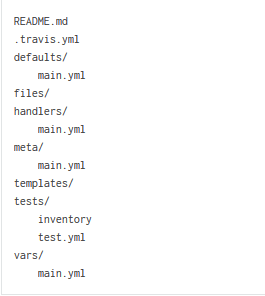
* 原理简单解读
	* roles父目录中的.yml文件定义了支持自定义修改的配置参数
	* 参数的定义保存在roles/defaults/main.yml中
	* templates/中的文件用于保存原始配置文件的模板以及配置增量相关的代码
	* tasks/中的文件用于处理配置文件的加工以及最终在目标机的所需操作
## 实验步骤
* 在Server上安装ansible

		$ sudo apt-get install software-properties-common
		$ sudo apt-add-repository ppa:ansible/ansible
		$ sudo apt-get update
		$ sudo apt-get install ansible
* 配置Server到Target的root用户的ssh免密登录
	
		$ ssh-copy-id -i ~/.ssh/id_rsa.pub root@192.168.112.20
		# 假设B上没有安装过python
		$ sudo apt-get update && sudo apt-get install -y python-minimal
		$ exit
* 在Server上配置本地Ansible本地工作目录，并测试
	
		$ mkdir ansible && cd ansible
		$ echo -e "[web]\n192.168.112.20" > hosts
		$ ansible all -m ping -u root -i hosts
	* 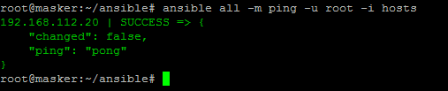
* 下载相关配置文件
	* 在[galaxy.ansible.com](https://galaxy.ansible.com/)中搜索相关的roles
	* 确认资源可信后，下载配置文件
		* [vsftpd](https://galaxy.ansible.com/franklinkim/vsftpd/)
		* [NFS](https://galaxy.ansible.com/indigo-dc/nfs/)
		* [DHCP](https://galaxy.ansible.com/debops/dhcpd/)
		* [DNS](https://galaxy.ansible.com/resmo/bind/)
		* [SAMBA](https://galaxy.ansible.com/mrlesmithjr/samba/)

				$ ansible-galaxy install franklinkim.vsftpd -p roles
				$ ansible-galaxy install indigo-dc.nfs -p roles
				$ ansible-galaxy install debops.dhcpd -p roles
				$ ansible-galaxy install resmo.bind -p roles
				$ ansible-galaxy install mrlesmithjr.samba -p roles

* 根据README进行自定义修改配置
	* vsftpd
		* 目标状态：
			* 修改target中文件
				* /etc/hosts.allow
				* /etc/hosts.deny
				* /etc/shells
			* 覆盖/新建target中文件
				* /etc/vsftpd.config
				* /etc/vsftpd.userlist
		* 在roles父目录下新建deploy.yml，根据README以及上次实验的配置文件进行自定义修改如下：
			* 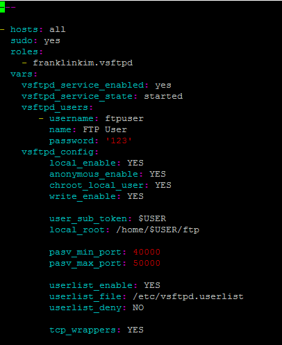
			* 该配置定义了vsftpd.conf中的相关配置以及ftp用户的创建
		* 由于需要修改/etc/hosts.allow与/etc/hosts.deny文件，因此可以在roles/franklinkim.vsftpd/tasks/config.yml中添加如下配置语句：
			* 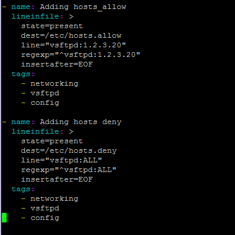
			* 该配置原理是通过正则表达式对文件中的内容进行判断，进行无重复地添加自定义内容。
		* 在该文件中也可看到对于其他配置的实现方式
			* 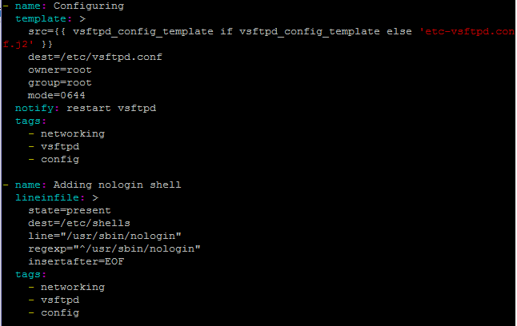
			* 对于主配文件vsftpd.conf，通过template文件覆盖的方式进行
			* 对于/etc/shells文件的修改，通过lineinfile的方式进行添加行
		* 覆盖target中/etc/vsftpd.userlist文件
			* 在server中roles/franklinkim.vsftpd/tasks/config.yml中添加如下内容：
				* 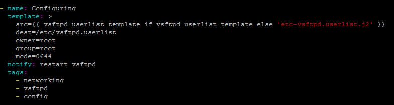
			* 在server中新建roles/franklinkim.vsftpd/templates/etc-vsftpd.userlist.j2，内容如下：
				* 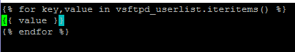
			* 在server中roles/franklinkim.vsftod/default/main.yml中添加有关vsftpd.userlist的定义
				* 
			* 最终在deploy.yml中增添vsftpd_userlist中的用户
				* 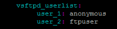
		* 检查target：
			* /etc/vsftpd.config
				* 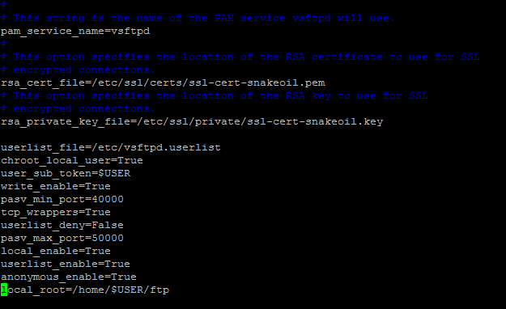
			* /etc/vsftpd.userlist
				* 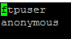
			* /etc/hosts.allow
				* 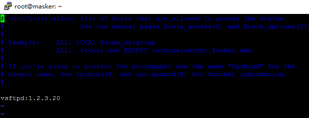
			* /etc/hosts.deny
				* 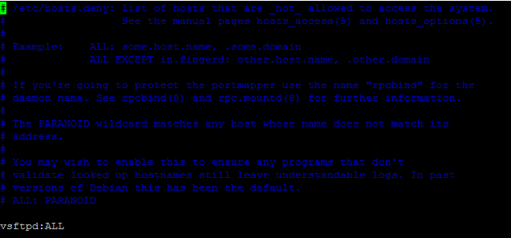
	* nfs
		* 目标状态: 
			* 覆盖/新建target中文件
				* /etc/exports
		* 根据README.MD在deploy.yml中进行Role Variables的添加
			* 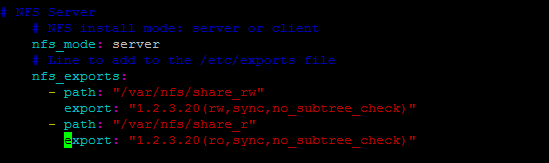
		* 检查target中/etc/exports：
			* 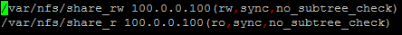

	* dhcp
		* 目标状态：
			* 覆盖/新建target中文件
				* /etc/dhcp/dhcpd.conf
				* /etc/default/isc-dhcp-server
		* 根据README.MD在deploy.yml中进行Role Variables的添加
			* 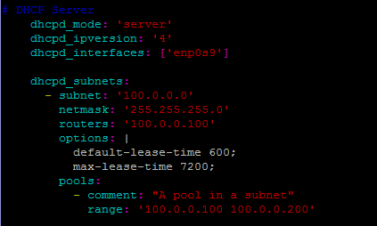
		* 检查target：
			* /etc/dhcp/dhcpd.conf
				* 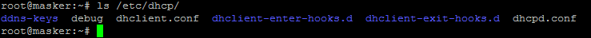
				* 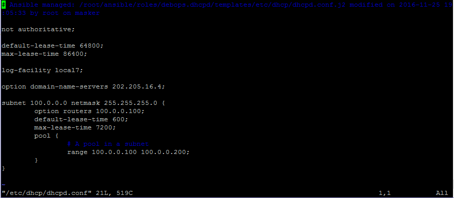
			* /etc/default/isc-dhcp-server
				* 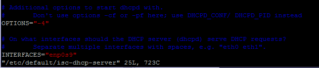
	* Samba
		* 目标状态：
			* 覆盖/新建target中文件
				* /etc/samba/smb.conf
		* 根据README.MD在deploy.yml中进行Role Variables的添加
			* 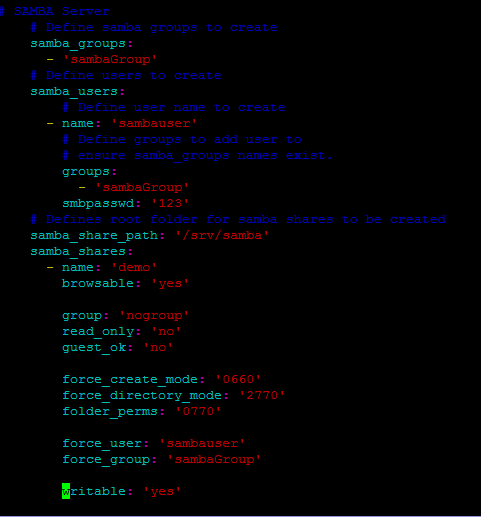
		* 检查target中/etc/samba/smb.conf：
			* 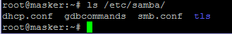
			* 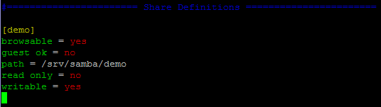
	* DNS
		* 目标状态：
			* 覆盖/新建target中文件
				* /etc/bind/named.conf.local.master
				* /var/lib/bind/master/db.cuc.edu.cn
		* 根据README.MD在deploy.yml中进行Role Variables的添加
			* 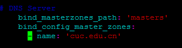
			* 注：需要在playbook脚本（deploy.yml）路径下创建自己的master/db.cuc.edu.cn用于远程自动拷贝
		* 检查target：
			* /etc/bind/named.conf.local.master
				* 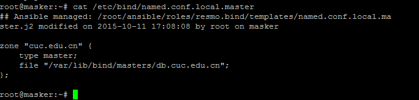
			* /var/lib/bind/master/db.cuc.edu.cn
				* 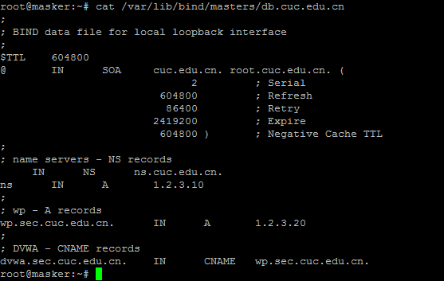
* 使用vault参数对target进行远程安装

		ansible-playbook deploy.yml -i hosts -u root -v --ask-vault-pass
* 问题
	* 尝试使用vault对单一文件的变量进行加密，可是无法应用对于franklinkim/vsftp中的内置添加用户的功能，报错：

		fatal: [192.168.112.20]: FAILED! => {"failed": true, "msg": "the field 'args' has an invalid value, which appears to include a variable that is undefined. The error was: 'ansible.vars.unsafe_proxy.AnsibleUnsafeText object' has no attribute 'username'\n\nThe error appears to have been in '/root/ansible/roles/franklinkim.vsftpd/tasks/users.yml': line 2, column 3, but may\nbe elsewhere in the file depending on the exact syntax problem.\n\nThe offending line appears to be:\n\n---\n- name: Adding users\n  ^ here\n"}

## 参考
* [ansible官方文档](http://docs.ansible.com/ansible/)
* [franklinkim/vsftpd](https://galaxy.ansible.com/franklinkim/vsftpd/)
* [indigo-dc/nfs](https://galaxy.ansible.com/indigo-dc/nfs/)
* [debops/dhcpd](https://galaxy.ansible.com/debops/dhcpd/)
* [resmo/bind](https://galaxy.ansible.com/resmo/bind/)
* [Smrlesmithjr/samba](https://galaxy.ansible.com/mrlesmithjr/samba/)
