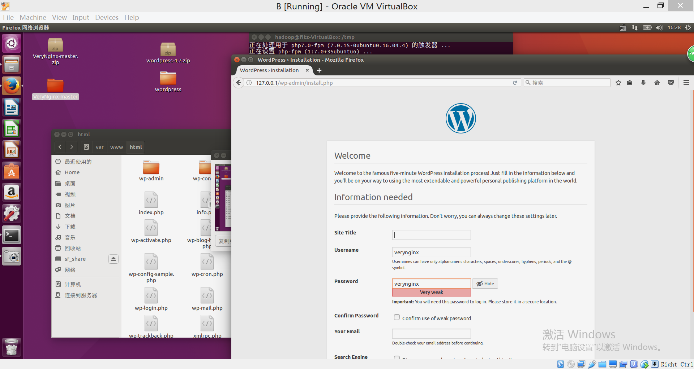
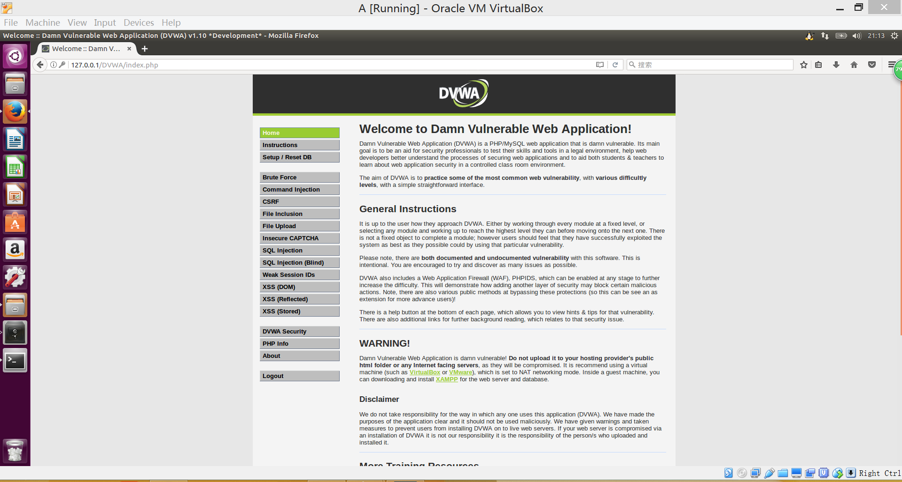
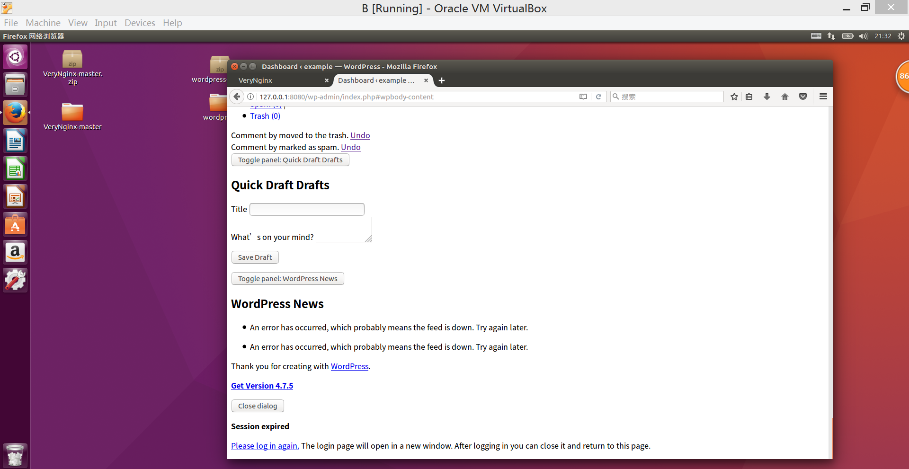
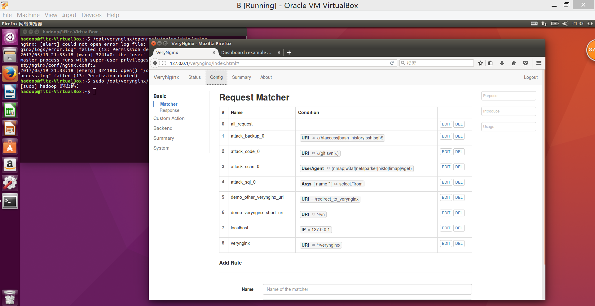
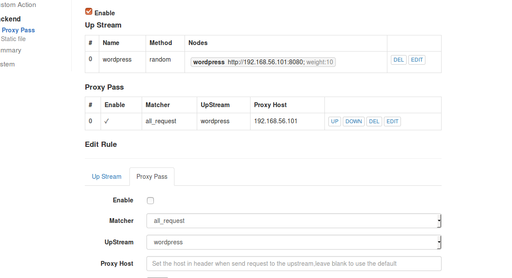
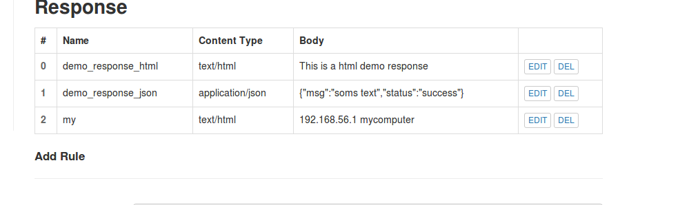
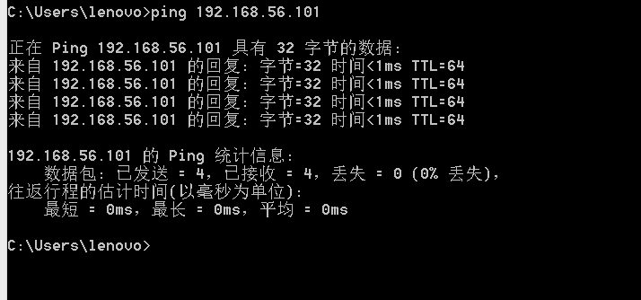

# 第五次实验

##一、实验环境

* 一台名为B的虚拟机，安装nginx，verynginx，wordpress4.7
* 一台宿主机，用来访问
*  一台名为A的虚拟机，安装nginx，DVWA

①安装过程

* 安装nginx

	   sudo apt-get install nginx
* 安装verynginx

       进入github https://github.com/alexazhou/VeryNginx
       下载并在本地使用教程中命令安

       注意点：根据错误提示安装pure的两个配套库

* 安装WordPress

       根据https://www.digitalocean.com/community/tutorials/how-to-install-wordpress-with-lemp-on-ubuntu-16-04教程安装设置WordPress，根据https://www.digitalocean.com/community/tutorials/how-to-install-linux-nginx-mysql-php-lemp-stack-in-ubuntu-16-04教程配置nginx和设置数据库

* 安装DVWA

       与安装WordPress类似，先安装好nginx，之后再nginx的基础上搭建DVWA

##二、实验过程
* 首先打开DVWA和WordPress

因为一些特殊原因样式表无法加载

* 我们可以看到已有的过滤规则 现在加入新规则

* 设置代理规则，由自己代理到自己，可以实现中间拦截功能

* 设置白名单，只允许本机ip访问

* 宿主机访问，在白名单能，可以成功ping
