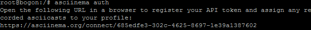
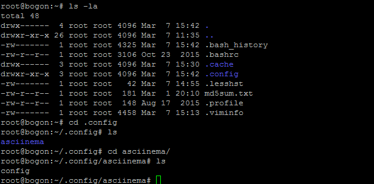
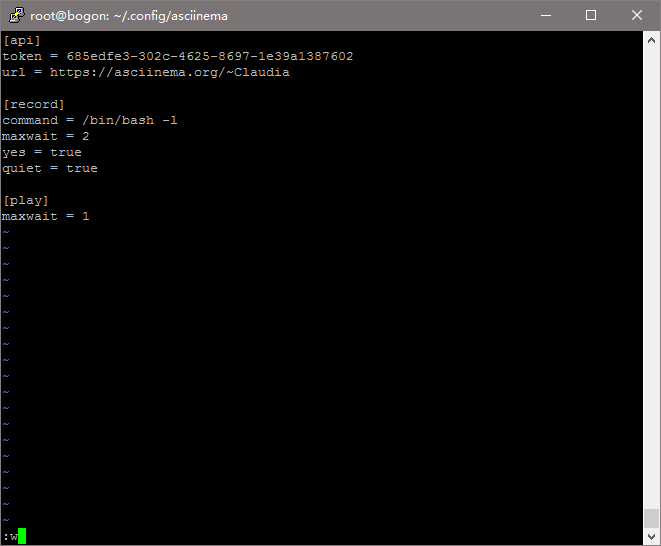

### 安装

[安装文档](https://asciinema.org/docs/installation)

- 按文档（三种方式）都可以

### 使用

[使用文档](https://asciinema.org/docs/usage)
- 主要操作命令
	- asciinema rec 文件名    （exit)
	- asciinema play 文件名 
	- asciinema upload 文件名
  
### 认证

[认证文档](https://asciinema.org/docs/config)

asciinema auth 进行认证

试了试没用，再上传视频还是到一个utitled

找到 /.config/asciinema/config

于是我在config文件里面加了这些参数

反复折腾还是没用，甚至更糟糕了，视频都打不开
最后，我在上传视频之后auth了一次再一次auth，终于关联成功！
为啥每次我都被这种问题纠缠好久，写下来留个纪念！
终于可以做vimtutor了
