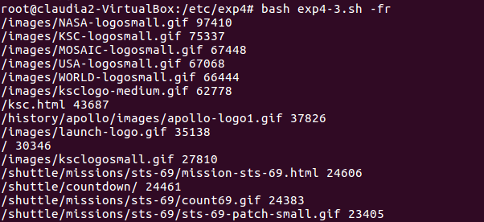

### exp4-2.1
	awk -F "\t" '{if(NR!=1)a[$5]++}
	END{printf("%-14s%-20s%-26s\n","Location","Count","Percentage");
	for(i in a)
	{printf("%-14s%-20s%-26.2f\n", i,a[i],(a[i]/(NR-1))*100)|"sort -k1 -nr"}}' worldcupplayerinfo.tsv

> 目前实现 

 
