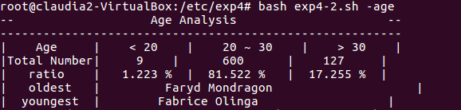
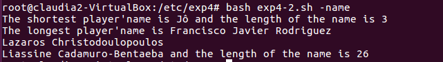
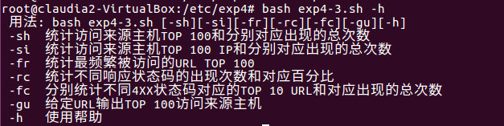
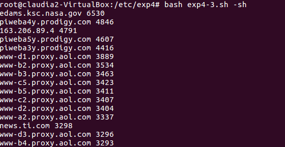
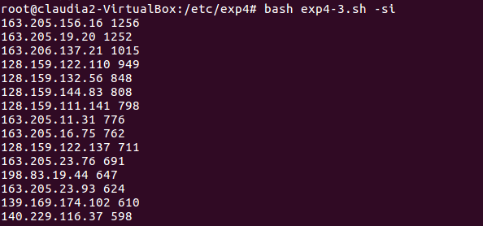
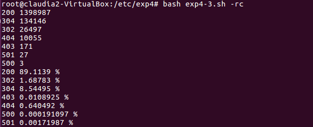

# exp4实验报告

### 任务二：用bash编写一个文本批处理脚本，对以下附件分别进行批量处理完成相应的数据统计任务：
* [2014世界杯运动员数据](http://sec.cuc.edu.cn/huangwei/course/LinuxSysAdmin/exp/chap0x04/worldcupplayerinfo.tsv)
* 年龄分析
	* 统计不同年龄区间范围（20岁以下、[20-30]、30岁以上）的球员数量、百分比
	* 年龄最大的球员是谁？年龄最小的球员是谁？
	
		
* 位置分析
	* 统计不同场上位置的球员数量、百分比
	
		
* 姓名分析
	* 名字最长的球员是谁？名字最短的球员是谁？

		

### 任务二：用bash编写一个文本批处理脚本，对以下附件分别进行批量处理完成相应的数据统计任务：
* [Web服务器访问日志](http://sec.cuc.edu.cn/huangwei/course/LinuxSysAdmin/exp/chap0x04/web_log.tsv.7z)
	* 给出帮助信息

		
	* 统计访问来源主机TOP 100和分别对应出现的总次数

		
	* 统计访问来源主机TOP 100 IP和分别对应出现的总次数

		
	* 统计最频繁被访问的URL TOP 100

		
	* 统计不同响应状态码的出现次数和对应百分比

		
	* 分别统计不同4XX状态码对应的TOP 10 URL和对应出现的总次数

		

> 实验一还在调试...
