# exp5 实验报告
---
### 一、实验目的
 完成高级Web服务器的配置，使其支持如下功能：
		
- 反向代理
- 流量控制
- 关键词过滤

### 二、实验环境
* 服务器
	* ubuntu 16.04 | 192.168.63.3
		* nginx
		* verynginx
	* ubuntu 16.04 | 192.168.63.4
		* dvwa
	* ubuntu 16.04 | 192.168.63.8
		* wordpress
* 客户端
	* WIN10     |   192.168.63.1
		* 配置hosts文件
		
			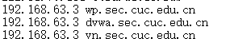
### 三、实验过程
---
###   VeryNginx
- 安装
	- 详细过程参照 [VeryNginx安装配置文档](https://github.com/alexazhou/VeryNginx/blob/master/readme_zh.md)
	- 故障排除参照 [VeryNginx故障排除文档](https://github.com/alexazhou/VeryNginx/wiki/Trouble-Shooting)
- 遇到的问题
	1. 在***git clone ***之前要先安装
		- git-man
		- liberror-perl
	
	2. 在 ***pathon install.py install*** 前需要
		- 加sudo，否则↓
		
		 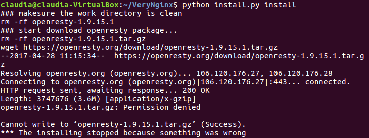
		- 安装libpcre3-dev、libssl-dev和build-essential ，否则↓
		
		 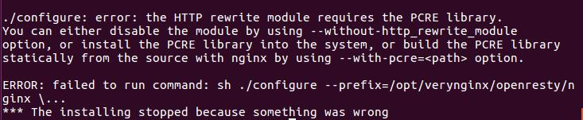
		- 保证网络环境较好，成功如图↓
		
		 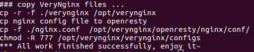
	3. 无法启动
		- nginx.conf 中指定了使用 nginx 用户来执行程序，而系统里缺少 nginx 用户，所以无法运行
				
				 adduser nginx
	
	4. 无法成功链接到指定域名下的控制面板，检查点
		- 是否开启nignx
		- 域名和ip是否设置好映射
	

		
- 成功

	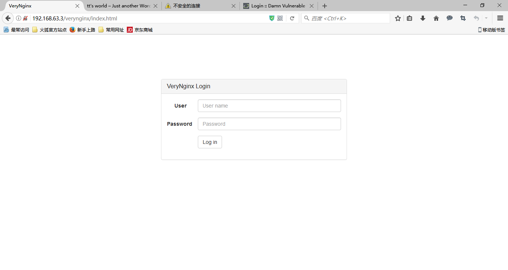
	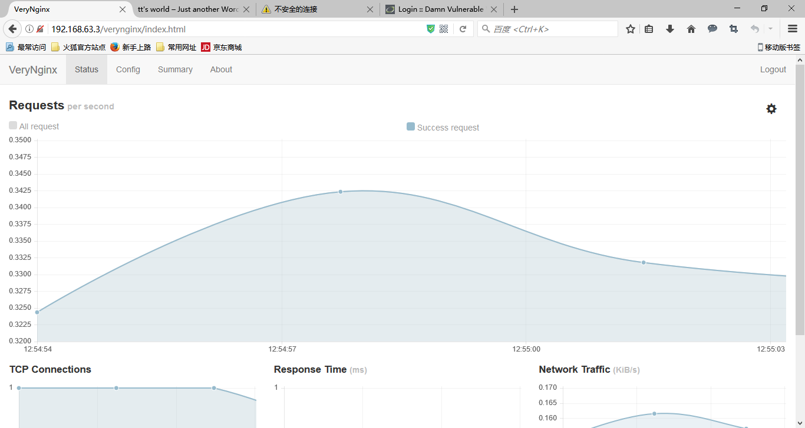

---
###   WordPress
- 安装
	- 安装准备
		- [LEMP安装配置](https://www.digitalocean.com/community/tutorials/how-to-install-linux-nginx-mysql-php-lemp-stack-in-ubuntu-16-04)
		- 配置 ***/etc/hosts*** 文件
		- [创建SSL自签发证书](https://www.digitalocean.com/community/tutorials/how-to-create-a-self-signed-ssl-certificate-for-nginx-in-ubuntu-16-04)
	-  [WordPress安装配置文档](https://www.digitalocean.com/community/tutorials/how-to-install-wordpress-with-lemp-on-ubuntu-16-04)

- 遇到的问题
	1.  创建好SSL自签发证书后，重启nginx时遇到：
	
		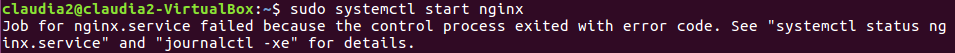
       	
		- 查看错误日志
       	
    		   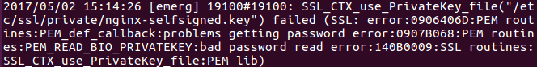

		- 查找了一些方法，发现都不适用。之后用ubuntu14-04的配置文档装了一次，没有问题了。
		

- 成功

	
	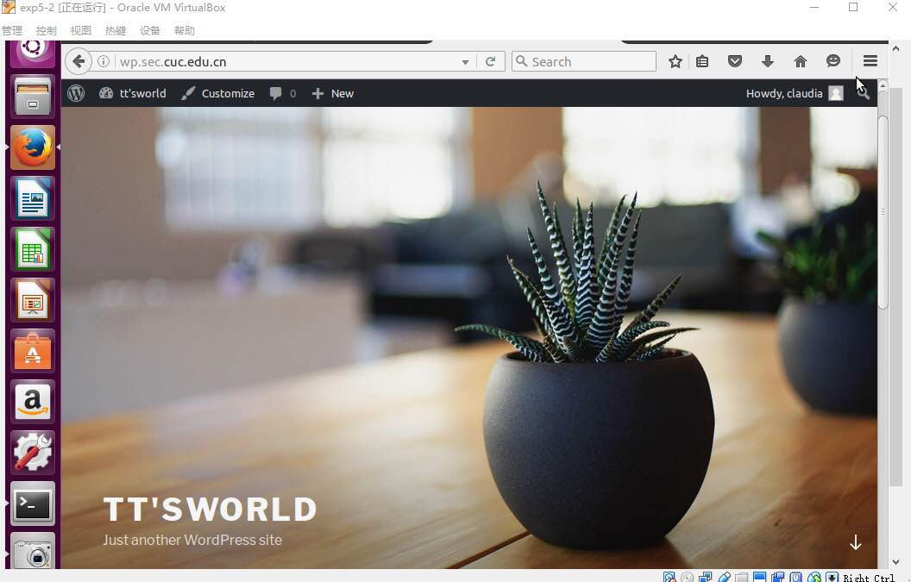
	

---
###  DVWA
- 安装
	- [How to Download and Set up DVWA Lab in Ubuntu Server (Any Linux)](https://www.youtube.com/watch?v=1C51jmFRXKw)
	- ***配置/etc/php/7.0/fpm/php.ini***
		- 将allow _ url _ include= Off 改为 On
	- 配置/var/www/html/DVWA-master/config/config.ini.php.dist
		- 将config.inc.php.dist复制成config.inc.php
- 遇到的问题
	1.  安装过程中打开nginx 出现了↓
	2.  
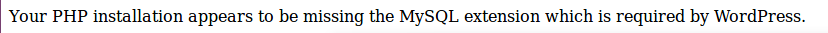

		- 看了一下php文件夹，竟然有这么多
		
			 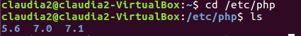
	
				sudo rm -rf 5.6
				sudo rm -rf 7.1
		- 重新把php7.0相关的包安装了一次，解决
	
	2. 配置/var/www/html/DVWA-master/config/config.inc.php.dist之后打开页面时出现问题，页面提示：
		- 将config.inc.php.dist复制成config.inc.php

- 成功

	

---
### 四、实验检查点
### 基本要求

* 在一台主机（虚拟机）上同时配置[Nginx](http://nginx.org/)和[VeryNginx](https://github.com/alexazhou/VeryNginx)
    * VeryNginx作为本次实验的Web App的反向代理服务器和WAF
	    * upstream、proxypass、matcher

			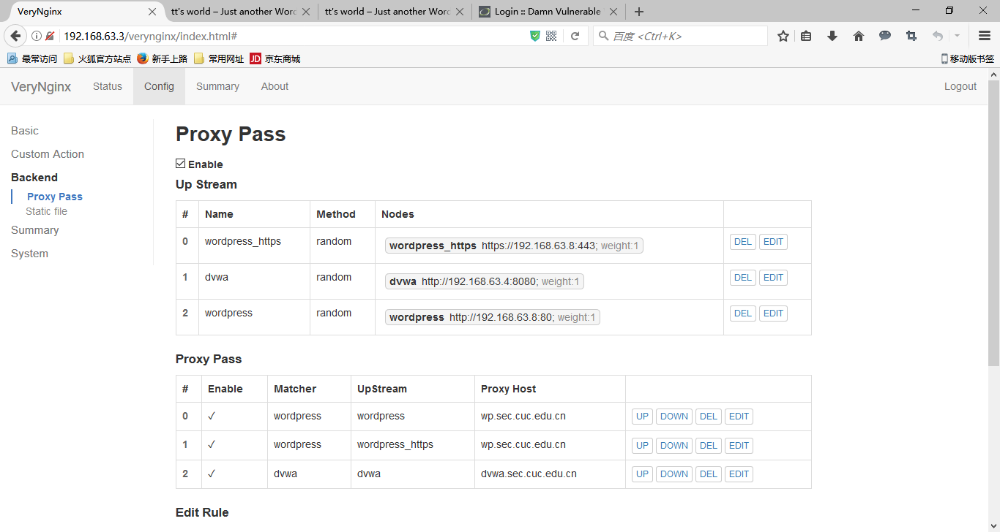

			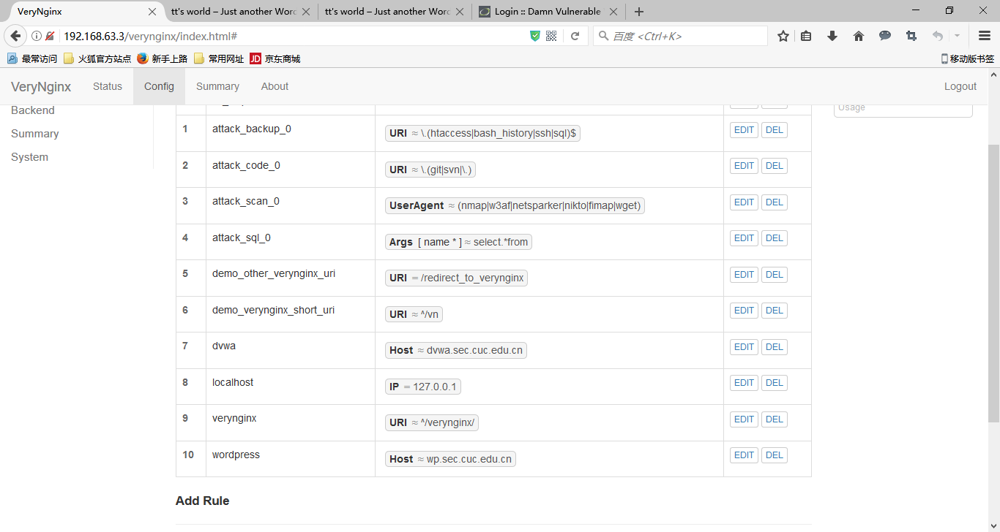

			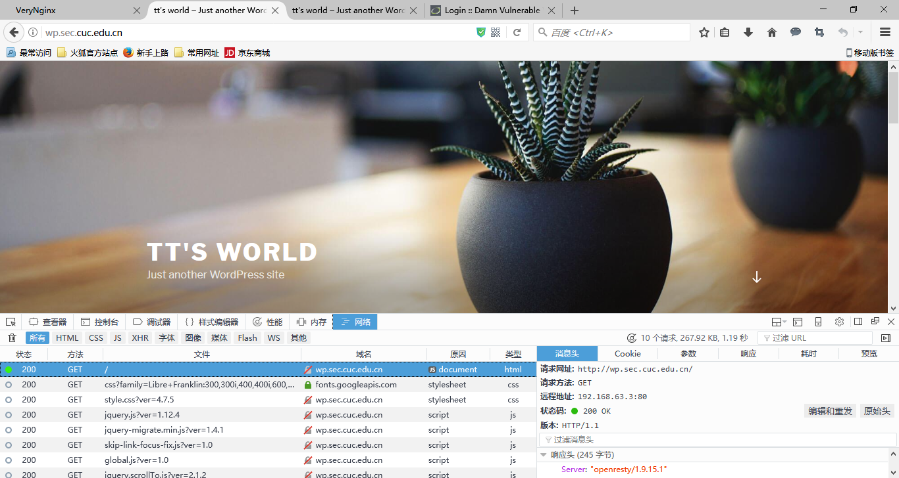

			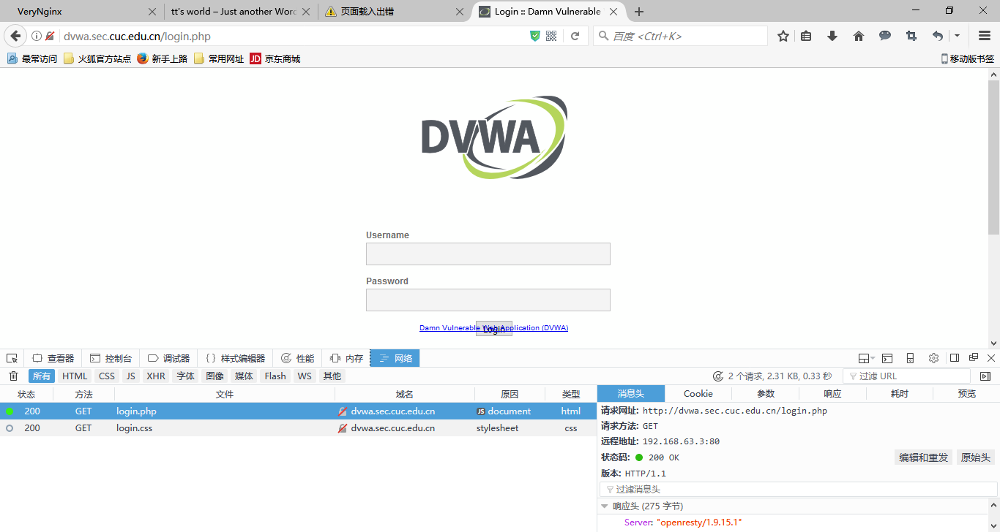
    * PHP-FPM进程的反向代理配置在nginx服务器上，VeryNginx服务器不直接配置Web站点服务
* 使用[Wordpress](https://wordpress.org/)搭建的站点对外提供访问的地址为： https://wp.sec.cuc.edu.cn 和 http://wp.sec.cuc.edu.cn

	 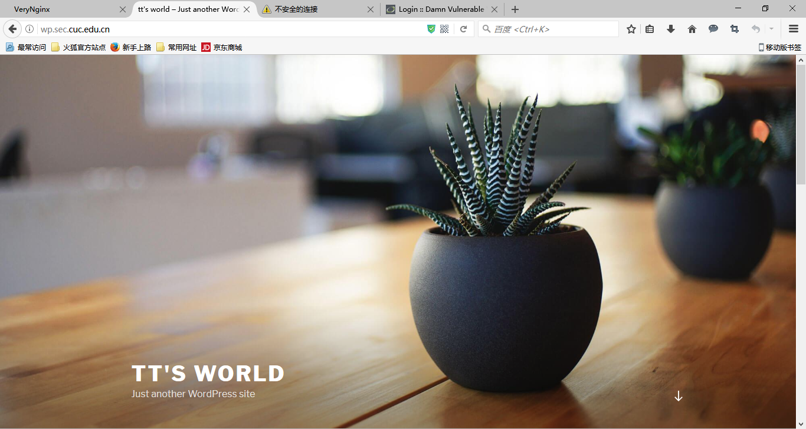
	 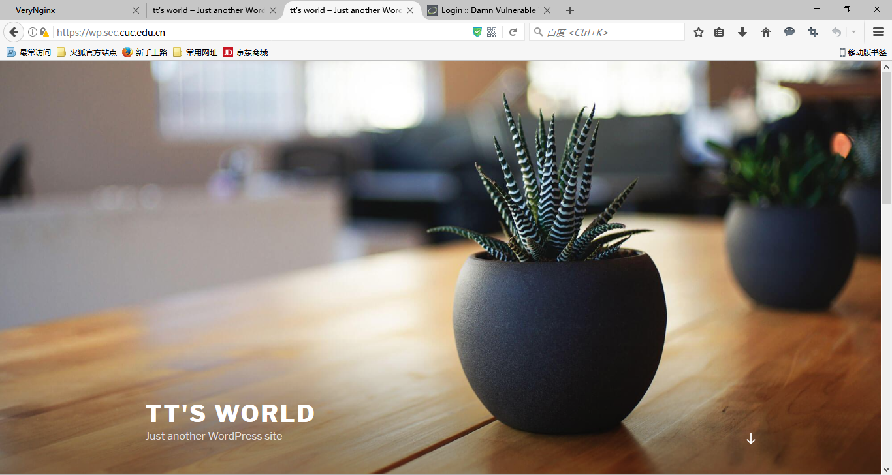
* 使用[Damn Vulnerable Web Application (DVWA)](http://www.dvwa.co.uk/)搭建的站点对外提供访问的地址为： http://dvwa.sec.cuc.edu.cn

	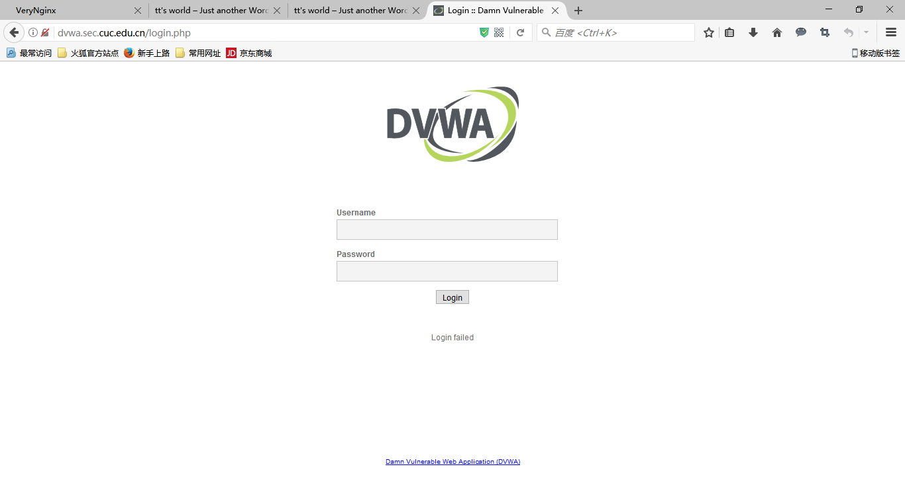

---

### 安全加固要求

* 使用IP地址方式均无法访问上述任意站点，并向访客展示自定义的**友好错误提示信息页面-1**
	* matcher
		
		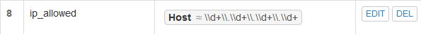
	* response
		
		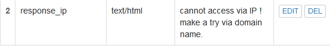
	* filter
		
		
	* 展示

		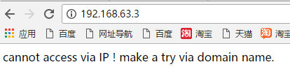
* [Damn Vulnerable Web Application (DVWA)](http://www.dvwa.co.uk/)只允许白名单上的访客来源IP，其他来源的IP访问均向访客展示自定义的**友好错误提示信息页面-2**
 	* matcher
		
		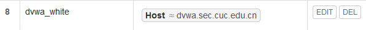
	* response
		
		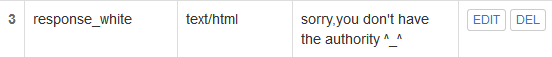
	* filter
		
		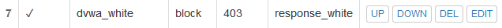
	* 展示

		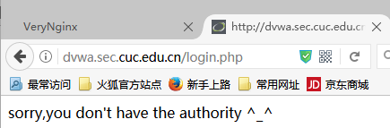
* 在不升级Wordpress版本的情况下，通过定制[VeryNginx](https://github.com/alexazhou/VeryNginx)的访问控制策略规则，**热**修复[WordPress \< 4.7.1 - Username Enumeration](https://www.exploit-db.com/exploits/41497/)
	* 原理：访问/wp-json/wp/v2/users/可以获取wordpress用户信息的json数据，所以采用的方法是禁止访问站点的/wp-json/wp/v2/users/路径
	* matcher
		
		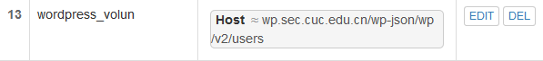			
	* filter
		
		
* 通过配置[VeryNginx](https://github.com/alexazhou/VeryNginx)的Filter规则实现对[Damn Vulnerable Web Application (DVWA)](http://www.dvwa.co.uk/)的SQL注入实验在低安全等级条件下进行防护
	* 设置低安全等级条件

		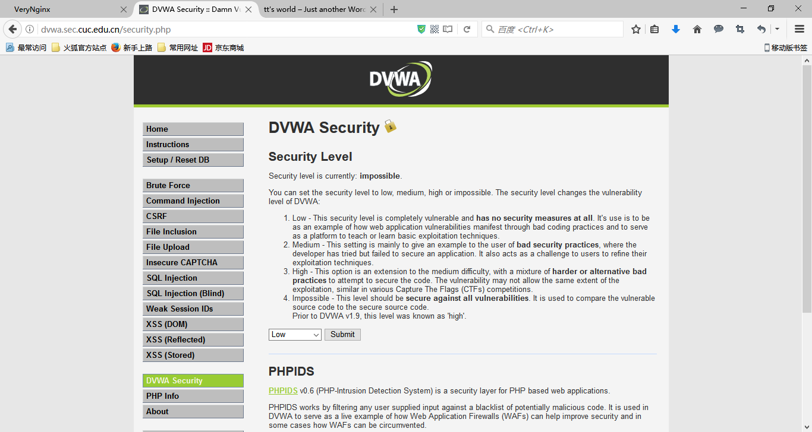
	* verynginx配置

		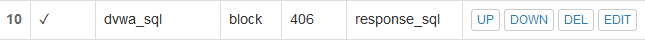

		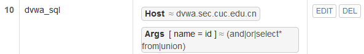

		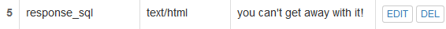
	* 展示

		
		

---

### VeryNginx配置要求

* [VeryNginx](https://github.com/alexazhou/VeryNginx)的Web管理页面仅允许白名单上的访客来源IP，其他来源的IP访问均向访客展示自定义的**友好错误提示信息页面-3**
* 通过定制[VeryNginx](https://github.com/alexazhou/VeryNginx)的访问控制策略规则实现：
    * 限制DVWA站点的单IP访问速率为每秒请求数 < 50
    * 限制Wordpress站点的单IP访问速率为每秒请求数 < 20
    * 超过访问频率限制的请求直接返回自定义**错误提示信息页面-4**
	
		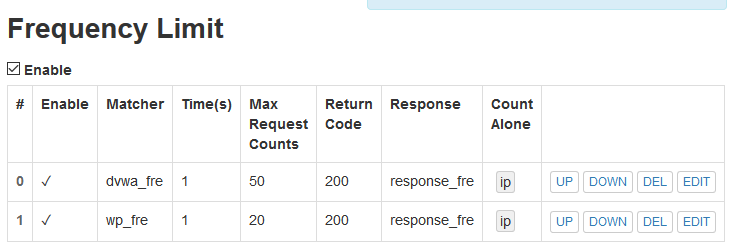
	
		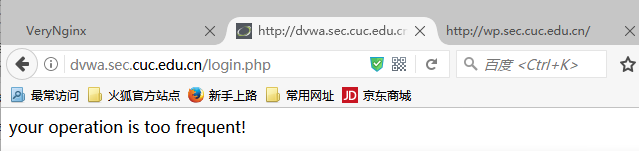

		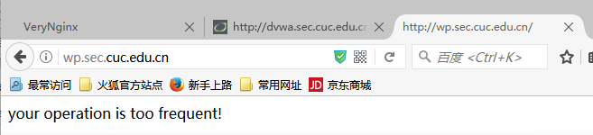

    * 禁止curl访问
	
		* 配置
	
			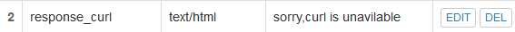
	
			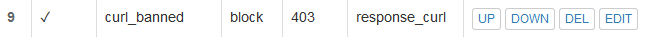
		* 展示
	
					

--- 
### 五、实验问题
* 配置好反向代理未保存
* 无论如何都无法从客户端访问dvwa和wp
	* 可以ping通，但不能访问
	* 问了无数人，查看配置，都没有解决。结果深夜关闭防火墙，竟然。。。dvwp成功了，wp还是没有成功，继续查找问题所在。
	* 在求助几位大神仍没有解决之后，我觉得可能很久之前做的时候改了某些配置，思路很混乱，所以干脆在新ubuntu上另安装了一次wp，这次出奇地顺利。很快就能访问了。所以以后做实验要想理清思路，要连贯，不然会多耽误很多时间
* 由于我是用win10进行访问的，所以没有curl，在网上找到了使用的方法
	*  [curl官方下载页面](https://curl.haxx.se/download.html)
	*  [WINDOWS中curl的使用](http://www.cnblogs.com/xing901022/p/4652624.html)
* 一开始配置ip的时候，把自己锁住了,去config.json中删除配置的ip的相关内容。当然，除此之外还出现各种小问题，不过好在都一个个慢慢解决了

> 后记：总是在莫名其妙的地方遇到莫名其妙的问题，导致在正式开始实验任务之前就已经心力交瘁，易燃易爆炸，越来越沮丧，有深刻的挫败感。这非常可怕。可是在后面通过各种方法把问题一个个解决之后，心里又非常地痛快，开心到飞起，欸，真的是又爱又恨...

---
### 六、参考链接
- [VeryNginx安装配置文档](https://github.com/alexazhou/VeryNginx/blob/master/readme_zh.md)
- [VeryNginx故障排除文档](https://github.com/alexazhou/VeryNginx/wiki/Trouble-Shooting)
- [LEMP安装配置](https://www.digitalocean.com/community/tutorials/how-to-install-linux-nginx-mysql-php-lemp-stack-in-ubuntu-16-04)
- [创建SSL自签发证书16-04](https://www.digitalocean.com/community/tutorials/how-to-create-a-self-signed-ssl-certificate-for-nginx-in-ubuntu-16-04)
- [创建SSL自签发证书14-04]( https://www.digitalocean.com/community/tutorials/how-to-create-an-ssl-certificate-on-nginx-for-ubuntu-14-04)
- [WordPress安装配置文档](https://www.digitalocean.com/community/tutorials/how-to-install-wordpress-with-lemp-on-ubuntu-16-04)
- [DVWA指导手册](https://www-s.acm.illinois.edu/archives/sigpony-l/pdf3oCSiI274L.pdf )
- [How to Download and Set up DVWA Lab in Ubuntu Server (Any Linux)](https://www.youtube.com/watch?v=1C51jmFRXKw)
- [curl官方下载页面](https://curl.haxx.se/download.html)
- [WINDOWS中curl的使用](http://www.cnblogs.com/xing901022/p/4652624.html)
