# FTP（选用vsftpd）

#### [ √ ] 配置一个提供匿名访问的FTP服务器，匿名访问者可以访问1个目录且仅拥有该目录及其所有子目录的只读访问权限；

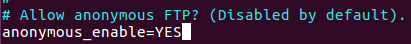

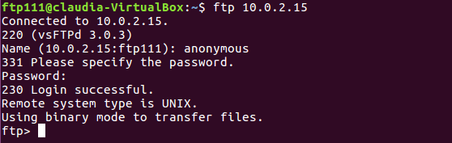
#### [ √ ] 配置一个支持用户名和密码方式访问的账号，该账号继承匿名访问者所有权限，且拥有对另1个独立目录及其子目录完整读写（包括创建目录、修改文件、删除文件等）权限；
* #####  相关配置：创建非root且有sudo权限的用户：ftp222；创建ftp文件夹，除去写权限；创建用户上传文件所及的文件夹files，并且给用户分配权限，同时规定用户使用范围

	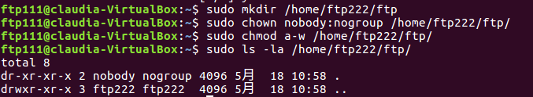
	
	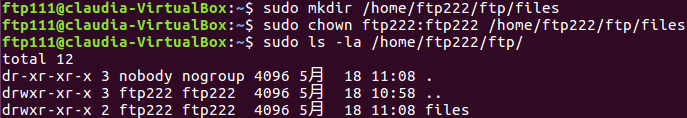
	
	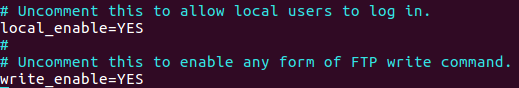

* ##### 规定用户使用范围， 把之前创建的用户加入userlist中，记得把anonymous加进去，不然之后登陆anonymous会无法登陆进去，惨痛的教训

		
			
		echo "ftp222" | sudo tee -a /etc/vsftpd.userlist
	
	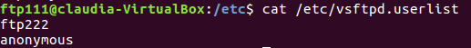

* #####  实验展示：前面几张是ubuntu系统的，最后一个是win10

	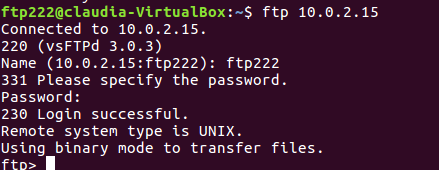
			
	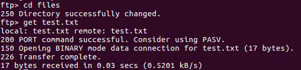
			
	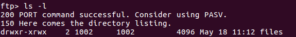
	
	
	
	

#### [ √ ]该账号仅可用于FTP服务访问，不能用于系统shell登录； 

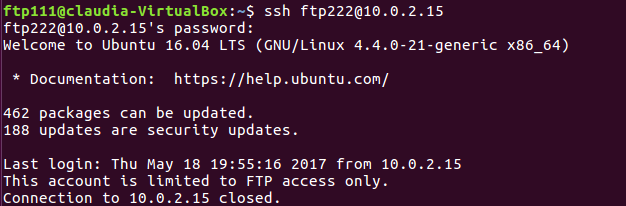

#### [ √ ] FTP用户不能越权访问指定目录之外的任意其他目录和文件，在后面Filezilla中有所实现；

		
#### [ √ ] 匿名访问权限仅限白名单IP来源用户访问，禁止白名单IP以外的访问；
######  hosts.allow  +  hosts.deny
	

######  用10.0.2.15登陆  +  用其他账号登陆
	
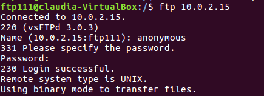
	
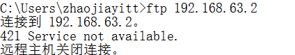
####  [ √ ]（可选加分任务）使用FTPS服务代替FTP服务，上述所有要求在FTPS服务中同时得到满足；
* **配置过程参照[How To Set Up vsftpd for a User's Directory on Ubuntu 16.04](https://www.digitalocean.com/community/tutorials/how-to-set-up-vsftpd-for-a-user-s-directory-on-ubuntu-16-04) Step6、Step7**

	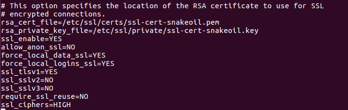

* **此时再ftp 10.0.2.15，会出现**

	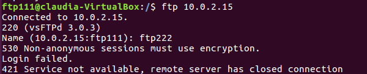

* **选用FileZilla，先配置好证书，连接，把右边的test.txt下载下来。注意：因为之前已经设置了权限，只能对指定路径进行操作，所以在起初我拖到目录下都不可以(如下图一)，之后我想起之前的配置，定位到/home/ftp222/ftp/files，再下载重命名成test2222，就成功了(如下图二)**

	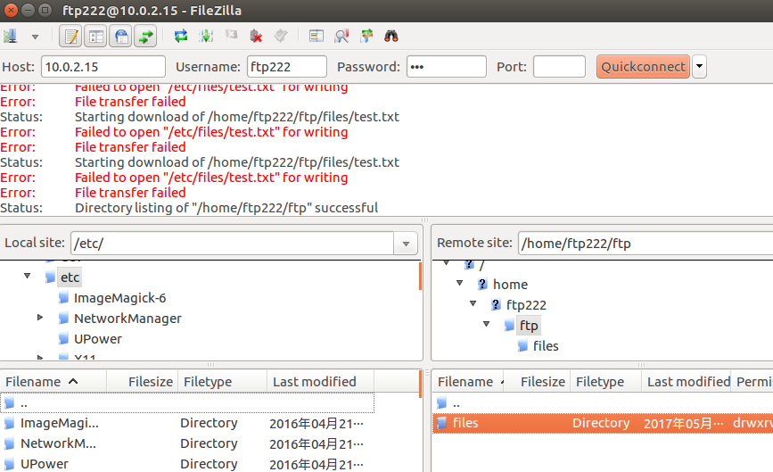
		
	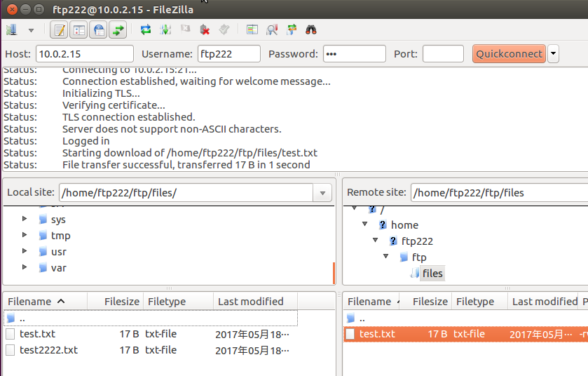

### FTP参考链接
* [Ubuntu 更改权限](http://blog.csdn.net/mzy202/article/details/7178586)
* [How To Set Up vsftpd for a User's Directory on Ubuntu 16.04](https://www.digitalocean.com/community/tutorials/how-to-set-up-vsftpd-for-a-user-s-directory-on-ubuntu-16-04)

# NFS

#### [ √  ] 在1台Linux上配置NFS服务，另1台电脑上配置NFS客户端挂载2个权限不同的共享目录，分别对应只读访问和读写访问权限；
* IP address
	* host  
			
			# ip : 192.168.63.2
	* client:
			
			# ip : 192.168.63.16
* 下载安装组件
	* host
	
		 	sudo apt-get update
			sudo apt-get install nfs-kernel-server
	* client
	
			sudo apt-get update
			sudo apt-get install nfs-common
* host配置

		# 创建共享目录，并改变路径所属，以确保暂时安全
		# /home不需创建
		sudo mkdir /var/nfs/general -p
		sudo chown nobody:nogroup /var/nfs/general

		# 配置/etc/exports，插入
		/var/nfs/general 192.168.63.16（rw,sync,no_subtree_check)
		/home            192.168.63.16(sync,no_root_squash,no_subtree_check)

		# 更改防火墙配置
		sudo ufw allow from 203.0.113.0 to any port nfs

		# 创建文件夹及文件，便于后面实验

	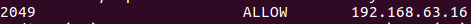
* client配置

		# 创建挂载文件夹
		sudo mkdir -p /nfs/general
		sudo mkdir -p /nfs/home

		# 进行挂载
		sudo mount 192.168.63.2:/var/nfs/general /nfs/general
		sudo mount 192.168.63.2:/home /nfs/home

	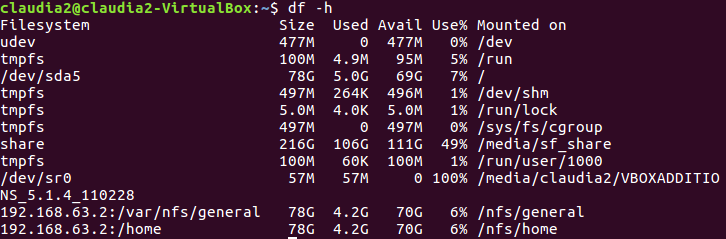
* 权限验证
	* 只读目录
		
		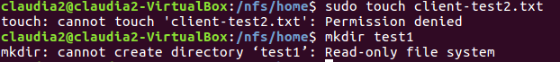
	* 读写目录

		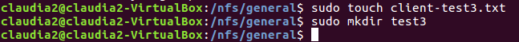
#### [ √  ] 实验报告中请记录你在NFS客户端上看到的：
	* 共享目录中文件、子目录的属主、权限信息
	* 你通过NFS客户端在NFS共享目录中新建的目录、创建的文件的属主、权限信息
	* 上述共享目录中文件、子目录的属主、权限信息和在NFS服务器端上查看到的信息一样吗？无论是否一致，请给出你查到的资料是如何讲解NFS目录中的属主和属主组信息应该如何正确解读

* 只读目录
	* server
	
		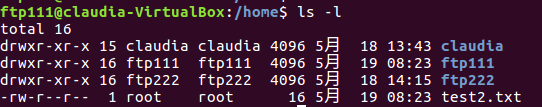
	* client

		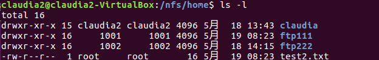
* 读写目录
	* server

		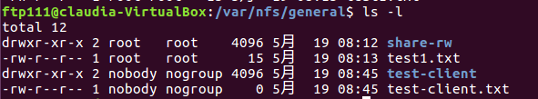
	* client

		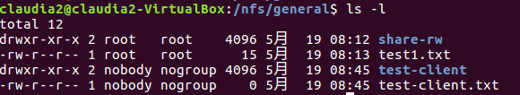

#####  是一样的。 

#####  在server中使用sudo 创建的文件，所属用户和用户组是root：root， 在client中使用NFS挂载后sudo 创建的文件，所属用户和用户组是nobody:nogroup；如上图中test1.txt与test-client.txt的区别；

#####  但如果在/etc/exports配置中设置no__root__squash参数，挂载的文件中所属是root，server中也是一样的，如下图所示
* 原配置

	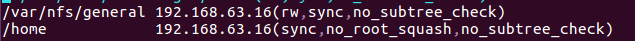
* 修改后

	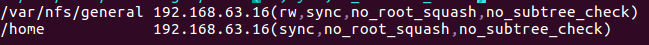
* client中创建文件观察所属
		
	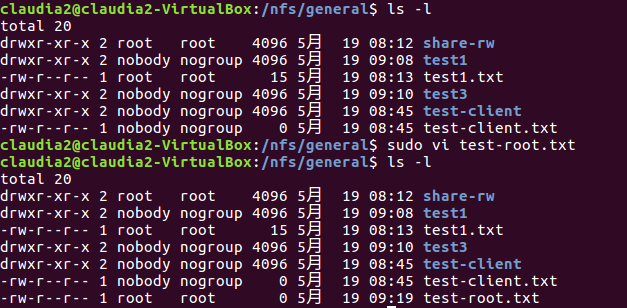
* server

	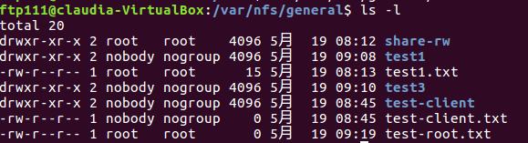
### NFS参考链接

* [How To Set Up an NFS Mount on Ubuntu 16.04](https://www.digitalocean.com/community/tutorials/how-to-set-up-an-nfs-mount-on-ubuntu-16-04)
# Samba

### LINUX

	# 安装Samba服务器
	sudo apt-get install samba
	
	# 创建Samba共享专用的用户
	sudo useradd -M -s /sbin/nologin demoUser
	sudo passwd demoUser

	# 创建的用户必须有一个同名的Linux用户，密码是独立的
	sudo smbpasswd -a demoUser
	
	# 创建用户组 
	sudo groupadd demoGroup
 	sudo usermod -G demoGroup demoUser

	# 在/etc/samba/smb.conf 文件尾部追加以下“共享目录”配置
	# demo为虚拟用户才能访问的目录
	[demo]
	        path = /srv/samba/demo/
	        read only = no
	        guest ok = no
	        force create mode = 0660
	        force directory mode = 2770
	        force user = demoUser
	        force group = demoGroup

	# guest为匿名用户可以访问的目录
	[guest]
			path = /home/samba/guest/
			read only = yes
			guest ok = yes
### WINDOWS
* 创建共享文件夹，并完成相关配置

	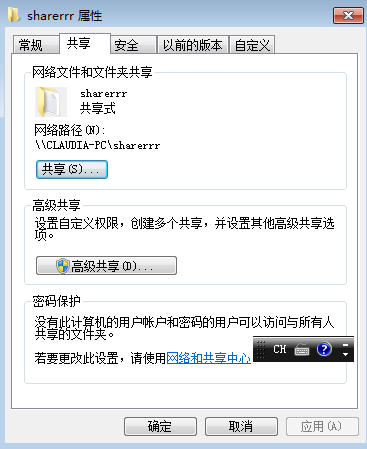
* [Windows7开启局域网匿名访问共享](https://wenku.baidu.com/view/d86d960516fc700abb68fc5a.html)
#### [ √ ] Linux设置匿名访问共享目录
	mkdir -p /home/samba/guest/
	sudo chgrp -R demoGroup /home/samba/guest/
	sudo chmod 2775 /home/samba/guest/

#### [ √ ] Linux设置用户名密码方式的共享目录
	mkdir -p /home/samba/demo/
	sudo chgrp -R demoGroup /home/samba/demo/
	sudo chmod 2775 /home/samba/demo/
#### [ √ ] Linux访问Windows的用户名密码方式共享目录，下载整个目录

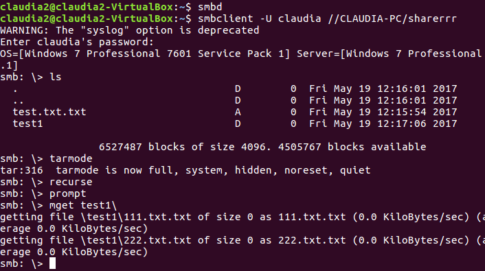
#### [ √ ] Windows访问Linux的用户名密码方式共享目录

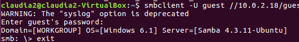

### Samba参考链接
* [黄大大的课件](http://sec.cuc.edu.cn/huangwei/course/LinuxSysAdmin/chap0x06.md.html#/samba)
* [Windows7开启局域网匿名访问共享](https://wenku.baidu.com/view/d86d960516fc700abb68fc5a.html)
* [Setting up Samba as a Standalone Server](https://wiki.samba.org/index.php/Setting_up_Samba_as_a_Standalone_Server)
# DHCP

####  [ √  ] 2台虚拟机使用Internal网络模式连接，其中一台虚拟机上配置DHCP服务，另一台服务器作为DHCP客户端，从该DHCP服务器获取网络地址配置
* DHCP Server(10.0.2.18)
	*  安装
		
			   sudo apt-get install isc-dhcp-server
	* 配置网卡接口
	
			 sudo vi /etc/default/isc-dhcp-server
			 INTERFACES="enp0s3"
	*  修改/etc/dhcp/dhcpd.conf配置文件		
	
		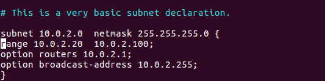
* DHCP Client

	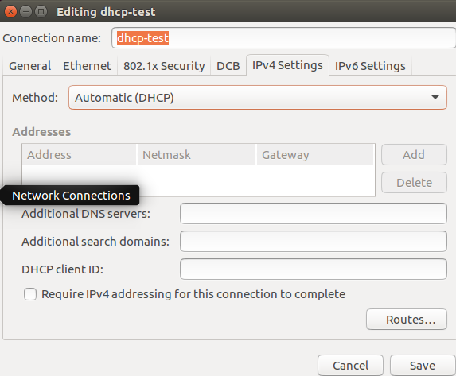

	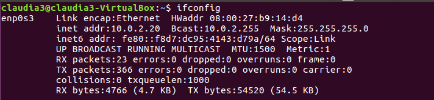

# DNS 

#### [ √ ] 基于上述Internal网络模式连接的虚拟机实验环境，在DHCP服务器上配置DNS服务，使得另一台作为DNS客户端的主机可以通过该DNS服务器进行DNS查询
#### [ √ ] 在DNS服务器上添加 zone "cuc.edu.cn" 的以下解析记录
	ns.cuc.edu.cn NS
	ns A <自行填写DNS服务器的IP地址>
	wp.sec.cuc.edu.cn A <自行填写第5章实验中配置的WEB服务器的IP地址>
	dvwa.sec.cuc.edu.cn CNAME wp.sec.cuc.edu.cn
##### Server (10.0.2.18)
*  sudo apt install bind9

*  配置***/etc/bind/named.conf.options***，将forwarders部分解除注释，添加客户端ip 10.0.2.20

	 
* 配置***/etc/bind/named.conf.local***

		 zone "cuc.edu.cn" {
          type master;
          file "/etc/bind/db.cuc.edu.cn";
 		 };

	 
* 创建、编辑存有域名解析的db文件
	
	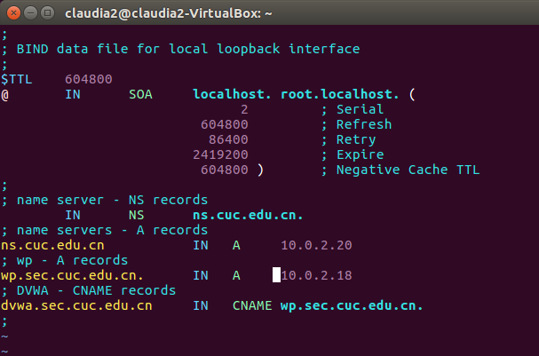
* 重启

		sudo systemctl restart bind9.service
##### Client (10.0.2.20)
* 配置***/etc/resolvconf/resolv.conf.d/head***，增添DNS服务器

	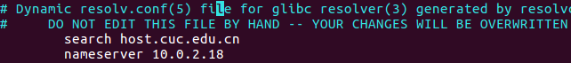
* 更新resolv.conf文件

		sudo resolvconf -u
### DNS参考链接
* [How To Configure BIND as a Private Network DNS Server on Ubuntu 14.04](https://www.digitalocean.com/community/tutorials/how-to-configure-bind-as-a-private-network-dns-server-on-ubuntu-14-04)

# 一键部署

### 前期准备
* 目标主机：
	* IP：192.168.63.4
	* 安装ssh服务：

			 sudo apt-get install openssh-server 
	* 修改root密码：
	
			 sudo passwd root  
	* 编辑/etc/ssh/sshd_config文件：

			 PermitRootLogin yes  
	* mkdir /root/.ssh  
	* touch /root/.ssh/authorized_keys  
	* chmod 700 -R /root/.ssh  
	* 重启ssh服务：

			 service ssh restart  
* 本地系统
	* IP：192.168.63.16
	* 切换到root 用户：
	
			sudo su
	* 创建公钥：
	
			ssh-keygen -t rsa
		
	* 安装expect：
	
			apt-get install expect
			touch /root/.ssh/authorized_keys.pub  
	* 安装sshpass
	
			sudo apt-get install sshpass

### 脚本解释

* conf
	* ftp
		* vsftpd.conf
		* vsftpd.userlist
		* hosts.allow
		* hosts.deny
	* nfs
		* exports
	* samba
		* smb.conf
	* dhcp
		* dhcpd.conf
		* isc-dhcp-server
	* dns
		* named.conf.local
		* named.conf.options
		* db.cuc.edu.cn
	* interfaces
* shell
	* vars.sh ：定义变量
	* main.sh：入口
		*  ssh_nopasswd.sh： root用户免密ssh登录
		*  install-soft.sh：     安装软件、程序
		*  todo.sh ：在目标机上进行用户创建、目录创建、修改权限、重启服务等必要的操作
		
---

### 参考链接汇总
* [Ubuntu 权限](http://blog.csdn.net/mzy202/article/details/7178586)
* [可爱的陶老师实验报告](https://github.com/CUCCS/linux/tree/master/2017-1/tzw/chapter6-7)
* [可亲的喵女神实验报告](https://github.com/CUCCS/linux/tree/master/2017-1/cay/ex6%267/configs)
* [可敬的宋学霸实验报告](https://github.com/CUCCS/linux/blob/master/2017-1/snRNA/ex6)
* [可爱可亲又可敬的黄大大的课件](http://sec.cuc.edu.cn/huangwei/course/LinuxSysAdmin/chap0x06.md.html#/samba)
* [How To Set Up vsftpd for a User's Directory on Ubuntu 16.04](https://www.digitalocean.com/community/tutorials/how-to-set-up-vsftpd-for-a-user-s-directory-on-ubuntu-16-04)
* [How To Set Up an NFS Mount on Ubuntu 16.04](https://www.digitalocean.com/community/tutorials/how-to-set-up-an-nfs-mount-on-ubuntu-16-04)
* [Windows7开启局域网匿名访问共享](https://wenku.baidu.com/view/d86d960516fc700abb68fc5a.html)
* [Setting up Samba as a Standalone Server](https://wiki.samba.org/index.php/Setting_up_Samba_as_a_Standalone_Server)
* [How To Configure BIND as a Private Network DNS Server on Ubuntu 14.04](https://www.digitalocean.com/community/tutorials/how-to-configure-bind-as-a-private-network-dns-server-on-ubuntu-14-04)
