## **实验一**

### 调查并记录实验环境的如下信息：

#### 当前 Linux 发行版基本信息
#### 法一：在虚拟机中输入命令：cat /etc/issue可以查看当前Linux的发行版基本信息
#### 结果如图：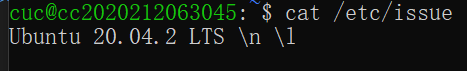
#### 法二：还可以输入以下命令查看，但ubuntu版本不同可能会导致命令无法使用
#### cat /etc/lsb-release 或 cat /etc/redhat-release
#### 结果如图：  
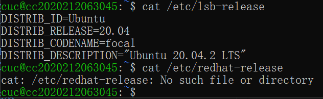
###  

#### 当前 Linux 内核版本信息
#### 法一：输入命令：uname -a
#### （课外了解：uname来源于utsname，是一个系统调用，格式为
####   int uret = uname((struct utsname)* uname_buf)
####   其中，结构体指针uname_buf中主要存放的是操作系统名称、内核版本和硬件体系结构）
#### 法二：另外也还可以输入命令：cat /proc/version
#### 运行结果如图：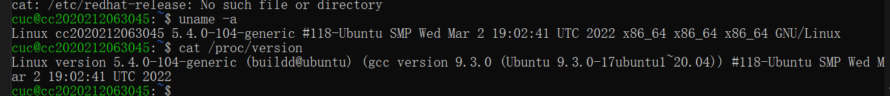
####    
#### 参考链接 [查看Linux信息命令](https://blog.csdn.net/qq_31278903/article/details/83146031)
##    

### Virtualbox 安装完Ubuntu之后新添加的网卡如何实现系统开机自动启用和自动获取 IP？
#### 步骤如下：（1）输入命令：ifconfig -a可以看到所有网卡
#### 如图：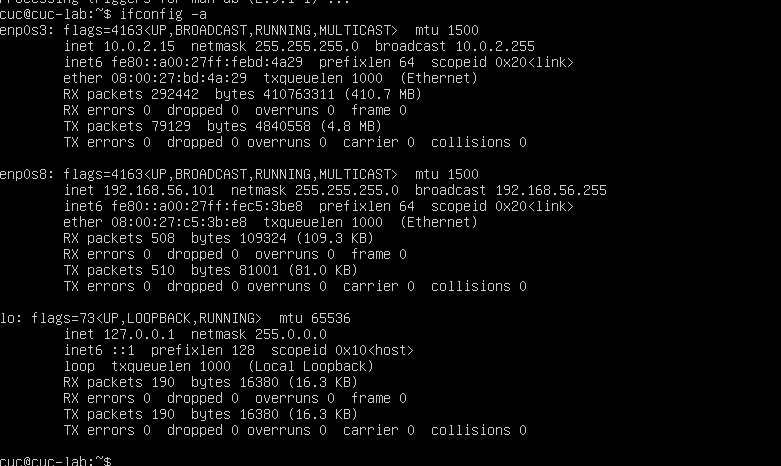
#### (2)输入命令：sudo vim /etc/netplan/00-installer-config.yaml 进入vim页面
#### (3)输入字母a进入vim编辑模式就可以手动输入信息实现添加网并开机自动启用和自动获取IP：如enp0s8: 
####    dhcp4: true
#### (4)输入命令：sudo netplan apply 使添加的内容生效
#### 结果如图：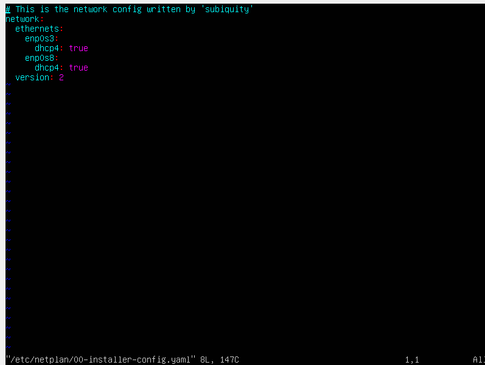
##    

### 如何使用scp在「虚拟机和宿主机之间」、「本机和远程 Linux 系统之间」传输文件？
#### 实现本地虚拟机ubuntu和远程阿里云平台Linux之间传输文件
#### 步骤如下：（1）输入命令：touch a.txt和touch b.txt分别在远程Linux和本地unbuntu上创建两个txt文件
#### （2）输入命令：find / -name a.txt和find / -name b.txt确认txt路径
#### 如图：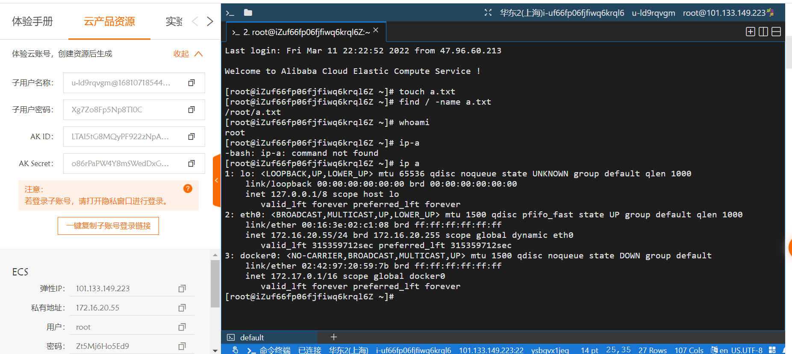
#### （3）在本地输入命令：scp -p root@101.133.149.223:/root/a.txt ./然后输入远程Linux的密码 实现将远程Linux的a.txt文件传输到本地 最后输入命令：ls 确认传输成功
#### 如图：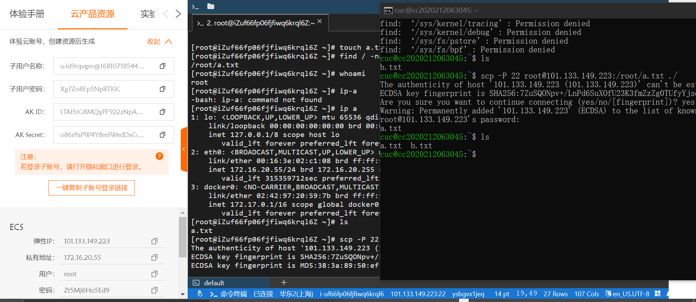
#### （4）在本地输入命令：scp /home/cuc/b.txt root@101.133.149.223:/root然后输入远程Linux的密码 实现将本地b.txt文件传输到远程  在远程输入命令：ls也可以确认成功接收
#### 如图：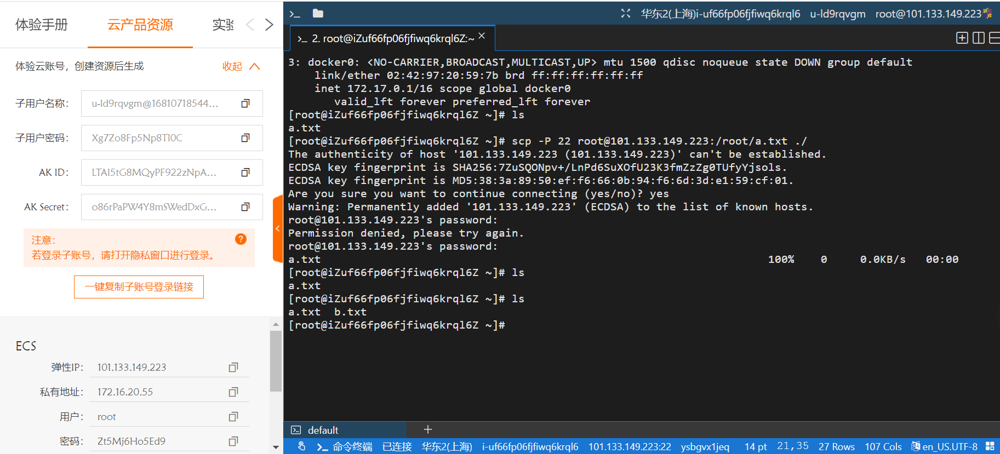
#### 实现在虚拟机和宿主机之间传输文件同理，只需注意命令的对象的用户名和ip地址改变
##     

### 如何配置 SSH 免密登录？
#### 环境：首先要成功配置SSH，步骤如下：
#### （1）通过输入ip-a查看到使用的ubuntu的ip地址是：192.168.56.101/24
#### 如图：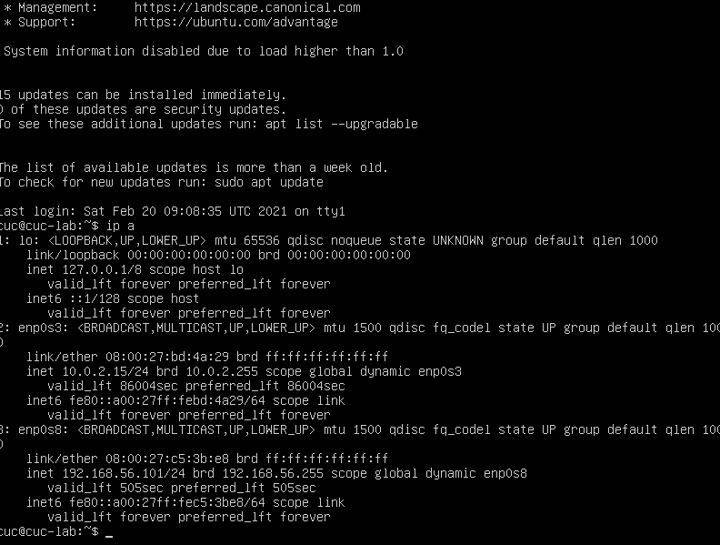
#### （2）在本机上安装SSH客户端
#### 如图：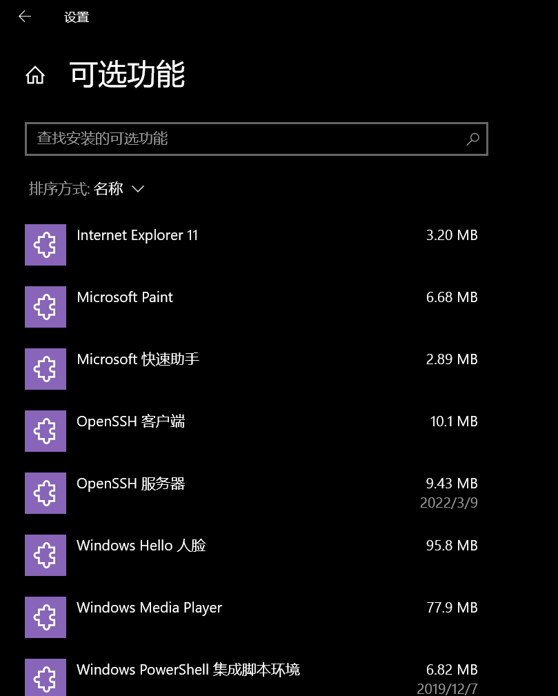
#### （3）在cmd输入ssh cuc@192.168.56.101再输入密码即实现SSH配置
###    
#### 免密登录步骤如下：
#### （1）输入命令：ssh-keygen -b 4096 生成公私钥对
#### （2）输入命令：ssh-copy-id -i ~/.ssh/id_rsa.pub cuc@192.168.56.101再输入ubuntu密码即完成免密登录
#### （3）最后通过输入命令：ssh 'cuc@192.168.56.101' 确认能进行免密登录
#### 如图：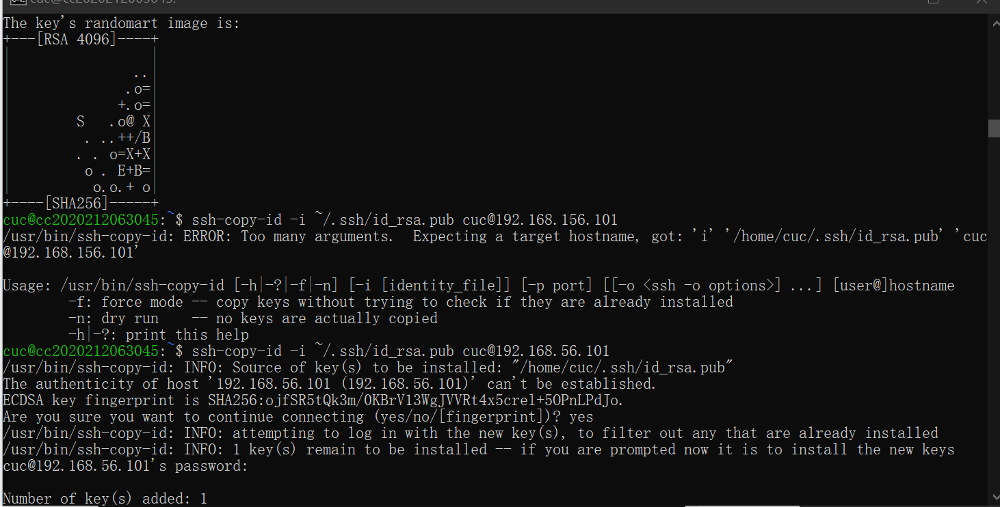
#     

### 遇到的问题以及解决方法
#### 刚导入ova文件并启动后遇到如图问题：
#### 问题（1）：
#### 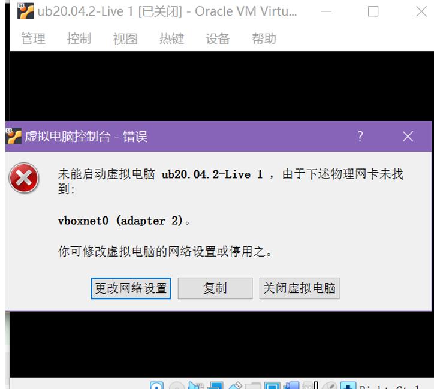
#### 在网上查找解决方法时，有两种解决方法：可以选择禁用USB2.0解决或者安装“Oracle VM VirtualBox Extension Pack”这个扩展包。
#### 选择了较为方便的禁用USB的方法：设置 --->  USB设备  -----> 取消启用USB控制器（如图）
#### 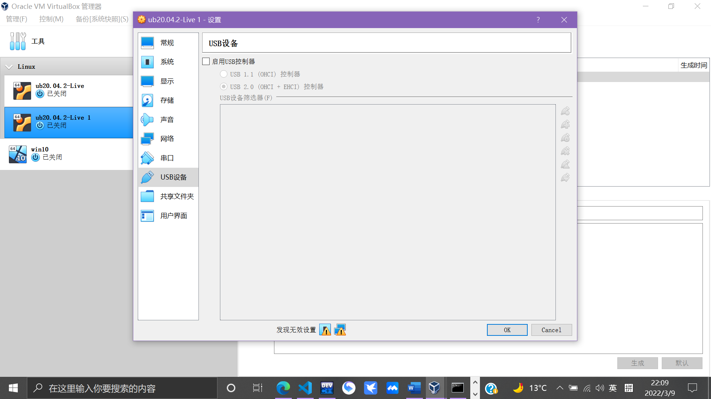
#### 问题解决参考资料： [不能为虚拟电脑打开一个新任务](https://www.cnblogs.com/wildernessdreams/p/8408797.html)
#### 但在禁用USB之后再次启动又遇到了这样的问题：
#### 问题（2）：
#### 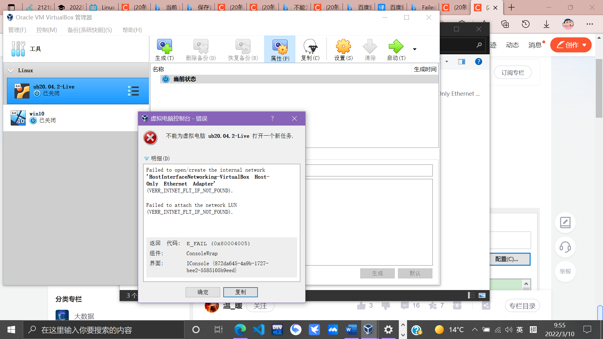
#### 在求助同班同学和学委之后仍然不知道原因，于是自己又上网搜索，找到的解决方法如下： [启动虚拟机报错](https://blog.csdn.net/wen_bin_li/article/details/54092950)
#### 类似的贴子都是让我把下图中的这个选项勾上，但我的已经是默认选上的，跟着操作之后再次启动仍然报相同的错误
#### 如图：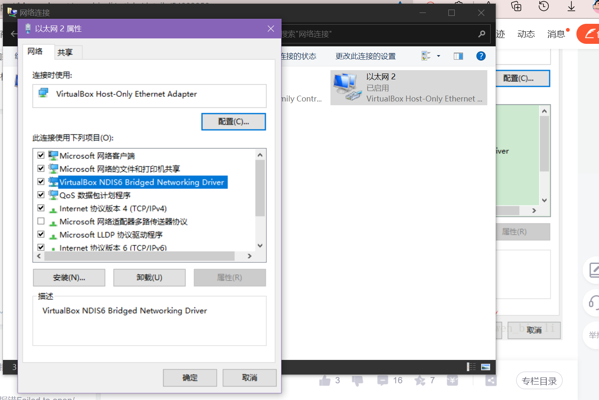
#### 不放弃又继续找方法，这个时候看到了这个帖子：[启动虚拟机报错二](https://blog.csdn.net/u012269267/article/details/103976666)
#### 与我的情况十分相似，其实之前我已经成功导入ubuntu并且也解决了不能新建任务的问题，也能正常登录，跟着老师的视频执行了命令语句那些，但因为第一次操作太不熟练了呜呜呜就出了蛮多bug，所以就又重头开始，再次导入一个新的ubuntu…
#### 帖子是这样解释原因的：在删除原有VirtualBox Host-Only虚拟网卡并重新添加后，虚拟机可能会无法启动
#### 解决方法：
#### 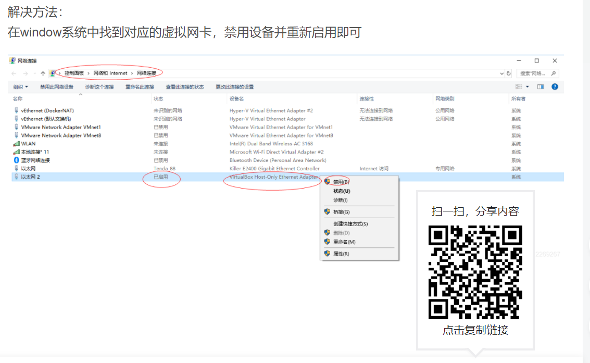
#### 跟着操作以后果然可以成功启动并登录了（做到这里真滴哭了5555，看了解决方法感觉只是一个小问题，但没有经验最开始真的很懵）
###   
#### 问题（3）：第一次进入vim编辑器页面后，相关操作很不熟悉，比如说要进入编辑模式尝试了输入很多个字母才找到启动点，自己的是输入a可以；要退出编辑模式时也是同样。真正理解到了老师课件里所说的趣味笑话“让新手退出vim”的含义
#### 参考资料： [vim编辑器新手指导](https://blog.csdn.net/qq_43768851/article/details/121629428)
#### 参考资料： [vim命令详解](https://blog.csdn.net/weixin_34337265/article/details/89828003?spm=1001.2101.3001.6650.1&utm_medium=distribute.pc_relevant.none-task-blog-2%7Edefault%7ECTRLIST%7ERate-1.pc_relevant_default&depth_1-utm_source=distribute.pc_relevant.none-task-blog-2%7Edefault%7ECTRLIST%7ERate-1.pc_relevant_default&utm_relevant_index=2)
###    
#### 小tips：给系统改名，实现个性标识信息， 输入命令：sudo hostnamectl set-hostname +改后的名称（如以上所有结果图片中我自己的是cc2020212063045）

